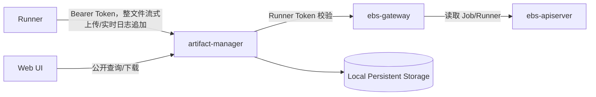

# Artifact Manager 设计

## 一、定位

Artifact Manager 是 EulerMaker 的构建结果数据服务，负责接收 Runner 上传的构建产物和日志，并提供查询、下载、保留与清理能力，同时提供 RPM 过程仓物化和正式仓库发布能力。过程仓物化和正式发布均由 Controller Manager 中的 RpmRepo Controller 驱动。

```text
Runner -> artifact-manager -> Local Persistent Storage

artifact-manager -> ebs-gateway upload authentication/authorization API
```

Artifact Manager 管理文件正文及其元数据，文件正文存储在本地持久化目录中。

## 二、设计目标

| 目标 | 说明 |
|------|------|
| 大文件上传 | 支持构建仓库、RPM、ISO 等大型产物 |
| 流式上传 | 单请求上传大文件，服务端流式落盘，不将完整文件载入内存 |
| 幂等 | 整文件上传请求可以安全重试，不生成重复 Artifact |
| 完整性 | 使用文件大小和 SHA-256 校验内容 |
| 上传隔离 | Runner 只能向分配给自己的 Job 上传文件 |
| 持久化 | 文件正文和元数据存储在本地持久化目录 |
| 可扩展 | 支持实时日志，并为后续内容扫描预留扩展点 |

## 三、总体架构



Runner 直接访问 Artifact Manager，上传正文不经过 ebs-gateway，避免 Gateway 承担构建产物和日志文件带宽。Artifact Manager 只通过 Gateway 校验 Runner Token 的签名、有效期和 scope。首版不查询 Job/Runner 对象，也不校验 Job 与 Runner 的绑定关系或 Job 阶段。Artifact 查询和下载公开访问，不经过 Gateway 鉴权。

Artifact、Job 上传清单和幂等记录均以元数据文件形式存放在本地持久化目录，不依赖独立数据库。服务启动时加载元数据并建立内存索引，本地元数据文件是事实来源。

文件正文写入 Artifact Manager 管理的本地持久化目录。使用节点本地目录时只能部署单实例。

首版由 Runner 单请求上传完整文件，Artifact Manager 流式写入本地文件系统。首版不支持普通 Artifact 的分片传输和断点续传；请求中断后 Runner 使用相同幂等键重新上传整个文件。实时日志仍使用第十章定义的 chunk/sequence 追加协议，该协议用于实时展示和日志流恢复，不属于普通 Artifact 分片上传。

## 四、文件归属与存储键

产物必须关联到具体的一次 Job 执行：

```text
project
jobName
jobUID
runnerName
```

`project` 和 `jobName` 用于展示与查询，`jobUID` 防止 Job 删除重建后与旧文件混淆。

存储键由服务端生成：

```text
projects/{project}/jobs/{jobUID}/{safeRelativePath}
```

服务对 `relativePath` 进行规范化后生成 `safeRelativePath`。路径不能为空或为绝对路径，不得包含 `..`、控制字符和符号链接；规范化后的路径必须位于该 Job 目录内。同一个 Job 中的 `safeRelativePath` 必须唯一，已存在时只有请求摘要相同的幂等重试可以返回原 Artifact。

本地后端以 `--data-dir` 为根目录，将存储键映射为正文路径。上传中的文件写入 `${dataDir}/.uploads/{artifactID}.tmp`，校验完成后在同一文件系统内原子重命名到最终路径。服务不得跟随符号链接，并必须验证规范化后的路径始终位于数据根目录内。

Artifact 元数据写入 `${dataDir}/.metadata/artifacts/{artifactID}.json`，Job 上传清单写入 `${dataDir}/.metadata/jobs/{project}/{jobUID}/manifest.json`。元数据先写入临时文件，完成文件和父目录的 `fsync` 后原子重命名。首版只运行一个可写实例，避免在没有分布式锁的情况下并发修改同一 Artifact 或 Job 上传清单。

RPM 路径使用 `packages/{fileName}`，例如 `packages/kernel-6.6.rpm`。日志使用 `logs/` 作为一级目录。

## 五、数据模型

以下结构是首版持久化格式和 HTTP JSON 契约的基准。Go 实现可以增加不序列化的锁、文件句柄和内存索引字段，但不得改变已持久化字段的语义。所有 API 默认拒绝未知 JSON 字段，防止客户端拼写错误被静默忽略。

公共类型：

```go
type Timestamp = time.Time // JSON 使用 RFC3339Nano UTC，例如 2026-08-12T02:30:00.123Z

type ArtifactCategory string
const (
    ArtifactCategoryArtifact ArtifactCategory = "artifact"
    ArtifactCategoryLog      ArtifactCategory = "log"
)

type ArtifactState string
const (
    ArtifactPending   ArtifactState = "Pending"
    ArtifactUploading ArtifactState = "Uploading"
    ArtifactCompleted ArtifactState = "Completed"
    ArtifactFailed    ArtifactState = "Failed"
    ArtifactExpired   ArtifactState = "Expired"
)
```

### 5.1 Artifact

```go
type Artifact struct {
    SchemaVersion int              `json:"schemaVersion"`
    ID            string           `json:"id"`
    Project       string           `json:"project"`
    JobName       string           `json:"jobName"`
    JobUID        string           `json:"jobUID"`
    RunnerName    string           `json:"runnerName"`
    Category      ArtifactCategory `json:"category"`
    Name          string           `json:"name,omitempty"`
    FileName      string           `json:"fileName"`
    RelativePath  string           `json:"relativePath"`
    ContentType   string           `json:"contentType,omitempty"`
    Size          int64            `json:"size"`
    SHA256        string           `json:"sha256"`
    StorageKey    string           `json:"storageKey"`
    State         ArtifactState    `json:"state"`
    Failure       *FailureInfo     `json:"failure,omitempty"`
    CreatedAt     Timestamp        `json:"createdAt"`
    UpdatedAt     Timestamp        `json:"updatedAt"`
    CompletedAt   *Timestamp       `json:"completedAt,omitempty"`
    ExpiresAt     *Timestamp       `json:"expiresAt,omitempty"`
}
```

`category` 首版支持：

| 值 | 说明 |
|----|------|
| `artifact` | RPM、仓库、ISO 等正式构建产物 |
| `log` | 完整日志文件 |

首版只接受 `artifact` 和 `log`，其他 category 返回 `422 UnsupportedArtifactCategory`。

Artifact 状态：

```text
Pending -> Uploading -> Completed
                     \-> Failed
Completed -> Expired
```

只有 `Completed` Artifact 可以公开下载。

`ID`、归属字段、路径、大小、摘要和 `StorageKey` 创建后不可变。`Size` 必须大于等于 0；`SHA256` 是 64 位小写十六进制，不带 `sha256:` 前缀。`FileName` 必须等于规范化后 `RelativePath` 的最后一段。`StorageKey` 仅由服务端生成，不接受客户端赋值，也不在普通列表响应中用于构造本地路径。

### 5.2 JobUploadManifest

Artifact Manager 使用本地持久化的 Job 上传清单记录一次 Job 预期上传的完整文件集合，不在 ebs-apiserver 中新增资源。单个 Artifact 的 `Completed` 只表示该文件完整，`JobUploadManifest` 的 `Completed` 才表示该 Job 的全部必需文件已经完成上传。

```go
type ManifestState string
const (
    ManifestOpen       ManifestState = "Open"
    ManifestCompleting ManifestState = "Completing"
    ManifestCompleted  ManifestState = "Completed"
    ManifestFailed     ManifestState = "Failed"
)

type ManifestFile struct {
    ArtifactID   string           `json:"artifactID"`
    RelativePath string          `json:"relativePath"`
    Category    ArtifactCategory `json:"category"`
    Size        int64            `json:"size"`
    SHA256      string           `json:"sha256"`
    Required    bool             `json:"required"`
}

type JobUploadManifest struct {
    SchemaVersion  int            `json:"schemaVersion"`
    Project        string         `json:"project"`
    JobName        string         `json:"jobName"`
    JobUID         string         `json:"jobUID"`
    RunnerName     string         `json:"runnerName"`
    Files          []ManifestFile `json:"files"`
    Digest         string         `json:"digest,omitempty"`
    State          ManifestState  `json:"state"`
    Failure        *FailureInfo   `json:"failure,omitempty"`
    CreatedAt      Timestamp      `json:"createdAt"`
    UpdatedAt      Timestamp      `json:"updatedAt"`
    CompletedAt    *Timestamp     `json:"completedAt,omitempty"`
    ExpiresAt      *Timestamp     `json:"expiresAt,omitempty"`
}
```

清单状态：

```text
Open -> Completing -> Completed
                  \-> Failed
```

每个 `(project, jobUID)` 最多只能有一个 Manifest 成功进入 `Completed`；清单完成后不可增加、删除或替换文件。封账校验及重复请求行为见 6.2。

`digest` 对按 `relativePath` 排序后的规范字段计算 SHA-256，不直接对未规范化的 JSON 文本计算，保证相同清单始终产生相同摘要。

`Files` 至少包含一个条目，并按 `relativePath` 排序持久化；`artifactID` 和 `relativePath` 在清单内都必须唯一。首版的 `manifest/complete` 同时提交并封账清单，`Open` 和 `Completing` 是服务端持久化过程中的可恢复状态，不提供单独编辑 Open 清单的公共接口。

摘要输入逐项使用 UTF-8 编码，数字使用不带前导零的十进制，布尔值使用 `true/false`：

```text
artifact-manifest-v1\n
relativePath\0artifactID\0category\0size\0sha256\0required\n
...
```

最终 `Digest` 表示为 `sha256:<64位小写十六进制>`。

### 5.3 LogStream

```go
type LogStreamState string
const (
    LogOpen       LogStreamState = "Open"
    LogFinalizing LogStreamState = "Finalizing"
    LogCompleted  LogStreamState = "Completed"
    LogFailed     LogStreamState = "Failed"
    LogExpired    LogStreamState = "Expired"
)

type LogChunkRecord struct {
    Sequence    int64  `json:"sequence"`
    StartOffset int64  `json:"startOffset"`
    Size        int64  `json:"size"`
    SHA256      string `json:"sha256"`
}

type LogStream struct {
    SchemaVersion  int            `json:"schemaVersion"`
    Project        string         `json:"project"`
    JobName        string         `json:"jobName"`
    JobUID         string         `json:"jobUID"`
    RunnerName     string         `json:"runnerName"`
    Stream         string         `json:"stream"`
    State          LogStreamState `json:"state"`
    NextSequence   int64          `json:"nextSequence"`
    CommittedBytes int64          `json:"committedBytes"`
    ArtifactID     string         `json:"artifactID,omitempty"`
    FinalSize      *int64         `json:"finalSize,omitempty"`
    FinalSHA256    string         `json:"finalSHA256,omitempty"`
    Failure        *FailureInfo   `json:"failure,omitempty"`
    CreatedAt      Timestamp      `json:"createdAt"`
    UpdatedAt      Timestamp      `json:"updatedAt"`
    CompletedAt    *Timestamp     `json:"completedAt,omitempty"`
    ExpiresAt      *Timestamp     `json:"expiresAt,omitempty"`
}
```

首版 `Stream` 只能是 `combined`。`NextSequence` 初始为 0，`CommittedBytes` 初始为 0。`LogChunkRecord` 使用 JSON Lines 追加式索引文件持久化，不在每次追加时整体重写进 `LogStream` JSON；记录必须满足 sequence 连续、offset 连续，且 `StartOffset+Size` 不超过 `CommittedBytes`。

索引文件每行是一个完整、紧凑的 JSON 对象，以单个 `\n` 结束，不允许空行、注释或跨行 JSON：

```jsonl
{"sequence":0,"startOffset":0,"size":1024,"sha256":"a1b2..."}
{"sequence":1,"startOffset":1024,"size":2048,"sha256":"c3d4..."}
```

字段顺序不是读取协议的一部分；实现必须按 JSON 字段名解析并拒绝未知字段。`sha256` 是对应 chunk 解压后正文的 64 位小写十六进制摘要。索引只能追加，不能就地修改已有记录。

### 5.4 IdempotencyRecord

整文件上传使用独立的本地幂等记录，在服务重启和 Artifact 临时状态清理后仍能识别重复请求。

```go
type IdempotencyState string
const (
    IdempotencyProcessing IdempotencyState = "Processing"
    IdempotencyCompleted  IdempotencyState = "Completed"
    IdempotencyFailed     IdempotencyState = "Failed"
)

type IdempotencyRecord struct {
    SchemaVersion int              `json:"schemaVersion"`
    Scope         string           `json:"scope"`
    Key           string           `json:"key"`
    RequestDigest string           `json:"requestDigest"`
    ArtifactID    string           `json:"artifactID"`
    State         IdempotencyState `json:"state"`
    Failure       *FailureInfo     `json:"failure,omitempty"`
    CreatedAt     Timestamp        `json:"createdAt"`
    UpdatedAt     Timestamp        `json:"updatedAt"`
    CompletedAt   *Timestamp       `json:"completedAt,omitempty"`
    ExpiresAt     *Timestamp       `json:"expiresAt,omitempty"`
}
```

上传作用域固定为 `artifact-upload/{project}/{jobUID}`。本地路径使用作用域和 key 的 SHA-256，客户端输入不得直接成为文件名：

```text
${dataDir}/.metadata/idempotency/{scopeSHA256}/{keySHA256}.json
```

`RequestDigest` 对规范化后的 `UploadArtifactMetadata` 计算，不包含 multipart boundary、header 顺序或文件正文；摘要格式为 `sha256:<64位小写十六进制>`。摘要输入固定为：

```text
artifact-upload-v1\n
jobUID\0category\0name\0fileName\0relativePath\0contentType\0size\0sha256\n
```

创建 `Processing` 记录和 `Pending` Artifact 时必须持有 `(scope,key)` 进程内锁。相同作用域和 key 的并发请求只能有一个进入正文读取阶段。`Completed` 记录与对应 Completed Artifact 的保留期限一致；`Failed` 记录默认保留 24 小时，并允许相同摘要的请求复用原 Artifact ID 整文件重传。

### 5.5 通用失败、错误和分页结构

```go
type FailureInfo struct {
    Code      string    `json:"code"`
    Message   string    `json:"message"`
    Retryable bool      `json:"retryable"`
    Time      Timestamp `json:"time"`
}

type APIError struct {
    Code      string         `json:"code"`
    Message   string         `json:"message"`
    Retryable bool           `json:"retryable"`
    RequestID string         `json:"requestID"`
    Details   map[string]any `json:"details,omitempty"`
}

type ArtifactList struct {
    Items      []Artifact `json:"items"`
    NextCursor string     `json:"nextCursor,omitempty"`
}
```

API 错误响应的 `Content-Type` 为 `application/json`，客户端只能依赖稳定的 `code` 和结构化 `details`，不能解析 `message`。列表默认按 `(completedAt,id)` 升序排序，cursor 是服务端编码的这两个字段，客户端必须视为不透明字符串。默认每页 100 条，最大 1000 条；翻页期间新完成的 Artifact 只可能出现在后续页，不返回非 `Completed` 对象。

### 5.6 通用格式与校验约束

| 字段 | 约束 |
|------|------|
| `schemaVersion` | 首版固定为 1；读取未知主版本必须拒绝启动或隔离该记录 |
| `id` | 服务端生成，Artifact 为 `art_<ULID>` |
| `project`、`jobName` | 1–253 字节，必须与 ebs-apiserver 中对象一致 |
| `jobUID` | Kubernetes UID 字符串，1–128 字节，不能只凭 Job 名推导 |
| `runnerName` | 来自 Gateway 认证结果，客户端请求正文不得提供 |
| `relativePath` | UTF-8 相对路径，规范化后不超过 1024 字节，不允许空段、`.`、`..`、反斜杠、控制字符和符号链接 |
| `fileName`、`name` | UTF-8，分别不超过 255 和 256 字节；`name` 仅用于展示 |
| `contentType` | 不超过 255 字节，仅用于展示，不作为可信文件类型 |
| `size`、offset | `int64` 非负数，并受部署配额限制 |
| 单文件 SHA-256 | 64 位小写十六进制；Manifest digest 使用 `sha256:` 前缀 |
| `idempotencyKey` | 1–128 个可打印 ASCII 字符，不得包含空白；同一作用域内唯一 |

持久化记录的不可变字段不得通过更新接口修改。状态更新必须验证合法状态转换；失败记录不得包含 Token、文件正文、绝对本地路径或敏感签名材料。

### 5.7 HTTP 请求与响应结构

```go
type UploadArtifactMetadata struct {
    JobUID       string           `json:"jobUID"`
    Category     ArtifactCategory `json:"category"`
    Name         string           `json:"name,omitempty"`
    FileName     string           `json:"fileName"`
    RelativePath string           `json:"relativePath"`
    ContentType  string           `json:"contentType,omitempty"`
    Size         int64            `json:"size"`
    SHA256       string           `json:"sha256"`
}

type UploadArtifactResponse struct {
    Artifact Artifact `json:"artifact"`
}

type CompleteManifestRequest struct {
    JobUID string         `json:"jobUID"`
    Files  []ManifestFile `json:"files"`
}

type CompleteManifestResponse struct {
    JobUID        string        `json:"jobUID"`
    State         ManifestState `json:"state"`
    ArtifactCount int           `json:"artifactCount"`
    Digest        string        `json:"digest"`
}

type LogStatusResponse struct {
    Stream         string         `json:"stream"`
    State          LogStreamState `json:"state"`
    NextSequence   int64          `json:"nextSequence"`
    CommittedBytes int64          `json:"committedBytes"`
    ArtifactID     string         `json:"artifactID,omitempty"`
    UpdatedAt      Timestamp      `json:"updatedAt"`
}

type CompleteLogRequest struct {
    JobUID       string `json:"jobUID"`
    Stream       string `json:"stream"`
    LastSequence int64  `json:"lastSequence"`
    Size         int64  `json:"size"`
    SHA256       string `json:"sha256"`
}

type CompleteLogResponse struct {
    State        LogStreamState `json:"state"`
    ArtifactID   string         `json:"artifactID"`
    RelativePath string         `json:"relativePath"`
    Size         int64          `json:"size"`
    SHA256       string         `json:"sha256"`
}

type SSELogData struct {
    Encoding string `json:"encoding"` // 固定为 base64
    Content  string `json:"content"`
}

type SSECompleteData struct {
    ArtifactID string `json:"artifactID"`
    Size       int64  `json:"size"`
    SHA256     string `json:"sha256"`
}
```

HTTP 路径中的 `{project}`、`{job}` 是归属来源，上传元数据不得重复提供或覆盖。`RunnerName`、ID、状态、存储键和时间均由服务端填写。空文件使用长度为 0 的正文上传；空日志封账时 `lastSequence=-1`、`size=0`、`sha256` 为 SHA-256 空输入。JobUploadManifest 首版不允许空 `files`；没有需要归档文件的 Job 不创建 manifest，并在 Job Status 中记录 `artifactCount=0` 和明确的 `artifactState=NotRequired`。

## 六、上传 API

Artifact API 使用独立前缀：

```text
/artifacts/v1
```

### 6.1 上传 Artifact

```http
POST /artifacts/v1/projects/{project}/jobs/{job}/artifacts
Authorization: Bearer <runner-token>
Idempotency-Key: <uuid>
Content-Type: multipart/form-data; boundary=...
```

请求按顺序包含 `metadata` 和 `file` 两个 form-data part。`metadata` 必须位于 `file` 之前，使用 `application/json`，结构为 `UploadArtifactMetadata`；`file` 使用 `application/octet-stream`：

```json
{
  "jobUID": "e32450b8-...",
  "category": "artifact",
  "fileName": "kernel-6.6.rpm",
  "relativePath": "packages/kernel-6.6.rpm",
  "contentType": "application/x-rpm",
  "size": 183746291,
  "sha256": "d6f4..."
}
```

成功返回 `UploadArtifactResponse`：

```json
{
  "artifact": {
    "id": "art_01...",
    "state": "Completed",
    "relativePath": "packages/kernel-6.6.rpm",
    "size": 183746291,
    "sha256": "d6f4..."
  }
}
```

服务先验证 Runner Token、上传元数据和配额，再创建 `Pending` Artifact。读取 `file` part 时流式写入 `${dataDir}/.uploads/{artifactID}.tmp`，同时累计大小和 SHA-256，不将完整文件载入内存。请求正文结束后：

1. 验证实际大小和 SHA-256 与 metadata 相同。
2. 对临时正文执行 `fdatasync`。
3. 将正文原子重命名到最终 `StorageKey` 并 `fsync` 父目录。
4. 原子写入 `Completed` Artifact 元数据。
5. 返回完整 Artifact。

请求中断或校验失败时删除临时正文，并将未提交的 Artifact 元数据删除或标记为 `Failed` 供后台清理。首版不提供上传进度查询、继续上传或中止接口；Runner 必须保留本地文件并使用相同 `Idempotency-Key` 整文件重传。

服务持久化 `(jobUID, idempotencyKey)`、规范化请求元数据摘要和响应 Artifact ID。相同键且元数据摘要相同时：已有 Artifact 为 `Completed` 则直接返回原结果；仍有上传请求进行中则返回 409 `UploadInProgress`；前次失败或中断则清理旧临时文件并允许整文件重传。相同键但元数据摘要不同返回 409 `IdempotencyConflict`。

#### 6.1.1 Multipart 解析限制

首版 multipart 请求必须满足：

- 恰好包含一个名为 `metadata` 的 part 和一个名为 `file` 的 part，不允许额外、重复或嵌套 multipart part。
- `metadata` 必须是第一个 part，`file` 必须是第二个且为最后一个 part；服务必须在读取文件正文前完成 metadata、鉴权、配额和幂等检查。
- `metadata` 的 `Content-Type` 必须是 `application/json`，解码时拒绝未知字段和尾随 JSON 数据；正文大小不得超过 `--max-metadata-size`。
- `file` 的 `Content-Type` 必须是 `application/octet-stream`。multipart 文件名仅用于协议兼容，不能覆盖 metadata 中的 `fileName`。
- 单个 part 的 header 数量、单个 header 长度和全部 header 总大小必须分别受配置限制；拒绝重复的 `Content-Disposition`、控制字符和非法 boundary。
- 请求可以不带总 `Content-Length`，但服务必须对整个请求使用有上限的流式 reader。实际文件字节超过 metadata.size 或 `--max-file-size` 时立即停止读取并返回 413。
- 请求带有 `Content-Length` 时，只用于提前拒绝明显超限请求，不能替代实际流式计数和摘要校验。
- file 正文允许为 0 字节；到达 multipart 结尾时实际大小必须严格等于 metadata.size。
- 临时文件使用服务端生成的 Artifact ID 并以独占方式创建，禁止覆盖现有临时文件，不使用客户端文件名拼接路径。
- 从读取请求头到正文完成均受 `--upload-timeout` 和最小上传速率限制；超时、取消或客户端断开必须关闭文件句柄并清理临时文件。

违反 part 数量、顺序、类型或 metadata 格式返回 400 `InvalidMultipartRequest`；超过 metadata、header 或请求大小限制返回 413 `RequestTooLarge`。

#### 6.1.2 可恢复提交顺序

整文件上传不是跨多个文件的原子事务。实现必须使用以下固定、可重放的提交顺序，以最终正文的原子 rename 作为正文提交点：

1. 获取 `(scope,idempotencyKey)` 锁，原子写入 `Processing` IdempotencyRecord。
2. 原子写入 `Pending` Artifact 元数据，其中已经包含最终 `StorageKey`。
3. 以独占方式创建 `.uploads/{artifactID}.tmp`，流式写入并计算大小和 SHA-256。
4. 校验成功后对临时正文执行 `fdatasync`。
5. 将临时正文原子 rename 到最终 `StorageKey`，随后 `fsync` 最终正文的父目录；该 rename 是正文提交点。
6. 原子更新 Artifact 元数据为 `Completed` 并 `fsync` 元数据父目录。
7. 原子更新 IdempotencyRecord 为 `Completed`，设置 `CompletedAt`，并 `fsync` 幂等记录父目录。
8. 返回成功响应并释放锁。

步骤 5 之后任何失败都不能删除最终正文；服务应返回可重试错误，由相同幂等键请求或启动恢复流程补齐元数据。步骤 5 之前失败则关闭并删除临时正文，将 IdempotencyRecord 和 Artifact 标记为 `Failed`，允许相同摘要整文件重传。

服务启动时按以下规则恢复：

| 现场状态 | 恢复动作 |
|----------|----------|
| Processing 记录 + Pending Artifact + 临时正文 | 删除临时正文，将幂等记录和 Artifact 标记为 Failed，允许相同摘要整文件重传 |
| Processing 记录 + Pending Artifact + 最终正文 | 流式复核大小和 SHA-256；匹配则补写 Completed Artifact 和幂等记录，不匹配则隔离正文并标记 Corrupted |
| Processing 记录存在但 Artifact 不存在 | 标记幂等记录 Failed；相同摘要重试时重新创建 Artifact |
| Completed Artifact + Processing/Failed 幂等记录 | 核对 Artifact ID 和请求摘要后补写 Completed 幂等记录 |
| Completed 幂等记录 + Pending Artifact + 最终正文 | 复核正文后补写 Completed Artifact；不匹配则标记 Corrupted，不能返回原成功响应 |
| Completed Artifact 但最终正文缺失 | 将 Artifact 和幂等记录标记 Failed/Corrupted，内容接口不得返回成功 |
| 只有临时正文 | 超过 `--temporary-upload-ttl` 后删除 |
| 只有最终正文且没有 Artifact/幂等记录 | 移入隔离目录并记录告警，不能自动公开或按客户端路径猜测归属 |

恢复和正常上传必须使用相同的 per-key/per-Artifact 锁，避免启动扫描与新请求同时修改一组记录。隔离目录中的正文只能由后台审计或管理员处理。

### 6.2 提交并完成 Job 上传清单

Runner 完成全部单文件上传后提交最终清单：

```http
POST /artifacts/v1/projects/{project}/jobs/{job}/manifest/complete
Authorization: Bearer <runner-token>
Content-Type: application/json
```

```json
{
  "jobUID": "e32450b8-...",
  "files": [
    {
      "artifactID": "art-01...",
      "relativePath": "packages/kernel-6.6.rpm",
      "category": "artifact",
      "size": 183746291,
      "sha256": "d6f4...",
      "required": true
    }
  ]
}
```

服务以 `(project, jobUID)` 为粒度加锁，并验证：

1. Runner Token 仍然有效，URL、请求清单与 Artifact 中的 project、jobName、jobUID 归属一致。
2. 清单内路径唯一，且每个 Artifact 都属于该 Job。
3. 所有必需 Artifact 均为 `Completed`。
4. Artifact 的路径、大小和 SHA-256 与清单一致。
5. 该 Job 尚未由不同内容完成 Manifest。

验证成功后按 5.2 计算清单摘要，原子写入 `Completed` 清单。相同 Job UID 和相同规范化文件集合的重复请求返回原结果；已经完成的 Job 收到不同清单内容时返回 `409 Conflict`。Manifest 完成接口不使用独立幂等键，Job UID 即为幂等作用域。校验失败不会持久化一个可供选择的清单版本，Runner 修正或补传后仍使用同一个接口重试。

```json
{
  "jobUID": "e32450b8-...",
  "state": "Completed",
  "artifactCount": 1,
  "digest": "sha256:..."
}
```

清单完成后禁止为该 Job 创建或完成新的 Artifact 上传。该接口是一次 Job 产物集合的唯一封账边界，不能通过扫描当前已有 Artifact 推断上传是否结束。

### 6.3 查询 Job 上传清单

```http
GET /artifacts/v1/projects/{project}/jobs/{job}/manifest?jobUID={uid}
```

接口返回该 Job 唯一清单的状态和文件列表。RpmRepo Controller 等消费者只有在清单状态为 `Completed` 时才能使用其中的 Artifact。Manifest digest 是 Artifact Manager 的内部完整性和幂等字段，不要求消费者记录或回传。消费者不得直接读取 Artifact Manager 的本地元数据文件。

## 七、查询与下载 API

Artifact 查询、列表和下载不要求登录，也不执行 Project 权限检查。任何能够访问 Artifact Manager 的客户端都可以查询 Completed Artifact 并获取下载地址。

### 7.1 查询 Job 产物

```http
GET /artifacts/v1/projects/{project}/jobs/{job}/artifacts?jobUID={uid}
```

默认只返回 Completed Artifact，并支持按 `category`、文件名和分页游标过滤。

### 7.2 下载文件

```http
GET /artifacts/v1/artifacts/{artifactID}/content
```

正文接口支持 `Range`、`ETag`、`If-None-Match` 和 `Content-Disposition`。Artifact Manager 流式读取文件并返回，下载过程中不得将完整文件载入内存。

公开查询和下载是系统明确的数据访问策略。部署方必须通过网络边界决定 Artifact Manager 是否向公网开放，并为公开接口配置请求速率和下载带宽限制。

## 八、Runner 上传流程

Runner 执行完成后扫描 Job 结果目录并生成 manifest：

```json
{
  "jobUID": "e32450b8-...",
  "files": [
    {
      "relativePath": "packages/kernel.rpm",
      "category": "artifact",
      "size": 183746291,
      "sha256": "..."
    },
    {
      "relativePath": "logs/container.log",
      "category": "log",
      "size": 738291,
      "sha256": "..."
    }
  ]
}
```

上传流程：

1. Runner 完成执行，Job 进入 `stage=PostRun`。
2. 扫描结果目录并计算文件大小和 SHA-256。
3. 对每个文件发起单请求流式上传，Artifact Manager 完成大小和 SHA-256 校验后返回 `Completed` Artifact。
4. 上传请求失败时使用相同幂等键整文件重传。
5. 确认每个必需文件均已返回 `Completed`。
6. 调用 Job 上传清单完成接口，由 Artifact Manager 校验并封账全部必需文件。
7. 清单完成后更新 Job 的 `artifactState` 和 `artifactCount`，再将 Job 更新为 `phase=Completed`；必需产物上传或清单封账失败时更新为 `Failed`。Manifest digest 只由 Artifact Manager 保存，不写入 Job Status。

Runner 默认并发上传 2–4 个文件，并对总带宽和同时上传的文件数量限流。上传成功前保留本地文件。

扫描结果目录时必须：

- 拒绝或忽略符号链接。
- 确保所有规范化路径仍位于结果根目录。
- 忽略 socket、device 和 named pipe。
- 限制单文件大小、文件数量和总大小。
- 保证同一个相对路径只生成一条 manifest 记录。

推荐使用 `packages/`、`logs/` 等一级目录组织产物；RpmRepo Controller 提交固定版本清单，Artifact Manager 将 `packages/` 下的 RPM 重新组织到不可变仓库的 `Packages/` 目录。

## 九、RPM 仓库物化

### 9.1 定位

Artifact Manager 在已经接管 Job 构建产物的基础上，提供 RPM 仓库物化能力。Controller Manager 中的 RpmRepo Controller 负责持续感知构建结果、选择基础仓和输入 Job，并更新 `RpmRepo`、`Build`、`Job` 等 API 对象；Artifact Manager 只负责校验固定版本的 Job 上传清单、组织 RPM、生成 repodata、原子发布仓库正文和保存本地物化状态。

```text
RpmRepo Controller
    │ 选择 base repository 和 Completed manifests
    ▼
Artifact Manager
    │ 校验清单与 RPM，继承基础仓，替换本批次 spec
    │ 执行 createrepo_c，在本地原子发布不可变仓库
    ▼
Repository content URL
    │
    └── RpmRepo Controller 更新 RpmRepo/Build/Job status
```

该能力替代老 repo-manager 的 Job JSON 目录扫描、ES 直接写入和 etcd 队列通知。控制面与数据面的职责边界见 9.3。

### 9.2 设计目标

1. 从一个显式基础仓和一组已封账的 Job 上传清单生成完整 RPM 仓库。
2. 同一请求可安全重试，不重复生成仓库或重复替换内容。
3. 新仓库发布前不可见；成功后内容不可变。
4. 同一 spec 的新产物完整替换基础仓中的旧产物。
5. 复用本地 Artifact 正文，避免控制器下载再上传大文件。
6. 进程崩溃后能够区分 Ready、可继续清理的临时状态和失败状态。
7. 仓库生成不直接修改业务 API 对象，避免数据面与控制面形成双写事务。

首版不提供仓库签名、跨 Artifact Manager 实例复制、镜像同步、增量 delta RPM 或外部仓库导入。

### 9.3 职责边界

#### 9.3.1 RpmRepo Controller

RpmRepo Controller 负责选择基础仓与输入 Job、持久化推进意图，以及更新业务 API 状态；控制面串行推进、批次选择、冲突处理和重启恢复统一遵循 9.3.3。

#### 9.3.2 Artifact Manager

Artifact Manager 负责校验固定输入、执行 9.7 的物化算法，保存本地状态并提供内容下载；失败及重启恢复见 9.9。输入或基础仓已因保留策略删除时返回稳定失败。

Artifact Manager 不监听 Job，不访问 ebs-apiserver、Elasticsearch 或 etcd，不更新 `RpmRepo`、`Build` 或 `Job`，也不提供隐式“取最新仓库”接口。过程仓物化不维护可变的 `last`、`current` 软链接，调用方必须使用返回的不可变仓库 URL；9.13 节正式发布的 `current` 只属于稳定发布入口，不参与过程仓版本选择。

#### 9.3.3 主动持续生成流程

RpmRepo Controller 是 Controller Manager 内的常驻控制器，不等待其他组件逐次调用“生成仓库”。它必须在 `Run` 前注册 Job 事件处理器，启动时先完成全局 Job List，再从取得的 `resourceVersion` 建立 Watch；Watch 断开时按 Controller Manager 的 Source 语义重新 List/Watch。只有 Job 支持 Watch，`Build`、`BuildInfo`、`Snapshot` 和 `RpmRepo` 仍通过按需 GET/List 读取。

进入仓库队列的 Job 必须同时满足：

- `status.phase=Completed`；
- `status.artifactState=Completed`；
- Job 携带由 BuildInfo Controller 写入的构建归属和目标 labels，能够确定 Build、spec、目标 OS 和目标架构；
- 该 Job 未写入仓库发布结果，也不是 `RpmRepo.status.repository.transition` 中正在处理的输入。

RpmRepo Controller 以 `{project}/{buildName}` 作为串行队列 key，Reconcile 的对象是 Build，而不是触发事件的单个 Job。`buildName` 由唯一 UUID 生成且不复用，因此无需再引入 Build UID、目标 OS 或目标架构作为队列维度。目标 OS 和架构由 Build 确定，仅作为仓库元数据及一致性校验字段。同一 key 任一时刻只允许一个物化周期，保证后一个仓库显式以上一个 Ready 仓库为基础；不同 key 可以并行。Job 事件只计算并 Add Build key，同一 key 的重复事件由队列合并。

BuildInfo Controller 创建 Job 时必须写入以下不可变元数据：

| 位置 | Key | 值 |
|------|-----|----|
| label | `ebs.io/build-name` | 所属 Build name，值为唯一 UUID |
| label | `ebs.io/spec-name` | 本 Job 构建的 spec 名 |
| label | `ebs.io/target-os` | 目标操作系统 |
| label | `ebs.io/target-arch` | 目标架构 |

RpmRepo Controller 不从 Job 名称、Payload 或 RPM 文件名推导这些控制面归属。缺少任一字段的 Job 不进入物化队列，并记录结构化告警和指标。Project 直接使用 Job `metadata.namespace`。

Build Controller 仅为非 single Build 创建同名 RpmRepo；single 只消费 bootstrap 和历史过程仓，构建产物仍可上传保存，但不进入本轮仓库物化或正式发布流程。RpmRepo Controller 只读取该对象并推进 status，不负责补建。每批完成 Job 将该逻辑仓库推进一个新的不可变物理版本。每次最多选择 `--rpmrepo-max-jobs-per-batch` 个 Job，同时受 Manifest 数量和输入总字节数上限约束；不使用时间窗口等待更多 Job，到达任一上限或当前候选集已取完即形成批次。候选 Job 按 `creationTimestamp`、`metadata.name`、`metadata.uid` 升序稳定排序。同一批次每个 `specName` 最多一个 Job；遇到重复 spec 时只选择排序最前的 Job，其余 Job 留到下一批次，不能以 Watch 事件到达顺序决定覆盖关系。

一次 Build Reconcile 流程如下：

1. GET Build；若 `spec.buildType=single`，成功结束，不读取或创建本轮同名 RpmRepo、不物化或发布本轮产物。其他类型再 GET 同名 RpmRepo；RpmRepo 不存在表示 Build Controller 的前置创建尚未完成或对象被异常删除，本周期返回临时错误并退避重试，不创建替代对象。
2. RpmRepo 已存在 `status.repository.transition` 时不得选择新输入或重新计算批次，直接按 transition 查询或重新提交 Artifact Manager，并继续该批次的结果确认。
3. 没有 transition 时，按 Build label 过滤 List Job，重新校验每个候选 Job 的 UID、终态、Artifact 状态和构建归属，剔除已发布、已稳定失败或不再满足条件的对象，然后按稳定顺序和批次上限选择输入。没有候选 Job 时成功结束。
4. 使用当前 `status.repository.repositoryUID` 作为基础仓。首次推进根据 `Build.status.baseBuildRef.name` 读取对应的已发布 RpmRepo 版本；未指定时基础仓为空。
5. 按候选顺序查询每个 Job 的唯一 Completed Manifest，达到 Job 数量或输入总字节数上限时停止加入批次。根据 Project、Build name、基础仓 UID 以及排序后的全部 Job UID 计算确定性 `repositoryUID`，再将完整 `RepositoryTransition` 以 `resourceVersion` CAS 写入 RpmRepo status。
6. transition 写入成功后才能调用 Artifact Manager，单次请求提交批次内全部 Manifest。返回 `202` 后不占用 worker 等待，使用带指数退避的延迟队列再次入队同一个 Build key。
7. 查询到 `Ready` 后，用一次 CAS 将 transition 中的版本提升为当前版本、写入 URL、摘要、RPM 元数据和本批次 Job UID，并清空 transition；然后逐个将同一物理版本 UID 写入本批次 Job status 作为已消费标记。
8. Job status 写回必须逐项幂等。部分 Job 写回失败时，后续 Reconcile 根据 RpmRepo 当前版本记录的 Job UID 补写，不重新物化，也不把这些 Job 选入新批次；全部补写完成后若仍有候选 Job，立即重新入队同一个 Build key。
9. 可重试基础设施错误保留原 transition 和同一 `repositoryUID` 重试。某个输入存在不可重试的请求、RPM 或 Manifest 错误时，整批不发布；将确定失败的 Job 标记为 `repositoryState=Failed` 并写入稳定错误，清除 transition 后将其余 Job 重新入队组成新批次。原已发布版本始终可读。

RpmRepo Controller 重启后通过 List 已完成 Job 和同名 RpmRepo 重建 Build key，不依赖内存中的“已消费集合”。存在 transition 时必须先按其固定的输入 Job UID 集合、base repository UID 和 repository UID 恢复旧批次，不得重新选择输入或基础仓。当前由 Build Controller 创建的 `RpmRepoSpec` 可保持为空；RpmRepo Controller 需扩展和更新的是公共 `RpmRepoStatus`、`JobStatus` 及对应的 apiserver status 校验。

当前公共 `JobStatus` 同样尚未包含 `artifactState`、`artifactCount`、`repositoryState` 和 `repositoryUID`。实现 RpmRepo Controller 前必须将这些字段加入公共 API，更新 OpenAPI、apiserver status 校验和客户端。`repositoryState=Published` 且 `repositoryUID` 非空表示 Job 已被逻辑仓库消费；`repositoryState=Failed` 表示稳定输入错误，不得自动重放。

首版 Controller Manager 只运行一个活动的 RpmRepo Controller。需要多副本时必须先在 Controller Manager 框架加入 Leader Election；不能依赖进程内队列锁协调多个实例。即使发生故障切换，RpmRepo status 的 `resourceVersion` CAS、持久化 transition 和 Artifact Manager 的 repositoryUID 幂等约束仍是最终防线。

### 9.4 标识与存储布局

一个 RpmRepo 是可持续推进的逻辑仓库，其 `metadata.uid` 不能直接作为物理版本标识。每次推进根据 Project、Build name、`baseRepositoryUID` 和按字典序排列的全部输入 Job UID 计算 SHA-256，将其十六进制结果作为稳定 `repositoryUID`。Build name 本身由唯一 UUID 生成且不复用。相同批次重试自然复用同一幂等键；基础仓或批次成员变化一定生成不同的不可变版本。摘要编码必须使用带长度前缀的字段序列，避免字符串拼接歧义。

```text
${dataDir}/
├── repositories/
│   └── {project}/
│       └── {arch}/
│           ├── current -> releases/{buildName}
│           ├── Packages -> current/Packages
│           ├── repodata -> current/repodata
│           ├── RPM-GPG-KEY-openEuler -> current/RPM-GPG-KEY-openEuler
│           ├── releases/
│           │   └── {buildName}/
│           │       ├── Packages/
│           │       ├── repodata/
│           │       └── release.json
│           └── history/
│               └── {buildName}/
│                   └── steps/
│                       └── {repositoryUID}/
│                           ├── Packages/
│                           ├── repodata/
│                           └── repository.json
├── .repository-work/
│   └── {repositoryUID}-{random}/
├── .release-work/
│   └── {buildName}-{random}/
├── .repository-trash/
├── .release-trash/
└── .metadata/
    ├── repositories/
    │   └── {repositoryUID}.json
    └── releases/
        └── {buildName}.json
```

`project`、`arch` 和 Build name 作为仓库的存储分区参与路径拼接，必须先通过标识符校验；`repositoryName` 和目标 OS 只属于元数据，不直接参与本地路径拼接。所有目录操作必须从预先打开的 `dataDir` FD 开始，拒绝非服务自身创建的符号链接，并确保目标始终位于配置的数据目录内。

`history/{buildName}/steps/{repositoryUID}` 保存构建过程中逐批推进的不可变仓库版本。`steps` 只是存储组织层级，最新版本仍以 `RpmRepo.status.repository.repositoryUID` 为唯一权威，禁止扫描目录、比较修改时间或按 UID 排序推断最新版本。

`releases/{buildName}` 保存正式发布产生的不可变版本；架构根目录的 `Packages` 和 `repodata` 是稳定发布入口，由 9.13 节的正式发布流程以原子切换方式维护。RpmRepo 过程仓物化不得创建或修改 `releases`、根目录链接及 `RPM-GPG-KEY-openEuler`。首版正式发布只安装已经由可信发布流程提供的公钥，不在 Artifact Manager 内签名 RPM 或 repodata。

Ready 过程仓目录不可修改。创建新版本时必须使用新的 `repositoryUID`，并通过 `baseRepositoryUID` 显式引用基础仓；Artifact Manager 根据基础仓元数据中的 Project、架构和 Build name 定位其实际目录，调用方不得传递本地路径。

### 9.5 数据模型

控制面中 RpmRepo 与 Build 一对一，`metadata.name` 与 Build name 相同。Build name、目标 OS 和架构均可从同名 Build 获取，因此 spec 保持为空：

```go
type RpmRepoSpec struct {
}

type RepositoryInput struct {
    JobName            string `json:"jobName"`
    JobUID             string `json:"jobUID"`
    SpecName           string `json:"specName"`
}

type RepositoryTransition struct {
    Inputs             []RepositoryInput `json:"inputs"`
    BaseRepositoryUID  string `json:"baseRepositoryUID,omitempty"`
    RepositoryUID      string `json:"repositoryUID"`
}

type ReleaseTransition struct {
    SourceRepositoryUID string   `json:"sourceRepositoryUID"`
    ExcludeSpecs        []string `json:"excludeSpecs,omitempty"`
}

type RpmRepoReleaseStatus struct {
    Phase               RpmRepoReleasePhase `json:"phase,omitempty"`
    SourceRepositoryUID string              `json:"sourceRepositoryUID,omitempty"`
    ContentURL          string              `json:"contentURL,omitempty"`
    Transition          *ReleaseTransition  `json:"transition,omitempty"`
    UpdatedAt           *metav1.Time        `json:"updatedAt,omitempty"`
}

type RpmRepoRepositoryStatus struct {
    Phase             RpmRepoPhase        `json:"phase,omitempty"`
    RepositoryUID     string              `json:"repositoryUID,omitempty"`
    ContentURL        string              `json:"contentURL,omitempty"`
    SourceJobUIDs     []string            `json:"sourceJobUIDs,omitempty"`
    Transition        *RepositoryTransition `json:"transition,omitempty"`
    UpdatedAt         *metav1.Time        `json:"updatedAt,omitempty"`
}

type RpmRepoStatus struct {
    Repository        *RpmRepoRepositoryStatus `json:"repository,omitempty"`
    Release           *RpmRepoReleaseStatus    `json:"release,omitempty"`
    Conditions        []metav1.Condition  `json:"conditions,omitempty"`
}
```

`RpmRepoPhase` 的稳定取值为 `Processing`、`Ready`、`Failed`。RpmRepo 会随 Job 完成持续推进，因此 `Ready` 和 `Failed` 都不是对象终态；`Ready` 表示当前已有可读版本，`Processing` 表示 transition 正在物化。推进失败时不清除已发布版本字段：存在旧版本时可继续以 `Ready` 对外服务并通过 condition 暴露本次失败，只有首次物化失败且没有可读版本时才使用 `Failed`。`RpmRepo` 创建时由 Build Controller 在请求中给出初始相位：继承到完整过程仓基线（`repositoryUID` 与 `contentURL` 同时非空）时为 `Ready`，否则为 `Processing`，apiserver 保留该值并校验；只有 RpmRepo Controller 可以在创建后更新 status。

正式发布使用独立的 `status.release` 状态机，不能复用过程仓 `phase`。`RpmRepoReleasePhase` 的稳定取值为 `Pending`、`Creating`、`Prepared`、`Ready`、`Failed`。提交 release API 前，Controller 必须先把源过程仓 UID 和规范化后的 `excludeSpecs` 写入 `release.transition`；恢复时必须重放该固定输入。激活成功后将源 UID 提升到 `release.sourceRepositoryUID`，写入稳定入口、摘要和包数量，并清除 transition。正式发布失败通过带独立 type 的顶层 condition 记录，不覆盖仍然可读的过程仓状态。

```go
type RepositoryState string

const (
    RepositoryCreating RepositoryState = "Creating"
    RepositoryReady         RepositoryState = "Ready"
    RepositoryFailed        RepositoryState = "Failed"
    RepositoryDeleting      RepositoryState = "Deleting"
)

type ManifestReference struct {
    JobName    string `json:"jobName"`
    JobUID     string `json:"jobUID"`
}

type CreateRepositoryRequest struct {
    RepositoryUID    string              `json:"repositoryUID"`
    RepositoryName   string              `json:"repositoryName"`
    Project          string              `json:"project"`
    BuildName        string              `json:"buildName"`
    TargetOS         string              `json:"targetOS"`
    TargetArch       string              `json:"targetArch"`
    BaseRepositoryUID string             `json:"baseRepositoryUID,omitempty"`
    Manifests        []ManifestReference `json:"manifests"`
}

type RepositoryRecord struct {
    SchemaVersion     int                 `json:"schemaVersion"`
    RepositoryUID     string              `json:"repositoryUID"`
    RepositoryName    string              `json:"repositoryName"`
    Project           string              `json:"project"`
    BuildName         string              `json:"buildName"`
    TargetOS          string              `json:"targetOS"`
    TargetArch        string              `json:"targetArch"`
    BaseRepositoryUID string              `json:"baseRepositoryUID,omitempty"`
    Manifests         []ManifestReference `json:"manifests"`
    RequestDigest     string              `json:"requestDigest"`
    State             RepositoryState     `json:"state"`
    Attempt           int                 `json:"attempt"`
    RepositoryDigest  string              `json:"repositoryDigest,omitempty"`
    ContentURL        string              `json:"contentURL,omitempty"`
    RPMs              map[string]RPMMeta  `json:"rpms,omitempty"`
    Failure           *FailureInfo        `json:"failure,omitempty"`
    CreatedAt         Timestamp           `json:"createdAt"`
    UpdatedAt         Timestamp           `json:"updatedAt"`
    CompletedAt       *Timestamp          `json:"completedAt,omitempty"`
}

type RepositoryResponse struct {
    RepositoryUID     string              `json:"repositoryUID"`
    State             RepositoryState     `json:"state"`
    Attempt           int                 `json:"attempt"`
    PollAfterSeconds  int                 `json:"pollAfterSeconds,omitempty"`
    ContentURL        string              `json:"contentURL,omitempty"`
    RPMs              map[string]RPMMeta  `json:"rpms,omitempty"`
    Failure           *FailureInfo        `json:"failure,omitempty"`
    CreatedAt         Timestamp           `json:"createdAt"`
    UpdatedAt         Timestamp           `json:"updatedAt"`
    CompletedAt       *Timestamp          `json:"completedAt,omitempty"`
}
```

请求摘要由规范化后的全部请求字段计算。`Manifests` 先按 `JobUID` 排序；重复引用、空输入、重复 `JobUID` 或不合法 UID 均返回 `422`。Artifact Manager 还必须重新计算并校验 `repositoryUID` 与规范化请求一致。相同 `repositoryUID` 和相同请求摘要是幂等重试；相同 UID 对应不同摘要返回 `409 RepositoryIdentityConflict`。

`RPMMeta` 至少记录文件名、SHA-256、大小、RPM name、epoch/version/release、arch、source RPM、specName、provides 和 requires。键使用仓库内唯一文件名，不沿用老实现中容易碰撞的 `<rpmName>@<specName>` 作为唯一标识。

### 9.6 内部 API

当前实现只暴露 Artifact 上传/查询/下载、Manifest、实时日志和健康检查接口，不能支撑 RpmRepo Controller 请求仓库生成，也不能把 Artifact Manager 的私有 `${dataDir}` 暴露给其他组件。实现本章流程必须新增以下内部物化接口和仓库内容接口。RpmRepo Controller 不得通过现有 Artifact 下载接口逐个下载 RPM 后在 Controller Manager 本地生成仓库，否则会重复存储、传输和实现清理恢复逻辑。

所有内部管理接口使用 `application/json`。成功响应统一返回 `RepositoryResponse`；失败响应使用第五章的 `APIError`，其中 `code` 是稳定的机器可读错误码，`message` 只供诊断，`retryable` 决定调用方能否自动重试。响应均包含 `X-Request-ID`。需要延迟重试的响应同时返回整数秒 `Retry-After`；调用方优先使用该 header，否则采用自身指数退避。

`attempt` 从 1 开始，只在服务端接受一次新的执行尝试时增加。查询、相同请求的并发提交以及 Ready 结果重放均不增加。`pollAfterSeconds` 只在 `Creating` 时返回，首版固定为 5；它是轮询下限，不是完成期限。

#### 9.6.1 提交物化

```http
POST /internal/v1/repositories
Content-Type: application/json
```

请求体中的确定性 `repositoryUID` 同时作为物化操作的幂等键，不再要求额外的 `Idempotency-Key` 请求头。

处理规则：

| 条件 | HTTP 状态 | 响应与行为 |
|------|-----------|------------|
| 首次接受 | `202 Accepted` | 原子持久化 `Creating, attempt=1` 后入队，返回 `RepositoryResponse` 和 `Location: /internal/v1/repositories/{repositoryUID}` |
| 相同请求正在执行或排队 | `202 Accepted` | 返回原 `Creating`，不重复入队、不增加 attempt |
| 相同请求已经 Ready | `200 OK` | 返回原 Ready 结果 |
| 相同请求处于可重试 Failed | `202 Accepted` | 原子增加 attempt、清空旧 Failure、写为 Creating 后重新入队 |
| 相同请求处于不可重试 Failed | `200 OK` | 返回原 Failed 结果，不重新执行 |
| 相同 UID、不同请求摘要 | `409 Conflict` | `RepositoryIdentityConflict` |
| 请求字段非法、UID 计算不一致或 Manifest 引用重复 | `422 Unprocessable Entity` | 返回对应稳定错误，不创建记录 |
| 接受前已确认 Manifest、Artifact 或基础仓过期 | `410 Gone` | `MaterializationInputExpired`，不创建或推进 attempt |
| 内存待执行队列已满 | `429 Too Many Requests` | `RepositoryQueueFull`、`retryable=true` 和 `Retry-After: 5`；不得先创建 Creating 记录 |
| 服务正在关闭、元数据存储暂不可用 | `503 Service Unavailable` | 稳定错误、`retryable=true` 和 `Retry-After` |

只有成功持久化 Creating 记录后才能返回接受成功并入队。入队操作与记录写入不可能形成单一本地文件事务，因此服务必须在启动恢复和周期扫描时重新入队所有没有活动 worker 的 Creating 记录。响应不等待 `createrepo_c` 完成。

#### 9.6.2 查询状态

```http
GET /internal/v1/repositories/{repositoryUID}
```

存在记录时统一返回 `200 OK` 和 `RepositoryResponse`：

- `Creating` 包含 attempt 和 `pollAfterSeconds`；
- `Ready` 必须包含不可变的 `contentURL`、RPM 元数据和 `completedAt`；
- Controller 按预期的 `repositoryUID` 与 `Ready` 确认过程仓；正式发布按预期的 `buildName` 与 `Ready` 确认。内容摘要仅保留在 Artifact Manager 内部记录和索引文件中，用于完整性校验与重启恢复，不写入 RpmRepo 状态，也不在仓库或发布响应中返回。
- `Failed` 必须包含 attempt 和 Failure，且 `Failure.retryable` 明确能否用完全相同的 POST 请求重试；
- `Deleting` 只返回身份、状态和时间字段，不再返回可用内容地址。

记录不存在或 tombstone 已完成清理时返回 `404 Not Found / RepositoryNotFound`。GET 从不改变状态或 attempt。

#### 9.6.3 删除仓库

```http
DELETE /internal/v1/repositories/{repositoryUID}
```

删除是异步、幂等操作，不检查仓库是否正被物化任务读取：

| 条件 | HTTP 状态 | 响应与行为 |
|------|-----------|------------|
| Creating、Ready 或 Failed | `202 Accepted` | 原子写为 Deleting，取消同 UID 的排队任务；运行任务不要求立即中断，最终发布前必须因状态不再是 Creating 而放弃发布 |
| 已经 Deleting | `202 Accepted` | 返回原 Deleting，不重复创建清理任务 |
| 记录不存在或删除已完成 | `204 No Content` | 视为删除成功 |

DELETE 不使用请求体。进入 Deleting 后，相同 UID 的 POST 返回 `409 Conflict / RepositoryDeleting`，不能通过重提物化请求撤销删除。Artifact Manager 不因 Project、Build 或 RpmRepo API 对象删除而自行推断清理；保留期限到达或显式删除请求均可直接推进删除。

#### 9.6.4 仓库内容

```http
GET /repositories/v1/{repositoryUID}/{path...}
```

只为 `Ready` 仓库提供只读内容。Creating 返回 `409 RepositoryNotReady`，Failed 和 Deleting 返回 `410 RepositoryUnavailable`，未知 UID 返回 404。路径必须经过规范化并限制在仓库目录中，支持 `GET`、`HEAD`、单区间 `Range`、`ETag` 和条件请求；不支持多区间 Range，目录列表关闭。`ETag` 使用目标文件 SHA-256 的强校验值。部署方可通过网络边界决定是否公开该接口。

当前内部管理 API 暂不执行 Token 校验，只能暴露在受信任的组件网络中，并通过网络策略限制为 Controller Manager 访问。后续接入统一的组件身份认证时再增加认证，不改变接口业务语义。

### 9.6.5 错误分类与停机

以下错误不可使用相同 UID 自动重试：请求或身份冲突、Manifest 内容非法、RPM 无法解析、包冲突、架构不兼容、输入已经过期以及本地文件系统布局不满足硬链接要求。命令超时、`createrepo_c` 临时失败、瞬时 I/O 错误和磁盘空间不足标记为 `retryable=true`；调用方仍必须遵守退避，不能无限快速重试。服务端错误信息不得包含本地绝对路径、Token 或命令环境。

优雅停机按以下顺序执行：停止接受新的 POST 和 DELETE，`/readyz` 立即失败；GET 状态和已打开的内容下载可继续；停止从队列取新任务；在 `--shutdown-timeout` 内等待运行任务完成。期限结束后取消命令，将对应记录持久化为 `Failed`，错误码为 `MaterializationInterrupted` 且 `retryable=true`。尚未启动的 Creating 记录保持不变，由下次启动重新入队。

进程崩溃可能留下 Creating 记录。启动恢复若发现完整且校验通过的最终目录则补写 Ready；否则隔离残留工作目录，将记录改为 `Failed / MaterializationInterrupted / retryable=true`。恢复完成前不接受创建或删除请求，`/readyz` 保持失败。

### 9.7 物化算法

单次物化按以下顺序执行：

1. 在 `repositoryUID` 粒度取得互斥锁，校验或创建并持久化 `Creating` 的 `RepositoryRecord`。
2. 校验基础仓存在且为 `Ready`，并且 Project、目标 OS 和架构与请求一致。
3. 按 Job UID 逐个读取唯一的 Job 上传清单，要求状态为 `Completed`，并在 Artifact Manager 内部重新计算清单摘要以验证本地元数据完整性。
4. 只选择 `relativePath` 位于 `packages/` 下且以 `.rpm` 结尾的 Artifact；流式计算 SHA-256 并与清单再次比对。
5. 使用 RPM 解析工具读取头信息，确定 `specName`。二进制 RPM 使用 Source RPM 推导，source RPM 使用自身名称推导；无法确定归属时整次请求失败。
6. 同一请求内同一 spec 可以产生多个 RPM，但同一仓库文件名只能对应一个摘要；同名不同内容、同一 NEVRA 不同内容或目标架构不兼容均返回 `422 PackageConflict`。
7. 在 `.repository-work/{repositoryUID}-{random}` 创建工作目录。
8. 基础仓存在时，将其 `Packages` 中的 RPM 硬链接到工作目录，并复制 `repodata` 供 `--update` 复用。基础仓和工作目录必须位于同一文件系统；首版硬链接失败不静默退化为完整复制。
9. 从工作目录删除所有属于本次输入 spec 集合的旧 RPM，再将输入 Artifact 正文硬链接进去。Artifact 正文和仓库工作目录也必须位于同一文件系统。
10. 执行 `createrepo_c --update`。命令使用参数数组而非 shell 拼接，设置超时、最大输出、固定 locale、受限环境和资源限制。
11. 重新解析生成的 primary metadata，确认 RPM 数量、文件摘要和解析结果与工作目录一致。
12. 计算确定性的 `repositoryDigest`：按仓库相对路径排序，对每个文件的路径、大小和 SHA-256 编码后计算整体 SHA-256。
13. 写入并 fsync `repository.json`，再将工作目录以不覆盖语义原子重命名为最终目录。
14. 原子写入 `Ready` 元数据，并向等待该 UID 的请求广播完成。

任何一步失败都不得暴露工作目录为可下载仓库，也不得修改基础仓或输入 Artifact。

### 9.8 并发和一致性

- 同一 `repositoryUID` 同时最多一个写操作；状态查询和 Ready 内容读取可并发。
- 不同仓库可以并发物化，即使它们引用同一个 Ready 基础仓；基础仓不可变，因此读取无需串行化。
- 清理与物化之间不建立引用或锁协调；生命周期总则见第十三章，仓库删除并发语义见 9.10。
- `baseRepositoryUID` 必须指向已经 Ready 的仓库，禁止引用 Creating、Failed 或自身；由此仓库依赖图保持无环。
- 多个请求可以从同一基础仓产生不同分支；某个 Build 的唯一后续版本由 9.3.3 的控制面串行推进及恢复契约确定。

### 9.9 失败、重试和恢复

| 场景 | 处理 |
|------|------|
| 清单不存在或未 Completed | `422 ManifestNotReady`，不启动物化 |
| 基础仓不存在或不是 Ready | `422 BaseRepositoryNotReady` |
| 同 UID 不同请求 | `409 RepositoryIdentityConflict` |
| RPM 非法或 spec 无法识别 | 标记 `Failed`，错误不可使用同一 UID 重试 |
| 硬链接返回跨文件系统 | 标记 `Failed / RepositoryFilesystemMismatch / retryable=false` |
| `createrepo_c` 超时或临时失败 | 标记 `Failed / RepositoryCommandFailed / retryable=true`，保存截断后的 stderr，不发布目录 |
| 磁盘空间不足 | 标记 `Failed / InsufficientStorage / retryable=true`，不发布目录 |
| 输入 Manifest、Artifact 或基础仓在物化期间到期删除 | 标记 `Failed / MaterializationInputExpired / retryable=false`，不发布目录 |
| 优雅停机超时或崩溃中断 | 标记 `Failed / MaterializationInterrupted / retryable=true`，相同请求可增加 attempt 重试 |
| 提交响应丢失 | 调用方使用相同 UID 查询；禁止生成新 UID 盲目重试 |
| 状态查询暂时失败 | RpmRepo Controller 指数退避，不重复提交不同请求 |
| API 状态更新失败 | 仓库保持 Ready，RpmRepo Controller 继续重试 API 更新 |

服务启动时先扫描 `.metadata/repositories` 和最终仓库目录：

- 元数据为 Ready 且最终目录和 `repository.json` 摘要一致时恢复为 Ready；
- Ready 元数据缺少最终目录或校验失败时标记 Failed，并阻止内容下载；
- 最终目录存在但元数据仍为 Creating 时，校验 `repository.json` 和请求摘要；一致则补写 Ready，否则隔离并标记 Failed；
- `.repository-work` 中超过恢复宽限期的目录在确认不对应活动 Worker 后安全清理；
- 孤立最终目录不自动对外提供，记录指标并等待管理员处理。

恢复扫描完成前 `/readyz` 返回失败。

### 9.10 清理与保留

仓库和 Artifact 生命周期按第十三章独立管理。仓库中的 RPM 使用硬链接后拥有独立目录项，删除原 Artifact 不会破坏 Ready 仓库。若删除与物化并发，已经打开的文件或已经建立的硬链接仍可继续使用；其他读取可能失败，物化任务必须终止且不得发布半成品。

删除顺序：

1. 将记录持久化为 `Deleting`，拒绝新的内容请求和基础仓引用；
2. 把最终目录原子移动到内部 trash 目录；
3. 持久化删除 tombstone；
4. 后台逐级删除内容；
5. 删除完成后移除元数据和 tombstone。

崩溃恢复时继续处理 tombstone。不得直接对由请求字段拼接出的路径执行递归删除。

### 9.11 配置和可观测性

新增配置：

| 参数 | 建议默认值 | 说明 |
|------|------------|------|
| `--createrepo-command` | `/usr/bin/createrepo_c` | 固定可执行文件路径 |
| `--rpm-query-command` | `/usr/bin/rpm` | 读取 RPM 头信息的固定可执行文件路径 |
| `--createrepo-workers` | `min(8, CPU)` | 单次生成 worker 数 |
| `--repository-workers` | `2` | 并发物化仓库数 |
| `--repository-queue-capacity` | `100` | 内存待执行队列上限；达到上限后新请求返回 429 |
| `--rpmrepo-max-jobs-per-batch` | `20` | RpmRepo Controller 单次仓库推进最多包含的 Job 数 |
| `--rpmrepo-max-input-bytes` | `20GiB` | 单批 Manifest 引用文件的总大小上限 |
| `--repository-timeout` | `30m` | 单次物化最大时间 |
| `--repository-work-ttl` | `24h` | 无活动任务工作目录的清理期限 |
| `--repository-command-output-limit` | `64KiB` | stdout/stderr 各自保存上限 |
| `--shutdown-timeout` | `30s` | 停机时等待正在运行的物化任务完成的最长时间 |

至少暴露：物化请求数、Ready/Failed 数、排队和执行耗时、继承 RPM 数、替换 spec 数、最终 RPM 数、硬链接失败数、`createrepo_c` 失败和超时数、恢复结果、工作目录清理数、仓库内容读取字节数。结构化日志包含 `repositoryUID`、Project、Build name 和输入 Job UID，但不记录 Token。

### 9.12 首版验收场景

1. 无基础仓时从多个 Completed Manifest 生成可被 DNF 使用的首个物理版本。
2. 基于 Ready 仓库替换一个 spec，未涉及的 RPM 保持不变，旧 spec RPM 全部消失。
3. 同一 Build 的多个 Job 同时满足条件时，在上限内组成一个批次，只更新一次同名 RpmRepo；后续批次始终基于前一个已发布物理版本。
4. 相同 UID、相同请求并发提交只产生一个最终仓库。
5. 相同 UID、不同请求返回 409，原仓库不变。
6. 输入清单损坏、RPM 损坏、文件名冲突和跨文件系统硬链接均不会发布半成品。
7. `createrepo_c` 执行期间进程退出，重启后可恢复或清理，不暴露工作目录。
8. Ready 后 RpmRepo Controller 更新 API 失败并重试时，不重新生成仓库。
9. 基础仓或输入 Artifact 到期时可以直接删除；并行物化若尚未打开所需文件则以 `MaterializationInputExpired` 失败，且不得发布半成品仓库。
10. 内容 API 不允许路径逃逸、符号链接跟随或目录列表。
11. RpmRepo Controller 在 transition 写入后任意时点重启，均使用原输入 Job 集合、基础仓和 repositoryUID 恢复，不产生分叉版本。

### 9.13 正式发布

#### 9.13.1 职责边界

正式发布由 RpmRepo Controller 驱动。其控制面职责包括：

- 判断 Build 是否满足发布条件，并取得同名 RpmRepo 当前 Ready 版本；
- 根据 Project 配置和当前 BuildInfo 计算需要从过程仓删除的 spec 集合；
- 使用 Build name 作为发布版本标识并生成固定的发布请求；
- 在提交前把发布输入和执行状态持久化到 RpmRepo status，重启后按该状态恢复；
- 调用 Artifact Manager、轮询结果，并在确认 Ready 后更新控制面发布状态；
- 对控制面冲突、未知提交结果和重启恢复进行幂等处理。

Artifact Manager 按 9.13.2 的请求契约校验源仓与排除集合，执行 9.13.4 的正文生成和原子切换，并负责状态查询、内容读取以及 9.13.6 的恢复与保留。Artifact Manager 不根据 Build type 推导删除集合：全量和增量 Build 均提交最终过程仓的 repositoryUID，由调用方根据 Project、BuildInfo 和发布策略完整计算 excludeSpecs。

RpmRepo Controller 的过程仓推进仍以 `{project}/{buildName}` 为队列 key；正式发布另以 `{project}/{arch}` 为串行 key，保证同一稳定入口不会由不同 Build 并发推进。两类动作由同一个控制器实现，但使用独立的状态迁移和队列键，过程仓 Ready 不等同于正式发布 Ready。

#### 9.13.2 标识与数据模型

同一个 Project 和架构只有一个稳定发布入口，但可以保存多个不可变发布版本。Build name 由唯一 UUID 生成且不复用，一个 Build 最多对应一个正式发布版本，因此直接使用 `buildName` 作为发布记录和 release 目录的唯一标识，不再生成独立的发布 ID。

发布身份和请求内容分离：`buildName` 标识不可变版本，`requestDigest` 根据以下规范化字段计算 SHA-256：

```text
buildName
project
targetOS
targetArch
sourceRepositoryUID
按字典序排列的 excludeSpecs
```

各字符串使用长度前缀编码，不能直接拼接。同一 `buildName` 和相同 `requestDigest` 是幂等重试；同一 `buildName` 对应不同摘要必须返回 `409 ReleaseIdentityConflict`。发布成功后不得使用相同 Build name 更换源仓或排除集合重新发布，修正内容必须创建新 Build。`targetOS` 参与摘要和一致性校验，但不参与本地路径；Project 与架构共同确定稳定发布目标。

```go
type ReleaseState string

const (
    ReleaseCreating ReleaseState = "Creating"
    ReleasePrepared ReleaseState = "Prepared"
    ReleaseReady    ReleaseState = "Ready"
    ReleaseFailed   ReleaseState = "Failed"
    ReleaseDeleting ReleaseState = "Deleting"
)

type CreateReleaseRequest struct {
    BuildName               string   `json:"buildName"`
    Project                 string   `json:"project"`
    TargetOS                string   `json:"targetOS"`
    TargetArch              string   `json:"targetArch"`
    SourceRepositoryUID     string   `json:"sourceRepositoryUID"`
    ExcludeSpecs            []string `json:"excludeSpecs,omitempty"`
}

type ReleaseRecord struct {
    SchemaVersion            int              `json:"schemaVersion"`
    BuildName                string           `json:"buildName"`
    Project                  string           `json:"project"`
    TargetOS                 string           `json:"targetOS"`
    TargetArch               string           `json:"targetArch"`
    SourceRepositoryUID      string           `json:"sourceRepositoryUID"`
    ExcludeSpecs             []string         `json:"excludeSpecs,omitempty"`
    RequestDigest            string           `json:"requestDigest"`
    State                    ReleaseState     `json:"state"`
    Attempt                  int              `json:"attempt"`
    ContentURL               string           `json:"contentURL,omitempty"`
    Failure                  *FailureInfo     `json:"failure,omitempty"`
    CreatedAt                Timestamp        `json:"createdAt"`
    UpdatedAt                Timestamp        `json:"updatedAt"`
    CompletedAt              *Timestamp       `json:"completedAt,omitempty"`
}
```

`excludeSpecs` 可以为空，非空时必须去重并按字典序规范化。Artifact Manager 必须校验源 RepositoryRecord 的 Project、目标 OS、架构和 `buildName` 均与请求一致，禁止使用其他 Build 的过程仓作为本次发布内容。Artifact Manager 从源仓 RPM 头中的 `specName` 判断是否删除，禁止由文件名推导；命中 `excludeSpecs` 的 RPM 全部排除，其余 RPM 全部保留。排除集合中的 spec 在源仓不存在视为幂等删除，不作为错误。调用方必须在提交前完整推导删除集合，Artifact Manager 不再查询 Project 或 BuildInfo 补充策略。

发布请求不携带公钥路径、公钥正文或公钥摘要。Artifact Manager 配置了只读公钥路径时，将该文件复制为 release 中的 `RPM-GPG-KEY-openEuler`，并把实际 SHA-256 记录到 `release.json` 供审计；未配置时不生成该文件。公钥完全属于服务端发布配置，不参与请求身份和幂等判断。

状态迁移固定为：

```text
Creating -> Prepared -> Ready
    |           |
    +----------> Failed
Creating/Prepared/Ready/Failed -> Deleting
```

`Prepared` 表示不可变正文已经完整落盘但尚未切换稳定入口；它不能通过稳定或不可变内容 API 对外读取。`Ready` 表示该版本至少成功激活过，即使后续被新版本替代也保持 Ready。Failed 不会破坏此前的 current。

#### 9.13.3 内部 API

提交发布：

```http
POST /internal/v1/releases
Content-Type: application/json
```

响应语义与仓库物化一致：首次接受、Creating、Prepared 和可重试失败重放返回 `202`，已经 Ready 的相同请求返回 `200`，相同 Build name 对应不同摘要返回 `409 ReleaseIdentityConflict`，非法集合或源仓不满足条件返回 `422`，队列满返回 `429`。接受成功时返回：

```http
Location: /internal/v1/releases/{buildName}
```

查询和删除：

```http
GET    /internal/v1/releases/{buildName}
DELETE /internal/v1/releases/{buildName}
```

GET 始终返回已持久化状态，不触发执行。DELETE 只能删除非当前发布版本；请求删除当前稳定入口所引用的版本时返回 `409 ReleaseInUse`。删除采用 `Deleting -> trash -> 删除正文 -> 删除元数据`，崩溃后继续处理。

受控激活或回滚使用：

```http
POST /internal/v1/releases/{buildName}/activate
```

目标 release 必须为 Prepared 或 Ready，且 Project 和架构由其持久化记录确定。Prepared 用于首次激活，Ready 用于幂等确认或回滚。Artifact Manager 在 `{project}/{arch}` 目标锁内切换当前指针；目标已经是当前版本时返回 `200`，成功切换返回 `200` 和 ReleaseRecord。接口不接收请求体，发布顺序由 RpmRepo Controller 的同目标串行队列保证。

稳定仓库内容地址为：

```http
GET /repositories/{project}/{arch}/{path...}
```

典型 DNF base URL：

```text
https://artifact.example/repositories/{project}/{arch}/
```

该地址是 Project 和架构对应的固定发布入口，不暴露 Build name，新版本激活后调用方无需修改 DNF 配置。接口通过架构目录中服务自身创建的 `current` 链接解析到 `releases/{buildName}`，只允许 `GET` 和 `HEAD`，内容读取、Range、ETag、路径规范化和目录列表规则与 9.6.4 相同。服务端必须先读取并校验链接值严格符合 `releases/{buildName}`，再从预先打开的 releases 目录 FD 解析内容，不能跟随任意链接。

路由与已经实现的不可变过程仓地址 `/repositories/v1/{repositoryUID}/` 共用前缀。只有 `v1` 后一段严格匹配 64 位小写十六进制 `repositoryUID` 时才按该路由解析；其他请求按 `/repositories/{project}/{arch}/` 稳定入口解析。因此 Project 创建校验不得仅为规避路由冲突而保留 `v1` 等名称。不可变正式发布版本另提供用于审计和回滚的地址：

```http
GET /repositories/releases/v1/{buildName}/{path...}
```

稳定 URL 不返回重定向，避免客户端缓存历史 Build name；服务端在单次请求开始时取得 `current` 的目标快照，该请求的全部文件读取只能落到同一个 release。根目录的 `Packages`、`repodata` 和公钥链接固定指向 `current` 下的对应名称，因此切换时只需要替换一条 `current` 链接。

#### 9.13.4 发布算法与原子切换

一次发布按以下顺序执行：

1. 规范化请求，校验 `buildName` 及 `requestDigest`，持久化 `Creating` 记录后入队。
2. 查询本地源仓记录，要求为 Ready，且 Project、Build name、目标 OS 和架构与请求一致。
3. 在 `.release-work/{buildName}-{random}` 创建工作目录。
4. 读取源仓 `repository.json` 和 RPM 元数据，删除 `specName` 位于 `excludeSpecs` 的 RPM，保留其余 RPM。
5. 将选中的 RPM 从过程仓 `Packages` 硬链接到工作目录；源仓保持不可变。跨文件系统失败返回稳定错误，不退化为无界复制。
6. 不复用源仓 repodata，执行一次完整 `createrepo_c`。正式发布集合通常经过删除，完整生成可以避免旧 metadata 残留；可在性能数据证明必要后再引入安全的 `--update` 优化。
7. 重新解析 repodata，核对文件集合、摘要、架构和 RPM 数量。
8. 复制服务端配置的公钥并记录其实际摘要；首版不执行 RPM、repomd 或 updateinfo 签名。
9. 计算 `releaseDigest`，写入包含请求摘要、源仓 UID、排除 spec 集合、RPM 摘要和完成时间的 `release.json`，fsync 文件和目录。
10. 将工作目录以不覆盖语义原子重命名为 `releases/{buildName}`，再将记录持久化为 `Prepared`。
11. 获取 `{project}/{arch}` 发布锁，重新确认该版本完整且摘要正确。
12. 读取 `current`；已经指向本次 `buildName` 时按幂等成功处理，否则继续切换。
13. 创建指向 `releases/{buildName}` 的临时符号链接，fsync 后以 rename 原子替换 `current`，再 fsync 架构目录。`Packages`、`repodata` 和可选公钥是初始化目标目录时一次创建、之后不改变的兼容链接，统一经过 `current` 解析。
14. 将 ReleaseRecord 标记为 Ready 并返回稳定 `contentURL`。如果控制面状态更新失败，RpmRepo Controller 使用相同 Build name 继续确认，不重新生成 release。

第 13 步是唯一生效点。在它之前失败，旧版本继续服务；在它之后进程崩溃，启动恢复根据 `current` 和 release 元数据补写 Ready。不能用依次删除再创建 `Packages`、`repodata` 两个链接作为切换机制，否则客户端可能观察到混合版本。

#### 9.13.5 并发、失败和回滚

- 同一 `{project}/{arch}` 同时最多执行一个激活操作；不同目标可以并行创建和激活。
- 相同 `buildName` 的提交由 Build name 锁和请求摘要实现幂等；不同 Build 可以并行准备正文，但进入激活临界区后按取得锁的顺序切换。
- RpmRepo Controller 在激活前必须再次确认控制面意图仍指向该 Build name，并保证同一目标串行；Artifact Manager 的目标锁只保护本地文件系统切换的一致性，不判断发布先后关系。
- `createrepo_c`、磁盘或读取配置公钥失败时不得切换指针；错误按是否可重试写入 Failed。
- 提交响应超时属于结果未知，调用方必须先 GET 相同 Build name，不能改用其他 Build name 盲目重试。
- 回滚不修改旧 release，而是通过受控激活接口把当前指针切回仍然完整的历史 Build name。回滚也必须经过目标锁、审计记录和摘要校验。
- 当前版本保护及旧版本保留规则见 9.13.6；旧版本的保留期从被替换时开始计算。

#### 9.13.6 恢复与保留

启动时在对外 Ready 前执行：

1. 加载 `.metadata/releases` 中的记录；
2. 校验每个 `current` 指向的 release、`release.json` 和整体摘要；
3. `current` 已指向 Creating 或 Prepared 记录且正文有效时补写 Ready；
4. Prepared 记录未激活时不由 Artifact Manager 自动切换 current，等待 RpmRepo Controller 查询状态、重新确认控制面意图后调用激活接口；
5. 指针无效时不选择目录中“最新”的版本，保留服务未就绪并要求管理员修复或显式回滚；
6. 清理超过 `--release-work-ttl` 且不属于活动 worker 的工作目录；
7. 继续处理 release trash 和 tombstone。

历史 release 默认保留当前版本加最近一个旧版本，并同时满足最短保留时间；版本选择依据是持久化的激活历史，而不是目录修改时间。配置建议为：

| 参数 | 默认值 | 说明 |
|------|--------|------|
| `--release-workers` | `1` | 并发准备发布版本数量 |
| `--release-queue-capacity` | `20` | 待发布队列上限 |
| `--release-timeout` | `30m` | 单次发布正文生成上限 |
| `--release-work-ttl` | `24h` | 孤立工作目录保留时间 |
| `--release-history-count` | `2` | 每个目标至少保留的 Ready 版本数，包含当前版本 |
| `--release-history-ttl` | `168h` | 非当前版本的最短保留时间 |
| `--release-public-key` | 空 | 只读公钥文件路径；为空时不发布公钥 |

当前版本不能由自动保留清理删除。历史清理候选必须同时满足：不是当前指针、超出保留数量且超过最短保留时间。清理只处理 `releases`，不得连带删除源过程仓；过程仓和 Artifact 仍按各自策略独立清理。

#### 9.13.7 可观测性与验收

结构化日志至少包含 Build name、Project、架构、源 repositoryUID、请求摘要、状态迁移和被排除的 spec 数量。指标至少覆盖请求、队列和执行耗时、输入与发布 RPM 数量、排除 spec 数量、命令失败、指针切换、恢复、回滚和历史清理。

正式发布验收至少包括：

1. 从 Ready 过程仓生成可被 DNF 使用的稳定仓库，禁止发布的 spec 和已删除 spec 均不存在。
2. 发布生成期间稳定 URL 始终读取旧版本；切换后新请求完整读取新版本。
3. 在正文 rename、指针 rename 和状态持久化前后分别注入崩溃，重启后均不出现混合版本。
4. 相同请求并发提交只生成一个 release；同一 Build name 对应不同请求时返回冲突。
5. 新发布失败时旧稳定仓库及其 repodata 保持可用。
6. 当前版本不会被删除，历史版本满足数量和时间条件后才进入 trash。
7. 配置公钥时 release 包含该公钥且 `release.json` 记录实际摘要；未配置公钥时仓库仍可正常使用。
8. 显式回滚后稳定 URL 指向目标历史版本，原新版本仍保持不可变并可审计。

## 十、日志处理

### 10.1 最终日志文件

容器运行期间的实时日志和 Job 结束后的最终日志使用同一份活动日志正文。Artifact Manager 持续追加实时日志；Runner 封账后，服务将该正文原子转换为 `relativePath=logs/container.log`、`category=log` 的普通 `Completed` Artifact，用于长期归档、查询和下载，不再要求 Runner 重复上传完整日志文件。

### 10.2 实时日志

实时日志使用独立于 Artifact 分片上传的追加协议。每个 Job 首版只允许一个 `stream=combined` 的日志流，按 Runner 捕获顺序合并 stdout 和 stderr。服务端以 `(project, jobUID, stream)` 唯一标识日志流，Job 名仅用于路由和展示。

日志流状态：

```text
Open -> Finalizing -> Completed
                   \-> Failed
Open -> Expired
```

本地持久化布局：

```text
${dataDir}/.logs/{project}/{jobUID}/combined.log
${dataDir}/.logs/{project}/{jobUID}/combined.index.jsonl
${dataDir}/.metadata/logs/{project}/{jobUID}/combined.json
```

`combined.index.jsonl` 是 sequence、字节范围和 chunk 摘要的持久化索引；`combined.json` 只保存 `LogStream` 的小型汇总状态，不重复保存最近 chunk 列表。日志正文只追加到一个活动文件，不把每个 chunk 保存成长期独立对象。

接收新 chunk 时，提交顺序固定为：

1. 将解压后的正文追加到 `combined.log`，执行 `fdatasync`。
2. 将一条带换行符的完整 JSON 记录追加到 `combined.index.jsonl`，执行 `fdatasync`。
3. 原子更新 `combined.json` 中的 `nextSequence`、`committedBytes` 和 `updatedAt`，并 `fsync` 父目录。
4. 只有以上步骤全部成功后才向 Runner 返回确认。

`combined.index.jsonl` 是已提交 chunk 边界的事实来源，`combined.json` 是可重建的汇总和状态来源。步骤 1 或 2 后崩溃产生的未提交尾部必须在恢复阶段截断，不能直接对 Runner 返回成功。

#### 10.2.1 追加日志块

```http
POST /artifacts/v1/projects/{project}/jobs/{job}/logs/chunks
Authorization: Bearer <runner-token>
Content-Type: application/octet-stream
Content-Encoding: identity | gzip
X-Job-UID: e32450b8-...
X-Log-Stream: combined
X-Log-Sequence: 100
X-Content-SHA256: <解压后正文的sha256>
```

请求体是一个 sequence 对应的原始日志字节，可选使用 gzip 传输压缩。sequence 从 `0` 开始且每个请求递增 `1`；sequence 标识日志块而不是日志行。`X-Content-SHA256` 始终针对解压后的字节计算，服务端必须限制压缩前后大小和解压比例，防止压缩炸弹。

成功返回：

```json
{
  "stream": "combined",
  "acceptedSequence": 100,
  "nextSequence": 101,
  "committedBytes": 18743291
}
```

服务端按以下规则处理 sequence：

| 请求情况 | 处理 |
|----------|------|
| `sequence == nextSequence` | 校验摘要后追加、持久化并返回 200 |
| `sequence < nextSequence` 且已记录摘要相同 | 视为幂等重试，不重复追加，返回 200 |
| `sequence < nextSequence` 但摘要不同 | 返回 409 `SequenceConflict` |
| `sequence > nextSequence` | 返回 409 `SequenceGap`，响应携带期望的 `nextSequence` |
| 日志流已经 Completed | 返回 409 `LogAlreadyFinalized` |
| URL、请求或已有日志流中的 Job 标识不一致 | 返回 409 `JobIdentityConflict` |

服务端不接受乱序缓存。Runner 收到 `SequenceGap` 后，从服务端返回的 `nextSequence` 开始重传，避免服务端持有无界乱序数据。为了判定旧 sequence 的幂等重试，服务端保留最近 `--log-dedupe-window` 个 chunk 的 sequence、大小和 SHA-256；早于窗口的重复请求返回 409，Runner 应先查询状态并从 `nextSequence` 继续。

Runner 在本地维护待确认缓冲区，每达到 256 KiB 或 500 ms 发送一个 chunk，同一日志流同一时间最多发送一个未确认请求。只有服务端确认后才能丢弃对应本地字节；网络错误使用相同 sequence 和正文重试。服务端返回 429 或 503 时，Runner 按 `Retry-After` 和指数退避重试，并限制本地缓冲区大小；超过上限时应暂停读取或将日志溢写到本地文件，不能静默丢弃日志。

#### 10.2.2 查询日志流状态

```http
GET /artifacts/v1/projects/{project}/jobs/{job}/logs/status?jobUID={uid}&stream=combined
Authorization: Bearer <runner-token>
```

```json
{
  "stream": "combined",
  "state": "Open",
  "nextSequence": 101,
  "committedBytes": 18743291,
  "updatedAt": "2026-08-12T10:30:00Z"
}
```

Runner 启动、重连或遇到结果未知时查询该接口，并以 `nextSequence` 作为恢复点。Runner 必须在本地保留尚未被服务端确认的日志；如果服务端请求的 sequence 已不在 Runner 本地缓冲或落盘文件中，Runner 将 Job 标记为日志不完整，不能伪造缺失数据继续封账。

#### 10.2.3 SSE 实时读取

```http
GET /artifacts/v1/projects/{project}/jobs/{job}/logs/stream?jobUID={uid}&stream=combined&afterSequence=100
Accept: text/event-stream
Last-Event-ID: 100
```

响应事件：

```text
id: 101
event: log
data: {"encoding":"base64","content":"Li4u"}

event: complete
data: {"artifactID":"art-log-01","size":18743291,"sha256":"..."}
```

事件 ID 是 chunk sequence。恢复位置的优先级为 `Last-Event-ID` 请求头、`afterSequence` 查询参数、当前最新 sequence。浏览器原生 `EventSource` 首次连接不能自行设置 `Last-Event-ID`，因此首次从历史日志衔接实时流时必须使用 `afterSequence`；浏览器自动重连时会携带最后收到的 `Last-Event-ID`。服务端总是从恢复位置的下一 sequence 推送。两者同时存在时必须优先使用 `Last-Event-ID`，避免代理或客户端重连时退回旧位置。

未提供恢复位置时只推送连接建立后的新日志。提供的 sequence 已超出内存重放窗口时返回 409 `ReplayWindowExceeded`，客户端改用活动日志读取接口补齐后重连。服务端应在 SSE 流开始处发送 `retry: 2000`，建议浏览器断线 2 秒后重连。

SSE 只是展示通道，不参与持久化确认。慢客户端使用有界发送队列；队列溢出时断开连接，让客户端通过 `Last-Event-ID` 恢复，不能阻塞 Runner 写入。服务端定期发送注释心跳，建议间隔 15 秒。SSE 响应必须禁用代理缓冲和中间缓存，例如返回 `Cache-Control: no-cache, no-transform` 和 `X-Accel-Buffering: no`。

活动日志读取接口：

```http
GET /artifacts/v1/projects/{project}/jobs/{job}/logs/content?jobUID={uid}&stream=combined
Range: bytes=<start>-<end>
```

只读取已提交的 `committedBytes`，支持 `Range`、`ETag` 和 `If-None-Match`。处理请求时，服务端必须在同一个一致性快照中读取 `snapshotCommittedBytes` 和 `snapshotNextSequence`，响应正文不得超过该快照的字节边界，不能在正文读取结束后再获取最新 sequence。

响应头至少包含：

```http
X-Log-State: Open | Completed | Failed
X-Log-Next-Sequence: 101
X-Committed-Bytes: 18743291
X-Artifact-ID: art-log-01
```

`X-Artifact-ID` 只在日志已经封账时返回。日志流完成后，接口继续返回相同正文和这些响应头，避免 Web UI 因重定向产生不同处理流程；最终日志的独立下载仍使用 Artifact 内容接口。

#### 10.2.4 Web UI 展示流程

Web UI 使用 Range 获取已有日志，再用 SSE 接收新增日志：

```text
LoadingHistory -> ConnectingSSE -> Streaming -> Completed
                         ^              |
                         |              v
                  CatchingUpByRange <- Disconnected
```

首次打开页面时：

1. 请求 `/logs/content`，首屏可使用 `Range: bytes=0-`；日志很大时可以只请求末尾窗口，并提供加载更早内容的入口。
2. 记录响应正文结束位置 `committedOffset=X-Committed-Bytes`，以及 `lastSequence=X-Log-Next-Sequence-1`。
3. 如果 `X-Log-State=Completed`，直接展示正文和完整日志下载入口，不建立 SSE。
4. 如果日志仍为 Open，使用 `afterSequence={lastSequence}` 创建 `EventSource`。由于响应正文和 sequence 来自同一个一致性快照，SSE 会从下一 chunk 开始，不会遗漏 Range 请求与 SSE 建连之间到达的日志。

前端处理 `log` 事件时应：

1. Base64 解码 `content` 得到原始字节。
2. 使用 `TextDecoder("utf-8")` 的 `{stream:true}` 模式增量解码，正确处理跨 chunk 的 UTF-8 字符。
3. 将字节长度累加到 `committedOffset`，把 `event.lastEventId` 保存为 `lastSequence`。
4. 批量刷新终端组件，不能为每一行创建永久 DOM 节点。

SSE 使用 Base64 是因为日志可能包含非 UTF-8 字节、不完整的多字节字符、换行和 SSE 控制格式。页面推荐使用 xterm.js 或虚拟列表，只保留有限可视行；完整内容通过 Range 分段加载或 Artifact 下载。用户离开底部时只暂停自动滚动，不暂停接收和位置记录。

浏览器自动重连会携带 `Last-Event-ID`。如果发生普通网络错误，Web UI 保持当前 `committedOffset` 和 `lastSequence` 等待自动重连；如果持续失败或服务端报告 `ReplayWindowExceeded`，则关闭 `EventSource`，执行：

```http
GET .../logs/content
Range: bytes={committedOffset}-
```

页面追加补齐内容，从新响应头更新 `committedOffset` 和 `lastSequence`，再以新的 `afterSequence` 创建 SSE。由于原生 `EventSource` 无法可靠读取非 200 响应体，前端不能依赖解析 409 的 JSON 正文，应在错误后主动走 Range 补齐流程。

收到：

```text
event: complete
data: {"artifactID":"art-log-01","size":18743291,"sha256":"..."}
```

前端刷新 `TextDecoder` 剩余内容、关闭 `EventSource`、将状态更新为 Completed，并显示 `/artifacts/v1/artifacts/{artifactID}/content` 的完整日志下载入口。页面隐藏时可以降低渲染频率，但仍需持续消费事件并保存 byte offset 和 sequence。

#### 10.2.5 日志封账

Job 执行结束且全部日志 chunk 已确认后，Runner 调用：

```http
POST /artifacts/v1/projects/{project}/jobs/{job}/logs/complete
Authorization: Bearer <runner-token>
Idempotency-Key: <jobUID>-log-complete
Content-Type: application/json
```

```json
{
  "jobUID": "e32450b8-...",
  "stream": "combined",
  "lastSequence": 100,
  "size": 18743291,
  "sha256": "..."
}
```

服务端以日志流为粒度加锁，并执行：

1. 重新校验 Runner Token 的签名、有效期和 `ebs:runner` scope。
2. 检查 `nextSequence == lastSequence + 1`，且没有 sequence 缺口。
3. 检查已提交字节数等于 `size`，重新流式计算完整正文 SHA-256。
4. 将状态置为 `Finalizing`，把活动日志正文原子移动到 Artifact 的最终存储键；正文已经位于目标文件系统时不得复制整份文件。
5. 创建或更新 `category=log`、`relativePath=logs/container.log` 的 Artifact 元数据，并将日志流与 Artifact 原子标记为 `Completed`。

成功返回：

```json
{
  "state": "Completed",
  "artifactID": "art-log-01...",
  "relativePath": "logs/container.log",
  "size": 18743291,
  "sha256": "..."
}
```

重复完成请求必须返回同一个 Artifact；相同幂等键或已完成日志流携带不同的 `lastSequence`、大小或摘要时返回 409。最终日志 Artifact 可以加入 JobUploadManifest；日志是否为必需文件由 Job 类型决定。日志封账失败时保留活动正文和可恢复状态，不能要求 Runner 从头上传。

#### 10.2.6 崩溃恢复和清理

服务启动时加载日志元数据并校验正文长度：

- 逐行解析 `combined.index.jsonl`；最后一行不是完整 JSON 或缺少结尾换行时，删除该残缺尾行并 `fdatasync`，文件中部存在无效 JSON 时标记为 `Failed/Corrupted`。
- 验证索引从 sequence 0 开始连续，首条 `startOffset=0`，且每条 `startOffset` 等于上一条的 `startOffset+size`；不满足时标记为 `Failed/Corrupted`。
- 以最后一条有效索引的 `startOffset+size` 作为恢复后的 `committedBytes`，以最后 sequence 加 1 作为 `nextSequence`；空索引对应两个值均为 0。
- 正文长度大于索引得出的 `committedBytes` 时，截断未提交尾部并 `fdatasync`。
- 正文长度小于索引得出的 `committedBytes` 时，将日志流标记为 `Failed/Corrupted`，禁止继续追加和封账。
- `combined.json` 与索引汇总不一致且日志仍为 Open 时，以索引为准原子重建汇总字段；终态和失败信息仍以 `combined.json` 为准。
- `Finalizing` 状态根据最终 Artifact 元数据和正文是否存在幂等完成或回退到可重试状态。
- `Completed` 状态缺少 Artifact 元数据或正文时标记为 `Failed/Corrupted`，不得返回成功。

Job 终止后长时间没有封账的 Open 日志流按 `--active-log-ttl` 过期并异步清理；仍处于可运行阶段的 Job 不得仅因长时间无日志而过期。最终日志 Artifact 进入普通 `category=log` 保留策略。

## 十一、上传 Token 校验

### 11.1 Runner 上传

Runner 使用现有短期 `ebs:runner` Token 直接请求 Artifact Manager。Artifact Manager 不自行签发 Token，也不依赖 Gateway 注入身份头，而是将 Token 发送给 ebs-gateway 公开 Token 校验接口：

```http
POST /auth/check
Authorization: Bearer <runner-token>
```

Gateway 只验证 Token 的签名、issuer、audience、有效期和 scopes 结构，不查询 ebs-apiserver 中的 Job 或 Runner。验证成功时返回经过认证的身份：

```json
{
  "authenticated": true,
  "identity": {
    "type": "runner",
    "name": "runner-ct-aarch64-01",
    "scopes": ["ebs:runner"]
  },
  "expiresAt": "2026-08-11T12:00:00Z"
}
```

Artifact Manager 必须确认响应中的 `identity.type=runner` 且 `identity.scopes` 包含 `ebs:runner`，随后使用 `identity.name` 作为 Runner 名称；不能信任上传请求正文、查询参数或外部请求头提供的身份。其他合法 Token 类型由 Gateway 正常解析，但 Artifact Manager 必须拒绝。

首版明确不执行以下检查：

- 不读取 Job 或 Runner 对象。
- 不校验 `job.status.runner` 是否等于 Token 中的 Runner。
- 不校验 Job 当前 phase/stage 是否允许上传。
- 不校验 Token 身份是否有权操作请求中的 project、jobName 或 jobUID。

Artifact Manager 仍需校验同一个请求和已有本地记录之间的标识一致性，例如 URL Project、URL Job、metadata.jobUID、Artifact 和 Manifest 归属不能互相冲突。这属于本地数据完整性校验，不是 Job/Runner 授权检查。

鉴权时机：

| 操作 | 检查要求 |
|------|----------|
| 上传 Artifact | 读取文件正文前校验 Token；提交 Artifact 前确认 Token 仍在有效期内 |
| 完成 Job 上传清单 | 校验 Token，并以 Job 为粒度加锁完成本地完整性校验和封账 |
| 追加日志、查询日志流状态 | 校验 Token；允许使用短期认证缓存 |
| 完成日志流 | 重新校验 Token，并以日志流为粒度加锁完成摘要校验和封账 |

SSE 和活动日志正文读取遵循第七章的公开查询策略，不使用 Runner Token；部署方必须通过网络边界、并发连接数、读取速率和带宽限制控制访问。若后续将构建日志调整为非公开数据，这两个接口必须统一接入用户或服务身份鉴权，不能依赖不可伪造的 URL。

认证结果可以按 Token 摘要缓存，缓存时间不得超过 `min(30s, tokenExpiresAt-now)`；完成 Artifact、Manifest 和日志流时不得使用过期缓存。认证失败结果不做长期缓存。

`/auth/check` 是公开接口，调用方无需提供独立的服务身份、mTLS 客户端证书或服务凭据，也不提交请求正文；请求中的 Bearer Token 是该接口唯一验证的凭据。接口必须通过 TLS 暴露并按 Token 身份和客户端地址限流。Artifact Manager、Gateway 以及其他调用方均不得记录 Token 原文或用于缓存的完整 Token。

`/auth/check` 不接受调用方指定待校验 scope；scope 检查与资源授权边界遵循本节前述约定。上传和下载文件正文不会经过 Gateway。后续若需加强权限，可扩展基于 Job/Runner 状态的动态授权。

## 十二、配额与安全

至少配置以下限制：

| 配额 | 说明 |
|------|------|
| 单文件大小 | 防止异常大文件耗尽存储 |
| 单 Job 总大小 | 控制单次构建产物规模 |
| 单 Project 总大小 | 实现租户存储配额 |
| 单 Job 文件数 | 防止海量小文件攻击 |
| Runner 并发文件上传数 | 控制连接、文件句柄和磁盘压力 |
| 请求体大小和上传超时 | 防止超大或长期占用连接的请求耗尽资源 |
| Multipart metadata 和 header | 防止解析器被超大元数据或 header 耗尽内存 |
| 日志 chunk 大小和解压比例 | 防止超大请求和压缩炸弹 |
| 单 Job 日志速率与总大小 | 防止日志洪泛耗尽磁盘和带宽 |
| SSE 连接数与发送队列 | 防止慢客户端阻塞服务 |

安全要求：

- 文件名和相对路径必须规范化。
- 所有写入必须绑定服务端生成的 storage key；本地路径不得由客户端输入直接构造。
- Content-Type 只用于展示，不能作为可信文件类型。
- 完成上传前验证 SHA-256。
- 结构化服务日志和错误响应中不得输出 Token 或文件正文；日志内容和 Artifact 正文接口按其协议返回文件内容。
- 可选接入恶意文件扫描；扫描完成前 Artifact 保持不可下载。
- 服务端不得自动解压客户端上传的归档文件。

## 十三、清理与保留

后台清理任务负责：

- 清理请求中断或服务崩溃遗留的 `.uploads/*.tmp` 临时文件。
- 清理到期的 Failed IdempotencyRecord；Completed 记录随对应 Artifact 生命周期清理。
- 删除超过保留期限的 Artifact。
- 清理无元数据记录的孤儿文件或对象。
- 处理 Project 或 Job 删除产生的异步清理任务。

`Completed` Job 上传清单引用的 Artifact 不得被单独清理。清理任务以清单为边界，到达保留期限后直接将该清单及其 Artifact 原子移入内部 trash，再异步删除，不检查是否存在物化任务。仓库到达自身保留期限后同样直接删除，不检查是否正被用作基础仓。由此产生的并发读取失败属于允许的竞态，物化任务记录稳定错误；输入已经过期时不能保证同一请求可重试成功。

不能在 Job 删除请求中同步删除大量文件。删除任务必须幂等，并支持失败重试。

建议默认保留策略：

| Category | 默认保留时间 |
|----------|--------------|
| artifact | 由 Project 策略决定 |
| log | 30 天 |

## 十四、与 Job Status 的关系

Job Status 只保存结果摘要和 Artifact Manager 定位信息，不保存完整 Artifact 列表：

```yaml
status:
  phase: Completed
  stage: PostRun
  resultRoot: artifact://e32450b8-...
  artifactState: Completed
  artifactCount: 12
```

完整产物列表通过 Artifact API 查询。上述字段只是可 watch 的完成信号和定位摘要，本地 JobUploadManifest 才是完整文件集合的事实来源。Runner 的封账与状态更新顺序见第八章，RpmRepo Controller 的消费流程见 9.3.3；Manifest digest 仅供 Artifact Manager 内部使用。

## 十五、错误处理

| 场景 | 处理 |
|------|------|
| 相同幂等键和元数据摘要重复上传 | 已完成时返回原 Artifact；失败时允许整文件重传 |
| 相同幂等键对应不同元数据 | 返回 409 `IdempotencyConflict` |
| 同一幂等键仍在上传 | 返回 409 `UploadInProgress` |
| 文件大小或 SHA-256 校验失败 | 返回 422，删除临时正文，Runner 整文件重传 |
| 上传连接中断或超时 | 删除或异步清理临时正文，Runner 整文件重传 |
| Multipart part 缺失、重复、乱序或类型错误 | 返回 400 `InvalidMultipartRequest` |
| Multipart metadata、header 或请求超过限制 | 返回 413 `RequestTooLarge` |
| URL、请求和本地记录的 Job 标识冲突 | 返回 409 `JobIdentityConflict` |
| Project 配额不足 | 返回 413 |
| 请求速率过高 | 返回 429 和 Retry-After |
| 本地存储不可用 | 返回 503，Runner 使用相同幂等键重试 |
| 本地存储空间不足 | 返回 507，Runner 使用相同幂等键重试 |
| 上传请求结果未知 | Runner 使用相同幂等键重试；服务返回原 Artifact 或重新接收整文件 |
| Job 的 Manifest 已 Completed 后创建或完成新 Artifact | 返回 409 `ManifestAlreadyCompleted`；仅已完成 Artifact 的同摘要幂等重放可返回原结果 |
| 清单包含未完成或不匹配的 Artifact | 返回 422，保留 Open 清单供 Runner 修正后重试 |
| 已完成 Job 收到不同清单 | 返回 409，不修改已有清单 |
| 清单完成请求结果未知 | Runner 查询该 Job 唯一清单的状态后决定是否重试 |
| 日志 sequence 存在缺口 | 返回 409 和期望的 `nextSequence`，Runner 从该位置重传 |
| 日志 sequence 重复且摘要一致 | 幂等返回原确认，不重复追加 |
| 日志 sequence 重复但摘要不同 | 返回 409，不修改已提交日志 |
| 日志封账大小或摘要不匹配 | 返回 422，保留活动日志供查询和重试 |
| SSE 客户端落后于重放窗口 | 返回 409，客户端通过活动日志 Range 接口补齐 |
| SSE 普通网络中断 | 浏览器携带 `Last-Event-ID` 自动重连，服务端从下一 sequence 继续 |
| Web UI 无法确认 SSE 恢复点 | 关闭 SSE，从已记录的 byte offset 通过 Range 补齐后重新连接 |

## 十六、配置

| 配置 | 建议默认值 | 说明 |
|------|------------|------|
| `--listen` | `:8081` | HTTP 监听地址 |
| `--gateway-url` | `https://ebs-gateway:8443` | Gateway 公开 Token 校验接口所在地址 |
| `--gateway-ca` | 必填 | 校验 Gateway 服务证书的 CA |
| `--auth-cache-ttl` | `30s` | Token 认证结果最大缓存时间 |
| `--data-dir` | `/var/lib/ebs-artifacts` | 本地持久化目录 |
| `--upload-timeout` | 按最大文件和最小允许速率配置 | 单次整文件上传的最大持续时间 |
| `--temporary-upload-ttl` | `24h` | 中断后遗留临时正文的最长保留时间 |
| `--failed-idempotency-retention` | `24h` | Failed 幂等记录的保留时间 |
| `--max-metadata-size` | `64KiB` | multipart metadata part 的最大正文大小 |
| `--max-part-headers` | `16` | 单个 multipart part 的最大 header 数量 |
| `--max-header-line-size` | `8KiB` | 单个 multipart header 行的最大长度 |
| `--max-part-header-bytes` | `32KiB` | 单个 multipart part 的 header 总大小 |
| `--min-upload-rate` | 按部署配置 | 超过宽限期后整文件上传允许的最低持续速率 |
| `--max-file-size` | 按部署配置 | 单文件上限 |
| `--max-job-size` | 按部署配置 | 单 Job 总大小上限 |
| `--log-chunk-size` | `256KiB` | 单个解压后日志 chunk 的建议及最大尺寸 |
| `--log-flush-interval` | `500ms` | Runner 聚合日志的建议最长期限 |
| `--log-dedupe-window` | `1024` | 持久化用于重复校验的最近 chunk 数量 |
| `--log-replay-window` | `1024` | SSE 可在内存中重放的最近事件数量 |
| `--log-sse-heartbeat` | `15s` | SSE 心跳间隔 |
| `--active-log-ttl` | `24h` | Job 终止后未封账活动日志的保留时间 |
| `--max-log-size` | 按部署配置 | 单 Job 实时日志总大小上限 |
| `--max-log-rate` | 按部署配置 | 单 Runner 或单 Job 日志写入速率上限 |

## 十七、可观测性

指标至少包括：

- 活跃整文件上传请求数。
- 上传成功、失败、中断和整文件重试次数。
- 上传字节数与速率。
- 整文件上传耗时、重试次数和校验失败次数。
- Job 上传清单完成、失败次数及封账耗时。
- 活跃日志流和 SSE 连接数。
- 日志 chunk 写入字节数、重复数、sequence 冲突数和写入延迟。
- 日志封账成功、失败、摘要不匹配和恢复次数。
- SSE 断连、重放窗口超限和慢消费者次数。
- 活动日志 Range 请求次数、读取字节数和补齐次数。
- 本地存储错误数及剩余空间。
- 过期临时文件与孤儿文件清理数。
- 各 Project 存储用量。

结构化日志包含 `project`、`jobUID`、`artifactID` 和 `runnerName`，但不得记录 Token 或文件正文。

健康检查：

```text
GET /healthz   # 进程存活
GET /readyz    # 本地持久化目录可用，元数据索引已加载
```

## 十八、首版实现范围

首版实现：

1. 本地持久化文件系统。
2. 本地元数据文件与启动时内存索引。
3. Runner Token 签名、有效期和 `ebs:runner` scope 校验。
4. 经 Artifact Manager 进行单请求整文件流式上传，支持整文件重试和幂等完成。
5. 文件大小与 SHA-256 校验。
6. Artifact 查询和本地文件流式下载。
7. 中断上传临时文件及孤儿文件清理。
8. 容器日志实时分块追加、sequence 幂等和断点续传。
9. Job 上传清单的本地持久化、完整性校验、单次成功封账、幂等完成和查询。
10. Job Status 中 Artifact 完成摘要与 RpmRepo Controller 消费约定。
11. 活动日志一致性 Range 读取、SSE 实时展示、Web UI 断线补齐及 `container.log` Artifact 幂等封账。
12. 实时日志的崩溃恢复、限流、背压和过期清理。
13. 由 RpmRepo Controller 驱动、基于 Completed Manifest 和显式基础仓的 RPM 仓库物化。

后续扩展：

- Artifact 内容扫描。
- Project 自定义保留策略。
- 仓库签名、跨实例复制和外部镜像发布流程。
