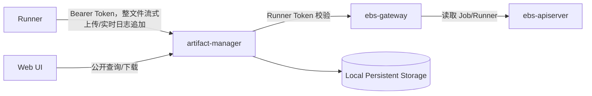

# Artifact Manager 设计

## 一、定位

Artifact Manager 是 EulerMaker 的构建结果数据服务，负责接收 Runner 上传的构建产物和日志，并提供查询、下载、保留与清理能力。

```text
Runner -> artifact-manager -> Local Persistent Storage

artifact-manager -> ebs-gateway upload authentication/authorization API
```

Artifact Manager 管理文件正文及其元数据，文件正文存储在本地持久化目录中。

## 二、设计目标

| 目标 | 说明 |
|------|------|
| 大文件上传 | 支持构建仓库、RPM、ISO 等大型产物 |
| 流式上传 | 单请求上传大文件，服务端流式落盘，不将完整文件载入内存 |
| 幂等 | 整文件上传请求可以安全重试，不生成重复 Artifact |
| 完整性 | 使用文件大小和 SHA-256 校验内容 |
| 上传隔离 | Runner 只能向分配给自己的 Job 上传文件 |
| 持久化 | 文件正文和元数据存储在本地持久化目录 |
| 可扩展 | 支持实时日志，并为后续内容扫描预留扩展点 |

## 三、总体架构



Runner 直接访问 Artifact Manager，上传正文不经过 ebs-gateway，避免 Gateway 承担构建产物和日志文件带宽。Artifact Manager 只通过 Gateway 校验 Runner Token 的签名、有效期和 scope。首版不查询 Job/Runner 对象，也不校验 Job 与 Runner 的绑定关系或 Job 阶段。Artifact 查询和下载公开访问，不经过 Gateway 鉴权。

Artifact、Job 上传清单和幂等记录均以元数据文件形式存放在本地持久化目录，不依赖独立数据库。服务启动时加载元数据并建立内存索引，本地元数据文件是事实来源。

文件正文写入 Artifact Manager 管理的本地持久化目录。使用节点本地目录时只能部署单实例。

首版由 Runner 单请求上传完整文件，Artifact Manager 流式写入本地文件系统。首版不支持普通 Artifact 的分片传输和断点续传；请求中断后 Runner 使用相同幂等键重新上传整个文件。实时日志仍使用第九章定义的 chunk/sequence 追加协议，该协议用于实时展示和日志流恢复，不属于普通 Artifact 分片上传。

## 四、文件归属与存储键

产物必须关联到具体的一次 Job 执行：

```text
project
jobName
jobUID
runnerName
```

`project` 和 `jobName` 用于展示与查询，`jobUID` 防止 Job 删除重建后与旧文件混淆。

存储键由服务端生成：

```text
projects/{project}/jobs/{jobUID}/{safeRelativePath}
```

服务对 `relativePath` 进行规范化后生成 `safeRelativePath`。路径不能为空或为绝对路径，不得包含 `..`、控制字符和符号链接；规范化后的路径必须位于该 Job 目录内。同一个 Job 中的 `safeRelativePath` 必须唯一，已存在时只有请求摘要相同的幂等重试可以返回原 Artifact。

本地后端以 `--data-dir` 为根目录，将存储键映射为正文路径。上传中的文件写入 `${dataDir}/.uploads/{artifactID}.tmp`，校验完成后在同一文件系统内原子重命名到最终路径。服务不得跟随符号链接，并必须验证规范化后的路径始终位于数据根目录内。

Artifact 元数据写入 `${dataDir}/.metadata/artifacts/{artifactID}.json`，Job 上传清单写入 `${dataDir}/.metadata/jobs/{project}/{jobUID}/manifest-{generation}.json`。元数据先写入临时文件，完成文件和父目录的 `fsync` 后原子重命名。首版只运行一个可写实例，避免在没有分布式锁的情况下并发修改同一 Artifact 或 Job 上传清单。

RPM 路径使用 `packages/{fileName}`，例如 `packages/kernel-6.6.rpm`。日志使用 `logs/` 作为一级目录。

## 五、数据模型

以下结构是首版持久化格式和 HTTP JSON 契约的基准。Go 实现可以增加不序列化的锁、文件句柄和内存索引字段，但不得改变已持久化字段的语义。所有 API 默认拒绝未知 JSON 字段，防止客户端拼写错误被静默忽略。

公共类型：

```go
type Timestamp = time.Time // JSON 使用 RFC3339Nano UTC，例如 2026-08-12T02:30:00.123Z

type ArtifactCategory string
const (
    ArtifactCategoryArtifact ArtifactCategory = "artifact"
    ArtifactCategoryLog      ArtifactCategory = "log"
)

type ArtifactState string
const (
    ArtifactPending   ArtifactState = "Pending"
    ArtifactUploading ArtifactState = "Uploading"
    ArtifactCompleted ArtifactState = "Completed"
    ArtifactFailed    ArtifactState = "Failed"
    ArtifactExpired   ArtifactState = "Expired"
)
```

### 5.1 Artifact

```go
type Artifact struct {
    SchemaVersion int              `json:"schemaVersion"`
    ID            string           `json:"id"`
    Project       string           `json:"project"`
    JobName       string           `json:"jobName"`
    JobUID        string           `json:"jobUID"`
    RunnerName    string           `json:"runnerName"`
    Category      ArtifactCategory `json:"category"`
    Name          string           `json:"name,omitempty"`
    FileName      string           `json:"fileName"`
    RelativePath  string           `json:"relativePath"`
    ContentType   string           `json:"contentType,omitempty"`
    Size          int64            `json:"size"`
    SHA256        string           `json:"sha256"`
    StorageKey    string           `json:"storageKey"`
    State         ArtifactState    `json:"state"`
    Failure       *FailureInfo     `json:"failure,omitempty"`
    CreatedAt     Timestamp        `json:"createdAt"`
    UpdatedAt     Timestamp        `json:"updatedAt"`
    CompletedAt   *Timestamp       `json:"completedAt,omitempty"`
    ExpiresAt     *Timestamp       `json:"expiresAt,omitempty"`
}
```

`category` 首版支持：

| 值 | 说明 |
|----|------|
| `artifact` | RPM、仓库、ISO 等正式构建产物 |
| `log` | 完整日志文件 |

首版只接受 `artifact` 和 `log`，其他 category 返回 `422 UnsupportedArtifactCategory`。

Artifact 状态：

```text
Pending -> Uploading -> Completed
                     \-> Failed
Completed -> Expired
```

只有 `Completed` Artifact 可以公开下载。

`ID`、归属字段、路径、大小、摘要和 `StorageKey` 创建后不可变。`Size` 必须大于等于 0；`SHA256` 是 64 位小写十六进制，不带 `sha256:` 前缀。`FileName` 必须等于规范化后 `RelativePath` 的最后一段。`StorageKey` 仅由服务端生成，不接受客户端赋值，也不在普通列表响应中用于构造本地路径。

### 5.2 JobUploadManifest

Artifact Manager 使用本地持久化的 Job 上传清单记录一次 Job 预期上传的完整文件集合，不在 ebs-apiserver 中新增资源。单个 Artifact 的 `Completed` 只表示该文件完整，`JobUploadManifest` 的 `Completed` 才表示该 Job 的全部必需文件已经完成上传。

```go
type ManifestState string
const (
    ManifestOpen       ManifestState = "Open"
    ManifestCompleting ManifestState = "Completing"
    ManifestCompleted  ManifestState = "Completed"
    ManifestFailed     ManifestState = "Failed"
)

type ManifestFile struct {
    ArtifactID   string           `json:"artifactID"`
    RelativePath string          `json:"relativePath"`
    Category    ArtifactCategory `json:"category"`
    Size        int64            `json:"size"`
    SHA256      string           `json:"sha256"`
    Required    bool             `json:"required"`
}

type ConsumerHold struct {
    ID        string    `json:"id"`
    Owner     string    `json:"owner"`
    CreatedAt Timestamp `json:"createdAt"`
    ExpiresAt Timestamp `json:"expiresAt"`
}

type JobUploadManifest struct {
    SchemaVersion  int            `json:"schemaVersion"`
    Project        string         `json:"project"`
    JobName        string         `json:"jobName"`
    JobUID         string         `json:"jobUID"`
    RunnerName     string         `json:"runnerName"`
    Generation     int64          `json:"generation"`
    IdempotencyKey string         `json:"idempotencyKey"`
    Files          []ManifestFile `json:"files"`
    Digest         string         `json:"digest,omitempty"`
    State          ManifestState  `json:"state"`
    Failure        *FailureInfo   `json:"failure,omitempty"`
    Holds          []ConsumerHold `json:"holds,omitempty"`
    CreatedAt      Timestamp      `json:"createdAt"`
    UpdatedAt      Timestamp      `json:"updatedAt"`
    CompletedAt    *Timestamp     `json:"completedAt,omitempty"`
    ExpiresAt      *Timestamp     `json:"expiresAt,omitempty"`
}
```

清单状态：

```text
Open -> Completing -> Completed
                  \-> Failed
```

`files` 中的路径必须唯一。清单完成后不可增加、删除或替换文件；确需补传时必须创建新的 `generation`，消费者必须读取明确的 generation，不能隐式跟随最新版本。

`digest` 对按 `relativePath` 排序后的规范字段计算 SHA-256，不直接对未规范化的 JSON 文本计算，保证相同清单始终产生相同摘要。

`Generation` 从 1 开始。`Files` 至少包含一个条目，并按 `relativePath` 排序持久化；`artifactID` 和 `relativePath` 在清单内都必须唯一。首版的 `manifest/complete` 同时提交并封账清单，`Open` 和 `Completing` 是服务端持久化过程中的可恢复状态，不提供单独编辑 Open 清单的公共接口。

摘要输入逐项使用 UTF-8 编码，数字使用不带前导零的十进制，布尔值使用 `true/false`：

```text
artifact-manifest-v1\n
generation\n
relativePath\0artifactID\0category\0size\0sha256\0required\n
...
```

最终 `Digest` 表示为 `sha256:<64位小写十六进制>`。

### 5.3 LogStream

```go
type LogStreamState string
const (
    LogOpen       LogStreamState = "Open"
    LogFinalizing LogStreamState = "Finalizing"
    LogCompleted  LogStreamState = "Completed"
    LogFailed     LogStreamState = "Failed"
    LogExpired    LogStreamState = "Expired"
)

type LogChunkRecord struct {
    Sequence    int64  `json:"sequence"`
    StartOffset int64  `json:"startOffset"`
    Size        int64  `json:"size"`
    SHA256      string `json:"sha256"`
}

type LogStream struct {
    SchemaVersion  int            `json:"schemaVersion"`
    Project        string         `json:"project"`
    JobName        string         `json:"jobName"`
    JobUID         string         `json:"jobUID"`
    RunnerName     string         `json:"runnerName"`
    Stream         string         `json:"stream"`
    State          LogStreamState `json:"state"`
    NextSequence   int64          `json:"nextSequence"`
    CommittedBytes int64          `json:"committedBytes"`
    ArtifactID     string         `json:"artifactID,omitempty"`
    FinalSize      *int64         `json:"finalSize,omitempty"`
    FinalSHA256    string         `json:"finalSHA256,omitempty"`
    Failure        *FailureInfo   `json:"failure,omitempty"`
    CreatedAt      Timestamp      `json:"createdAt"`
    UpdatedAt      Timestamp      `json:"updatedAt"`
    CompletedAt    *Timestamp     `json:"completedAt,omitempty"`
    ExpiresAt      *Timestamp     `json:"expiresAt,omitempty"`
}
```

首版 `Stream` 只能是 `combined`。`NextSequence` 初始为 0，`CommittedBytes` 初始为 0。`LogChunkRecord` 使用 JSON Lines 追加式索引文件持久化，不在每次追加时整体重写进 `LogStream` JSON；记录必须满足 sequence 连续、offset 连续，且 `StartOffset+Size` 不超过 `CommittedBytes`。

索引文件每行是一个完整、紧凑的 JSON 对象，以单个 `\n` 结束，不允许空行、注释或跨行 JSON：

```jsonl
{"sequence":0,"startOffset":0,"size":1024,"sha256":"a1b2..."}
{"sequence":1,"startOffset":1024,"size":2048,"sha256":"c3d4..."}
```

字段顺序不是读取协议的一部分；实现必须按 JSON 字段名解析并拒绝未知字段。`sha256` 是对应 chunk 解压后正文的 64 位小写十六进制摘要。索引只能追加，不能就地修改已有记录。

### 5.4 IdempotencyRecord

整文件上传使用独立的本地幂等记录，在服务重启和 Artifact 临时状态清理后仍能识别重复请求。

```go
type IdempotencyState string
const (
    IdempotencyProcessing IdempotencyState = "Processing"
    IdempotencyCompleted  IdempotencyState = "Completed"
    IdempotencyFailed     IdempotencyState = "Failed"
)

type IdempotencyRecord struct {
    SchemaVersion int              `json:"schemaVersion"`
    Scope         string           `json:"scope"`
    Key           string           `json:"key"`
    RequestDigest string           `json:"requestDigest"`
    ArtifactID    string           `json:"artifactID"`
    State         IdempotencyState `json:"state"`
    Failure       *FailureInfo     `json:"failure,omitempty"`
    CreatedAt     Timestamp        `json:"createdAt"`
    UpdatedAt     Timestamp        `json:"updatedAt"`
    CompletedAt   *Timestamp       `json:"completedAt,omitempty"`
    ExpiresAt     *Timestamp       `json:"expiresAt,omitempty"`
}
```

上传作用域固定为 `artifact-upload/{project}/{jobUID}`。本地路径使用作用域和 key 的 SHA-256，客户端输入不得直接成为文件名：

```text
${dataDir}/.metadata/idempotency/{scopeSHA256}/{keySHA256}.json
```

`RequestDigest` 对规范化后的 `UploadArtifactMetadata` 计算，不包含 multipart boundary、header 顺序或文件正文；摘要格式为 `sha256:<64位小写十六进制>`。摘要输入固定为：

```text
artifact-upload-v1\n
jobUID\0category\0name\0fileName\0relativePath\0contentType\0size\0sha256\n
```

创建 `Processing` 记录和 `Pending` Artifact 时必须持有 `(scope,key)` 进程内锁。相同作用域和 key 的并发请求只能有一个进入正文读取阶段。`Completed` 记录与对应 Completed Artifact 的保留期限一致；`Failed` 记录默认保留 24 小时，并允许相同摘要的请求复用原 Artifact ID 整文件重传。

### 5.5 通用失败、错误和分页结构

```go
type FailureInfo struct {
    Code      string    `json:"code"`
    Message   string    `json:"message"`
    Retryable bool      `json:"retryable"`
    Time      Timestamp `json:"time"`
}

type APIError struct {
    Code      string         `json:"code"`
    Message   string         `json:"message"`
    Retryable bool           `json:"retryable"`
    RequestID string         `json:"requestID"`
    Details   map[string]any `json:"details,omitempty"`
}

type ArtifactList struct {
    Items      []Artifact `json:"items"`
    NextCursor string     `json:"nextCursor,omitempty"`
}
```

API 错误响应的 `Content-Type` 为 `application/json`，客户端只能依赖稳定的 `code` 和结构化 `details`，不能解析 `message`。列表默认按 `(completedAt,id)` 升序排序，cursor 是服务端编码的这两个字段，客户端必须视为不透明字符串。默认每页 100 条，最大 1000 条；翻页期间新完成的 Artifact 只可能出现在后续页，不返回非 `Completed` 对象。

### 5.6 通用格式与校验约束

| 字段 | 约束 |
|------|------|
| `schemaVersion` | 首版固定为 1；读取未知主版本必须拒绝启动或隔离该记录 |
| `id` | 服务端生成，Artifact 为 `art_<ULID>` |
| `project`、`jobName` | 1–253 字节，必须与 ebs-apiserver 中对象一致 |
| `jobUID` | Kubernetes UID 字符串，1–128 字节，不能只凭 Job 名推导 |
| `runnerName` | 来自 Gateway 认证结果，客户端请求正文不得提供 |
| `relativePath` | UTF-8 相对路径，规范化后不超过 1024 字节，不允许空段、`.`、`..`、反斜杠、控制字符和符号链接 |
| `fileName`、`name` | UTF-8，分别不超过 255 和 256 字节；`name` 仅用于展示 |
| `contentType` | 不超过 255 字节，仅用于展示，不作为可信文件类型 |
| `size`、offset | `int64` 非负数，并受部署配额限制 |
| 单文件 SHA-256 | 64 位小写十六进制；Manifest digest 使用 `sha256:` 前缀 |
| `idempotencyKey` | 1–128 个可打印 ASCII 字符，不得包含空白；同一作用域内唯一 |
| `generation` | 从 1 开始的正 `int64` |

持久化记录的不可变字段不得通过更新接口修改。状态更新必须验证合法状态转换；失败记录不得包含 Token、文件正文、绝对本地路径或敏感签名材料。

### 5.7 HTTP 请求与响应结构

```go
type UploadArtifactMetadata struct {
    JobUID       string           `json:"jobUID"`
    Category     ArtifactCategory `json:"category"`
    Name         string           `json:"name,omitempty"`
    FileName     string           `json:"fileName"`
    RelativePath string           `json:"relativePath"`
    ContentType  string           `json:"contentType,omitempty"`
    Size         int64            `json:"size"`
    SHA256       string           `json:"sha256"`
}

type UploadArtifactResponse struct {
    Artifact Artifact `json:"artifact"`
}

type CompleteManifestRequest struct {
    JobUID     string         `json:"jobUID"`
    Generation int64          `json:"generation"`
    Files      []ManifestFile `json:"files"`
}

type CompleteManifestResponse struct {
    JobUID        string        `json:"jobUID"`
    Generation    int64         `json:"generation"`
    State         ManifestState `json:"state"`
    ArtifactCount int           `json:"artifactCount"`
    Digest        string        `json:"digest"`
}

type LogStatusResponse struct {
    Stream         string         `json:"stream"`
    State          LogStreamState `json:"state"`
    NextSequence   int64          `json:"nextSequence"`
    CommittedBytes int64          `json:"committedBytes"`
    ArtifactID     string         `json:"artifactID,omitempty"`
    UpdatedAt      Timestamp      `json:"updatedAt"`
}

type CompleteLogRequest struct {
    JobUID       string `json:"jobUID"`
    Stream       string `json:"stream"`
    LastSequence int64  `json:"lastSequence"`
    Size         int64  `json:"size"`
    SHA256       string `json:"sha256"`
}

type CompleteLogResponse struct {
    State        LogStreamState `json:"state"`
    ArtifactID   string         `json:"artifactID"`
    RelativePath string         `json:"relativePath"`
    Size         int64          `json:"size"`
    SHA256       string         `json:"sha256"`
}

type SSELogData struct {
    Encoding string `json:"encoding"` // 固定为 base64
    Content  string `json:"content"`
}

type SSECompleteData struct {
    ArtifactID string `json:"artifactID"`
    Size       int64  `json:"size"`
    SHA256     string `json:"sha256"`
}
```

HTTP 路径中的 `{project}`、`{job}` 是归属来源，上传元数据不得重复提供或覆盖。`RunnerName`、ID、状态、存储键和时间均由服务端填写。空文件使用长度为 0 的正文上传；空日志封账时 `lastSequence=-1`、`size=0`、`sha256` 为 SHA-256 空输入。JobUploadManifest 首版不允许空 `files`；没有需要归档文件的 Job 不创建 manifest，并在 Job Status 中记录 `artifactCount=0` 和明确的 `artifactState=NotRequired`。

## 六、上传 API

Artifact API 使用独立前缀：

```text
/artifacts/v1
```

### 6.1 上传 Artifact

```http
POST /artifacts/v1/projects/{project}/jobs/{job}/artifacts
Authorization: Bearer <runner-token>
Idempotency-Key: <uuid>
Content-Type: multipart/form-data; boundary=...
```

请求按顺序包含 `metadata` 和 `file` 两个 form-data part。`metadata` 必须位于 `file` 之前，使用 `application/json`，结构为 `UploadArtifactMetadata`；`file` 使用 `application/octet-stream`：

```json
{
  "jobUID": "e32450b8-...",
  "category": "artifact",
  "fileName": "kernel-6.6.rpm",
  "relativePath": "packages/kernel-6.6.rpm",
  "contentType": "application/x-rpm",
  "size": 183746291,
  "sha256": "d6f4..."
}
```

成功返回 `UploadArtifactResponse`：

```json
{
  "artifact": {
    "id": "art_01...",
    "state": "Completed",
    "relativePath": "packages/kernel-6.6.rpm",
    "size": 183746291,
    "sha256": "d6f4..."
  }
}
```

服务先验证 Runner Token、上传元数据和配额，再创建 `Pending` Artifact。读取 `file` part 时流式写入 `${dataDir}/.uploads/{artifactID}.tmp`，同时累计大小和 SHA-256，不将完整文件载入内存。请求正文结束后：

1. 验证实际大小和 SHA-256 与 metadata 相同。
2. 对临时正文执行 `fdatasync`。
3. 将正文原子重命名到最终 `StorageKey` 并 `fsync` 父目录。
4. 原子写入 `Completed` Artifact 元数据。
5. 返回完整 Artifact。

请求中断或校验失败时删除临时正文，并将未提交的 Artifact 元数据删除或标记为 `Failed` 供后台清理。首版不提供上传进度查询、继续上传或中止接口；Runner 必须保留本地文件并使用相同 `Idempotency-Key` 整文件重传。

服务持久化 `(jobUID, idempotencyKey)`、规范化请求元数据摘要和响应 Artifact ID。相同键且元数据摘要相同时：已有 Artifact 为 `Completed` 则直接返回原结果；仍有上传请求进行中则返回 409 `UploadInProgress`；前次失败或中断则清理旧临时文件并允许整文件重传。相同键但元数据摘要不同返回 409 `IdempotencyConflict`。

#### 6.1.1 Multipart 解析限制

首版 multipart 请求必须满足：

- 恰好包含一个名为 `metadata` 的 part 和一个名为 `file` 的 part，不允许额外、重复或嵌套 multipart part。
- `metadata` 必须是第一个 part，`file` 必须是第二个且为最后一个 part；服务必须在读取文件正文前完成 metadata、鉴权、配额和幂等检查。
- `metadata` 的 `Content-Type` 必须是 `application/json`，解码时拒绝未知字段和尾随 JSON 数据；正文大小不得超过 `--max-metadata-size`。
- `file` 的 `Content-Type` 必须是 `application/octet-stream`。multipart 文件名仅用于协议兼容，不能覆盖 metadata 中的 `fileName`。
- 单个 part 的 header 数量、单个 header 长度和全部 header 总大小必须分别受配置限制；拒绝重复的 `Content-Disposition`、控制字符和非法 boundary。
- 请求可以不带总 `Content-Length`，但服务必须对整个请求使用有上限的流式 reader。实际文件字节超过 metadata.size 或 `--max-file-size` 时立即停止读取并返回 413。
- 请求带有 `Content-Length` 时，只用于提前拒绝明显超限请求，不能替代实际流式计数和摘要校验。
- file 正文允许为 0 字节；到达 multipart 结尾时实际大小必须严格等于 metadata.size。
- 临时文件使用服务端生成的 Artifact ID 并以独占方式创建，禁止覆盖现有临时文件，不使用客户端文件名拼接路径。
- 从读取请求头到正文完成均受 `--upload-timeout` 和最小上传速率限制；超时、取消或客户端断开必须关闭文件句柄并清理临时文件。

违反 part 数量、顺序、类型或 metadata 格式返回 400 `InvalidMultipartRequest`；超过 metadata、header 或请求大小限制返回 413 `RequestTooLarge`。

#### 6.1.2 可恢复提交顺序

整文件上传不是跨多个文件的原子事务。实现必须使用以下固定、可重放的提交顺序，以最终正文的原子 rename 作为正文提交点：

1. 获取 `(scope,idempotencyKey)` 锁，原子写入 `Processing` IdempotencyRecord。
2. 原子写入 `Pending` Artifact 元数据，其中已经包含最终 `StorageKey`。
3. 以独占方式创建 `.uploads/{artifactID}.tmp`，流式写入并计算大小和 SHA-256。
4. 校验成功后对临时正文执行 `fdatasync`。
5. 将临时正文原子 rename 到最终 `StorageKey`，随后 `fsync` 最终正文的父目录；该 rename 是正文提交点。
6. 原子更新 Artifact 元数据为 `Completed` 并 `fsync` 元数据父目录。
7. 原子更新 IdempotencyRecord 为 `Completed`，设置 `CompletedAt`，并 `fsync` 幂等记录父目录。
8. 返回成功响应并释放锁。

步骤 5 之后任何失败都不能删除最终正文；服务应返回可重试错误，由相同幂等键请求或启动恢复流程补齐元数据。步骤 5 之前失败则关闭并删除临时正文，将 IdempotencyRecord 和 Artifact 标记为 `Failed`，允许相同摘要整文件重传。

服务启动时按以下规则恢复：

| 现场状态 | 恢复动作 |
|----------|----------|
| Processing 记录 + Pending Artifact + 临时正文 | 删除临时正文，将幂等记录和 Artifact 标记为 Failed，允许相同摘要整文件重传 |
| Processing 记录 + Pending Artifact + 最终正文 | 流式复核大小和 SHA-256；匹配则补写 Completed Artifact 和幂等记录，不匹配则隔离正文并标记 Corrupted |
| Processing 记录存在但 Artifact 不存在 | 标记幂等记录 Failed；相同摘要重试时重新创建 Artifact |
| Completed Artifact + Processing/Failed 幂等记录 | 核对 Artifact ID 和请求摘要后补写 Completed 幂等记录 |
| Completed 幂等记录 + Pending Artifact + 最终正文 | 复核正文后补写 Completed Artifact；不匹配则标记 Corrupted，不能返回原成功响应 |
| Completed Artifact 但最终正文缺失 | 将 Artifact 和幂等记录标记 Failed/Corrupted，内容接口不得返回成功 |
| 只有临时正文 | 超过 `--temporary-upload-ttl` 后删除 |
| 只有最终正文且没有 Artifact/幂等记录 | 移入隔离目录并记录告警，不能自动公开或按客户端路径猜测归属 |

恢复和正常上传必须使用相同的 per-key/per-Artifact 锁，避免启动扫描与新请求同时修改一组记录。隔离目录中的正文只能由后台审计或管理员处理。

### 6.2 提交并完成 Job 上传清单

Runner 完成全部单文件上传后提交最终清单：

```http
POST /artifacts/v1/projects/{project}/jobs/{job}/manifest/complete
Authorization: Bearer <runner-token>
Idempotency-Key: <jobUID>-manifest-<generation>
Content-Type: application/json
```

```json
{
  "jobUID": "e32450b8-...",
  "generation": 1,
  "files": [
    {
      "artifactID": "art-01...",
      "relativePath": "packages/kernel-6.6.rpm",
      "category": "artifact",
      "size": 183746291,
      "sha256": "d6f4...",
      "required": true
    }
  ]
}
```

服务以 `(project, jobUID, generation)` 为粒度加锁，并验证：

1. Runner Token 仍然有效，URL、请求清单与 Artifact 中的 project、jobName、jobUID 归属一致。
2. 清单内路径唯一，且每个 Artifact 都属于该 Job。
3. 所有必需 Artifact 均为 `Completed`。
4. Artifact 的路径、大小和 SHA-256 与清单一致。
5. 同一 generation 尚未由不同内容完成。

验证成功后计算确定性的清单摘要，原子写入 `Completed` 清单。相同幂等键或相同内容的重复请求返回原结果；已经完成的 generation 收到不同内容时返回 `409 Conflict`。

```json
{
  "jobUID": "e32450b8-...",
  "generation": 1,
  "state": "Completed",
  "artifactCount": 1,
  "digest": "sha256:..."
}
```

清单完成后禁止为该 generation 创建或完成新的 Artifact 上传。该接口是一次 Job 产物集合的封账边界，不能通过扫描当前已有 Artifact 推断上传是否结束。

### 6.3 查询 Job 上传清单

```http
GET /artifacts/v1/projects/{project}/jobs/{job}/manifest?jobUID={uid}&generation={generation}
```

接口返回固定 generation 的清单状态、摘要和文件列表。Repo Controller 等消费者只有在清单状态为 `Completed` 时才能使用其中的 Artifact，并应记录和校验返回的 `digest`。消费者不得直接读取 Artifact Manager 的本地元数据文件。

## 七、查询与下载 API

Artifact 查询、列表和下载不要求登录，也不执行 Project 权限检查。任何能够访问 Artifact Manager 的客户端都可以查询 Completed Artifact 并获取下载地址。

### 7.1 查询 Job 产物

```http
GET /artifacts/v1/projects/{project}/jobs/{job}/artifacts?jobUID={uid}
```

默认只返回 Completed Artifact，并支持按 `category`、文件名和分页游标过滤。

### 7.2 下载文件

```http
GET /artifacts/v1/artifacts/{artifactID}/content
```

正文接口支持 `Range`、`ETag`、`If-None-Match` 和 `Content-Disposition`。Artifact Manager 流式读取文件并返回，下载过程中不得将完整文件载入内存。

公开查询和下载是系统明确的数据访问策略。部署方必须通过网络边界决定 Artifact Manager 是否向公网开放，并为公开接口配置请求速率和下载带宽限制。

## 八、Runner 上传流程

Runner 执行完成后扫描 Job 结果目录并生成 manifest：

```json
{
  "jobUID": "e32450b8-...",
  "files": [
    {
      "relativePath": "packages/kernel.rpm",
      "category": "artifact",
      "size": 183746291,
      "sha256": "..."
    },
    {
      "relativePath": "logs/container.log",
      "category": "log",
      "size": 738291,
      "sha256": "..."
    }
  ]
}
```

上传流程：

1. Runner 完成执行，Job 进入 `stage=PostRun`。
2. 扫描结果目录并计算文件大小和 SHA-256。
3. 对每个文件发起单请求流式上传，Artifact Manager 完成大小和 SHA-256 校验后返回 `Completed` Artifact。
4. 上传请求失败时使用相同幂等键整文件重传。
5. 确认每个必需文件均已返回 `Completed`。
6. 调用 Job 上传清单完成接口，由 Artifact Manager 校验并封账全部必需文件。
7. 清单完成后更新 Job 的 `artifactState`、`artifactGeneration`、`artifactDigest` 和 `artifactCount`，再将 Job 更新为 `phase=Completed`；必需产物上传或清单封账失败时更新为 `Failed`。

Runner 默认并发上传 2–4 个文件，并对总带宽和同时上传的文件数量限流。上传成功前保留本地文件。

扫描结果目录时必须：

- 拒绝或忽略符号链接。
- 确保所有规范化路径仍位于结果根目录。
- 忽略 socket、device 和 named pipe。
- 限制单文件大小、文件数量和总大小。
- 保证同一个相对路径只生成一条 manifest 记录。

推荐使用 `packages/`、`logs/` 等一级目录组织产物；Repo Controller 将 `packages/` 下的 RPM 重新组织到最终 repo 的 `Packages/` 目录。

## 九、日志处理

### 9.1 最终日志文件

容器运行期间的实时日志和 Job 结束后的最终日志使用同一份活动日志正文。Artifact Manager 持续追加实时日志；Runner 封账后，服务将该正文原子转换为 `relativePath=logs/container.log`、`category=log` 的普通 `Completed` Artifact，用于长期归档、查询和下载，不再要求 Runner 重复上传完整日志文件。

### 9.2 实时日志

实时日志使用独立于 Artifact 分片上传的追加协议。每个 Job 首版只允许一个 `stream=combined` 的日志流，按 Runner 捕获顺序合并 stdout 和 stderr。服务端以 `(project, jobUID, stream)` 唯一标识日志流，Job 名仅用于路由和展示。

日志流状态：

```text
Open -> Finalizing -> Completed
                   \-> Failed
Open -> Expired
```

本地持久化布局：

```text
${dataDir}/.logs/{project}/{jobUID}/combined.log
${dataDir}/.logs/{project}/{jobUID}/combined.index.jsonl
${dataDir}/.metadata/logs/{project}/{jobUID}/combined.json
```

`combined.index.jsonl` 是 sequence、字节范围和 chunk 摘要的持久化索引；`combined.json` 只保存 `LogStream` 的小型汇总状态，不重复保存最近 chunk 列表。日志正文只追加到一个活动文件，不把每个 chunk 保存成长期独立对象。

接收新 chunk 时，提交顺序固定为：

1. 将解压后的正文追加到 `combined.log`，执行 `fdatasync`。
2. 将一条带换行符的完整 JSON 记录追加到 `combined.index.jsonl`，执行 `fdatasync`。
3. 原子更新 `combined.json` 中的 `nextSequence`、`committedBytes` 和 `updatedAt`，并 `fsync` 父目录。
4. 只有以上步骤全部成功后才向 Runner 返回确认。

`combined.index.jsonl` 是已提交 chunk 边界的事实来源，`combined.json` 是可重建的汇总和状态来源。步骤 1 或 2 后崩溃产生的未提交尾部必须在恢复阶段截断，不能直接对 Runner 返回成功。

#### 9.2.1 追加日志块

```http
POST /artifacts/v1/projects/{project}/jobs/{job}/logs/chunks
Authorization: Bearer <runner-token>
Content-Type: application/octet-stream
Content-Encoding: identity | gzip
X-Job-UID: e32450b8-...
X-Log-Stream: combined
X-Log-Sequence: 100
X-Content-SHA256: <解压后正文的sha256>
```

请求体是一个 sequence 对应的原始日志字节，可选使用 gzip 传输压缩。sequence 从 `0` 开始且每个请求递增 `1`；sequence 标识日志块而不是日志行。`X-Content-SHA256` 始终针对解压后的字节计算，服务端必须限制压缩前后大小和解压比例，防止压缩炸弹。

成功返回：

```json
{
  "stream": "combined",
  "acceptedSequence": 100,
  "nextSequence": 101,
  "committedBytes": 18743291
}
```

服务端按以下规则处理 sequence：

| 请求情况 | 处理 |
|----------|------|
| `sequence == nextSequence` | 校验摘要后追加、持久化并返回 200 |
| `sequence < nextSequence` 且已记录摘要相同 | 视为幂等重试，不重复追加，返回 200 |
| `sequence < nextSequence` 但摘要不同 | 返回 409 `SequenceConflict` |
| `sequence > nextSequence` | 返回 409 `SequenceGap`，响应携带期望的 `nextSequence` |
| 日志流已经 Completed | 返回 409 `LogAlreadyFinalized` |
| URL、请求或已有日志流中的 Job 标识不一致 | 返回 409 `JobIdentityConflict` |

服务端不接受乱序缓存。Runner 收到 `SequenceGap` 后，从服务端返回的 `nextSequence` 开始重传，避免服务端持有无界乱序数据。为了判定旧 sequence 的幂等重试，服务端保留最近 `--log-dedupe-window` 个 chunk 的 sequence、大小和 SHA-256；早于窗口的重复请求返回 409，Runner 应先查询状态并从 `nextSequence` 继续。

Runner 在本地维护待确认缓冲区，每达到 256 KiB 或 500 ms 发送一个 chunk，同一日志流同一时间最多发送一个未确认请求。只有服务端确认后才能丢弃对应本地字节；网络错误使用相同 sequence 和正文重试。服务端返回 429 或 503 时，Runner 按 `Retry-After` 和指数退避重试，并限制本地缓冲区大小；超过上限时应暂停读取或将日志溢写到本地文件，不能静默丢弃日志。

#### 9.2.2 查询日志流状态

```http
GET /artifacts/v1/projects/{project}/jobs/{job}/logs/status?jobUID={uid}&stream=combined
Authorization: Bearer <runner-token>
```

```json
{
  "stream": "combined",
  "state": "Open",
  "nextSequence": 101,
  "committedBytes": 18743291,
  "updatedAt": "2026-08-12T10:30:00Z"
}
```

Runner 启动、重连或遇到结果未知时查询该接口，并以 `nextSequence` 作为恢复点。Runner 必须在本地保留尚未被服务端确认的日志；如果服务端请求的 sequence 已不在 Runner 本地缓冲或落盘文件中，Runner 将 Job 标记为日志不完整，不能伪造缺失数据继续封账。

#### 9.2.3 SSE 实时读取

```http
GET /artifacts/v1/projects/{project}/jobs/{job}/logs/stream?jobUID={uid}&stream=combined&afterSequence=100
Accept: text/event-stream
Last-Event-ID: 100
```

响应事件：

```text
id: 101
event: log
data: {"encoding":"base64","content":"Li4u"}

event: complete
data: {"artifactID":"art-log-01","size":18743291,"sha256":"..."}
```

事件 ID 是 chunk sequence。恢复位置的优先级为 `Last-Event-ID` 请求头、`afterSequence` 查询参数、当前最新 sequence。浏览器原生 `EventSource` 首次连接不能自行设置 `Last-Event-ID`，因此首次从历史日志衔接实时流时必须使用 `afterSequence`；浏览器自动重连时会携带最后收到的 `Last-Event-ID`。服务端总是从恢复位置的下一 sequence 推送。两者同时存在时必须优先使用 `Last-Event-ID`，避免代理或客户端重连时退回旧位置。

未提供恢复位置时只推送连接建立后的新日志。提供的 sequence 已超出内存重放窗口时返回 409 `ReplayWindowExceeded`，客户端改用活动日志读取接口补齐后重连。服务端应在 SSE 流开始处发送 `retry: 2000`，建议浏览器断线 2 秒后重连。

SSE 只是展示通道，不参与持久化确认。慢客户端使用有界发送队列；队列溢出时断开连接，让客户端通过 `Last-Event-ID` 恢复，不能阻塞 Runner 写入。服务端定期发送注释心跳，建议间隔 15 秒。SSE 响应必须禁用代理缓冲和中间缓存，例如返回 `Cache-Control: no-cache, no-transform` 和 `X-Accel-Buffering: no`。

活动日志读取接口：

```http
GET /artifacts/v1/projects/{project}/jobs/{job}/logs/content?jobUID={uid}&stream=combined
Range: bytes=<start>-<end>
```

只读取已提交的 `committedBytes`，支持 `Range`、`ETag` 和 `If-None-Match`。处理请求时，服务端必须在同一个一致性快照中读取 `snapshotCommittedBytes` 和 `snapshotNextSequence`，响应正文不得超过该快照的字节边界，不能在正文读取结束后再获取最新 sequence。

响应头至少包含：

```http
X-Log-State: Open | Completed | Failed
X-Log-Next-Sequence: 101
X-Committed-Bytes: 18743291
X-Artifact-ID: art-log-01
```

`X-Artifact-ID` 只在日志已经封账时返回。日志流完成后，接口继续返回相同正文和这些响应头，避免 Web UI 因重定向产生不同处理流程；最终日志的独立下载仍使用 Artifact 内容接口。

#### 9.2.4 Web UI 展示流程

Web UI 使用 Range 获取已有日志，再用 SSE 接收新增日志：

```text
LoadingHistory -> ConnectingSSE -> Streaming -> Completed
                         ^              |
                         |              v
                  CatchingUpByRange <- Disconnected
```

首次打开页面时：

1. 请求 `/logs/content`，首屏可使用 `Range: bytes=0-`；日志很大时可以只请求末尾窗口，并提供加载更早内容的入口。
2. 记录响应正文结束位置 `committedOffset=X-Committed-Bytes`，以及 `lastSequence=X-Log-Next-Sequence-1`。
3. 如果 `X-Log-State=Completed`，直接展示正文和完整日志下载入口，不建立 SSE。
4. 如果日志仍为 Open，使用 `afterSequence={lastSequence}` 创建 `EventSource`。由于响应正文和 sequence 来自同一个一致性快照，SSE 会从下一 chunk 开始，不会遗漏 Range 请求与 SSE 建连之间到达的日志。

前端处理 `log` 事件时应：

1. Base64 解码 `content` 得到原始字节。
2. 使用 `TextDecoder("utf-8")` 的 `{stream:true}` 模式增量解码，正确处理跨 chunk 的 UTF-8 字符。
3. 将字节长度累加到 `committedOffset`，把 `event.lastEventId` 保存为 `lastSequence`。
4. 批量刷新终端组件，不能为每一行创建永久 DOM 节点。

SSE 使用 Base64 是因为日志可能包含非 UTF-8 字节、不完整的多字节字符、换行和 SSE 控制格式。页面推荐使用 xterm.js 或虚拟列表，只保留有限可视行；完整内容通过 Range 分段加载或 Artifact 下载。用户离开底部时只暂停自动滚动，不暂停接收和位置记录。

浏览器自动重连会携带 `Last-Event-ID`。如果发生普通网络错误，Web UI 保持当前 `committedOffset` 和 `lastSequence` 等待自动重连；如果持续失败或服务端报告 `ReplayWindowExceeded`，则关闭 `EventSource`，执行：

```http
GET .../logs/content
Range: bytes={committedOffset}-
```

页面追加补齐内容，从新响应头更新 `committedOffset` 和 `lastSequence`，再以新的 `afterSequence` 创建 SSE。由于原生 `EventSource` 无法可靠读取非 200 响应体，前端不能依赖解析 409 的 JSON 正文，应在错误后主动走 Range 补齐流程。

收到：

```text
event: complete
data: {"artifactID":"art-log-01","size":18743291,"sha256":"..."}
```

前端刷新 `TextDecoder` 剩余内容、关闭 `EventSource`、将状态更新为 Completed，并显示 `/artifacts/v1/artifacts/{artifactID}/content` 的完整日志下载入口。页面隐藏时可以降低渲染频率，但仍需持续消费事件并保存 byte offset 和 sequence。

#### 9.2.5 日志封账

Job 执行结束且全部日志 chunk 已确认后，Runner 调用：

```http
POST /artifacts/v1/projects/{project}/jobs/{job}/logs/complete
Authorization: Bearer <runner-token>
Idempotency-Key: <jobUID>-log-complete
Content-Type: application/json
```

```json
{
  "jobUID": "e32450b8-...",
  "stream": "combined",
  "lastSequence": 100,
  "size": 18743291,
  "sha256": "..."
}
```

服务端以日志流为粒度加锁，并执行：

1. 重新校验 Runner Token 的签名、有效期和 `ebs:runner` scope。
2. 检查 `nextSequence == lastSequence + 1`，且没有 sequence 缺口。
3. 检查已提交字节数等于 `size`，重新流式计算完整正文 SHA-256。
4. 将状态置为 `Finalizing`，把活动日志正文原子移动到 Artifact 的最终存储键；正文已经位于目标文件系统时不得复制整份文件。
5. 创建或更新 `category=log`、`relativePath=logs/container.log` 的 Artifact 元数据，并将日志流与 Artifact 原子标记为 `Completed`。

成功返回：

```json
{
  "state": "Completed",
  "artifactID": "art-log-01...",
  "relativePath": "logs/container.log",
  "size": 18743291,
  "sha256": "..."
}
```

重复完成请求必须返回同一个 Artifact；相同幂等键或已完成日志流携带不同的 `lastSequence`、大小或摘要时返回 409。最终日志 Artifact 可以加入 JobUploadManifest；日志是否为必需文件由 Job 类型决定。日志封账失败时保留活动正文和可恢复状态，不能要求 Runner 从头上传。

#### 9.2.6 崩溃恢复和清理

服务启动时加载日志元数据并校验正文长度：

- 逐行解析 `combined.index.jsonl`；最后一行不是完整 JSON 或缺少结尾换行时，删除该残缺尾行并 `fdatasync`，文件中部存在无效 JSON 时标记为 `Failed/Corrupted`。
- 验证索引从 sequence 0 开始连续，首条 `startOffset=0`，且每条 `startOffset` 等于上一条的 `startOffset+size`；不满足时标记为 `Failed/Corrupted`。
- 以最后一条有效索引的 `startOffset+size` 作为恢复后的 `committedBytes`，以最后 sequence 加 1 作为 `nextSequence`；空索引对应两个值均为 0。
- 正文长度大于索引得出的 `committedBytes` 时，截断未提交尾部并 `fdatasync`。
- 正文长度小于索引得出的 `committedBytes` 时，将日志流标记为 `Failed/Corrupted`，禁止继续追加和封账。
- `combined.json` 与索引汇总不一致且日志仍为 Open 时，以索引为准原子重建汇总字段；终态和失败信息仍以 `combined.json` 为准。
- `Finalizing` 状态根据最终 Artifact 元数据和正文是否存在幂等完成或回退到可重试状态。
- `Completed` 状态缺少 Artifact 元数据或正文时标记为 `Failed/Corrupted`，不得返回成功。

Job 终止后长时间没有封账的 Open 日志流按 `--active-log-ttl` 过期并异步清理；仍处于可运行阶段的 Job 不得仅因长时间无日志而过期。最终日志 Artifact 进入普通 `category=log` 保留策略。

## 十、上传 Token 校验

### 10.1 Runner 上传

Runner 使用现有短期 `ebs:runner` Token 直接请求 Artifact Manager。Artifact Manager 不自行签发 Token，也不依赖 Gateway 注入身份头，而是将 Token 发送给 ebs-gateway 公开 Token 校验接口：

```http
POST /auth/check
Authorization: Bearer <runner-token>
```

Gateway 只验证 Token 的签名、issuer、audience、有效期和 scopes 结构，不查询 ebs-apiserver 中的 Job 或 Runner。验证成功时返回经过认证的身份：

```json
{
  "authenticated": true,
  "identity": {
    "type": "runner",
    "name": "runner-ct-aarch64-01",
    "scopes": ["ebs:runner"]
  },
  "expiresAt": "2026-08-11T12:00:00Z"
}
```

Artifact Manager 必须确认响应中的 `identity.type=runner` 且 `identity.scopes` 包含 `ebs:runner`，随后使用 `identity.name` 作为 Runner 名称；不能信任上传请求正文、查询参数或外部请求头提供的身份。其他合法 Token 类型由 Gateway 正常解析，但 Artifact Manager 必须拒绝。

首版明确不执行以下检查：

- 不读取 Job 或 Runner 对象。
- 不校验 `job.status.runner` 是否等于 Token 中的 Runner。
- 不校验 Job 当前 phase/stage 是否允许上传。
- 不校验 Token 身份是否有权操作请求中的 project、jobName 或 jobUID。

Artifact Manager 仍需校验同一个请求和已有本地记录之间的标识一致性，例如 URL Project、URL Job、metadata.jobUID、Artifact 和 Manifest 归属不能互相冲突。这属于本地数据完整性校验，不是 Job/Runner 授权检查。

鉴权时机：

| 操作 | 检查要求 |
|------|----------|
| 上传 Artifact | 读取文件正文前校验 Token；提交 Artifact 前确认 Token 仍在有效期内 |
| 完成 Job 上传清单 | 校验 Token，并以 Job 为粒度加锁完成本地完整性校验和封账 |
| 追加日志、查询日志流状态 | 校验 Token；允许使用短期认证缓存 |
| 完成日志流 | 重新校验 Token，并以日志流为粒度加锁完成摘要校验和封账 |

SSE 和活动日志正文读取遵循第七章的公开查询策略，不使用 Runner Token；部署方必须通过网络边界、并发连接数、读取速率和带宽限制控制访问。若后续将构建日志调整为非公开数据，这两个接口必须统一接入用户或服务身份鉴权，不能依赖不可伪造的 URL。

认证结果可以按 Token 摘要缓存，缓存时间不得超过 `min(30s, tokenExpiresAt-now)`；完成 Artifact、Manifest 和日志流时不得使用过期缓存。认证失败结果不做长期缓存。

`/auth/check` 是公开接口，调用方无需提供独立的服务身份、mTLS 客户端证书或服务凭据，也不提交请求正文；请求中的 Bearer Token 是该接口唯一验证的凭据。接口必须通过 TLS 暴露并按 Token 身份和客户端地址限流。Artifact Manager、Gateway 以及其他调用方均不得记录 Token 原文或用于缓存的完整 Token。

该接口只提供 Token 认证并返回 Token 自带的 scopes，不接受调用方指定待校验 scope，也不承担资源授权；持有有效 Token 的客户端可以直接调用。各调用方必须自行检查所需 scope。上传和下载文件正文不会经过 Gateway。后续需要加强权限时，再扩展为基于 Job/Runner 状态的动态授权，首版不实现。

## 十一、配额与安全

至少配置以下限制：

| 配额 | 说明 |
|------|------|
| 单文件大小 | 防止异常大文件耗尽存储 |
| 单 Job 总大小 | 控制单次构建产物规模 |
| 单 Project 总大小 | 实现租户存储配额 |
| 单 Job 文件数 | 防止海量小文件攻击 |
| Runner 并发文件上传数 | 控制连接、文件句柄和磁盘压力 |
| 请求体大小和上传超时 | 防止超大或长期占用连接的请求耗尽资源 |
| Multipart metadata 和 header | 防止解析器被超大元数据或 header 耗尽内存 |
| 日志 chunk 大小和解压比例 | 防止超大请求和压缩炸弹 |
| 单 Job 日志速率与总大小 | 防止日志洪泛耗尽磁盘和带宽 |
| SSE 连接数与发送队列 | 防止慢客户端阻塞服务 |

安全要求：

- 文件名和相对路径必须规范化。
- 所有写入必须绑定服务端生成的 storage key；本地路径不得由客户端输入直接构造。
- Content-Type 只用于展示，不能作为可信文件类型。
- 完成上传前验证 SHA-256。
- 结构化服务日志和错误响应中不得输出 Token 或文件正文；日志内容和 Artifact 正文接口按其协议返回文件内容。
- 可选接入恶意文件扫描；扫描完成前 Artifact 保持不可下载。
- 服务端不得自动解压客户端上传的归档文件。

## 十二、清理与保留

后台清理任务负责：

- 清理请求中断或服务崩溃遗留的 `.uploads/*.tmp` 临时文件。
- 清理到期的 Failed IdempotencyRecord；Completed 记录随对应 Artifact 生命周期清理。
- 删除超过保留期限的 Artifact。
- 清理无元数据记录的孤儿文件或对象。
- 处理 Project 或 Job 删除产生的异步清理任务。

`Completed` Job 上传清单引用的 Artifact 不得被单独清理。清理任务必须以清单为边界，在确认清单达到保留期限且没有正在消费后，先删除其引用的 Artifact，再删除清单元数据。首版应保证 `artifact` 的保留时间覆盖 Repo Controller 的最大等待和重试时间；后续可在本地清单元数据中增加带 TTL 的 Consumer Hold，避免生成 repo 期间输入过期。Consumer Hold 属于 Artifact Manager 私有元数据，不需要新增 ebs-apiserver 对象。

不能在 Job 删除请求中同步删除大量文件。删除任务必须幂等，并支持失败重试。

建议默认保留策略：

| Category | 默认保留时间 |
|----------|--------------|
| artifact | 由 Project 策略决定 |
| log | 30 天 |

## 十三、与 Job Status 的关系

Job Status 只保存结果摘要和 Artifact Manager 定位信息，不保存完整 Artifact 列表：

```yaml
status:
  phase: Completed
  stage: PostRun
  resultRoot: artifact://e32450b8-...
  artifactState: Completed
  artifactGeneration: 1
  artifactDigest: sha256:...
  artifactCount: 12
```

完整产物列表通过 Artifact API 查询。上述字段只是可 watch 的完成信号和定位摘要，Artifact Manager 的本地 Job 上传清单仍是完整文件集合的事实来源。Runner 必须先完成清单封账，再更新 Job Status；Repo Controller 收到 Job 事件后，根据 `jobUID`、`artifactGeneration` 和 `artifactDigest` 查询并校验固定清单，不能根据当前 Artifact 列表推断完整性。

## 十四、错误处理

| 场景 | 处理 |
|------|------|
| 相同幂等键和元数据摘要重复上传 | 已完成时返回原 Artifact；失败时允许整文件重传 |
| 相同幂等键对应不同元数据 | 返回 409 `IdempotencyConflict` |
| 同一幂等键仍在上传 | 返回 409 `UploadInProgress` |
| 文件大小或 SHA-256 校验失败 | 返回 422，删除临时正文，Runner 整文件重传 |
| 上传连接中断或超时 | 删除或异步清理临时正文，Runner 整文件重传 |
| Multipart part 缺失、重复、乱序或类型错误 | 返回 400 `InvalidMultipartRequest` |
| Multipart metadata、header 或请求超过限制 | 返回 413 `RequestTooLarge` |
| URL、请求和本地记录的 Job 标识冲突 | 返回 409 `JobIdentityConflict` |
| Project 配额不足 | 返回 413 |
| 请求速率过高 | 返回 429 和 Retry-After |
| 本地存储不可用 | 返回 503，Runner 使用相同幂等键重试 |
| 本地存储空间不足 | 返回 507，Runner 使用相同幂等键重试 |
| 上传请求结果未知 | Runner 使用相同幂等键重试；服务返回原 Artifact 或重新接收整文件 |
| 清单包含未完成或不匹配的 Artifact | 返回 422，保留 Open 清单供 Runner 修正后重试 |
| 已完成 generation 收到不同清单 | 返回 409，不修改已有清单 |
| 清单完成请求结果未知 | Runner 查询固定 generation 的清单状态后决定是否重试 |
| 日志 sequence 存在缺口 | 返回 409 和期望的 `nextSequence`，Runner 从该位置重传 |
| 日志 sequence 重复且摘要一致 | 幂等返回原确认，不重复追加 |
| 日志 sequence 重复但摘要不同 | 返回 409，不修改已提交日志 |
| 日志封账大小或摘要不匹配 | 返回 422，保留活动日志供查询和重试 |
| SSE 客户端落后于重放窗口 | 返回 409，客户端通过活动日志 Range 接口补齐 |
| SSE 普通网络中断 | 浏览器携带 `Last-Event-ID` 自动重连，服务端从下一 sequence 继续 |
| Web UI 无法确认 SSE 恢复点 | 关闭 SSE，从已记录的 byte offset 通过 Range 补齐后重新连接 |

## 十五、配置

| 配置 | 建议默认值 | 说明 |
|------|------------|------|
| `--listen` | `:8080` | HTTP 监听地址 |
| `--gateway-url` | `https://ebs-gateway:8443` | Gateway 公开 Token 校验接口所在地址 |
| `--gateway-ca` | 必填 | 校验 Gateway 服务证书的 CA |
| `--auth-cache-ttl` | `30s` | Token 认证结果最大缓存时间 |
| `--data-dir` | `/var/lib/ebs-artifacts` | 本地持久化目录 |
| `--upload-timeout` | 按最大文件和最小允许速率配置 | 单次整文件上传的最大持续时间 |
| `--temporary-upload-ttl` | `24h` | 中断后遗留临时正文的最长保留时间 |
| `--failed-idempotency-retention` | `24h` | Failed 幂等记录的保留时间 |
| `--max-metadata-size` | `64KiB` | multipart metadata part 的最大正文大小 |
| `--max-part-headers` | `16` | 单个 multipart part 的最大 header 数量 |
| `--max-header-line-size` | `8KiB` | 单个 multipart header 行的最大长度 |
| `--max-part-header-bytes` | `32KiB` | 单个 multipart part 的 header 总大小 |
| `--min-upload-rate` | 按部署配置 | 超过宽限期后整文件上传允许的最低持续速率 |
| `--max-file-size` | 按部署配置 | 单文件上限 |
| `--max-job-size` | 按部署配置 | 单 Job 总大小上限 |
| `--log-chunk-size` | `256KiB` | 单个解压后日志 chunk 的建议及最大尺寸 |
| `--log-flush-interval` | `500ms` | Runner 聚合日志的建议最长期限 |
| `--log-dedupe-window` | `1024` | 持久化用于重复校验的最近 chunk 数量 |
| `--log-replay-window` | `1024` | SSE 可在内存中重放的最近事件数量 |
| `--log-sse-heartbeat` | `15s` | SSE 心跳间隔 |
| `--active-log-ttl` | `24h` | Job 终止后未封账活动日志的保留时间 |
| `--max-log-size` | 按部署配置 | 单 Job 实时日志总大小上限 |
| `--max-log-rate` | 按部署配置 | 单 Runner 或单 Job 日志写入速率上限 |

## 十六、可观测性

指标至少包括：

- 活跃整文件上传请求数。
- 上传成功、失败、中断和整文件重试次数。
- 上传字节数与速率。
- 整文件上传耗时、重试次数和校验失败次数。
- Job 上传清单完成、失败次数及封账耗时。
- 活跃日志流和 SSE 连接数。
- 日志 chunk 写入字节数、重复数、sequence 冲突数和写入延迟。
- 日志封账成功、失败、摘要不匹配和恢复次数。
- SSE 断连、重放窗口超限和慢消费者次数。
- 活动日志 Range 请求次数、读取字节数和补齐次数。
- 本地存储错误数及剩余空间。
- 过期临时文件与孤儿文件清理数。
- 各 Project 存储用量。

结构化日志包含 `project`、`jobUID`、`artifactID` 和 `runnerName`，但不得记录 Token 或文件正文。

健康检查：

```text
GET /healthz   # 进程存活
GET /readyz    # 本地持久化目录可用，元数据索引已加载
```

## 十七、首版实现范围

首版实现：

1. 本地持久化文件系统。
2. 本地元数据文件与启动时内存索引。
3. Runner Token 签名、有效期和 `ebs:runner` scope 校验。
4. 经 Artifact Manager 进行单请求整文件流式上传。
5. 单请求流式上传、整文件重试和幂等完成。
6. 文件大小与 SHA-256 校验。
7. Artifact 查询和本地文件流式下载。
8. 中断上传临时文件及孤儿文件清理。
9. 容器日志实时分块追加、sequence 幂等和断点续传。
10. Job 上传清单的本地持久化、完整性校验、幂等封账和查询。
11. Job Status 中 Artifact 完成摘要与 Repo Controller 消费约定。
12. 活动日志一致性 Range 读取、SSE 实时展示、Web UI 断线补齐及 `container.log` Artifact 幂等封账。
13. 实时日志的崩溃恢复、限流、背压和过期清理。

后续扩展：

- Artifact 内容扫描。
- Project 自定义保留策略。
- Artifact 复制和发布流程。
