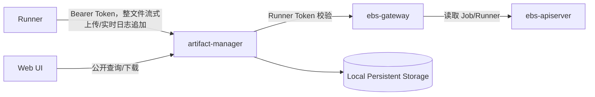

# Artifact Manager 设计

## 一、定位

Artifact Manager 是 EulerMaker 的构建结果数据服务，负责接收 Runner 上传的构建产物和日志，并提供查询、下载、保留与清理能力。

```text
Runner -> artifact-manager -> Local Persistent Storage

artifact-manager -> ebs-gateway upload authentication/authorization API
```

Artifact Manager 管理文件正文及其元数据，文件正文存储在本地持久化目录中。

## 二、设计目标

| 目标 | 说明 |
|------|------|
| 大文件上传 | 支持构建仓库、RPM、ISO 等大型产物 |
| 流式上传 | 单请求上传大文件，服务端流式落盘，不将完整文件载入内存 |
| 幂等 | 整文件上传请求可以安全重试，不生成重复 Artifact |
| 完整性 | 使用文件大小和 SHA-256 校验内容 |
| 上传隔离 | Runner 只能向分配给自己的 Job 上传文件 |
| 持久化 | 文件正文和元数据存储在本地持久化目录 |
| 可扩展 | 支持实时日志，并为后续内容扫描预留扩展点 |

## 三、总体架构



Runner 直接访问 Artifact Manager，上传正文不经过 ebs-gateway，避免 Gateway 承担构建产物和日志文件带宽。Artifact Manager 只通过 Gateway 校验 Runner Token 的签名、有效期和 scope。首版不查询 Job/Runner 对象，也不校验 Job 与 Runner 的绑定关系或 Job 阶段。Artifact 查询和下载公开访问，不经过 Gateway 鉴权。

Artifact、Job 上传清单和幂等记录均以元数据文件形式存放在本地持久化目录，不依赖独立数据库。服务启动时加载元数据并建立内存索引，本地元数据文件是事实来源。

文件正文写入 Artifact Manager 管理的本地持久化目录。使用节点本地目录时只能部署单实例。

首版由 Runner 单请求上传完整文件，Artifact Manager 流式写入本地文件系统。首版不支持普通 Artifact 的分片传输和断点续传；请求中断后 Runner 使用相同幂等键重新上传整个文件。实时日志仍使用第九章定义的 chunk/sequence 追加协议，该协议用于实时展示和日志流恢复，不属于普通 Artifact 分片上传。

## 四、文件归属与存储键

产物必须关联到具体的一次 Job 执行：

```text
project
jobName
jobUID
runnerName
```

`project` 和 `jobName` 用于展示与查询，`jobUID` 防止 Job 删除重建后与旧文件混淆。

存储键由服务端生成：

```text
projects/{project}/jobs/{jobUID}/{safeRelativePath}
```

服务对 `relativePath` 进行规范化后生成 `safeRelativePath`。路径不能为空或为绝对路径，不得包含 `..`、控制字符和符号链接；规范化后的路径必须位于该 Job 目录内。同一个 Job 中的 `safeRelativePath` 必须唯一，已存在时只有请求摘要相同的幂等重试可以返回原 Artifact。

本地后端以 `--data-dir` 为根目录，将存储键映射为正文路径。上传中的文件写入 `${dataDir}/.uploads/{artifactID}.tmp`，校验完成后在同一文件系统内原子重命名到最终路径。服务不得跟随符号链接，并必须验证规范化后的路径始终位于数据根目录内。

Artifact 元数据写入 `${dataDir}/.metadata/artifacts/{artifactID}.json`，Job 上传清单写入 `${dataDir}/.metadata/jobs/{project}/{jobUID}/manifest-{generation}.json`。元数据先写入临时文件，完成文件和父目录的 `fsync` 后原子重命名。首版只运行一个可写实例，避免在没有分布式锁的情况下并发修改同一 Artifact 或 Job 上传清单。

RPM 路径使用 `packages/{fileName}`，例如 `packages/kernel-6.6.rpm`。日志使用 `logs/` 作为一级目录。

## 五、数据模型

以下结构是首版持久化格式和 HTTP JSON 契约的基准。Go 实现可以增加不序列化的锁、文件句柄和内存索引字段，但不得改变已持久化字段的语义。所有 API 默认拒绝未知 JSON 字段，防止客户端拼写错误被静默忽略。

公共类型：

```go
type Timestamp = time.Time // JSON 使用 RFC3339Nano UTC，例如 2026-08-12T02:30:00.123Z

type ArtifactCategory string
const (
    ArtifactCategoryArtifact ArtifactCategory = "artifact"
    ArtifactCategoryLog      ArtifactCategory = "log"
)

type ArtifactState string
const (
    ArtifactPending   ArtifactState = "Pending"
    ArtifactUploading ArtifactState = "Uploading"
    ArtifactCompleted ArtifactState = "Completed"
    ArtifactFailed    ArtifactState = "Failed"
    ArtifactExpired   ArtifactState = "Expired"
)
```

### 5.1 Artifact

```go
type Artifact struct {
    SchemaVersion int              `json:"schemaVersion"`
    ID            string           `json:"id"`
    Project       string           `json:"project"`
    JobName       string           `json:"jobName"`
    JobUID        string           `json:"jobUID"`
    RunnerName    string           `json:"runnerName"`
    Category      ArtifactCategory `json:"category"`
    Name          string           `json:"name,omitempty"`
    FileName      string           `json:"fileName"`
    RelativePath  string           `json:"relativePath"`
    ContentType   string           `json:"contentType,omitempty"`
    Size          int64            `json:"size"`
    SHA256        string           `json:"sha256"`
    StorageKey    string           `json:"storageKey"`
    State         ArtifactState    `json:"state"`
    Failure       *FailureInfo     `json:"failure,omitempty"`
    CreatedAt     Timestamp        `json:"createdAt"`
    UpdatedAt     Timestamp        `json:"updatedAt"`
    CompletedAt   *Timestamp       `json:"completedAt,omitempty"`
    ExpiresAt     *Timestamp       `json:"expiresAt,omitempty"`
}
```

`category` 首版支持：

| 值 | 说明 |
|----|------|
| `artifact` | RPM、仓库、ISO 等正式构建产物 |
| `log` | 完整日志文件 |

首版只接受 `artifact` 和 `log`，其他 category 返回 `422 UnsupportedArtifactCategory`。

Artifact 状态：

```text
Pending -> Uploading -> Completed
                     \-> Failed
Completed -> Expired
```

只有 `Completed` Artifact 可以公开下载。

`ID`、归属字段、路径、大小、摘要和 `StorageKey` 创建后不可变。`Size` 必须大于等于 0；`SHA256` 是 64 位小写十六进制，不带 `sha256:` 前缀。`FileName` 必须等于规范化后 `RelativePath` 的最后一段。`StorageKey` 仅由服务端生成，不接受客户端赋值，也不在普通列表响应中用于构造本地路径。

### 5.2 JobUploadManifest

Artifact Manager 使用本地持久化的 Job 上传清单记录一次 Job 预期上传的完整文件集合，不在 ebs-apiserver 中新增资源。单个 Artifact 的 `Completed` 只表示该文件完整，`JobUploadManifest` 的 `Completed` 才表示该 Job 的全部必需文件已经完成上传。

```go
type ManifestState string
const (
    ManifestOpen       ManifestState = "Open"
    ManifestCompleting ManifestState = "Completing"
    ManifestCompleted  ManifestState = "Completed"
    ManifestFailed     ManifestState = "Failed"
)

type ManifestFile struct {
    ArtifactID   string           `json:"artifactID"`
    RelativePath string          `json:"relativePath"`
    Category    ArtifactCategory `json:"category"`
    Size        int64            `json:"size"`
    SHA256      string           `json:"sha256"`
    Required    bool             `json:"required"`
}

type ConsumerHold struct {
    ID        string    `json:"id"`
    Owner     string    `json:"owner"`
    CreatedAt Timestamp `json:"createdAt"`
    ExpiresAt Timestamp `json:"expiresAt"`
}

type JobUploadManifest struct {
    SchemaVersion  int            `json:"schemaVersion"`
    Project        string         `json:"project"`
    JobName        string         `json:"jobName"`
    JobUID         string         `json:"jobUID"`
    RunnerName     string         `json:"runnerName"`
    Generation     int64          `json:"generation"`
    IdempotencyKey string         `json:"idempotencyKey"`
    Files          []ManifestFile `json:"files"`
    Digest         string         `json:"digest,omitempty"`
    State          ManifestState  `json:"state"`
    Failure        *FailureInfo   `json:"failure,omitempty"`
    Holds          []ConsumerHold `json:"holds,omitempty"`
    CreatedAt      Timestamp      `json:"createdAt"`
    UpdatedAt      Timestamp      `json:"updatedAt"`
    CompletedAt    *Timestamp     `json:"completedAt,omitempty"`
    ExpiresAt      *Timestamp     `json:"expiresAt,omitempty"`
}
```

清单状态：

```text
Open -> Completing -> Completed
                  \-> Failed
```

`files` 中的路径必须唯一。清单完成后不可增加、删除或替换文件；确需补传时必须创建新的 `generation`，消费者必须读取明确的 generation，不能隐式跟随最新版本。

`digest` 对按 `relativePath` 排序后的规范字段计算 SHA-256，不直接对未规范化的 JSON 文本计算，保证相同清单始终产生相同摘要。

`Generation` 从 1 开始。`Files` 至少包含一个条目，并按 `relativePath` 排序持久化；`artifactID` 和 `relativePath` 在清单内都必须唯一。首版的 `manifest/complete` 同时提交并封账清单，`Open` 和 `Completing` 是服务端持久化过程中的可恢复状态，不提供单独编辑 Open 清单的公共接口。

摘要输入逐项使用 UTF-8 编码，数字使用不带前导零的十进制，布尔值使用 `true/false`：

```text
artifact-manifest-v1\n
generation\n
relativePath\0artifactID\0category\0size\0sha256\0required\n
...
```

最终 `Digest` 表示为 `sha256:<64位小写十六进制>`。

### 5.3 LogStream

```go
type LogStreamState string
const (
    LogOpen       LogStreamState = "Open"
    LogFinalizing LogStreamState = "Finalizing"
    LogCompleted  LogStreamState = "Completed"
    LogFailed     LogStreamState = "Failed"
    LogExpired    LogStreamState = "Expired"
)

type LogChunkRecord struct {
    Sequence    int64  `json:"sequence"`
    StartOffset int64  `json:"startOffset"`
    Size        int64  `json:"size"`
    SHA256      string `json:"sha256"`
}

type LogStream struct {
    SchemaVersion  int            `json:"schemaVersion"`
    Project        string         `json:"project"`
    JobName        string         `json:"jobName"`
    JobUID         string         `json:"jobUID"`
    RunnerName     string         `json:"runnerName"`
    Stream         string         `json:"stream"`
    State          LogStreamState `json:"state"`
    NextSequence   int64          `json:"nextSequence"`
    CommittedBytes int64          `json:"committedBytes"`
    ArtifactID     string         `json:"artifactID,omitempty"`
    FinalSize      *int64         `json:"finalSize,omitempty"`
    FinalSHA256    string         `json:"finalSHA256,omitempty"`
    Failure        *FailureInfo   `json:"failure,omitempty"`
    CreatedAt      Timestamp      `json:"createdAt"`
    UpdatedAt      Timestamp      `json:"updatedAt"`
    CompletedAt    *Timestamp     `json:"completedAt,omitempty"`
    ExpiresAt      *Timestamp     `json:"expiresAt,omitempty"`
}
```

首版 `Stream` 只能是 `combined`。`NextSequence` 初始为 0，`CommittedBytes` 初始为 0。`LogChunkRecord` 使用 JSON Lines 追加式索引文件持久化，不在每次追加时整体重写进 `LogStream` JSON；记录必须满足 sequence 连续、offset 连续，且 `StartOffset+Size` 不超过 `CommittedBytes`。

索引文件每行是一个完整、紧凑的 JSON 对象，以单个 `\n` 结束，不允许空行、注释或跨行 JSON：

```jsonl
{"sequence":0,"startOffset":0,"size":1024,"sha256":"a1b2..."}
{"sequence":1,"startOffset":1024,"size":2048,"sha256":"c3d4..."}
```

字段顺序不是读取协议的一部分；实现必须按 JSON 字段名解析并拒绝未知字段。`sha256` 是对应 chunk 解压后正文的 64 位小写十六进制摘要。索引只能追加，不能就地修改已有记录。

### 5.4 IdempotencyRecord

整文件上传使用独立的本地幂等记录，在服务重启和 Artifact 临时状态清理后仍能识别重复请求。

```go
type IdempotencyState string
const (
    IdempotencyProcessing IdempotencyState = "Processing"
    IdempotencyCompleted  IdempotencyState = "Completed"
    IdempotencyFailed     IdempotencyState = "Failed"
)

type IdempotencyRecord struct {
    SchemaVersion int              `json:"schemaVersion"`
    Scope         string           `json:"scope"`
    Key           string           `json:"key"`
    RequestDigest string           `json:"requestDigest"`
    ArtifactID    string           `json:"artifactID"`
    State         IdempotencyState `json:"state"`
    Failure       *FailureInfo     `json:"failure,omitempty"`
    CreatedAt     Timestamp        `json:"createdAt"`
    UpdatedAt     Timestamp        `json:"updatedAt"`
    CompletedAt   *Timestamp       `json:"completedAt,omitempty"`
    ExpiresAt     *Timestamp       `json:"expiresAt,omitempty"`
}
```

上传作用域固定为 `artifact-upload/{project}/{jobUID}`。本地路径使用作用域和 key 的 SHA-256，客户端输入不得直接成为文件名：

```text
${dataDir}/.metadata/idempotency/{scopeSHA256}/{keySHA256}.json
```

`RequestDigest` 对规范化后的 `UploadArtifactMetadata` 计算，不包含 multipart boundary、header 顺序或文件正文；摘要格式为 `sha256:<64位小写十六进制>`。摘要输入固定为：

```text
artifact-upload-v1\n
jobUID\0category\0name\0fileName\0relativePath\0contentType\0size\0sha256\n
```

创建 `Processing` 记录和 `Pending` Artifact 时必须持有 `(scope,key)` 进程内锁。相同作用域和 key 的并发请求只能有一个进入正文读取阶段。`Completed` 记录与对应 Completed Artifact 的保留期限一致；`Failed` 记录默认保留 24 小时，并允许相同摘要的请求复用原 Artifact ID 整文件重传。

### 5.5 通用失败、错误和分页结构

```go
type FailureInfo struct {
    Code      string    `json:"code"`
    Message   string    `json:"message"`
    Retryable bool      `json:"retryable"`
    Time      Timestamp `json:"time"`
}

type APIError struct {
    Code      string         `json:"code"`
    Message   string         `json:"message"`
    Retryable bool           `json:"retryable"`
    RequestID string         `json:"requestID"`
    Details   map[string]any `json:"details,omitempty"`
}

type ArtifactList struct {
    Items      []Artifact `json:"items"`
    NextCursor string     `json:"nextCursor,omitempty"`
}
```

API 错误响应的 `Content-Type` 为 `application/json`，客户端只能依赖稳定的 `code` 和结构化 `details`，不能解析 `message`。列表默认按 `(completedAt,id)` 升序排序，cursor 是服务端编码的这两个字段，客户端必须视为不透明字符串。默认每页 100 条，最大 1000 条；翻页期间新完成的 Artifact 只可能出现在后续页，不返回非 `Completed` 对象。

### 5.6 通用格式与校验约束

| 字段 | 约束 |
|------|------|
| `schemaVersion` | 首版固定为 1；读取未知主版本必须拒绝启动或隔离该记录 |
| `id` | 服务端生成，Artifact 为 `art_<ULID>` |
| `project`、`jobName` | 1–253 字节，必须与 ebs-apiserver 中对象一致 |
| `jobUID` | Kubernetes UID 字符串，1–128 字节，不能只凭 Job 名推导 |
| `runnerName` | 来自 Gateway 认证结果，客户端请求正文不得提供 |
| `relativePath` | UTF-8 相对路径，规范化后不超过 1024 字节，不允许空段、`.`、`..`、反斜杠、控制字符和符号链接 |
| `fileName`、`name` | UTF-8，分别不超过 255 和 256 字节；`name` 仅用于展示 |
| `contentType` | 不超过 255 字节，仅用于展示，不作为可信文件类型 |
| `size`、offset | `int64` 非负数，并受部署配额限制 |
| 单文件 SHA-256 | 64 位小写十六进制；Manifest digest 使用 `sha256:` 前缀 |
| `idempotencyKey` | 1–128 个可打印 ASCII 字符，不得包含空白；同一作用域内唯一 |
| `generation` | 从 1 开始的正 `int64` |

持久化记录的不可变字段不得通过更新接口修改。状态更新必须验证合法状态转换；失败记录不得包含 Token、文件正文、绝对本地路径或敏感签名材料。

### 5.7 HTTP 请求与响应结构

```go
type UploadArtifactMetadata struct {
    JobUID       string           `json:"jobUID"`
    Category     ArtifactCategory `json:"category"`
    Name         string           `json:"name,omitempty"`
    FileName     string           `json:"fileName"`
    RelativePath string           `json:"relativePath"`
    ContentType  string           `json:"contentType,omitempty"`
    Size         int64            `json:"size"`
    SHA256       string           `json:"sha256"`
}

type UploadArtifactResponse struct {
    Artifact Artifact `json:"artifact"`
}

type CompleteManifestRequest struct {
    JobUID     string         `json:"jobUID"`
    Generation int64          `json:"generation"`
    Files      []ManifestFile `json:"files"`
}

type CompleteManifestResponse struct {
    JobUID        string        `json:"jobUID"`
    Generation    int64         `json:"generation"`
    State         ManifestState `json:"state"`
    ArtifactCount int           `json:"artifactCount"`
    Digest        string        `json:"digest"`
}

type LogStatusResponse struct {
    Stream         string         `json:"stream"`
    State          LogStreamState `json:"state"`
    NextSequence   int64          `json:"nextSequence"`
    CommittedBytes int64          `json:"committedBytes"`
    ArtifactID     string         `json:"artifactID,omitempty"`
    UpdatedAt      Timestamp      `json:"updatedAt"`
}

type CompleteLogRequest struct {
    JobUID       string `json:"jobUID"`
    Stream       string `json:"stream"`
    LastSequence int64  `json:"lastSequence"`
    Size         int64  `json:"size"`
    SHA256       string `json:"sha256"`
}

type CompleteLogResponse struct {
    State        LogStreamState `json:"state"`
    ArtifactID   string         `json:"artifactID"`
    RelativePath string         `json:"relativePath"`
    Size         int64          `json:"size"`
    SHA256       string         `json:"sha256"`
}

type SSELogData struct {
    Encoding string `json:"encoding"` // 固定为 base64
    Content  string `json:"content"`
}

type SSECompleteData struct {
    ArtifactID string `json:"artifactID"`
    Size       int64  `json:"size"`
    SHA256     string `json:"sha256"`
}
```

HTTP 路径中的 `{project}`、`{job}` 是归属来源，上传元数据不得重复提供或覆盖。`RunnerName`、ID、状态、存储键和时间均由服务端填写。空文件使用长度为 0 的正文上传；空日志封账时 `lastSequence=-1`、`size=0`、`sha256` 为 SHA-256 空输入。JobUploadManifest 首版不允许空 `files`；没有需要归档文件的 Job 不创建 manifest，并在 Job Status 中记录 `artifactCount=0` 和明确的 `artifactState=NotRequired`。

## 六、上传 API

Artifact API 使用独立前缀：

```text
/artifacts/v1
```

### 6.1 上传 Artifact

```http
POST /artifacts/v1/projects/{project}/jobs/{job}/artifacts
Authorization: Bearer <runner-token>
Idempotency-Key: <uuid>
Content-Type: multipart/form-data; boundary=...
```

请求按顺序包含 `metadata` 和 `file` 两个 form-data part。`metadata` 必须位于 `file` 之前，使用 `application/json`，结构为 `UploadArtifactMetadata`；`file` 使用 `application/octet-stream`：

```json
{
  "jobUID": "e32450b8-...",
  "category": "artifact",
  "fileName": "kernel-6.6.rpm",
  "relativePath": "packages/kernel-6.6.rpm",
  "contentType": "application/x-rpm",
  "size": 183746291,
  "sha256": "d6f4..."
}
```

成功返回 `UploadArtifactResponse`：

```json
{
  "artifact": {
    "id": "art_01...",
    "state": "Completed",
    "relativePath": "packages/kernel-6.6.rpm",
    "size": 183746291,
    "sha256": "d6f4..."
  }
}
```

服务先验证 Runner Token、上传元数据和配额，再创建 `Pending` Artifact。读取 `file` part 时流式写入 `${dataDir}/.uploads/{artifactID}.tmp`，同时累计大小和 SHA-256，不将完整文件载入内存。请求正文结束后：

1. 验证实际大小和 SHA-256 与 metadata 相同。
2. 对临时正文执行 `fdatasync`。
3. 将正文原子重命名到最终 `StorageKey` 并 `fsync` 父目录。
4. 原子写入 `Completed` Artifact 元数据。
5. 返回完整 Artifact。

请求中断或校验失败时删除临时正文，并将未提交的 Artifact 元数据删除或标记为 `Failed` 供后台清理。首版不提供上传进度查询、继续上传或中止接口；Runner 必须保留本地文件并使用相同 `Idempotency-Key` 整文件重传。

服务持久化 `(jobUID, idempotencyKey)`、规范化请求元数据摘要和响应 Artifact ID。相同键且元数据摘要相同时：已有 Artifact 为 `Completed` 则直接返回原结果；仍有上传请求进行中则返回 409 `UploadInProgress`；前次失败或中断则清理旧临时文件并允许整文件重传。相同键但元数据摘要不同返回 409 `IdempotencyConflict`。

#### 6.1.1 Multipart 解析限制

首版 multipart 请求必须满足：

- 恰好包含一个名为 `metadata` 的 part 和一个名为 `file` 的 part，不允许额外、重复或嵌套 multipart part。
- `metadata` 必须是第一个 part，`file` 必须是第二个且为最后一个 part；服务必须在读取文件正文前完成 metadata、鉴权、配额和幂等检查。
- `metadata` 的 `Content-Type` 必须是 `application/json`，解码时拒绝未知字段和尾随 JSON 数据；正文大小不得超过 `--max-metadata-size`。
- `file` 的 `Content-Type` 必须是 `application/octet-stream`。multipart 文件名仅用于协议兼容，不能覆盖 metadata 中的 `fileName`。
- 单个 part 的 header 数量、单个 header 长度和全部 header 总大小必须分别受配置限制；拒绝重复的 `Content-Disposition`、控制字符和非法 boundary。
- 请求可以不带总 `Content-Length`，但服务必须对整个请求使用有上限的流式 reader。实际文件字节超过 metadata.size 或 `--max-file-size` 时立即停止读取并返回 413。
- 请求带有 `Content-Length` 时，只用于提前拒绝明显超限请求，不能替代实际流式计数和摘要校验。
- file 正文允许为 0 字节；到达 multipart 结尾时实际大小必须严格等于 metadata.size。
- 临时文件使用服务端生成的 Artifact ID 并以独占方式创建，禁止覆盖现有临时文件，不使用客户端文件名拼接路径。
- 从读取请求头到正文完成均受 `--upload-timeout` 和最小上传速率限制；超时、取消或客户端断开必须关闭文件句柄并清理临时文件。

违反 part 数量、顺序、类型或 metadata 格式返回 400 `InvalidMultipartRequest`；超过 metadata、header 或请求大小限制返回 413 `RequestTooLarge`。

#### 6.1.2 可恢复提交顺序

整文件上传不是跨多个文件的原子事务。实现必须使用以下固定、可重放的提交顺序，以最终正文的原子 rename 作为正文提交点：

1. 获取 `(scope,idempotencyKey)` 锁，原子写入 `Processing` IdempotencyRecord。
2. 原子写入 `Pending` Artifact 元数据，其中已经包含最终 `StorageKey`。
3. 以独占方式创建 `.uploads/{artifactID}.tmp`，流式写入并计算大小和 SHA-256。
4. 校验成功后对临时正文执行 `fdatasync`。
5. 将临时正文原子 rename 到最终 `StorageKey`，随后 `fsync` 最终正文的父目录；该 rename 是正文提交点。
6. 原子更新 Artifact 元数据为 `Completed` 并 `fsync` 元数据父目录。
7. 原子更新 IdempotencyRecord 为 `Completed`，设置 `CompletedAt`，并 `fsync` 幂等记录父目录。
8. 返回成功响应并释放锁。

步骤 5 之后任何失败都不能删除最终正文；服务应返回可重试错误，由相同幂等键请求或启动恢复流程补齐元数据。步骤 5 之前失败则关闭并删除临时正文，将 IdempotencyRecord 和 Artifact 标记为 `Failed`，允许相同摘要整文件重传。

服务启动时按以下规则恢复：

| 现场状态 | 恢复动作 |
|----------|----------|
| Processing 记录 + Pending Artifact + 临时正文 | 删除临时正文，将幂等记录和 Artifact 标记为 Failed，允许相同摘要整文件重传 |
| Processing 记录 + Pending Artifact + 最终正文 | 流式复核大小和 SHA-256；匹配则补写 Completed Artifact 和幂等记录，不匹配则隔离正文并标记 Corrupted |
| Processing 记录存在但 Artifact 不存在 | 标记幂等记录 Failed；相同摘要重试时重新创建 Artifact |
| Completed Artifact + Processing/Failed 幂等记录 | 核对 Artifact ID 和请求摘要后补写 Completed 幂等记录 |
| Completed 幂等记录 + Pending Artifact + 最终正文 | 复核正文后补写 Completed Artifact；不匹配则标记 Corrupted，不能返回原成功响应 |
| Completed Artifact 但最终正文缺失 | 将 Artifact 和幂等记录标记 Failed/Corrupted，内容接口不得返回成功 |
| 只有临时正文 | 超过 `--temporary-upload-ttl` 后删除 |
| 只有最终正文且没有 Artifact/幂等记录 | 移入隔离目录并记录告警，不能自动公开或按客户端路径猜测归属 |

恢复和正常上传必须使用相同的 per-key/per-Artifact 锁，避免启动扫描与新请求同时修改一组记录。隔离目录中的正文只能由后台审计或管理员处理。

### 6.2 提交并完成 Job 上传清单

Runner 完成全部单文件上传后提交最终清单：

```http
POST /artifacts/v1/projects/{project}/jobs/{job}/manifest/complete
Authorization: Bearer <runner-token>
Idempotency-Key: <jobUID>-manifest-<generation>
Content-Type: application/json
```

```json
{
  "jobUID": "e32450b8-...",
  "generation": 1,
  "files": [
    {
      "artifactID": "art-01...",
      "relativePath": "packages/kernel-6.6.rpm",
      "category": "artifact",
      "size": 183746291,
      "sha256": "d6f4...",
      "required": true
    }
  ]
}
```

服务以 `(project, jobUID, generation)` 为粒度加锁，并验证：

1. Runner Token 仍然有效，URL、请求清单与 Artifact 中的 project、jobName、jobUID 归属一致。
2. 清单内路径唯一，且每个 Artifact 都属于该 Job。
3. 所有必需 Artifact 均为 `Completed`。
4. Artifact 的路径、大小和 SHA-256 与清单一致。
5. 同一 generation 尚未由不同内容完成。

验证成功后计算确定性的清单摘要，原子写入 `Completed` 清单。相同幂等键或相同内容的重复请求返回原结果；已经完成的 generation 收到不同内容时返回 `409 Conflict`。

```json
{
  "jobUID": "e32450b8-...",
  "generation": 1,
  "state": "Completed",
  "artifactCount": 1,
  "digest": "sha256:..."
}
```

清单完成后禁止为该 generation 创建或完成新的 Artifact 上传。该接口是一次 Job 产物集合的封账边界，不能通过扫描当前已有 Artifact 推断上传是否结束。

### 6.3 查询 Job 上传清单

```http
GET /artifacts/v1/projects/{project}/jobs/{job}/manifest?jobUID={uid}&generation={generation}
```

接口返回固定 generation 的清单状态、摘要和文件列表。Repo Controller 等消费者只有在清单状态为 `Completed` 时才能使用其中的 Artifact，并应记录和校验返回的 `digest`。消费者不得直接读取 Artifact Manager 的本地元数据文件。

## 七、查询与下载 API

Artifact 查询、列表和下载不要求登录，也不执行 Project 权限检查。任何能够访问 Artifact Manager 的客户端都可以查询 Completed Artifact 并获取下载地址。

### 7.1 查询 Job 产物

```http
GET /artifacts/v1/projects/{project}/jobs/{job}/artifacts?jobUID={uid}
```

默认只返回 Completed Artifact，并支持按 `category`、文件名和分页游标过滤。

### 7.2 下载文件

```http
GET /artifacts/v1/artifacts/{artifactID}/content
```

正文接口支持 `Range`、`ETag`、`If-None-Match` 和 `Content-Disposition`。Artifact Manager 流式读取文件并返回，下载过程中不得将完整文件载入内存。

公开查询和下载是系统明确的数据访问策略。部署方必须通过网络边界决定 Artifact Manager 是否向公网开放，并为公开接口配置请求速率和下载带宽限制。

## 八、Runner 上传流程

Runner 执行完成后扫描 Job 结果目录并生成 manifest：

```json
{
  "jobUID": "e32450b8-...",
  "files": [
    {
      "relativePath": "packages/kernel.rpm",
      "category": "artifact",
      "size": 183746291,
      "sha256": "..."
    },
    {
      "relativePath": "logs/container.log",
      "category": "log",
      "size": 738291,
      "sha256": "..."
    }
  ]
}
```

上传流程：

1. Runner 完成执行，Job 进入 `stage=PostRun`。
2. 扫描结果目录并计算文件大小和 SHA-256。
3. 对每个文件发起单请求流式上传，Artifact Manager 完成大小和 SHA-256 校验后返回 `Completed` Artifact。
4. 上传请求失败时使用相同幂等键整文件重传。
5. 确认每个必需文件均已返回 `Completed`。
6. 调用 Job 上传清单完成接口，由 Artifact Manager 校验并封账全部必需文件。
7. 清单完成后更新 Job 的 `artifactState`、`artifactGeneration`、`artifactDigest` 和 `artifactCount`，再将 Job 更新为 `phase=Completed`；必需产物上传或清单封账失败时更新为 `Failed`。

Runner 默认并发上传 2–4 个文件，并对总带宽和同时上传的文件数量限流。上传成功前保留本地文件。

扫描结果目录时必须：

- 拒绝或忽略符号链接。
- 确保所有规范化路径仍位于结果根目录。
- 忽略 socket、device 和 named pipe。
- 限制单文件大小、文件数量和总大小。
- 保证同一个相对路径只生成一条 manifest 记录。

推荐使用 `packages/`、`logs/` 等一级目录组织产物；Repo Controller 将 `packages/` 下的 RPM 重新组织到最终 repo 的 `Packages/` 目录。
