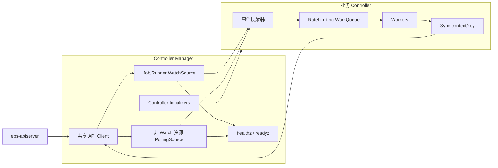

# Controller Manager 框架设计

## 1. 目标与范围

Controller Manager 使用 Go 实现，参考 Kubernetes controller 的组织方式，负责创建共享依赖、初始化 Controller、启动事件源与 Worker，并统一处理健康检查和优雅退出。

本文只定义 Controller Manager 和 Controller 公共框架，不定义 Build、Snapshot 等业务对象的状态机。具体 Controller 负责决定关注哪些资源、哪些变化需要入队、如何调谐以及拥有哪些状态字段。

框架遵循以下原则：

- Controller Manager 只管理生命周期，不直接调用业务调谐逻辑；
- 事件只负责触发调谐，资源 key 是队列中唯一的数据；
- Worker 每次处理 key 时读取最新对象，不依赖事件携带的旧对象；
- 所有业务副作用集中在 `Sync` 中，事件处理函数不得写状态、创建或删除资源；
- `Sync` 必须幂等，并允许因事件重复、进程重启和超时确认而重复执行；
- 优先使用 Kubernetes 的 `client-go` 工作队列、缓存与并发约定，不重复实现 dirty/processing、退避和关闭语义。

### 1.1 API 能力边界

当前 ebs-apiserver 只有以下资源支持 List/Watch：

- `Job`
- `Runner`

除 `Job` 和 `Runner` 以外的所有资源均不支持 Watch，包括但不限于 `Project`、`Snapshot`、`Build`、`BuildInfo`、`RpmRepo` 和 `BuildResource`。框架不得为这些资源创建 Reflector、SharedInformer 或发起带 `watch=true` 的请求。

因此框架同时支持两种事件源：

| 事件源 | 适用资源 | 数据获取方式 |
| --- | --- | --- |
| `WatchSource` | 仅 `Job`、`Runner` | List/Watch、本地 cache 和 lister |
| `PollingSource` | 其他所有资源 | 周期 List、快照比较和按需 GET |

Controller 的一致性不能依赖事件只发生一次。Watch 断线重连、周期 relist、Polling 重复扫描都可以造成同一 key 被多次入队。

## 2. 总体架构



Manager 创建共享客户端及事件源工厂，通过显式 initializer 构造 Controller。每个 Controller 拥有独立的限速队列和 Worker。事件源把资源变化交给 Controller 注册的映射器，映射器只计算并加入调谐 key。

## 3. 包结构与公共接口

建议使用以下包结构：

```text
components/controller-manager/
  cmd/controller-manager/
  pkg/app/
  pkg/controller/
    controller.go
    registry.go
  pkg/source/
    watch.go
    polling.go
  pkg/queue/
  pkg/health/
  pkg/controllers/
    build/
    buildinfo/
    snapshot/
    rpmrepo/
```

公共 API 类型继续来自独立的 `api` module。框架包不得依赖任何具体 Controller 包；`pkg/app` 负责显式组装具体 Controller。

### 3.1 Controller

```go
type Controller interface {
    Name() string
    Run(ctx context.Context, workers int) error
}

type HealthChecker interface {
    Check(ctx context.Context) error
}

type HealthCheckable interface {
    HealthChecker() HealthChecker
}
```

- `Name` 返回稳定且唯一的名称，用于配置、日志和指标标签；
- `Run` 启动 Worker 并阻塞到 `ctx` 取消或发生不可恢复错误；
- 同一个 Controller 实例的 `Run` 只允许调用一次。

与 Kubernetes controller-manager 一致，健康检查是 Controller 的可选扩展，而不是 `Controller` 的必选方法。Manager 在 initializer 全部完成后检查 Controller 是否实现 `HealthCheckable`：实现且返回非 nil checker 时，以 Controller 名称注册该检查；否则注册同名且恒成功的 ping checker。Controller 名称重复、checker 名称冲突或健康服务已经启动后继续注册均属于启动错误。

健康检查只读取 Controller 原子维护的内存状态，不得执行 API 请求、等待队列或获取可能长期阻塞的业务锁。每个 checker 使用健康服务派生的短超时 context；超时等同检查失败。Controller 若没有独立于 `Run` 的关键后台状态，不应实现 `HealthCheckable`。

Controller 的标准实现持有：

```go
type ReconcileResult struct {
    Requeue      bool
    RequeueAfter time.Duration
}

type SyncFunc func(ctx context.Context, key string) (ReconcileResult, error)

type BaseController struct {
    name         string
    queue        workqueue.TypedRateLimitingInterface[string]
    sync         SyncFunc
    maxRetries   int
    slowBackoff  workqueue.RateLimiter
    slowKeys     map[string]struct{}
    slowKeysLock sync.Mutex
}
```

`BaseController` 只实现 Worker、队列终结、两阶段错误退避和停止逻辑，不解释业务对象。业务 `Sync` 只返回结构化结果和错误，不得直接调用 `Done`、`Forget`、`AddRateLimited` 或 `AddAfter`。`slowKeys` 和 `slowBackoff` 仅由 BaseController 管理；锁内不得调用队列、RateLimiter 或业务 `Sync`。

`ReconcileResult` 语义如下：

| 返回值 | 含义 |
|--------|------|
| 零值 | 本周期完成，等待新事件 |
| `Requeue=true` | 清除本次退避后立即重新入队 |
| `RequeueAfter>0` | 清除本次退避后，在指定时长后重新入队 |

`Requeue` 与 `RequeueAfter` 互斥；`RequeueAfter` 不得为负数。违反约束属于 Controller 编程错误，BaseController 记录错误并结束该 key 的本周期，不能猜测业务意图。返回非 nil error 时结果必须为零值；若同时返回结果和错误，BaseController 忽略结果并按错误处理，同时记录 invalid-result 指标。

### 3.2 Initializer

```go
type Dependencies struct {
    Client         Client
    WatchFactory   WatchSourceFactory
    PollingFactory PollingSourceFactory
    Recorder       EventRecorder
}

type InitContext struct {
    Dependencies Dependencies
    Config       ControllerConfig
}

type InitFunc func(ctx context.Context, init InitContext) (Controller, bool, error)
```

返回值语义：

- `(controller, true, nil)`：Controller 已成功构造；
- `(nil, false, nil)`：Controller 被配置显式禁用；
- 其他组合均视为初始化失败。

Initializer 只能构造和注册事件处理器，不得启动 goroutine。Controller 名称到 `InitFunc` 的映射由 `NewControllerInitializers` 显式创建，不使用导入副作用或全局可变注册表。

### 3.3 Manager

```go
type Manager struct {
    controllers []Controller
    sources     []Source
    health      HealthServer
}

func (m *Manager) Run(ctx context.Context) error
```

Manager 不知道业务 Controller 的类型，也不调用其 `Sync`。首次同步由 Manager 对所有已创建 Source 统一等待，不在 Controller 上重复暴露同步状态。

Manager 只负责注册和调用显式 HealthChecker，不根据 Reconcile 返回值、队列重试次数、HTTP 状态码或指标自动推导 Controller 健康状态。Controller 顶层 `Run` 在 context 未取消时返回仍属于不可恢复的生命周期错误，直接终止进程，不依赖健康检查发现。

### 3.4 API Client 与写入结果

Controller Manager 共享的 API Client 提供 Source 所需的 List/Watch 能力，以及业务 Controller 所需的 Get、普通更新、status 更新和带前置条件删除能力：

```go
type DeletePreconditions struct {
    UID             types.UID
    ResourceVersion string
}

type Client interface {
    ListPage(
        ctx context.Context,
        gvr schema.GroupVersionResource,
        options metav1.ListOptions,
    ) (source.ListPage, error)

    ListProjectPage(
        ctx context.Context,
        gvr schema.GroupVersionResource,
        project string,
        options metav1.ListOptions,
    ) (source.ListPage, error)

    ResolveWatch(
        ctx context.Context,
        gvr schema.GroupVersionResource,
    ) (source.WatchResource, error)

    Get(
        ctx context.Context,
        gvr schema.GroupVersionResource,
        namespace, name string,
    ) (runtime.Object, error)

    Create(
        ctx context.Context,
        gvr schema.GroupVersionResource,
        namespace string,
        obj runtime.Object,
    ) (runtime.Object, error)

    Update(
        ctx context.Context,
        gvr schema.GroupVersionResource,
        namespace string,
        obj runtime.Object,
    ) (runtime.Object, error)

    UpdateStatus(
        ctx context.Context,
        gvr schema.GroupVersionResource,
        namespace string,
        obj runtime.Object,
    ) (runtime.Object, error)

    Delete(
        ctx context.Context,
        gvr schema.GroupVersionResource,
        namespace, name string,
        preconditions DeletePreconditions,
    ) error
}
```

`ListPage` 读取资源的集群范围集合路径；`ListProjectPage` 仅接受 namespace-scoped 资源和非空 Project，并读取 `/projects/{project}/{resource}`。两者都完整传递分页和 selector 相关的 `ListOptions`。

namespace-scoped 写资源要求 `namespace` 非空；cluster-scoped 写资源要求为空。`name`、GVR、对象类型和删除前置条件必须在发起请求前校验。Create 请求对象的 namespace 必须与目标一致，并且不得预填 UID 或 resourceVersion；Update 请求必须携带服务端返回的 UID 和 resourceVersion。首版 Controller 发起的删除必须同时提供非空 UID 和 resourceVersion，不提供无条件删除接口。

所有非 Watch 请求使用共享 `--request-timeout` 派生子 context；调用方 context 更早取消时必须立即返回。Watch 不使用该短超时，由 `ListOptions.timeoutSeconds` 和生命周期 context 控制。

`Get` 成功必须返回 apiserver 响应对象；404 等读取错误使用 Kubernetes `apierrors` 保留状态码和 Reason，不包装成 WriteError。`Create`、`Update` 和 `UpdateStatus` 成功必须返回 apiserver 持久化后的对象，不能用请求对象构造成功结果，并校验响应对象身份符合请求。`Create` 向资源集合路径发送 POST，`Update` 向资源主路径发送 PUT，`UpdateStatus` 向 `/status` 子资源发送 PUT。`Delete` 收到完整 2xx 响应即可视为成功；资源包含 finalizer 时只表示删除已经被接受，调用方仍通过后续 Get/Watch 观察最终消失。

写操作错误统一实现以下接口：

```go
type WriteOutcome string

const (
    WriteNotSent  WriteOutcome = "NotSent"
    WriteRejected WriteOutcome = "Rejected"
    WriteUnknown  WriteOutcome = "Unknown"
)

type WriteError struct {
    Operation  string
    Resource   schema.GroupResource
    Outcome    WriteOutcome
    StatusCode int
    RetryAfter time.Duration
    Err        error
}

func (e *WriteError) Error() string
func (e *WriteError) Unwrap() error

func RetryAfter(err error) time.Duration
```

分类只回答“服务端是否可能已经接受预期写入”，不直接决定是否重试：

| Outcome | 判定条件 | 调用方约束 |
|---------|----------|------------|
| `WriteNotSent` | 本地参数、序列化或请求构造失败，能够证明请求未交给 transport | 可以在修正本地问题后重试；永久输入错误不得重试 |
| `WriteRejected` | 收到完整且可识别的非 2xx HTTP 响应，例如 401、403、404、409、422、429、5xx | 预期写入没有被接受，根据状态码决定结束、立即重读或限速重试 |
| `WriteUnknown` | 请求可能已经发送，但没有取得可证明结果的响应，例如 deadline、EOF、连接重置、截断或无法解码的 2xx 响应 | 不得立即重放写操作，必须先通过 Get/List/Watch 确认 |

为保证安全，无法证明 `NotSent` 或 `Rejected` 的错误一律归为 `WriteUnknown`。DNS、连接建立、TLS 和代理错误只有在 transport 能可靠证明未发送请求时才可归为 `NotSent`；否则保守归为 `WriteUnknown`。context 已取消也不能单独证明请求没有发送。

收到非 2xx 响应即为 `WriteRejected`，包括 5xx；“Rejected”不代表永久失败。`StatusCode` 在存在 HTTP 响应时填写，429 和 503 的合法 `Retry-After` 解析到 `RetryAfter`。原始 Kubernetes StatusError 必须可由 `errors.Is`/`errors.As` 或 `apierrors.IsConflict` 等方法穿透识别。

收到 2xx 但对象响应为空、解码失败，或者成功对象缺少 UID/resourceVersion，Client 返回 `WriteUnknown`。资源特有的成功条件由对应业务适配器继续验证；例如 Job status 更新响应与请求 Job UID 不同，必须包装为 `WriteUnknown`，不能当作普通业务校验失败。

每个 Controller 应在自己的包中声明所需的最小 typed client 接口，并由共享 Client 适配实现，便于单元测试且避免业务代码重复传递 GVR。业务接口仍必须保留上述 WriteError，不得把结果未知压缩为普通 error。

## 4. 事件源

### 4.1 通用约束

```go
type Source interface {
    Name() string
    AddEventHandler(handler ResourceEventHandler) error
    Run(ctx context.Context) error
    HasSynced() bool
    Ready() bool
}

// CachedSource 是 WatchSource 暴露给 Controller 的只读缓存视图。
// PollingSource 不实现该接口。
type CachedSource interface {
    Source
    GetByKey(key string) (obj runtime.Object, exists bool, err error)
    ByIndex(indexName, indexedValue string) ([]runtime.Object, error)
}

type ResourceEventHandler interface {
    OnAdd(obj runtime.Object)
    OnUpdate(oldObj, newObj runtime.Object)
    OnDelete(obj runtime.Object)
}

var ErrSourceStarted = errors.New("source already started")
var ErrWatchUnsupported = errors.New("resource does not support watch")
```

接口语义：

- `Name` 返回稳定且唯一的事件源名称，用于日志、指标和错误定位；
- `AddEventHandler` 注册订阅者，同一个 Source 可以注册多个 Handler；
- `Run` 启动 List/Watch 或 Polling 主循环并阻塞，直到 `ctx` 取消或发生不可恢复错误；
- `HasSynced` 只表示首次完整同步已经成功，不表示事件源此后永远健康；
- `Ready` 返回事件源当前是否可用于调谐，供 Manager 聚合 readiness；
- `ctx` 正常取消时 `Run` 返回 `nil`；不可恢复的初始化、协议或数据错误由 `Run` 返回；
- List、Watch 断线和临时网络错误由 Source 内部按退避策略持续恢复，不应直接终止 `Run`；底层运行循环在 context 未取消时意外结束才作为不可恢复错误返回。

所有 Handler 必须在 Source 的 `Run` 被调用之前完成注册。Source 一旦开始运行，其订阅集合即被冻结；之后调用 `AddEventHandler` 必须返回 `ErrSourceStarted`，不得动态修改订阅列表。`Run` 只能调用一次，重复调用返回 `ErrSourceStarted`。`AddEventHandler` 与 `Run` 对 started 状态的检查和修改必须由同一把锁保护，确保注册与启动不存在竞态。Initializer 是唯一允许注册业务 Handler 的阶段。

事件处理器只允许执行以下操作：

1. 校验并提取资源 key；
2. 比较与入队判断直接相关的轻量字段；
3. 将一个或多个 key 加入目标 Controller 队列。

事件处理器不得调用写 API、访问外部服务或执行耗时计算。关联资源事件需要通过索引或一次 List 找到受影响的主资源 key；具体映射规则属于业务 Controller。

Source 在调用 Handler 时必须隔离订阅者异常：一个 Handler 的 panic 不得阻止同一事件通知其他 Handler。Source 记录 handler、source、resource 和 panic 堆栈后继续分发；事件将在后续 Watch relist 或 Polling resync 中重新触发。

Handler 方法不返回 error，这是有意遵循 informer event handler 的通知语义。对象类型错误、key 提取失败或事件映射失败由 Handler 记录日志和指标后丢弃本次通知，不得阻塞或终止 Source；后续 relist/resync 负责再次触发。

### 4.2 Source Factory 与共享规则

Source 使用 Kubernetes 的 `schema.GroupVersionResource` 标识，不以 Go 类型名或 URL 字符串作为共享键：

```go
type WatchSourceFactory interface {
    ForResource(gvr schema.GroupVersionResource) (CachedSource, error)
    Sources() []Source
}

type PollingSourceFactory interface {
    ForResource(
        gvr schema.GroupVersionResource,
        period time.Duration,
        options metav1.ListOptions,
    ) (Source, error)
    Sources() []Source
}
```

Factory 契约：

- 相同 GVR、`labelSelector` 和 `fieldSelector` 的多次 `ForResource` 返回同一个 Source；过滤条件不同则创建独立 Source；
- 不同 group、version 或 resource 永远不共享 Source；
- `WatchSourceFactory` 只接受 `ebs/v1` 的 `jobs` 和 `runners`，其他 GVR 返回 `ErrWatchUnsupported`；
- `PollingSourceFactory` 负责通过共享 API Client 为 GVR 构造分页 List 调用；
- `PollingSourceFactory` 只读取 `ListOptions` 中的 `LabelSelector` 和 `FieldSelector`；分页 token 和页大小由 Source 管理，调用方设置的其他 List 选项不参与 Source 配置；
- 同一 PollingSource 被请求不同周期时，在启动前采用最短周期；Source 启动后不得再次调用 `ForResource` 改变周期；
- `Sources` 返回去重后的稳定快照，只允许 Manager 在全部 initializer 完成后调用；首次调用同时冻结 Factory，之后任何 `ForResource` 调用均返回 `ErrSourceStarted`；
- Factory 的创建、复用和周期合并必须并发安全，但首版仍要求 initializer 串行执行，以获得确定的注册顺序。

Manager 合并两个 Factory 的 `Sources`，只启动已被启用 Controller 请求的 Source，并等待这些 Source 全部 `HasSynced`。因此不需要维护 Controller 到 Source 的依赖图，也不会为未启用的 Controller 启动事件源。

### 4.3 Job 和 Runner WatchSource

`Job`、`Runner` 使用 `client-go` 的 Reflector/SharedIndexInformer 语义：

- 首次 List 成功并完成本地 cache 替换后，`HasSynced` 才可返回 true；
- Watch 断开后从最近的 `resourceVersion` 恢复；版本过期时重新 List；
- Add、Update、Delete 都可以触发入队；
- Delete 必须兼容 `cache.DeletedFinalStateUnknown`；
- Update 收到相同 `resourceVersion` 时可以跳过；是否进一步比较 generation、spec 或 status 由业务 Controller 决定；
- resync 事件允许重复入队，不影响正确性。

共享 WatchSource 可以被多个 Controller 订阅，但每个 Controller 使用自己的事件映射器和队列。业务代码不得修改 informer cache 返回的对象；需要保留或修改时必须 `DeepCopy`。

#### 4.3.1 只读缓存接口

Controller 只能通过 `CachedSource` 读取 WatchSource 的本地缓存，不得依赖 `*source.WatchSource` 具体类型，也不得直接取得 SharedIndexInformer、Indexer 或 Store。这样可以把缓存所有权、对象复制和同步状态检查统一留在 Source 内部。

`GetByKey` 的 key 使用 `cache.MetaNamespaceKeyFunc` 约定：

```text
namespace-scoped: {namespace}/{name}
cluster-scoped:   {name}
```

其返回语义为：

- 命中时返回对象的 `DeepCopyObject()`、`true` 和 `nil`；
- 未命中时返回 `nil`、`false` 和 `nil`，未命中不是错误；
- Source 尚未完成首次同步时返回 `ErrCacheNotSynced`；
- key 非法或底层 Indexer 读取失败时返回可包装的明确错误；
- 返回对象永远不与 informer cache 共享可变内存，Controller 可以安全地修改副本。

`ByIndex` 用于按已经注册的索引读取对象：

- `indexName` 不存在时返回明确错误，不能退化为全量扫描；
- 没有匹配对象时返回非 nil 空切片和 nil；
- 返回列表及其中每个对象都是新的副本；
- 返回顺序不构成接口保证，调用方需要稳定顺序时自行排序；
- Source 尚未完成首次同步时同样返回 `ErrCacheNotSynced`。

```go
var ErrCacheNotSynced = errors.New("source cache has not synced")

func (s *WatchSource) GetByKey(key string) (runtime.Object, bool, error) {
    if !s.HasSynced() {
        return nil, false, ErrCacheNotSynced
    }
    obj, exists, err := s.informer.GetIndexer().GetByKey(key)
    if err != nil || !exists {
        return nil, exists, err
    }
    value, ok := obj.(runtime.Object)
    if !ok {
        return nil, false, fmt.Errorf("cached object %T is not runtime.Object", obj)
    }
    return value.DeepCopyObject(), true, nil
}

func (s *WatchSource) ByIndex(indexName, indexedValue string) ([]runtime.Object, error) {
    if !s.HasSynced() {
        return nil, ErrCacheNotSynced
    }
    values, err := s.informer.GetIndexer().ByIndex(indexName, indexedValue)
    if err != nil {
        return nil, err
    }
    result := make([]runtime.Object, 0, len(values))
    for _, obj := range values {
        value, ok := obj.(runtime.Object)
        if !ok {
            return nil, fmt.Errorf("cached object %T is not runtime.Object", obj)
        }
        result = append(result, value.DeepCopyObject())
    }
    return result, nil
}
```

以上代码表达接口语义；实际实现需要为错误补充 Source 名称、key 或索引上下文。读取期间只持有 Indexer 自身的读锁，不得调用 API、Handler 或业务代码。

首版 WatchSource 固定注册 `cache.NamespaceIndex`。业务 Controller 若需要其他反向关系，应像 Job Controller 一样在事件处理器中维护自己的并发安全索引；首版不开放运行时动态注册 Indexer，避免共享 Source 的索引名称冲突和启动竞态。

WatchSource 在 `Run` 内启动底层 SharedIndexInformer 并等待 context 取消。List/Watch 临时失败交由 Reflector 的退避和 relist 机制恢复，普通 Watch 断线不导致 `Run` 返回错误。与 Kubernetes informer 一致，首次同步后 `Ready` 保持 true；底层 Reflector 没有把安静但健康的 Watch 与断连重试区分为可靠的 stale 信号，因此不对 WatchSource 应用时间阈值。仅当 informer 主 goroutine 在 context 未取消时意外结束，`Run` 才返回带 Source 名称的不可恢复错误。

### 4.4 非 Watch 资源 PollingSource

不支持 Watch 的资源使用统一 `PollingSource`。每种资源可以共享一个 PollingSource，多个 Controller 注册独立事件映射器。

PollingSource 通过以下通用分页接口读取资源：

```go
type ListPage struct {
    Items           []runtime.Object
    Continue        string
    ResourceVersion string
}

type ListFunc func(
    ctx context.Context,
    gvr schema.GroupVersionResource,
    options metav1.ListOptions,
) (ListPage, error)
```

`PollingSourceFactory` 从共享 API Client 构造 `ListFunc`。Source 在每一页请求中保留注册时指定的 `labelSelector` 和 `fieldSelector`，使用响应中的 `continue` 请求下一页，直到返回空 token；`limit` 默认 500，可配置。对象元数据统一通过 `meta.Accessor` 读取，无法读取 name、namespace、UID 或 resourceVersion 的对象使整轮扫描失败。

PollingSource 每轮执行：

1. 调用 List 获取全量对象并处理分页；
2. 用 `UID` 标识对象身份，用 `resourceVersion` 判断同一对象是否变化；
3. 与上一次成功快照比较，产生 Add、Update 和 Delete 通知；
4. 原子替换本地只读快照；
5. 记录成功时间并等待下一轮。

约束如下：

- 首次完整 List 成功后 `HasSynced` 才返回 true；空列表也是一次成功同步；
- 任一分页失败则整轮失败，不替换快照，也不产生 Delete 通知；
- 同名对象 UID 改变必须表现为旧对象 Delete 和新对象 Add；
- 快照内对象必须 DeepCopy，禁止订阅方修改；
- 每次成功扫描可以选择对全部对象产生周期 resync 通知，默认开启，以修复遗漏事件和外部副作用；
- List 失败按独立的指数退避重试，成功后恢复正常轮询周期；
- `ctx` 取消必须中止等待和后续扫描；已经发出的 HTTP 请求必须携带该 context；
- PollingSource 不能把轮询结果称为 Watch 事件，也不能提供强实时性保证。

PollingSource 对临时 List 失败持续退避重试；超过 stale threshold 时将 readiness 置为 false，成功完成一轮扫描后恢复。临时失败不终止 `Run`，且不得用失败或不完整的 List 结果覆盖旧快照。只有固定配置错误、响应无法按契约解析，或者轮询主循环在 context 未取消时意外结束，`Run` 才返回不可恢复错误。

默认轮询周期为 30 秒，允许按资源和 Controller 配置。相同资源和过滤条件的共享 PollingSource 使用所有订阅者要求的最短周期，避免重复 List。同一 Source 不允许并发执行两轮扫描；上一次扫描完成后才计算下一次等待时间。对象进入过滤范围产生 Add，匹配期间发生变化产生 Update，离开过滤范围产生 Delete。

对于非 Watch 资源，Worker 收到 key 后应通过 API `Get` 读取最新对象；PollingSource 快照只用于变化检测、索引和事件映射，不作为业务写入的并发前提。若 API 不提供对应 Get，业务 Controller 才可读取快照，并必须在设计中明确其最终一致性限制。

## 5. WorkQueue 与 Worker

每个 Controller 使用独立的 client-go 限速队列。当前仓库固定使用 `client-go v0.28.4`，该版本尚未提供泛型 Typed WorkQueue，因此首版使用：

```go
workqueue.RateLimitingInterface
```

`BaseController.Enqueue` 只接收 string，Worker 从队列取出元素后必须断言为 string，其他类型记录框架错误并 `Forget`。未来升级到提供泛型队列的 client-go 版本时，直接替换为 `workqueue.TypedRateLimitingInterface[string]`，队列语义不变。

队列中只存放稳定 key：

- project 范围资源使用 `{namespace}/{name}`；
- cluster 范围资源使用 `{name}`；
- key 生成失败时记录错误并丢弃事件。

`client-go` workqueue 的 dirty/processing 语义保证：同一 key 不会被同一队列的多个 Worker 同时处理；处理期间再次 Add 会在当前处理结束后重新入队一次。

### 5.1 标准 Worker 循环

```go
func (c *BaseController) processNext(ctx context.Context) bool {
    key, shutdown := c.queue.Get()
    if shutdown {
        return false
    }
    defer c.queue.Done(key)

    result, err := c.sync(ctx, key)
    retryAfter := RetryAfter(err)
    switch {
    case ctx.Err() != nil:
        c.queue.Forget(key)
        return false
    case IsPermanent(err):
        c.clearSlowRetry(key)
        c.queue.Forget(key)
    case err != nil && retryAfter > 0:
        c.queue.Forget(key)
        c.queue.AddAfter(key, retryAfter)
    case err != nil && c.isSlowRetry(key):
        c.queue.Forget(key)
        c.addSlowRetry(key)
    case err != nil && c.queue.NumRequeues(key) < c.maxRetries:
        c.queue.AddRateLimited(key)
    case err != nil:
        c.queue.Forget(key)
        c.enterSlowRetry(key)
        c.addSlowRetry(key)
    case !result.Valid():
        c.clearSlowRetry(key)
        c.queue.Forget(key)
        // 记录 Controller 编程错误和 invalid-result 指标。
    case result.RequeueAfter > 0:
        c.clearSlowRetry(key)
        c.queue.Forget(key)
        c.queue.AddAfter(key, result.RequeueAfter)
    case result.Requeue:
        c.clearSlowRetry(key)
        c.queue.Forget(key)
        c.queue.Add(key)
    default:
        c.clearSlowRetry(key)
        c.queue.Forget(key)
    }
    return true
}
```

其中：

```go
func (r ReconcileResult) Valid() bool {
    return r.RequeueAfter >= 0 && !(r.Requeue && r.RequeueAfter > 0)
}
```

终结规则：

- 成功且返回零值：`Forget`；
- `Requeue=true`：先 `Forget` 再 `Add`，作为一次没有旧退避的新调谐；
- `RequeueAfter>0`：先 `Forget` 再 `AddAfter`，延迟等待不计为失败重试；
- 对象已删除且无需清理：视为成功；
- API Conflict 如果业务需要立即读取最新版本，返回 `ReconcileResult{Requeue: true}, nil`；如果冲突持续发生可能形成竞争，则允许返回错误进入 `AddRateLimited`；
- 暂时性网络错误、依赖未就绪：返回错误并 `AddRateLimited`；
- 输入永久无效：记录 condition/event 后返回永久错误并 `Forget`；
- 达到快速重试上限：清除快速 RateLimiter 计数，进入慢速指数退避并通过 `AddAfter` 持续重新入队，不能静默丢弃 key；
- 无论任何结果都必须且只能调用一次 `Done`。

`Forget` 必须发生在 `Add` 或 `AddAfter` 之前，以清除上一轮失败累计的 rate-limit 次数。处理期间由事件 Handler 执行的普通 `Add` 仍由 workqueue 的 dirty/processing 语义保留；延迟条目到期后可能形成一次额外的幂等调谐，这是允许的，业务正确性不能依赖取消旧的 `AddAfter`。

快速阶段默认使用 client-go 的指数退避与总体限速组合，基础退避 5 ms，默认最多连续重试 15 次。达到上限后，该 key 进入框架维护的慢速阶段，延迟从 30 秒开始按 2 倍增长，最大 15 分钟，并应用 `[0.8, 1.2]` 的随机抖动。慢速阶段的每次临时失败直接计算下一次慢速延迟，不重新执行一轮快速重试，避免长期故障持续制造请求尖峰。

慢速状态遵循以下固定语义：

- 调谐成功、合法的 `Requeue`/`RequeueAfter`、永久错误、非法 Result 或确认对象已不存在时，清除该 key 的快速和慢速退避状态；
- `RetryAfter` 优先于本地退避；它只决定本次延迟，不增加慢速失败次数，也不清除已经存在的慢速状态；
- Event Handler 的普通 `Enqueue` 可以立即唤醒处于慢速等待中的 key，但不直接清除慢速失败历史；本次调谐成功后才清除，继续临时失败则沿用慢速阶段；
- context 取消时不再入队；Controller 退出后慢速状态随实例释放；
- 慢速状态必须在终结路径及时删除，不能因已删除对象或成功调谐造成无界增长。

抖动函数和时钟必须可注入，以便单元测试精确验证延迟。慢速 RateLimiter 自身的计数与 `slowKeys` 的阶段标记必须并发安全；多个 worker 可以操作不同 key，同一 key 仍由 workqueue 的 dirty/processing 语义串行化。慢速退避是最终收敛保障，不替代 Watch/Polling resync。

### 5.2 错误分类

框架提供可被 `errors.Is`/`errors.As` 穿透包装识别的永久错误：

```go
type PermanentError interface {
    error
    Permanent() bool
}

func NewPermanentError(err error) error
func IsPermanent(err error) bool
```

永久错误只终结本次调谐并清除本次队列退避，不会永久屏蔽 key。后续新的 Watch 事件或 Polling resync 仍可以重新入队。

`RetryAfter(err)` 使用 `errors.As` 查找 `*WriteError`；仅当 Outcome 为 `WriteRejected`、状态码为 429 或 503，且 `RetryAfter > 0` 时返回该时长，否则返回 0。BaseController 对该错误记录一次 reconcile error，随后执行 `Forget + AddAfter`，不再叠加本地 rate limiter。PermanentError 的优先级高于 RetryAfter。

框架不负责为永久错误写 condition。业务 `Sync` 必须先完成必要且幂等的状态或 Event 写入，再返回永久错误；如果这次写入本身失败，应返回可重试错误。context cancellation 不计入重试，Controller 正在停止时直接结束当前 Worker。

### 5.3 最新状态与并发写

- Watch 资源由 Worker 通过 lister 获取最新 cache 对象；
- 非 Watch 资源由 Worker 通过 API Get 获取最新对象；
- 更新 status 时必须携带 `resourceVersion`；
- Conflict 应重新读取对象并重算结果，不能盲目重放旧 patch；
- 创建确定性名称的子对象遇到 AlreadyExists 时，应读取并确认其 owner/UID 等幂等标识；
- API 写入请求已发送但响应超时时，业务 Controller 必须先通过 Get/List 确认结果，不能直接重复产生外部副作用。

## 6. 生命周期

### 6.1 启动顺序

Manager 必须按以下顺序启动：

1. 解析配置并创建 REST config、客户端、事件记录器和健康服务；
2. 执行所有 initializer，构造启用的 Controller，并在此阶段向 Source 注册全部 Handler；
3. 为每个启用的 Controller 注册自定义或默认 ping checker，并冻结健康检查注册表；
4. 启动 `/healthz` 和 `/readyz`；
5. 结束 Source 注册阶段；后续调用 Source 的 `Run` 时，由 Source 原子地标记 started 并冻结订阅集合；
6. 从两个 Factory 获取并合并全部已创建 Source，使用同一个 `errgroup.WithContext` 调用其 `Run`；
7. 使用 cache-sync timeout 等待全部已创建 Source 的 `HasSynced` 返回 true；
8. 使用同一 errgroup 启动各 Controller Worker；
9. 所有 Controller 启动且依赖已同步后，将 readiness 设置为 true；
10. 阻塞等待根 context 取消，或任一 Source/Controller 返回不可恢复错误。

缓存同步具有可配置超时，默认 2 分钟。超时、初始化失败、Source 返回不可恢复错误或 Controller 意外退出均取消 errgroup context，Manager 等待其他组件退出后返回原始错误并终止进程，交由容器编排层重启；不得静默保留一个永久缺失的事件源或 Controller。根 context 正常取消且所有组件正常退出时，Manager 返回 `nil`。

启动顺序不表达业务依赖。Controller 必须通过资源状态实现依赖协调，不得依赖另一个 Controller 恰好先启动。

### 6.2 停止顺序

`main` 使用 `signal.NotifyContext` 将 SIGINT/SIGTERM 转换为根 context 取消。停止顺序为：

1. readiness 立即变为 false；
2. Manager 取消运行 context，Source 的 `Run` 停止 Watch、Polling 和新的 API 请求；
3. 每个 Controller 调用 `queue.ShutDownWithDrain()`，不再接受新 key；
4. Worker 完成当前 `Sync` 后退出；
5. Manager 单独创建 `shutdownCtx`，其超时时间为 `--shutdown-timeout`，并等待 errgroup 返回；
6. errgroup 在期限内完成则返回其原始结果；`shutdownCtx` 先到期则返回 shutdown timeout 错误，由容器终止宽限期兜底。

shutdown timeout 只由 Manager 创建，Source 和 Controller 不得各自建立进程级退出期限。框架不使用游离 goroutine，也不允许丢下不受 context 管理的后台任务。业务外部调用必须设置超时并接受运行 context；收到取消后应尽快返回。

### 6.3 Controller panic

Worker 边界必须捕获 panic，记录 controller、key 和堆栈。发生 panic 的本次 key 按可重试失败处理；连续 panic 先经历快速重试，随后进入慢速指数退避，不能形成紧密循环。Controller 的顶层 `Run` 意外返回视为不可恢复错误，Manager 终止进程。

## 7. 配置

框架至少提供：

| 配置 | 默认值 | 说明 |
| --- | --- | --- |
| `--apiserver` | 必填 | ebs-apiserver 地址 |
| `--apiserver-ca` | 空 | 服务端 CA |
| `--insecure-skip-verify` | false | 仅开发环境允许关闭 TLS 校验 |
| `--controllers` | `*` | 启用或禁用的 Controller 集合 |
| `--workers` | 2 | Controller 默认 Worker 数量 |
| `--controller-max-retries` | 15 | 单个 key 进入慢速阶段前的快速连续重试次数 |
| `--controller-slow-retry-initial-delay` | 30s | 快速重试耗尽后的首次慢速重入延迟 |
| `--controller-slow-retry-max-delay` | 15m | 慢速指数退避上限 |
| `--controller-slow-retry-jitter` | 0.2 | 慢速延迟的正负抖动比例，取值范围 `[0, 1)` |
| `--poll-period` | 30s | 非 Watch 资源默认轮询周期 |
| `--poll-page-size` | 500 | 非 Watch 资源单页对象数 |
| `--cache-sync-timeout` | 2m | 首次同步超时 |
| `--shutdown-timeout` | 30s | 优雅退出上限 |
| `--source-stale-threshold` | 2m | Source 持续未成功同步后 readiness 失败的最小阈值 |
| `--health-bind-address` | `:8080` | 健康与指标监听地址 |

每个 Controller 可以覆盖 worker 数量和轮询周期。Worker 数量、周期和超时必须为正值；快速重试次数不得为负数，慢速初始延迟不得大于最大延迟，抖动必须位于 `[0, 1)`；配置非法时启动失败。当前不配置客户端证书，认证能力随 ebs-apiserver 的客户端契约另行扩展。

## 8. 健康检查与可观测性

### 8.1 健康检查

- `/healthz`：进程生命周期正常，且全部已注册 Controller HealthChecker 成功时返回 200；任一检查失败时返回 500，并在响应中标识失败的 Controller；未实现 `HealthCheckable` 的 Controller 使用恒成功 ping checker；
- `/readyz`：初始化成功、全部启用 Controller 的依赖完成首次同步、PollingSource 未超过 stale threshold，且没有 Source 或 Controller 意外退出时返回 200；停止流程开始后立即返回 500；
- 首次 Polling List 失败或 Watch 初始 List 失败时，进程可以继续重试，但 readiness 保持 false，直至同步超时；
- 运行期间短暂 List/Watch 或 Reconcile 错误不改变 healthz，应通过重试、指标和日志反映；PollingSource 持续超过配置阈值未成功同步时只令 readiness 失败；
- 单个对象的 401、403、校验失败、Conflict、重试耗尽或永久错误不得自动改变 Controller 健康状态；它们不证明 Controller 主循环已经失效；
- HealthChecker 失败只影响健康端点，Manager 不在检查回调中主动退出。是否重启由部署环境配置的 liveness probe 决定；检查恢复后端点自动恢复。

PollingSource 的有效 stale threshold 为 `max(--source-stale-threshold, 3 × pollPeriod)`。PollingSource 必须原子维护 `lastSuccessfulSync`，健康检查只读取该状态，不执行 API 请求；恢复一次成功扫描后 readiness 自动恢复。WatchSource 首次同步后沿用 SharedInformer 的 synced 状态，不使用基于时间的 stale 判定。

首版 Controller 均只有由 `Run` 管理的 Worker，不含无法通过 `Run` 返回值观察的独立关键循环，因此不实现自定义 HealthChecker。框架仍保留 `HealthCheckable`，供以后存在独立后台循环的 Controller 显式报告整体失效；不得用最近一次 Reconcile 是否成功作为 checker 输入。

### 8.2 日志字段

结构化日志至少包含：

- `controller`
- `key`
- `source`
- `resource`
- `result`
- `retries`
- `duration`
- `error`

不得记录 payload、认证信息或可能包含密钥的完整对象。

### 8.3 指标

除 client-go workqueue 指标外，至少提供：

- Controller 启动状态和 Worker 数；
- reconcile 总数、错误数、重试数和耗时；
- Watch 重连和 relist 次数；
- Polling 成功/失败次数、耗时和最后成功时间；
- cache sync 状态；
- 永久错误数、进入慢速退避的 key 数、慢速重入次数和当前慢速 key 数。

## 9. 多副本与一致性

首版 Controller Manager 按单活设计。部署多个副本时必须启用 leader election，只有 leader 启动 Controller Worker；非 leader 可以保持健康，但 readiness 必须明确表示 standby 状态。

Leader election 不能替代幂等性：领导者切换可能发生在 API 或外部操作已经成功但本进程尚未观察到响应时，新的领导者仍会重新调谐同一对象。

如果首版暂不实现 leader election，部署清单必须固定 `replicas: 1`，并在启动参数或文档中明确不支持多副本并发工作。

## 10. 测试要求

### 10.1 框架单元测试

- initializer 成功、禁用、失败和重复名称；
- Source 名称、首次 Run、重复 Run，以及 Run 前/后的 Handler 注册；
- Source 临时错误内部恢复、不可恢复错误返回和 Manager 错误传播；
- 未实现 HealthCheckable 的 Controller 注册同名 ping checker，自定义 checker 失败和恢复能反映到 healthz；
- 单次 Reconcile 永久错误、401/403 和重试耗尽不会自动改变 healthz；
- 健康检查重复注册、启动后注册和检查超时按契约处理；
- Source Factory 按 GVR 复用、拒绝非 Job/Runner Watch、Polling 周期合并和启动后冻结；
- 多个 Handler 的事件分发，以及单个 Handler panic 不影响其他订阅者；
- cache sync 成功、失败、超时和 context 取消；
- stale threshold 导致 readiness 失败及成功同步后的恢复；
- key 去重、处理期间更新、快速退避、进入慢速退避及慢速延迟封顶；
- ReconcileResult 零值、立即重入、延迟重入，以及非法组合；
- 返回结果并同时返回错误时忽略结果，临时错误仍按限速重试；
- `Requeue` 和 `RequeueAfter` 在入队前清除旧的 rate-limit 次数；
- WriteError 携带合法 RetryAfter 时执行 `Forget + AddAfter`，永久错误不得被延迟重试覆盖；
- RetryAfter 保留已有慢速阶段但不增加慢速失败次数；普通 Enqueue 立即唤醒慢速 key 且不清除其失败历史；
- 成功、永久错误、对象删除和合法业务重入清理慢速状态，停止后不产生新的延迟入队；
- 永久错误包装识别、Forget 以及后续新事件重新激活；
- panic 恢复和 Controller 意外退出；
- tombstone Delete；
- Polling 首次空列表同步；
- Polling Add/Update/Delete、UID 替换、完整分页、分页失败不覆盖快照和单轮串行；
- 停止时不再入队并等待 Worker 退出；
- shutdown timeout 由 Manager 统一执行；
- readiness 随初始化和同步状态变化。

### 10.2 Controller 契约测试

每个业务 Controller 至少验证：

- 注册的事件源符合 API 能力边界；
- 对 `Job`、`Runner` 使用 WatchSource；
- 对其他资源使用 PollingSource，代码不会请求 Watch；
- 事件映射只入队，不产生写副作用；
- 相同 key 重复调谐保持幂等；
- Conflict、NotFound、超时结果未知和外部依赖暂时失败；
- Client 的 NotSent、Rejected、Unknown 分类，以及 StatusCode、RetryAfter 和 Unwrap；
- Update、UpdateStatus 异常 2xx 响应和 Delete 结果未知时不会被当作成功或直接重放；
- 进程重启后的状态恢复。

所有模块必须通过：

```bash
go test ./...
go test -race ./...
go vet ./...
```

## 11. 实现裁定

以下决策作为首版实现的固定契约：

1. Manager 与 Controller 使用 `context.Context` 管理生命周期；
2. Controller 显式注册，不使用导入副作用；
3. 每个 Controller 使用独立的 client-go rate-limiting workqueue，并在当前 v0.28.4 版本通过 BaseController 强制 string key 边界；
4. `SyncFunc` 只返回 `ReconcileResult` 和 error，由 BaseController 唯一执行 Done、Forget、立即重入、延迟重入和限速重试；
5. 队列只保存 key，所有业务写入集中在 `Sync`；
6. 仅 `Job`、`Runner` 使用 List/Watch，并通过 `CachedSource` 读取本地缓存；
7. 其他资源使用周期 List 的 PollingSource，Worker 默认通过 GET 获取最新对象；
8. 首次事件源同步完成前不得启动 Worker，readiness 保持 false；
9. 可重试失败先进入有上限的快速退避，耗尽后由 BaseController 统一进入带抖动和上限的慢速指数退避；成功和永久失败清除两阶段状态；
10. 初始化失败、同步超时或 Controller 意外退出使进程失败；
11. 首版若不实现 leader election，只允许部署一个工作副本；
12. 所有事件 Handler 必须在 Source `Run` 前注册，运行后注册和重复运行均返回 `ErrSourceStarted`；
13. Source 通过阻塞的 `Run(ctx) error` 报告不可恢复错误，Manager 使用共享 errgroup 将该错误传播到进程出口；
14. Source Factory 按完整 GVR 共享事件源；Watch Factory 必须拒绝 Job、Runner 之外的资源；
15. Manager 启动 Worker 前统一等待全部已创建 Source 完成首次同步，不维护 Controller 到 Source 的依赖图；
16. 普通 List/Watch/Polling 错误持续退避恢复，通过 stale 状态影响 readiness，不直接终止进程；
17. PollingSource 使用通用分页 `ListFunc`，任何一页失败都不得替换旧快照；
18. 永久错误只终结本次调谐，后续资源事件仍可重新激活 key；
19. 运行 context 和 shutdown timeout 均由 Manager 统一管理；
20. Controller 健康检查采用可选 HealthCheckable；默认 ping checker 恒成功，框架不从 Reconcile 错误自动推导健康状态；
21. 所有写操作通过 `WriteError.Outcome` 表达是否可能已被服务端接受，Unknown 结果必须先读后确认，不能直接重放。
