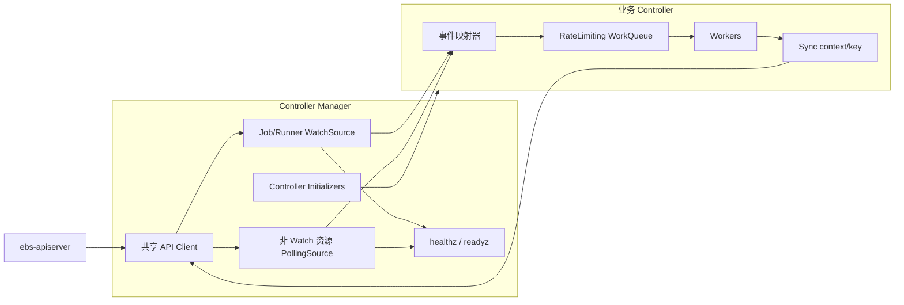

# Controller Manager 框架设计

## 1. 目标与范围

Controller Manager 使用 Go 实现，参考 Kubernetes controller 的组织方式，负责创建共享依赖、初始化 Controller、启动事件源与 Worker，并统一处理健康检查和优雅退出。

本文只定义 Controller Manager 和 Controller 公共框架，不定义 Build、Snapshot 等业务对象的状态机。具体 Controller 负责决定关注哪些资源、哪些变化需要入队、如何调谐以及拥有哪些状态字段。

框架遵循以下原则：

- Controller Manager 只管理生命周期，不直接调用业务调谐逻辑；
- 事件只负责触发调谐，资源 key 是队列中唯一的数据；
- Worker 每次处理 key 时读取最新对象，不依赖事件携带的旧对象；
- 所有业务副作用集中在 `Sync` 中，事件处理函数不得写状态、创建或删除资源；
- `Sync` 必须幂等，并允许因事件重复、进程重启和超时确认而重复执行；
- 优先使用 Kubernetes 的 `client-go` 工作队列、缓存与并发约定，不重复实现 dirty/processing、退避和关闭语义。

### 1.1 API 能力边界

当前 ebs-apiserver 只有以下资源支持 List/Watch：

- `Job`
- `Runner`

除 `Job` 和 `Runner` 以外的所有资源均不支持 Watch，包括但不限于 `Project`、`Snapshot`、`Build`、`BuildInfo`、`RpmRepo` 和 `BuildResource`。框架不得为这些资源创建 Reflector、SharedInformer 或发起带 `watch=true` 的请求。

因此框架同时支持两种事件源：

| 事件源 | 适用资源 | 数据获取方式 |
| --- | --- | --- |
| `WatchSource` | 仅 `Job`、`Runner` | List/Watch、本地 cache 和 lister |
| `PollingSource` | 其他所有资源 | 周期 List、快照比较和按需 GET |

Controller 的一致性不能依赖事件只发生一次。Watch 断线重连、周期 relist、Polling 重复扫描都可以造成同一 key 被多次入队。

## 2. 总体架构



Manager 创建共享客户端及事件源工厂，通过显式 initializer 构造 Controller。每个 Controller 拥有独立的限速队列和 Worker。事件源把资源变化交给 Controller 注册的映射器，映射器只计算并加入调谐 key。

## 3. 包结构与公共接口

建议使用以下包结构：

```text
components/controller-manager/
  cmd/controller-manager/
  pkg/app/
  pkg/controller/
    controller.go
    registry.go
  pkg/source/
    watch.go
    polling.go
  pkg/queue/
  pkg/health/
  pkg/controllers/
    build/
    buildinfo/
    snapshot/
    rpmrepo/
```

公共 API 类型继续来自独立的 `api` module。框架包不得依赖任何具体 Controller 包；`pkg/app` 负责显式组装具体 Controller。

### 3.1 Controller

```go
type Controller interface {
    Name() string
    Run(ctx context.Context, workers int) error
}
```

- `Name` 返回稳定且唯一的名称，用于配置、日志和指标标签；
- `Run` 启动 Worker 并阻塞到 `ctx` 取消或发生不可恢复错误；
- 同一个 Controller 实例的 `Run` 只允许调用一次。

Controller 的标准实现持有：

```go
type SyncFunc func(ctx context.Context, key string) error

type BaseController struct {
    name  string
    queue workqueue.TypedRateLimitingInterface[string]
    sync  SyncFunc
}
```

`BaseController` 只实现 Worker、队列终结和停止逻辑，不解释业务对象。

### 3.2 Initializer

```go
type Dependencies struct {
    Client         Client
    WatchFactory   WatchSourceFactory
    PollingFactory PollingSourceFactory
    Recorder       EventRecorder
}

type InitContext struct {
    Dependencies Dependencies
    Config       ControllerConfig
}

type InitFunc func(ctx context.Context, init InitContext) (Controller, bool, error)
```

返回值语义：

- `(controller, true, nil)`：Controller 已成功构造；
- `(nil, false, nil)`：Controller 被配置显式禁用；
- 其他组合均视为初始化失败。

Initializer 只能构造和注册事件处理器，不得启动 goroutine。Controller 名称到 `InitFunc` 的映射由 `NewControllerInitializers` 显式创建，不使用导入副作用或全局可变注册表。

### 3.3 Manager

```go
type Manager struct {
    controllers []Controller
    sources     []Source
    health      HealthServer
}

func (m *Manager) Run(ctx context.Context) error
```

Manager 不知道业务 Controller 的类型，也不调用其 `Sync`。首次同步由 Manager 对所有已创建 Source 统一等待，不在 Controller 上重复暴露同步状态。

## 4. 事件源

### 4.1 通用约束

```go
type Source interface {
    Name() string
    AddEventHandler(handler ResourceEventHandler) error
    Run(ctx context.Context) error
    HasSynced() bool
    Ready() bool
}

type ResourceEventHandler interface {
    OnAdd(obj runtime.Object)
    OnUpdate(oldObj, newObj runtime.Object)
    OnDelete(obj runtime.Object)
}

var ErrSourceStarted = errors.New("source already started")
var ErrWatchUnsupported = errors.New("resource does not support watch")
```

接口语义：

- `Name` 返回稳定且唯一的事件源名称，用于日志、指标和错误定位；
- `AddEventHandler` 注册订阅者，同一个 Source 可以注册多个 Handler；
- `Run` 启动 List/Watch 或 Polling 主循环并阻塞，直到 `ctx` 取消或发生不可恢复错误；
- `HasSynced` 只表示首次完整同步已经成功，不表示事件源此后永远健康；
- `Ready` 返回事件源当前是否可用于调谐，供 Manager 聚合 readiness；
- `ctx` 正常取消时 `Run` 返回 `nil`；不可恢复的初始化、协议或数据错误由 `Run` 返回；
- List、Watch 断线和临时网络错误由 Source 内部按退避策略持续恢复，不应直接终止 `Run`；底层运行循环在 context 未取消时意外结束才作为不可恢复错误返回。

所有 Handler 必须在 Source 的 `Run` 被调用之前完成注册。Source 一旦开始运行，其订阅集合即被冻结；之后调用 `AddEventHandler` 必须返回 `ErrSourceStarted`，不得动态修改订阅列表。`Run` 只能调用一次，重复调用返回 `ErrSourceStarted`。`AddEventHandler` 与 `Run` 对 started 状态的检查和修改必须由同一把锁保护，确保注册与启动不存在竞态。Initializer 是唯一允许注册业务 Handler 的阶段。

事件处理器只允许执行以下操作：

1. 校验并提取资源 key；
2. 比较与入队判断直接相关的轻量字段；
3. 将一个或多个 key 加入目标 Controller 队列。

事件处理器不得调用写 API、访问外部服务或执行耗时计算。关联资源事件需要通过索引或一次 List 找到受影响的主资源 key；具体映射规则属于业务 Controller。

Source 在调用 Handler 时必须隔离订阅者异常：一个 Handler 的 panic 不得阻止同一事件通知其他 Handler。Source 记录 handler、source、resource 和 panic 堆栈后继续分发；事件将在后续 Watch relist 或 Polling resync 中重新触发。

Handler 方法不返回 error，这是有意遵循 informer event handler 的通知语义。对象类型错误、key 提取失败或事件映射失败由 Handler 记录日志和指标后丢弃本次通知，不得阻塞或终止 Source；后续 relist/resync 负责再次触发。

### 4.2 Source Factory 与共享规则

Source 使用 Kubernetes 的 `schema.GroupVersionResource` 标识，不以 Go 类型名或 URL 字符串作为共享键：

```go
type WatchSourceFactory interface {
    ForResource(gvr schema.GroupVersionResource) (Source, error)
    Sources() []Source
}

type PollingSourceFactory interface {
    ForResource(gvr schema.GroupVersionResource, period time.Duration) (Source, error)
    Sources() []Source
}
```

Factory 契约：

- 相同 GVR 的多次 `ForResource` 返回同一个 Source；
- 不同 group、version 或 resource 永远不共享 Source；
- `WatchSourceFactory` 只接受 `ebs/v1` 的 `jobs` 和 `runners`，其他 GVR 返回 `ErrWatchUnsupported`；
- `PollingSourceFactory` 负责通过共享 API Client 为 GVR 构造分页 List 调用；
- 同一 PollingSource 被请求不同周期时，在启动前采用最短周期；Source 启动后不得再次调用 `ForResource` 改变周期；
- `Sources` 返回去重后的稳定快照，只允许 Manager 在全部 initializer 完成后调用；首次调用同时冻结 Factory，之后任何 `ForResource` 调用均返回 `ErrSourceStarted`；
- Factory 的创建、复用和周期合并必须并发安全，但首版仍要求 initializer 串行执行，以获得确定的注册顺序。

Manager 合并两个 Factory 的 `Sources`，只启动已被启用 Controller 请求的 Source，并等待这些 Source 全部 `HasSynced`。因此不需要维护 Controller 到 Source 的依赖图，也不会为未启用的 Controller 启动事件源。

### 4.3 Job 和 Runner WatchSource

`Job`、`Runner` 使用 `client-go` 的 Reflector/SharedIndexInformer 语义：

- 首次 List 成功并完成本地 cache 替换后，`HasSynced` 才可返回 true；
- Watch 断开后从最近的 `resourceVersion` 恢复；版本过期时重新 List；
- Add、Update、Delete 都可以触发入队；
- Delete 必须兼容 `cache.DeletedFinalStateUnknown`；
- Update 收到相同 `resourceVersion` 时可以跳过；是否进一步比较 generation、spec 或 status 由业务 Controller 决定；
- resync 事件允许重复入队，不影响正确性。

共享 WatchSource 可以被多个 Controller 订阅，但每个 Controller 使用自己的事件映射器和队列。业务代码不得修改 informer cache 返回的对象；需要保留或修改时必须 `DeepCopy`。

WatchSource 在 `Run` 内启动底层 SharedIndexInformer 并等待 context 取消。List/Watch 临时失败交由 Reflector 的退避和 relist 机制恢复，普通 Watch 断线不导致 `Run` 返回错误。与 Kubernetes informer 一致，首次同步后 `Ready` 保持 true；底层 Reflector 没有把安静但健康的 Watch 与断连重试区分为可靠的 stale 信号，因此不对 WatchSource 应用时间阈值。仅当 informer 主 goroutine 在 context 未取消时意外结束，`Run` 才返回带 Source 名称的不可恢复错误。

### 4.4 非 Watch 资源 PollingSource

不支持 Watch 的资源使用统一 `PollingSource`。每种资源可以共享一个 PollingSource，多个 Controller 注册独立事件映射器。

PollingSource 通过以下通用分页接口读取资源：

```go
type ListPage struct {
    Items           []runtime.Object
    Continue        string
    ResourceVersion string
}

type ListFunc func(
    ctx context.Context,
    gvr schema.GroupVersionResource,
    continueToken string,
    limit int64,
) (ListPage, error)
```

`PollingSourceFactory` 从共享 API Client 构造 `ListFunc`。每一页使用响应中的 `continue` 请求下一页，直到返回空 token；`limit` 默认 500，可配置。对象元数据统一通过 `meta.Accessor` 读取，无法读取 name、namespace、UID 或 resourceVersion 的对象使整轮扫描失败。

PollingSource 每轮执行：

1. 调用 List 获取全量对象并处理分页；
2. 用 `UID` 标识对象身份，用 `resourceVersion` 判断同一对象是否变化；
3. 与上一次成功快照比较，产生 Add、Update 和 Delete 通知；
4. 原子替换本地只读快照；
5. 记录成功时间并等待下一轮。

约束如下：

- 首次完整 List 成功后 `HasSynced` 才返回 true；空列表也是一次成功同步；
- 任一分页失败则整轮失败，不替换快照，也不产生 Delete 通知；
- 同名对象 UID 改变必须表现为旧对象 Delete 和新对象 Add；
- 快照内对象必须 DeepCopy，禁止订阅方修改；
- 每次成功扫描可以选择对全部对象产生周期 resync 通知，默认开启，以修复遗漏事件和外部副作用；
- List 失败按独立的指数退避重试，成功后恢复正常轮询周期；
- `ctx` 取消必须中止等待和后续扫描；已经发出的 HTTP 请求必须携带该 context；
- PollingSource 不能把轮询结果称为 Watch 事件，也不能提供强实时性保证。

PollingSource 对临时 List 失败持续退避重试；超过 stale threshold 时将 readiness 置为 false，成功完成一轮扫描后恢复。临时失败不终止 `Run`，且不得用失败或不完整的 List 结果覆盖旧快照。只有固定配置错误、响应无法按契约解析，或者轮询主循环在 context 未取消时意外结束，`Run` 才返回不可恢复错误。

默认轮询周期为 30 秒，允许按资源和 Controller 配置。相同资源的共享 PollingSource 使用所有订阅者要求的最短周期，避免重复全量 List。同一 Source 不允许并发执行两轮扫描；上一次扫描完成后才计算下一次等待时间。

对于非 Watch 资源，Worker 收到 key 后应通过 API `Get` 读取最新对象；PollingSource 快照只用于变化检测、索引和事件映射，不作为业务写入的并发前提。若 API 不提供对应 Get，业务 Controller 才可读取快照，并必须在设计中明确其最终一致性限制。

## 5. WorkQueue 与 Worker

每个 Controller 使用独立的 client-go 限速队列。当前仓库固定使用 `client-go v0.28.4`，该版本尚未提供泛型 Typed WorkQueue，因此首版使用：

```go
workqueue.RateLimitingInterface
```

`BaseController.Enqueue` 只接收 string，Worker 从队列取出元素后必须断言为 string，其他类型记录框架错误并 `Forget`。未来升级到提供泛型队列的 client-go 版本时，直接替换为 `workqueue.TypedRateLimitingInterface[string]`，队列语义不变。

队列中只存放稳定 key：

- project 范围资源使用 `{namespace}/{name}`；
- cluster 范围资源使用 `{name}`；
- key 生成失败时记录错误并丢弃事件。

`client-go` workqueue 的 dirty/processing 语义保证：同一 key 不会被同一队列的多个 Worker 同时处理；处理期间再次 Add 会在当前处理结束后重新入队一次。

### 5.1 标准 Worker 循环

```go
func (c *BaseController) processNext(ctx context.Context) bool {
    key, shutdown := c.queue.Get()
    if shutdown {
        return false
    }
    defer c.queue.Done(key)

    err := c.sync(ctx, key)
    switch {
    case err == nil:
        c.queue.Forget(key)
    case ctx.Err() != nil:
        c.queue.Forget(key)
        return false
    case IsPermanent(err):
        c.queue.Forget(key)
    case c.queue.NumRequeues(key) < c.maxRetries:
        c.queue.AddRateLimited(key)
    default:
        c.queue.Forget(key)
    }
    return true
}
```

终结规则：

- 成功：`Forget`；
- 对象已删除且无需清理：视为成功；
- API Conflict、暂时性网络错误、依赖未就绪：`AddRateLimited`；
- 输入永久无效：记录 condition/event 后返回永久错误并 `Forget`；
- 超过最大重试次数：`Forget`，记录 error、指标和事件，等待后续 Watch 或 Polling resync 再次激活；
- 无论任何结果都必须且只能调用一次 `Done`。

默认使用指数退避与总体限速组合，基础退避 5 ms、最大退避 1000 秒，Controller 可覆盖；默认最大连续重试次数为 15。成功、永久错误或超过重试上限时通过 `Forget` 清除旧退避。普通 Add 不主动清除一个仍在失败重试中的 key 的退避次数。

### 5.2 错误分类

框架提供可被 `errors.Is`/`errors.As` 穿透包装识别的永久错误：

```go
type PermanentError interface {
    error
    Permanent() bool
}

func NewPermanentError(err error) error
func IsPermanent(err error) bool
```

永久错误只终结本次调谐并清除本次队列退避，不会永久屏蔽 key。后续新的 Watch 事件或 Polling resync 仍可以重新入队。

框架不负责为永久错误写 condition。业务 `Sync` 必须先完成必要且幂等的状态或 Event 写入，再返回永久错误；如果这次写入本身失败，应返回可重试错误。context cancellation 不计入重试，Controller 正在停止时直接结束当前 Worker。

### 5.3 最新状态与并发写

- Watch 资源由 Worker 通过 lister 获取最新 cache 对象；
- 非 Watch 资源由 Worker 通过 API Get 获取最新对象；
- 更新 status 时必须携带 `resourceVersion`；
- Conflict 应重新读取对象并重算结果，不能盲目重放旧 patch；
- 创建确定性名称的子对象遇到 AlreadyExists 时，应读取并确认其 owner/UID 等幂等标识；
- API 写入请求已发送但响应超时时，业务 Controller 必须先通过 Get/List 确认结果，不能直接重复产生外部副作用。

## 6. 生命周期

### 6.1 启动顺序

Manager 必须按以下顺序启动：

1. 解析配置并创建 REST config、客户端、事件记录器和健康服务；
2. 执行所有 initializer，构造启用的 Controller，并在此阶段向 Source 注册全部 Handler；
3. 启动 `/healthz` 和 `/readyz`；
4. 结束注册阶段；后续调用 Source 的 `Run` 时，由 Source 原子地标记 started 并冻结订阅集合；
5. 从两个 Factory 获取并合并全部已创建 Source，使用同一个 `errgroup.WithContext` 调用其 `Run`；
6. 使用 cache-sync timeout 等待全部已创建 Source 的 `HasSynced` 返回 true；
7. 使用同一 errgroup 启动各 Controller Worker；
8. 所有 Controller 启动且依赖已同步后，将 readiness 设置为 true；
9. 阻塞等待根 context 取消，或任一 Source/Controller 返回不可恢复错误。

缓存同步具有可配置超时，默认 2 分钟。超时、初始化失败、Source 返回不可恢复错误或 Controller 意外退出均取消 errgroup context，Manager 等待其他组件退出后返回原始错误并终止进程，交由容器编排层重启；不得静默保留一个永久缺失的事件源或 Controller。根 context 正常取消且所有组件正常退出时，Manager 返回 `nil`。

启动顺序不表达业务依赖。Controller 必须通过资源状态实现依赖协调，不得依赖另一个 Controller 恰好先启动。

### 6.2 停止顺序

`main` 使用 `signal.NotifyContext` 将 SIGINT/SIGTERM 转换为根 context 取消。停止顺序为：

1. readiness 立即变为 false；
2. Manager 取消运行 context，Source 的 `Run` 停止 Watch、Polling 和新的 API 请求；
3. 每个 Controller 调用 `queue.ShutDownWithDrain()`，不再接受新 key；
4. Worker 完成当前 `Sync` 后退出；
5. Manager 单独创建 `shutdownCtx`，其超时时间为 `--shutdown-timeout`，并等待 errgroup 返回；
6. errgroup 在期限内完成则返回其原始结果；`shutdownCtx` 先到期则返回 shutdown timeout 错误，由容器终止宽限期兜底。

shutdown timeout 只由 Manager 创建，Source 和 Controller 不得各自建立进程级退出期限。框架不使用游离 goroutine，也不允许丢下不受 context 管理的后台任务。业务外部调用必须设置超时并接受运行 context；收到取消后应尽快返回。

### 6.3 Controller panic

Worker 边界必须捕获 panic，记录 controller、key 和堆栈。发生 panic 的本次 key 按可重试失败处理，但连续 panic 仍受最大重试次数限制。Controller 的顶层 `Run` 意外返回视为不可恢复错误，Manager 终止进程。

## 7. 配置

框架至少提供：

| 配置 | 默认值 | 说明 |
| --- | --- | --- |
| `--apiserver` | 必填 | ebs-apiserver 地址 |
| `--apiserver-ca` | 空 | 服务端 CA |
| `--insecure-skip-verify` | false | 仅开发环境允许关闭 TLS 校验 |
| `--controllers` | `*` | 启用或禁用的 Controller 集合 |
| `--workers` | 2 | Controller 默认 Worker 数量 |
| `--poll-period` | 30s | 非 Watch 资源默认轮询周期 |
| `--poll-page-size` | 500 | 非 Watch 资源单页对象数 |
| `--cache-sync-timeout` | 2m | 首次同步超时 |
| `--shutdown-timeout` | 30s | 优雅退出上限 |
| `--source-stale-threshold` | 2m | Source 持续未成功同步后 readiness 失败的最小阈值 |
| `--health-bind-address` | `:8080` | 健康与指标监听地址 |

每个 Controller 可以覆盖 worker 数量和轮询周期。Worker 数量、周期和超时必须为正值；配置非法时启动失败。当前不配置客户端证书，认证能力随 ebs-apiserver 的客户端契约另行扩展。

## 8. 健康检查与可观测性

### 8.1 健康检查

- `/healthz`：进程主循环和 HTTP 服务存活即成功；
- `/readyz`：初始化成功、全部启用 Controller 的依赖完成首次同步，且没有 Controller 意外退出时成功；
- 首次 Polling List 失败或 Watch 初始 List 失败时，进程可以继续重试，但 readiness 保持 false，直至同步超时；
- 运行期间短暂 List/Watch 错误不立即令进程 unhealthy，应通过指标和日志反映；持续超过配置阈值时 readiness 变为 false。

PollingSource 的有效 stale threshold 为 `max(--source-stale-threshold, 3 × pollPeriod)`。PollingSource 必须原子维护 `lastSuccessfulSync`，健康检查只读取该状态，不执行 API 请求；恢复一次成功扫描后 readiness 自动恢复。WatchSource 首次同步后沿用 SharedInformer 的 synced 状态，不使用基于时间的 stale 判定。

### 8.2 日志字段

结构化日志至少包含：

- `controller`
- `key`
- `source`
- `resource`
- `result`
- `retries`
- `duration`
- `error`

不得记录 payload、认证信息或可能包含密钥的完整对象。

### 8.3 指标

除 client-go workqueue 指标外，至少提供：

- Controller 启动状态和 Worker 数；
- reconcile 总数、错误数、重试数和耗时；
- Watch 重连和 relist 次数；
- Polling 成功/失败次数、耗时和最后成功时间；
- cache sync 状态；
- 永久错误和超过最大重试次数的对象数。

## 9. 多副本与一致性

首版 Controller Manager 按单活设计。部署多个副本时必须启用 leader election，只有 leader 启动 Controller Worker；非 leader 可以保持健康，但 readiness 必须明确表示 standby 状态。

Leader election 不能替代幂等性：领导者切换可能发生在 API 或外部操作已经成功但本进程尚未观察到响应时，新的领导者仍会重新调谐同一对象。

如果首版暂不实现 leader election，部署清单必须固定 `replicas: 1`，并在启动参数或文档中明确不支持多副本并发工作。

## 10. 测试要求

### 10.1 框架单元测试

- initializer 成功、禁用、失败和重复名称；
- Source 名称、首次 Run、重复 Run，以及 Run 前/后的 Handler 注册；
- Source 临时错误内部恢复、不可恢复错误返回和 Manager 错误传播；
- Source Factory 按 GVR 复用、拒绝非 Job/Runner Watch、Polling 周期合并和启动后冻结；
- 多个 Handler 的事件分发，以及单个 Handler panic 不影响其他订阅者；
- cache sync 成功、失败、超时和 context 取消；
- stale threshold 导致 readiness 失败及成功同步后的恢复；
- key 去重、处理期间更新、退避、Forget 和最大重试；
- 永久错误包装识别、Forget 以及后续新事件重新激活；
- panic 恢复和 Controller 意外退出；
- tombstone Delete；
- Polling 首次空列表同步；
- Polling Add/Update/Delete、UID 替换、完整分页、分页失败不覆盖快照和单轮串行；
- 停止时不再入队并等待 Worker 退出；
- shutdown timeout 由 Manager 统一执行；
- readiness 随初始化和同步状态变化。

### 10.2 Controller 契约测试

每个业务 Controller 至少验证：

- 注册的事件源符合 API 能力边界；
- 对 `Job`、`Runner` 使用 WatchSource；
- 对其他资源使用 PollingSource，代码不会请求 Watch；
- 事件映射只入队，不产生写副作用；
- 相同 key 重复调谐保持幂等；
- Conflict、NotFound、超时结果未知和外部依赖暂时失败；
- 进程重启后的状态恢复。

所有模块必须通过：

```bash
go test ./...
go test -race ./...
go vet ./...
```

## 11. 实现裁定

以下决策作为首版实现的固定契约：

1. Manager 与 Controller 使用 `context.Context` 管理生命周期；
2. Controller 显式注册，不使用导入副作用；
3. 每个 Controller 使用独立的 client-go rate-limiting workqueue，并在当前 v0.28.4 版本通过 BaseController 强制 string key 边界；
4. 队列只保存 key，所有业务写入集中在 `Sync`；
5. 仅 `Job`、`Runner` 使用 List/Watch 和本地 lister；
6. 其他资源使用周期 List 的 PollingSource，Worker 默认通过 GET 获取最新对象；
7. 首次事件源同步完成前不得启动 Worker，readiness 保持 false；
8. 可重试失败进入指数退避，成功和永久失败执行 Forget；
9. 初始化失败、同步超时或 Controller 意外退出使进程失败；
10. 首版若不实现 leader election，只允许部署一个工作副本；
11. 所有事件 Handler 必须在 Source `Run` 前注册，运行后注册和重复运行均返回 `ErrSourceStarted`；
12. Source 通过阻塞的 `Run(ctx) error` 报告不可恢复错误，Manager 使用共享 errgroup 将该错误传播到进程出口；
13. Source Factory 按完整 GVR 共享事件源；Watch Factory 必须拒绝 Job、Runner 之外的资源；
14. Manager 启动 Worker 前统一等待全部已创建 Source 完成首次同步，不维护 Controller 到 Source 的依赖图；
15. 普通 List/Watch/Polling 错误持续退避恢复，通过 stale 状态影响 readiness，不直接终止进程；
16. PollingSource 使用通用分页 `ListFunc`，任何一页失败都不得替换旧快照；
17. 永久错误只终结本次调谐，后续资源事件仍可重新激活 key；
18. 运行 context 和 shutdown timeout 均由 Manager 统一管理。
