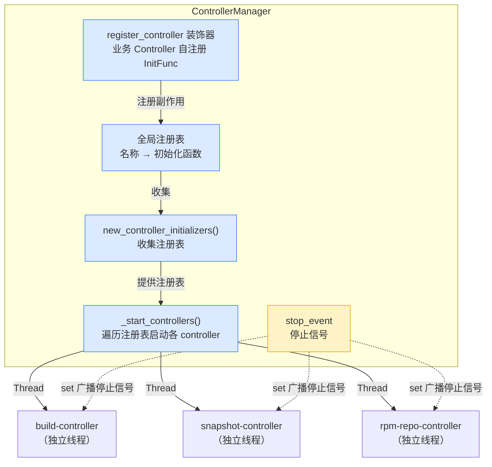
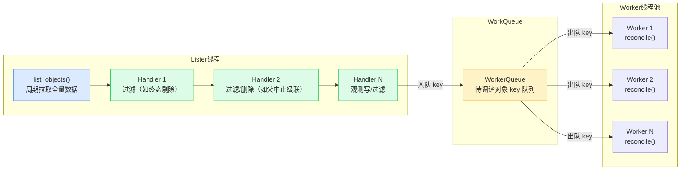
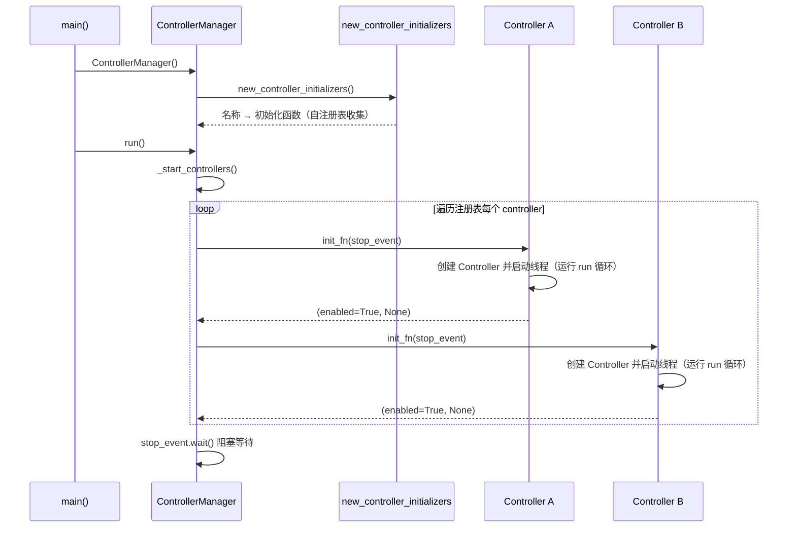
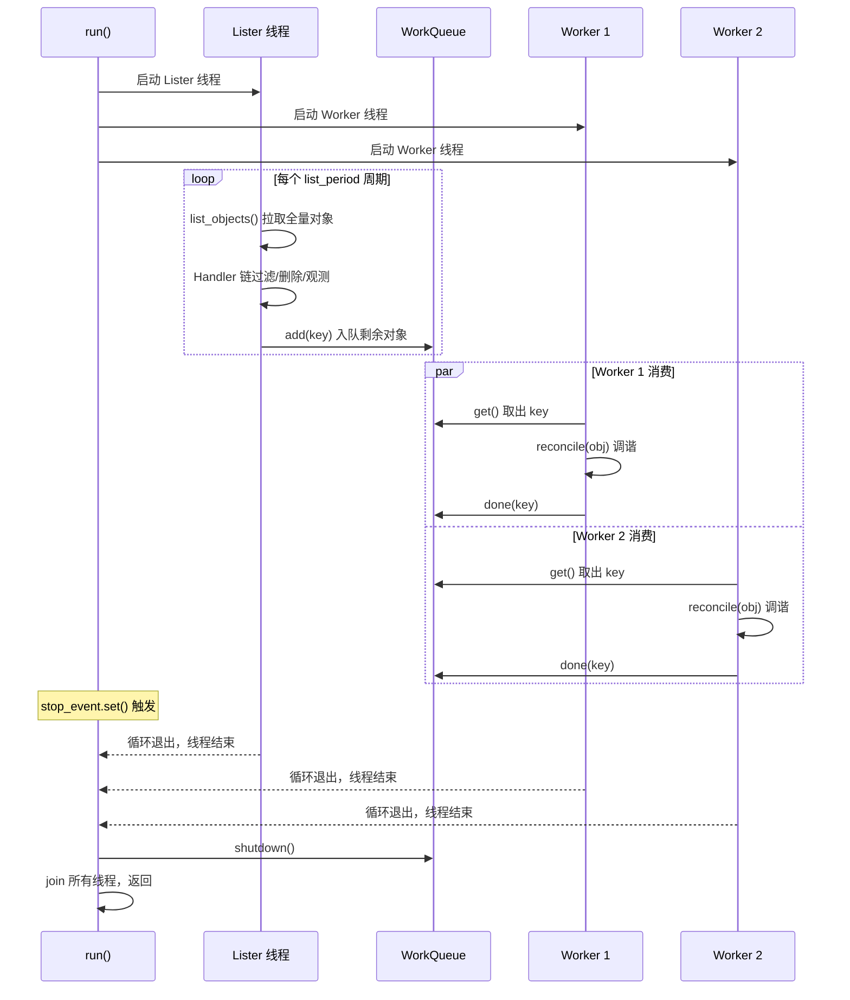
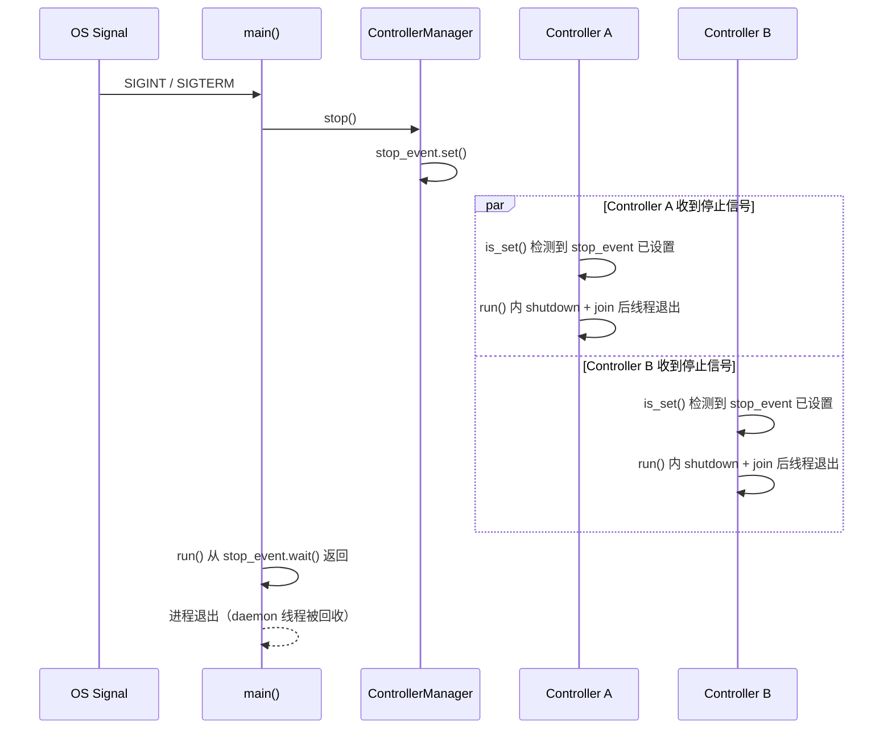

# Controller Manager 设计文档

## 1. 概述

### 1.1 设计目标

Controller Manager 负责管理多个 Controller 的生命周期，提供统一的启动与停止入口。通过一个管理器编排所有 Controller 的运行，避免为每个 Controller 单独管理进程或线程，降低运维复杂度。

核心功能仅包含两项：

- **启动所有 Controller**：一次性将所有已注册的 Controller 在各自独立的线程中启动
- **停止所有 Controller**：通过广播停止信号，让所有正在运行的 Controller 退出

**范围边界**：本文覆盖 Controller Manager 的编排层与 Controller 基类通用骨架（Handler / Controller / 工作队列 / 注册表 / 停止机制）。具体 Controller 的业务状态机、具体 Handler 实现，以及对 apiserver 的认证/授权、TLS 与超时/重试参数，均不在本文范围（由各 Controller 设计文档及 API 客户端单独设计）。

### 1.2 关键设计

其关键设计包括：

- 业务 Controller 通过 `register_controller("name")` 装饰器自注册其初始化函数（`InitFunc`），`new_controller_initializers()` 收集全局注册表，将控制器名称映射到初始化函数
- `ControllerManager._start_controllers()` 遍历该注册表，依次调用每个初始化函数启动对应的控制器
- 每个控制器在独立的线程中运行，互不阻塞
- 通过停止事件（`threading.Event`）传递停止信号，`event.set()` 一次性通知所有控制器退出

### 1.3 设计原则

| 编号 | 原则 | 说明 |
|----|------|------|
| P1 | **编排优于实现** | Controller Manager 的价值在于"管"，而非"做"。调谐流水线、对象过滤、状态推进全部下沉到 Controller 基类与各 Controller 的实现（Handler / reconcile）中。管理器本身保持极薄，任何试图把业务逻辑塞进管理器的冲动都应被拒绝 |
| P2 | **可观测优于可猜测** | 每个 Controller 必须有名称，每次启动、退出、异常都必须留下日志痕迹。当生产环境出问题时，运维人员应能从日志快速判断"哪个 Controller 挂了、挂在哪一步、是否已经退出" |

**编码与工程标准**：

- **语言**：Python 3.9+，类型注解（PEP 484）必填。
- **风格**：遵循 PEP 8，行宽 120；使用 `black` 格式化、`isort` 排序导入、`flake8` 静态检查、`mypy` 类型检查。
- **异步模型**：Controller 框架基于多线程（Lister 线程 + Worker 线程池），禁止在 reconcile 中混用 asyncio；I/O 阻塞调用通过线程池并发，单次 reconcile 控制在秒级。
- **API 客户端**：统一使用项目内 API 客户端，封装重试、分页、标签选择器；禁止裸 `requests`。
- **配置**：通过配置模块 + 环境变量注入（Worker 数量、Lister 间隔、队列容量、退避参数、发布服务地址、文件系统根路径、日志目录），禁止硬编码。
- **测试**：单元测试覆盖率 ≥ 80%；reconcile 各分支、状态机所有迁移、幂等性、失败跳过路径必须有测试用例。
- **异常处理**：`reconcile` 抛出异常时，基类记录 ERROR 日志（含堆栈）并跳过该对象，不重试、不退避；该对象在下一轮 Lister 周期重新拉取并再次入队（若仍被 Handler 链保留）。是否写入 condition 由各 Controller 业务实现自行决定，基类不代写。

### 1.4 强约束

强约束是不可逾越的红线，定义了"什么绝对不能做"，用以防止后续迭代中因短期便利而侵蚀架构。

| 编号 | 强约束 | 违反后果 |
| --- | --- | --- |
| G-01 | Controller Manager 不得直接调用任何 Controller 的 `reconcile` 方法 | 架构腐化，管理器退化为业务编排器 |
| G-02 | 不得在 `ControllerManager` 类中导入任何具体 Controller 子类或具体业务模块 | 注册表与实现解耦被破坏。具体 Controller 仅由 `new_controller_initializers()` 内的模块导入副作用触发自注册 |
| G-03 | 停止流程不得依赖 Controller 数量，`ControllerManager` 不得逐个 join 各 Controller 线程 | 广播语义被破坏，停止成为不可靠操作。Controller 线程为 daemon，由进程退出回收；基类内部对自己的 Lister/Worker 线程做 shutdown + join 属基类收尾，不在本约束内 |
| G-04 | `stop_event` 不得被任何 Controller 重置 (`clear()`) | 停止信号被误清，系统无法退出 |
| G-05 | 不得引入进程级 `ControllerManager` 单例（如全局 `manager = ControllerManager()`） | 破坏可测试性，隐藏依赖。`ControllerManager` 通过构造参数注入 `initializers` 保持可测试 |
| G-06 | Controller 线程不得以非 daemon 方式运行 | 主进程退出时挂死，影响容器编排回收 |
| G-07 | `InitFunc` 不得在调用线程内执行长时间阻塞的调谐循环 | 阻塞管理器的启动编排，启动顺序不可控 |
| G-08 | 不得绕过 workqueue 直接把对象交给 Worker | 去重与背压机制失效 |
| G-09 | `reconcile` 对同一对象的重复调用不得产生重复业务副作用 | 失败跳过 + 下一轮重放会重复执行副作用，破坏幂等性 |

### 1.5 功能边界

本节明确 Controller Manager **不提供**的功能，划定能力边界。

| 编号 | 边界 | 说明                                                                                                                                                                                                                |
| --- | --- |-------------------------------------------------------------------------------------------------------------------------------------------------------------------------------------------------------------------|
| F-01 | **不感知 Controller 是否存活** | Controller Manager 不提供心跳上报、健康检查、存活探测（liveness）等任何存活感知机制，无法主动判断某个 Controller 线程是否仍在运行。Controller 线程为 daemon，管理器不 join、不检查线程状态（见 G-03 / G-06）；判断"哪个 Controller 挂了、是否已退出"只能依赖日志观测                                    |
| F-02 | **无优雅停机，进程退出即全量回收** | Controller Manager 不提供优雅停机：停止仅通过 `stop_event.set()` 广播停止信号，不阻塞等待线程退出、不保证清理完成（见 G-03 / G-06）。各 Controller 的 `InitFunc` 以 daemon 线程启动（G-06），因此直接关闭启动容器（如 kill 进程、删除 Pod）时，主进程退出即回收全部 daemon 线程——所有 Controller 随之终止。 |

---

## 2. 整体架构

### 2.1 核心组件

Controller Manager 由以下核心抽象构成：

- **`InitFunc`**：Controller 的初始化函数类型，接收 `stop_event`，负责创建并启动一个 Controller 的线程，返回 `(enabled, error)`
- **`Handler` 抽象基类**：对象过滤器基类，各 Controller 继承它实现自己的过滤/删除/观测逻辑
- **`Controller` 抽象基类**：封装 `list → filter → workqueue → reconcile` 流水线，子类实现 `list_objects` / `get_handlers` / `reconcile`
- **`ControllerManager` 类**：持有初始化函数注册表与共享 `stop_event`，提供 `run` / `stop`
- **`register_controller` 装饰器**：业务 Controller 自注册 `InitFunc` 到全局注册表
- **`new_controller_initializers()` 工厂**：导入各 Controller 模块触发注册副作用，并收集注册表

### 2.2 整体框架图

图中实线表示启动阶段的注册与线程派发关系，虚线表示停止时 `stop_event` 的广播通知路径。业务 Controller 在导入期通过 `register_controller` 装饰器将 `InitFunc` 登记进全局注册表；`ControllerManager` 构造时经 `new_controller_initializers()` 收集该注册表，随后 `_start_controllers()` 将每个 Controller 投放到独立线程。停止时 `stop_event.set()` 的广播特性使所有线程同时收到退出信号。

### 2.3 Controller 内部流水线

每个 Controller 内部运行两类线程：一个 **Lister 线程** 负责周期性拉取数据并经过 Handler 链过滤，N 个 **Worker 线程** 负责从 workqueue 取出对象执行调谐。Lister 和 Worker 之间通过 `WorkerQueue` 解耦。

Lister 线程周期性执行 `list_objects()` 获取全量对象，依次经过 Handler 链：每个 Handler 接收一个对象列表，返回过滤后的列表，被剔除的对象不再进入后续 Handler 与 workqueue。过滤后剩余的对象按 `key_func(obj)` 提取稳定资源键入队 workqueue，由 Worker 线程池中的 N 个线程并发取出执行 `reconcile()` 调谐。

### 2.4 状态推进职责划分

**核心原则**：Handler 只负责"过滤 / 删除 / 观测写"，`reconcile` 是业务状态机（phase / stage 推进）的唯一推进点。终态对象不再入队、不再推进。

| 职责 | 负责角色 | 说明 |
| --- | --- | --- |
| 剔除自身已终态的对象 | Handler（`TerminalStateFilter`，各 Controller 自实现） | 终态集合由各 Controller 自行定义（如 build 的 `{Success, Failed, Aborted}`、snapshot 的 `{Active}`），终态对象不入队 |
| 父对象中止时级联删除子对象 | Handler（`ParentAbortedFilter`，各 Controller 自实现） | 父中止则删除子对象；父不存在（孤儿）时保留子对象，不误删 |
| 观测型 condition 写（如 `BuildNotFound`） | Handler | 「跳过不入队」语义下写入该 condition 的唯一时机（观测元数据，非业务状态推进） |
| phase / stage 推进 | `reconcile`（各 Controller 自实现状态机） | 业务状态迁移的唯一推进点，Handler 不得推进业务 phase |

**判定规则**：

- Handler 在 Lister 线程内串行执行，顺序由各 Controller 的 `get_handlers()` 返回列表决定，不可在流水线之外变更。
- Handler 剔除对象后可执行副作用（删除对象、写 condition），被 Handler 删除的对象不再入队 `reconcile`。
- 具体状态机、迁移表与终态集合见各 Controller 设计文档（`build_controller.md`、`snapshot_controller.md` 等），不在本文范围。

---

## 3. 核心抽象与职责

### 3.1 InitFunc 类型

`InitFunc` 是 Controller 的工厂函数签名。每个 Controller 提供一个符合此签名的函数，负责实例化 Controller 并在其内部启动线程运行控制循环。

- 接收 `stop_event`，用于通知 Controller 退出。
- 返回 `(enabled, error)`：`enabled` 表示该 Controller 是否成功启用，`error` 表示初始化过程中遇到的异常（`None` 表示无错误）。
- `InitFunc` 不得抛出未捕获异常；调用方会兜底捕获并转为该元组。

### 3.2 Handler 过滤器基类

`Handler` 是对 list 出的对象进行过滤并执行副作用（删除对象、写 condition）的处理单元基类，各 Controller 继承它实现自己的 Handler。

- 每个 Handler 接收一个对象列表，返回过滤后的对象列表；被过滤掉的对象不再进入后续 Handler 与 workqueue。
- 可在此方法中执行副作用（如删除对象、写 condition）。

> 各 Controller 自行实现具体 Handler（如 `TerminalStateFilter`、`ParentAbortedFilter`、`ProjectStatusFilter`），均继承 `Handler` 基类。本文不内置具体 Handler。

### 3.3 Controller 抽象基类

`Controller` 抽象基类封装了 Lister + Worker 的流水线骨架。子类只需实现 `list_objects`、`get_handlers`、`reconcile` 三个抽象方法，`run` 方法由基类提供默认实现。

- `list_objects`：周期性拉取待处理的全量对象，由 Lister 线程调用。
- `get_handlers`：返回过滤链，按列表顺序依次执行。
- `reconcile`：对 workqueue 中取出的单个对象执行调谐，由 Worker 线程调用。
- `key_func(obj)` 为资源键提取函数，默认取 `metadata.name`，有 namespace 时拼为 `namespace/name`，缺失时返回 `None`。
- 日志器携带 controller 名称（见第7节）。

`run` 的默认行为：首次运行时构建 Handler 链（只构建一次，避免半构造对象上调用）；随后启动 1 个 Lister 线程与 N 个 Worker 线程，均为 daemon；随后阻塞在 `stop_event.wait()` 上等待停止信号。收到信号后，立即关闭 workqueue（丢弃积压，对应 B-7），并 join 自己启动的线程（超时后由 daemon 回收）。

Lister 线程主循环：每个周期执行 `list_objects()` 拉取全量对象 → 依次经过 Handler 链过滤 → 用 `key_func` 提取资源键，原子重建工作集（供 Worker 按 key 只读取值）→ 将 key 入队 workqueue。周期结束在 `stop_event.wait(timeout=period)` 上休眠，兼顾下一周期与停止响应。

Worker 线程主循环：从 workqueue 取 key → 用 key 从工作集取对象（对象可能已被下一周期过滤掉）→ 调用 `reconcile(obj)`。`reconcile` 抛异常时记录 ERROR 日志并跳过（不重试、不退避，该对象在下一轮 Lister 周期重新入队）；无论成败最终都 `done(key)`，释放处理中标记。

**workqueue 语义**（`WorkerQueue`）：

- 队列元素为稳定可哈希的资源键（`key_func` 结果），不存可变资源对象。
- 去重采用 client-go 风格 `dirty + processing` 两集合配合 `ready` 队列：同一 key 在等待队列中只保留一份；处理中再次 `add` 会进入 `dirty`，处理完成后重新入队一次，不丢失处理期间的更新。
- 有界：`max_size` 限制等待队列长度，队列满时 `add` 阻塞等待空间（软背压），不丢弃。
- `shutdown(drain=False)` 立即丢弃待处理与处理中状态（对应 B-7）；`drain=True` 等待 ready 与 processing 排空。

### 3.4 ControllerManager 类

`ControllerManager` 是整个系统的核心，持有 Controller 注册表和停止事件，管理多个 Controller 的生命周期。

- 对外提供`run` / `stop`（运行/停止）；`run`内部通过`_start_controllers`启动注册的Controller。
- 构造时可注入自定义 `initializers`（默认用 `new_controller_initializers()`），以保持可测试。
- 校验 `initializers` 为 dict、key 为非空字符串、value 可调用，非法即抛错。

### 3.5 注册表与 register_controller 装饰器

业务 Controller 通过 `register_controller("name")` 装饰其 `InitFunc`，即可自动注册到全局注册表，无需手动登记。注册顺序即导入顺序，亦为启动顺序。

- 全局注册表维护 `name -> InitFunc` 映射，dict 保序。
- `register_controller` 在注册期校验名称：非法（非空字符串）或重复时抛错，避免注册表在导入期被静默污染（对应 B-4）。
- `get_registered_initializers()` 返回当前已注册的全部初始化函数（拷贝）。

### 3.6 配置

运行参数与启动抖动区间集中配置，避免各模块硬编码。

- 启动抖动区间（秒，闭区间）：0.5 ~ 1.5。
- Controller 默认运行参数：Worker 数量 2、Lister 周期 30 秒、队列容量 1024、worker 取对象轮询超时 1 秒、停止等待线程退出超时 5 秒。

各 Controller 的独立运行参数（`worker_num` / `list_period` / `queue_capacity` 及业务参数）与独立日志目录，以 controller 实例名为 key 集中配置，未配置者回退到默认值。

---

## 4. 启动流程

### 4.1 注册 Controller — register_controller 与 new_controller_initializers

业务 Controller 用 `register_controller("name")` 装饰其 `InitFunc`，在模块导入期自动登记到全局注册表。`new_controller_initializers()` 负责导入各 Controller 模块以触发注册副作用，并收集注册表。

- 导入顺序即注册顺序，亦为启动顺序。新增 Controller 需追加一次导入以触发注册副作用。
- 当前注册 4 个 Controller：`build-controller`、`build-info-controller`、`snapshot-controller`、`rpm-repo-controller`。
- `new_controller_initializers()` 收集注册表后记录 `controller_registered` 日志（含 `total_count`）。

### 4.2 主入口 — run

`run` 是 `ControllerManager` 的启动入口，编排注册与启动流程，随后阻塞等待停止信号。

- 调用 `_start_controllers()` 后记录 `controller manager started: ok/total` 日志；无注册时记录 `no controllers registered`。
- 阻塞等待 `stop_event`，收到信号后退出。不 join 各 controller 线程 —— InitFunc 内部启动的是 daemon 线程，由进程退出回收（见 G-03 / G-06）。

### 4.3 启动流程图

启动流程的执行顺序为：`main` 创建 `ControllerManager` 实例（构造时经 `new_controller_initializers` 收集自注册表），随后调用 `run`。`run` 内部调用 `_start_controllers`，遍历每个 `InitFunc` 并调用它，每个 `InitFunc` 在内部创建 Controller 并启动一个 daemon 线程运行控制循环。所有 Controller 启动后，`run` 在 `stop_event.wait()` 处阻塞，等待停止信号。

---

## 5. 停止流程

### 5.1 停止机制

停止通过 `stop_event.set()` 实现。Python 的 `threading.Event` 内部维护一个布尔标志，调用 `set()` 后标志变为 `True`，所有调用 `wait()` 阻塞的线程会立即被唤醒，所有调用 `is_set()` 检查的线程会读到 `True`。这一广播特性天然适合一对多的停止通知场景：无需逐个通知每个 Controller，一次 `set()` 即可让所有线程感知。

- `stop()` 广播停止信号，让所有正在运行的 Controller 退出。
- 幂等：多次调用等价于一次。
- 不阻塞等待线程退出。

### 5.2 信号处理

`main` 函数注册 `SIGINT` 和 `SIGTERM` 信号处理器，收到信号后调用 `cm.stop()` 设置 `stop_event`。

### 5.3 Controller 内部的停止逻辑

Controller 基类的 `run` 方法启动了 Lister 线程和 N 个 Worker 线程后，在 `stop_event.wait()` 处阻塞。当 `stop_event` 被设置后，Lister 线程的 `while not stop_event.is_set()` 循环退出（或在 `wait(timeout=period)` 处立即返回并 break），Worker 线程在 `workqueue.get(timeout=1)` 超时（返回 `(None, False)`）后继续轮询，检查到 `stop_event.is_set()` 也退出；`run` 方法随后 `workqueue.shutdown()` 并 `join` 所有线程返回（超时后依赖 daemon 回收）。

Lister 线程周期性地执行 list-filter-enqueue 循环，Worker 线程持续从 workqueue 取对象执行 reconcile。两类线程通过 `WorkerQueue` 解耦：Lister 产出对象的速率与 Worker 消费的速率不必一致，workqueue 起到缓冲作用。当 `stop_event` 被设置时，Lister 与 Worker 的循环条件不满足即退出，`run` 方法随后 `shutdown()` 并 `join` 所有线程（`join(timeout=5)` 超时后由 daemon 回收）。

### 5.4 停止流程图

停止流程的关键在于 `stop_event.set()` 的广播特性。所有 Controller 的线程通过 `wait()` 阻塞或 `is_set()` 轮询检测到事件被设置，各自执行清理逻辑后退出。`run` 方法中阻塞的 `stop_event.wait()` 也会返回，使主流程得以继续向下执行并最终退出进程。图中使用 `par` 块表示各 Controller 的退出是并行发生的；各 Controller 线程均为 daemon，即便清理未完成，主进程退出时也会被回收。

---

## 6. 边界情况与裁定

本节列出设计阶段识别的边界情况及其裁定，作为实现的契约依据。

### 6.1 启动与停止边界

**B-1: 注册表为空**

`new_controller_initializers()` 返回空 dict 时，`_start_controllers()` 不启动任何 Controller，`run()` 记录 `no controllers registered` 后进入 `stop_event.wait()` 阻塞。进程正常运行，等待停止信号。这是合法状态，非异常。

**B-2: InitFunc 抛出异常而非返回元组**

`_start_controllers()` 用 try/except 包裹调用，捕获后转为 `(False, exc)` 并记录 `ERROR` 日志，继续后续 Controller。这保证一个不规范的 InitFunc 不会拖垮整个启动。

**B-3: stop_event 在启动完成前被设置**

启动过程中收到 SIGTERM 时，`_start_controllers()` 在每次调用 InitFunc 前检查 `stop_event.is_set()`，若已设置则跳过剩余 Controller。已启动的 Controller 线程感知事件后退出。`run()` 不阻塞，直接返回。这避免在停止过程中继续启动新 Controller。

**B-4: Controller 名非法或重复注册**

`register_controller` 在注册期校验名称：非空字符串，否则抛 `ValueError`；同名重复注册抛 `ValueError`。注册表在导入期即失败，避免被静默污染。

### 6.2 运行时边界

**B-5: Lister 拉取周期内 stop_event 被设置**

Lister 处于 `stop_event.wait(timeout=period)` 阻塞中收到停止信号时，`wait` 立即返回（返回 True），Lister 退出循环，不再拉取。这是 `threading.Event.wait` 的标准语义，天然支持。若停止信号在 `list_objects` 或 Handler 链执行期间到达，Lister 会完成当前周期（含入队）后退出，不中途打断，也不影响停止的最终达成。

**B-6: Worker 正在调谐一个耗时对象时收到停止信号**

`reconcile` 调用耗时 60 秒，停止信号在调谐进行到 10 秒时到达：Worker 不中断当前 `reconcile`（无法安全中断），完成当前对象后，在下次取队列前检查 `stop_event`，退出。`run` 中 `join(timeout=5)` 只等待 5 秒，超时后未退出的 Worker 线程交由主进程 daemon 回收，不阻塞退出。若 `reconcile` 内部有可中断点，子类应自行检查 stop_event 提前退出。容器编排层 `terminationGracePeriodSeconds` 兜底强制 kill。

**B-7: workqueue 在停止时仍有积压**

停止时 workqueue 含未处理对象，积压对象被丢弃，不强制排空（`shutdown(drain=False)`）。理由：停止语义是"尽快退出"，排空积压可能耗时不可控；对象在进程重启后的下一轮 Lister 拉取时会重新入队（前提是对象状态未达终态）。此结论依赖 G-09：`reconcile` 必须可安全重放，否则丢弃积压后的重放会重复产生副作用。

### 6.3 关键歧义裁定

| 歧义 | 裁定 |
| --- | --- |
| 某个 InitFunc 失败后是否重试？ | 不重试。失败即记录并跳过。重试职责属于各 Controller 内部的连接管理，不属于管理器。管理器重启整个进程是唯一的"全局重试"途径，由容器编排层负责 |
| `stop()` 是否阻塞等待所有线程退出？ | 不阻塞。`stop()` 仅设置 `stop_event` 后返回；Controller 线程为 daemon，由进程退出回收 |
| Worker 数量 N 如何确定？ | 由 Controller 子类构造时指定（从配置读取，回退默认值），必须为正整数，非法值抛 `ValueError` |
| Lister 拉取周期如何确定？ | 由 Controller 子类构造时指定（从配置读取，回退默认 30 秒），通过 `stop_event.wait(timeout=period)` 实现兼顾轮询与停止响应 |
| 注册表的顺序由什么决定？ | 由各 Controller 模块的导入顺序决定，导入顺序即 `register_controller` 注册顺序，亦即启动顺序（Python 3.7+ dict 保序） |
| `reconcile` 失败后如何处理？ | 不重试、不退避。基类记录 ERROR 日志（含堆栈）并跳过，该对象在下一轮 Lister 周期重新拉取入队（若仍被 Handler 链保留）。是否写 condition 由各 Controller 业务实现决定 |
| 启动抖动区间如何确定？ | 相邻 Controller 之间插入 0.5~1.5 秒（闭区间）随机抖动 |
| `ControllerManager` 如何保持可测试？ | 构造参数 `initializers` 可注入自定义注册表（默认用 `new_controller_initializers()`），测试无需真实业务 Controller |

---

## 7. 可观测性设计

### 7.1 关键事件表

每个 Controller 必须有名称，每次启动、退出、异常都必须留下日志痕迹。日志器按 controller 名称创建，其日志器名称即为 controller 名称（模块级日志取调用方模块名）。下表定义系统应埋点的关键事件。

| 事件 | 等级 | 关键字段 | 触发点 |
| --- | --- | --- | --- |
| controller_registered | INFO | total_count | `new_controller_initializers()` 收集注册表完成 |
| controller thread dispatched | INFO | controller（日志器名） | InitFunc 返回 `(True, None)` |
| controller start failed | ERROR | controller, error | InitFunc 返回 `(False, err)` |
| controller init raised | ERROR | controller, exc（堆栈） | InitFunc 抛异常（B-2 兜底） |
| lister cycle | INFO | controller, total, enqueued | Lister 完成一轮 |
| lister cycle error | ERROR | controller, exc（堆栈） | list/handler 循环内异常 |
| reconcile done | INFO | controller, obj_key, duration_ms | Worker 完成一次调谐 |
| reconcile error | ERROR | controller, obj_key, exc（堆栈） | reconcile 抛异常 |
| object not found in working set | WARN | controller, obj_key | 队列 key 在工作集中缺失 |
| workqueue drop item | DEBUG | item | 队列关闭后仍 `add`（丢弃） |
| controller lister stopped | INFO | controller | Lister 线程退出（finally） |
| manager stopping | INFO | — | `stop()` 被调用 |

### 7.2 日志规范

- 每个 Controller 用独立日志器，日志器名称即 controller 名，日志输出的模块段即为该名称。
- 启动、退出、异常三个关键事件必须打 `INFO` 或更高等级。
- 高频指标（如 workqueue 丢弃）打 `DEBUG`，生产默认关闭（受调试开关控制）。
- 异常日志必须包含堆栈信息：记录时携带异常实例以输出完整堆栈。

---

## 8. 典型场景

### 8.1 场景 S-1: 正常启动

**前置条件**：平台进程启动，导入 4 个 Controller 模块：`build-controller`、`build-info-controller`、`snapshot-controller`、`rpm-repo-controller`

**主流程**：
1. `main` 构造 `ControllerManager`（构造时内部调用 `new_controller_initializers()`，收集自注册表）
2. `main` 注册 SIGINT/SIGTERM 处理器，指向 `ControllerManager.stop`
3. `main` 调用 `ControllerManager.run()`
4. `run()` 内部调用 `_start_controllers()`
5. 依次调用 `build-controller` 的 InitFunc，线程启动；间隔抖动；调用 `build-info-controller` 的 InitFunc，线程启动；……依序完成 4 个 Controller
6. `run()` 在 `stop_event.wait()` 阻塞

**后置条件**：4 个 Controller 并发调谐，日志可见 4 条 `controller thread dispatched` 记录

### 8.2 场景 S-2: 单个 Controller 启动失败

**前置条件**：`snapshot-controller` 的 InitFunc 因依赖服务不可用返回 `(False, RuntimeError("client unavailable"))`

**主流程**：
1. `_start_controllers()` 依次调用各 InitFunc
2. `snapshot-controller` 的 InitFunc 返回 `(False, err)`
3. 记录 `ERROR` 日志（`controller start failed`），继续后续
4. 其余 Controller 正常启动
5. `run()` 阻塞等待停止

**后置条件**：3 个 Controller 正常运行，`snapshot-controller` 未运行，日志可见失败记录，进程不退出

### 8.3 场景 S-3: Controller 线程运行时崩溃

**前置条件**：`build-controller` 的 Lister 线程因 API 返回非预期数据抛出异常

**主流程**：
1. Lister 线程的循环用 try/except 捕获异常
2. 记录 `ERROR` 日志含堆栈
3. 该轮 list 失败但 Lister 线程不退出，下一周期继续尝试
4. 其他 Controller 与管理器不受影响

**后置条件**：仅 `build-controller` 该轮调谐受影响，平台整体继续运行，日志可定位崩溃点

---

## 9. 关键设计决策

### 9.1 为什么使用装饰器自注册而非手工维护 Dict

采用 `register_controller("name")` 装饰器 + 全局注册表，而非手工维护名称到初始化函数的映射，原因有二：

- **可标识性与唯一性**：每个 Controller 通过名称标识，`register_controller` 在注册期校验名称非法/重复并抛错，避免注册表在导入期被静默污染（对应 B-4）。
- **可扩展性与低耦合**：新增 Controller 只需在其模块顶部加一行装饰器，并追加一次导入以触发注册副作用，无需改动注册表构造逻辑。`ControllerManager` 不直接导入具体 Controller 子类（G-02），注册与实现解耦。

### 9.2 为什么每个 Controller 在独立线程运行

将每个 Controller 放在独立的线程中运行，实现了故障隔离和并发执行。一个 Controller 的异常或阻塞不会影响其他 Controller 的正常运行。Python 的 `threading` 模块足以管理数十个 Controller，且 `daemon=True` 保证了即使某个线程未正常退出，主进程退出时也不会被挂住。

需要注意的是，Python 受 GIL 限制，多线程适合 I/O 密集型控制循环（如轮询 API、等待事件）。如果 Controller 涉及大量 CPU 计算，可考虑使用 `multiprocessing` 或 `concurrent.futures.ProcessPoolExecutor` 替代。

### 9.3 为什么使用 threading.Event 而非 contextvars 或其他机制

本设计使用 `threading.Event` 作为停止信号的载体，原因在于：

- **广播语义直观**：`Event.set()` 的语义是"通知所有等待者"，恰好对应"停止所有 Controller"的需求。所有调用 `wait()` 阻塞的线程会立即被唤醒，所有调用 `is_set()` 的线程会读到 `True`
- **API 简洁**：`Event` 只有 `set()`、`clear()`、`is_set()`、`wait()` 四个方法，语义清晰，无额外认知负担
- **可组合性强**：`wait(timeout=N)` 兼顾了轮询间隔和停止信号响应——若事件被设置则立即返回，否则最多等待 N 秒，非常适合控制循环的 `while not stop_event.is_set()` 模式

如果项目整体已采用 `asyncio` 异步框架，也可以将 `threading.Event` 替换为 `asyncio.Event`，将线程替换为协程，核心逻辑不变。