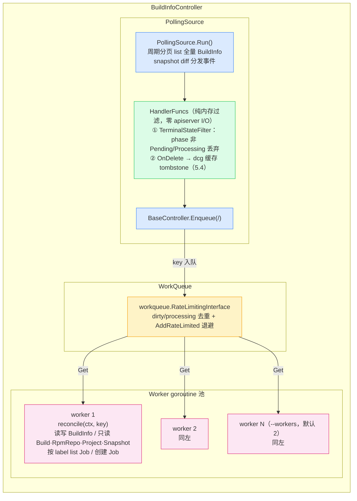
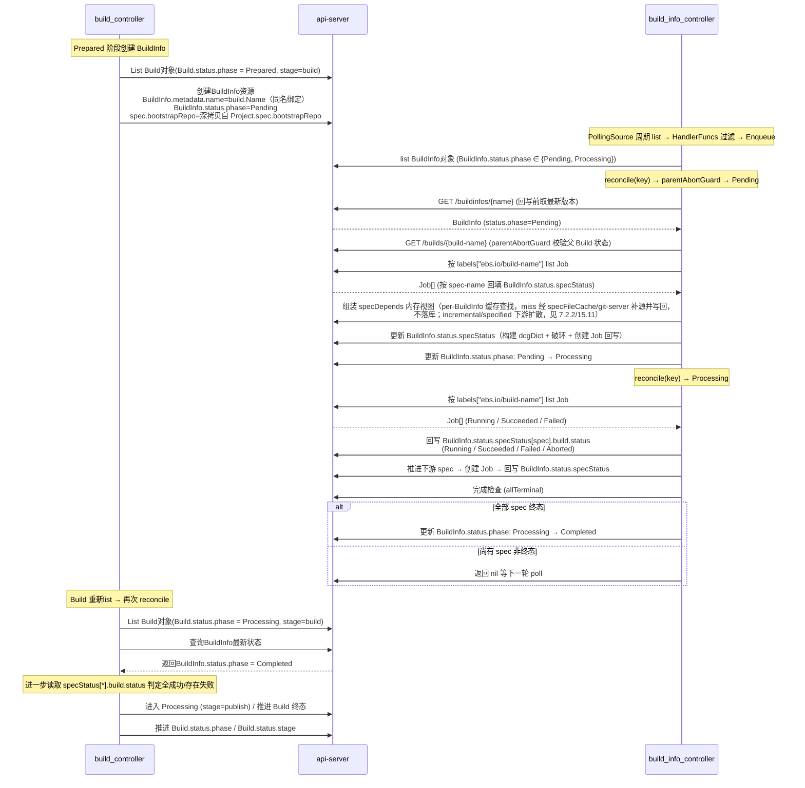
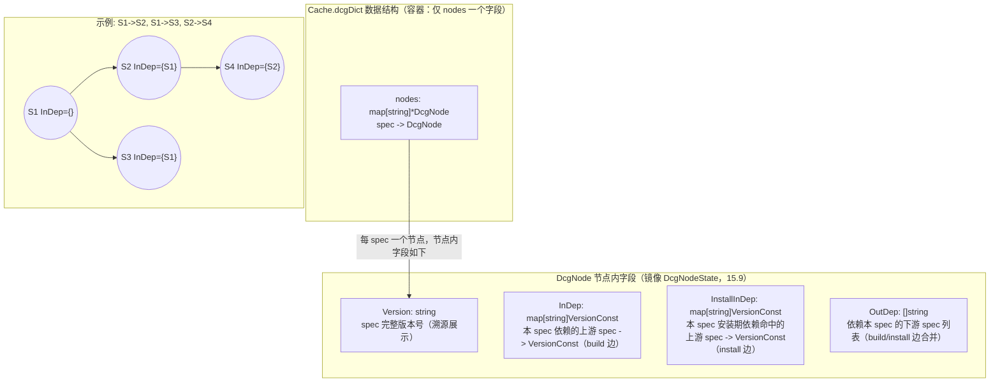

# BuildInfo Controller 设计

## 一、定位与范围

BuildInfo Controller 是 `controller-manager` 中负责 `BuildInfo` 资源生命周期（specDepends 组装 + 构建期破环 + Job 提交 + spec 构建状态汇总）的控制器，与 build_controller、snapshot_controller、rpm_repo_controller 协同工作。框架基线为 [controller-manager.md](controller-manager.md) 与 `components/controller-manager/pkg/` 现有骨架（`source.PollingSource` / `controller.BaseController`）；数据模型基线为 [data-models.md](data-models.md)，与 Go API 类型（`api/ebs/v1/types.go`）的差异以 data-models.md 为准（落地前置见十七章）。

首版职责：

- `PollingSource` 周期 list 全量 `BuildInfo`，事件 Handler 纯内存过滤 `BuildInfo.status.phase ∈ {Pending, Processing}` 后 `Enqueue(key)`；
- `BuildInfo` 资源生命周期推进：`Pending → Processing → Completed`（phase / specStatus / conditions 回写，本控制器是 `BuildInfo.status` 的唯一写入方）；
- 维护 specDepends 内存缓存（`Cache.specDependsCache`：per-BuildInfo，key=`<namespace>/<buildinfo.name>`，存放该 BuildInfo 全部 specDepends，失效/prune 复用 dcgDict 机制，15.11）与全局 spec 文件内容 LRU 缓存（`Cache.specFileCache`：两层 key `commitId`/`specFileName`，15.11），specDepends 不落库（字段已自 `BuildInfoSpec` 移除）；
- 构建并缓存 `Cache.dcgDict`（spec 级依赖图；进程内缓存为加速层，建图结果持久化至 `BuildInfo.status.dcg`，G-02）、环检测与破环点选择（仅 `initBuildInfo` 阶段，G-09）；
- 按依赖拓扑序创建/下发 `Job`（`specStatus[spec].dispatchCount` 门禁控制下发次数，G-03），按 label list Job 回填 specStatus / install 状态；
- 父 Build 处于 `Aborted`（或已删除）时置 BuildInfo 为 `Aborted` 中止终态并保留对象（G-06 / E-03）；
- 所属 Project 处于 `Terminating` 时置 BuildInfo 为 `Aborted` 中止终态并保留对象（Project 级联回收，E-20）；
- 保证状态更新幂等，并在并发更新时以 apiserver 中的最新对象为准；
- 暴露必要的结构化日志和指标。

首版不负责（范围外，归属其他组件）：

| 范围外事项 | 归属组件                |
|-----------|---------------------|
| 创建 `BuildInfo`（`Prepared` 阶段；创建时从 `Project.spec.bootstrapRepo` 深拷贝写入 `spec.bootstrapRepo`，已有 BuildInfo 不覆盖，data-models.md「BuildInfoSpec」）、消费其终态推进 `Build.status.stage` | build-controller    |
| 读写 `Build` 资源（本控制器仅只读查询 `status.phase` / `spec.buildTarget.arch` / `spec.buildType` / `spec.packages`，G-01 禁写） | build-controller    |
| Job 的实际执行（构建、install 校验、install 校验失败时将缺失依赖 JSON 写入 `Job.status.message`，见 7.4.7） | runner              |
| RPM 产物收集与 RpmRepo 状态推进（逐批物化不可变物理版本并推进 `status.repository`、累计已成功消费的 Job UID（`status.repository.sourceJobUIDs`，去重排序、只增不减）——物化与发布语义见 [artifact-manager.md](artifact-manager.md) 9.3.3；本控制器只读消费（发布确认门禁，7.4.6）。同名 RpmRepo 由 build_controller 前置创建并初始化，rpm-repo-controller 不负责创建） | rpm-repo-controller |
| 删除 BuildInfo 时回收关联 Job（仅 label 关联、无 ownerReference，按 label 独立清理，见 8.4） | 独立清理机制              |
| Snapshot 生命周期与 commit 解析（本控制器仅步骤 0 只读消费 `packageRepoStatuses` / `packageRepos`；基准 Snapshot 经基准轮次 Build 同名定位，见 7.2.2） | snapshot-controller |
| leader election（首版单副本部署） | -                   |

依赖的 API 接口统一经本控制器自带的 `components/controller-manager/pkg/controllers/buildinfo/apiserver`（封装 `rest.RESTClient`，禁止裸 `net/http`）访问 ebs-apiserver（GVR 常量复用 `pkg/source`）；完整资源 × client 方法 × HTTP 路径 × 权限矩阵见 15.1（数据契约）。

### 推进的字段

| 字段 | 写入方 | 说明 |
|------|--------|------|
| `BuildInfo.status.phase` | build_info_controller | `Pending` / `Processing` / `Completed`（正常生命周期）/ `Aborted`（中止终态，G-06/E-03/E-20） |
| `BuildInfo.status.specStatus` | build_info_controller | 持续回写 |
| `BuildInfo.status.conditions` | build_info_controller | 状态条件（见 9.1） |
| `BuildInfo.status.dcg` | build_info_controller | dcgDict 建图结果持久化载体（G-02；初始建图成功后、首次基于 DCG 创建 Job 前**单独 PUT /status 落盘一次**；运行期 install 补边（7.4.7）成功后各重落盘一次——无图变更不 PUT（脏检查）；终态后保留不清理；`single` 直通路径**不填充**——整个生命周期保持空，见 7.2.3） |

### 协同关系

- `BuildInfo` 由 `build_controller` 在 `Prepared` 阶段创建，与 Build 同名绑定（`BuildInfo.metadata.name = Build.metadata.name`），不依赖 label 关联。
- `build_info_controller` 不直接读写 `Build` 资源；`build_controller` 通过查询 `BuildInfo.status.phase`（及 `specStatus`）推进 `Build.status.stage`。
- `Job` 由 `build_info_controller` 创建，并通过 `metadata.labels["ebs.io/build-name"]` 关联到 Build，便于按 label 过滤查询。

### 设计原则

| 编号 | 原则 | 说明 |
|------|------|------|
| P-01 | **单一职责** | `build_info_controller` 只负责 `BuildInfo` 资源及其关联 Job 的生命周期，不直接读写 `Build` 资源。 |
| P-02 | **最终一致性** | 通过 PollingSource 周期 list + reconcile 循环驱动状态收敛，不依赖跨组件的强一致通知。 |
| P-03 | **幂等性** | reconcile 必须可重复执行，任何一次执行都不得产生副作用累积（如重复创建 Job）。 |
| P-04 | **声明式意图** | 通过 `metadata.labels`（Job → Build/spec/project）与同名约定（BuildInfo 与 Build 同名）表达资源间关联关系，而非通过外部注册表。 |
| P-05 | **最小权限** | 只读写 `BuildInfo`（含 G-06/E-03/E-20 置 `Aborted` 终态），只读写 `Job`，只读查询 `Build` / `RpmRepo` / `Project` / `Snapshot` / `BuildResource`，不修改任何其他资源。 |
| P-06 | **可观测性优先** | 所有关键路径必须通过 `conditions` 记录决策依据，便于排障（瞬时可重试错误按 9.1 约定可仅结构化日志）。 |
| P-07 | **失败隔离** | 单个 BuildInfo 的处理异常不得影响其他 BuildInfo 的 reconcile（`BaseController` 已带 panic recover；业务错误经返回值隔离）。 |
| P-08 | **退避重试** | 失败操作经 WorkQueue `AddRateLimited` 退避重试，不立即重试导致雪崩。 |
| P-09 | **水平触发优于边沿触发** | reconcile 依据"当前状态 + 期望状态"决定下一步动作，不依赖"事件是否到达"。PollingSource 每轮对同 key 分发 OnUpdate，组件重启后从任意状态都能恢复推进。 |
| P-10 | **乐观并发与冲突延迟重入** | 资源更新采用 resourceVersion 乐观锁；遇到 409 Conflict 时延迟重入（`RequeueAfter: 1s`），下一轮重新 GET 并按最新对象重算目标状态，禁止重放旧请求，不依赖外部锁（见 10.2/10.3）。 |

---

## 二、依赖与组件边界

BuildInfo Controller 运行在现有 `controller-manager` 框架内。

### 2.1 装配与配置

- 队列 key 为 `{BuildInfo.metadata.namespace}/{BuildInfo.metadata.name}`，`BuildInfo.metadata.namespace` 即 Project 名，`BuildInfo.metadata.name` 与父 Build 同名。
- Controller 配置项：轮询周期沿用框架全局 `--poll-period`（默认 30s），worker 数沿用框架全局 `--workers`（默认 2）；本控制器专有配置见 12.1。
- 配置校验时机：所有静态配置（apiserver 地址与 CA、git-server 地址/超时/重试、请求超时）必须在 initializer 阶段完成校验；配置非法时 controller-manager 直接启动失败，不得延迟到单个 BuildInfo 的 reconcile 中处理，也不通过 HealthChecker 表达。镜像映射不再是本地静态配置：创建 Job 时运行期经 apiserver 读取集群级 BuildConf（见 15.3.1/E-26）。

### 2.2 组件依赖与框架接口

建议实现目录：

```
components/controller-manager/
  pkg/
    controllers/buildinfo/         # 本控制器（客户端子包内聚于控制器目录）
      apiserver/                   # 本控制器 apiserver 客户端：typed REST 封装（rest.RESTClient；GVR 常量复用 pkg/source）
        client.go                  # Client 最小接口（15.1 方法清单）+ 实现：Get / ListPage / ListProjectPage / Create / UpdateStatus；响应校验与哨兵错误归一
      gitserver/                   # 本控制器 git-server 客户端：HTTP 封装
        client.go                  # ExecCommand(ctx, cloneURL, command) (string, error)——镜像定位由 git-server 服务端按仓库 key 完成，客户端不持有 storePath
      rpmver/
        rpmrepo.go                 # RpmRepo 消费：两阶段匹配（分层查询）、payload Repo 注入（contentURL）
        rpmcache.go                # RpmMetaSources 内存分层缓存：XML 下载/解析、分层索引（providesInfo/rpmByName）、contentURL 变化刷新、失效清扫复用 dcgDict（15.10）
        rpmver.go                  # VersionSatisfies
      specparse/
        specparse.go               # *.spec 解析为 ebsv1.SpecDepend（规则见 16.3）
      controller.go                # Initializer：注册 PollingSource handler + 构造 BaseController；注入 apiserver / gitserver 客户端与 clock.Clock
      reconcile.go                 # reconcile 入口、parentAbortGuard、错误返回约定
      init.go                      # initBuildInfo（步骤 0~5；含 single 直通分支，见 7.2.3）
      advance.go                   # advanceBuildInfo（含步骤 3.1 install 补边处理）、advanceDownstream；single 简化路径（仅回填 + 完成度检查，见 7.2.3）
      specdcache.go                # Cache.specDependsCache（per-BuildInfo：RWMutex，失效/prune 复用 dcgDict 机制，无 TTL）与 Cache.specFileCache（全局 LRU：commitId/specFileName 两层 key，--specfile-cache-size 上限，15.11）
      specdepends.go               # 步骤 0：specDepends 组装（查 specdcache + miss 补源调度：specFileCache 命中直用/git-server 下载）/构建集判定/下游扩散/上轮失败包并入；single 指定包仓库集直通组装（见 7.2.3）
      dcg.go                       # DcgDict/DcgNode、Kosaraju SCC、SCC 剥离选点、运行期 install 补边（含新环追加破环）、DispatchRequirements
      cache.go                     # dcgDict 缓存（RWMutex + tombstone + sweeper）
      jobs.go                      # createJobForSpec、syncSpecStatusFromJobs、多代 Job 排序、发布确认门禁（RpmRepo.sourceJobUIDs）
      conditions.go                # condition upsert/清除
      metrics.go                   # build_info_controller_* 指标注册
```

> **客户端就地内聚**：apiserver 与 gitserver 客户端均置于本控制器目录内（`controllers/buildinfo/apiserver`、`controllers/buildinfo/gitserver`），不引入跨控制器的共享客户端依赖；两者仅向本控制器暴露最小接口（15.1 方法清单 / `ExecCommand`），其他控制器（如 snapshot_controller）各自持有自己的客户端。
>
> 本控制器仅消费 `ExecCommand`（7.2.2 spec 下载，直接以 `packageRepoStatuses` 的 `cloneUrl` / `commitId` 请求；**不做就绪判定、不发布同步任务**——镜像同步任务发布与新鲜度等待由 snapshot_controller 在 Snapshot 解析期完成，本控制器直接复用其同步完成的本地镜像，接口见 4.2）。新增资源 GVR 常量（`BuildInfosGVR` / `ProjectsGVR` / `RpmReposGVR` / `BuildResourcesGVR`）加入 `pkg/source`（复用已有 `SnapshotsGVR` / `BuildsGVR` / `JobsGVR`）。

依赖与注入：

- `Controller` 持有 `BaseController`（队列/Worker）、`Client`（apiserver）、`GitServerClient`、`clock.Clock` 与配置；
- 构造时注入 `clock.Clock`（`k8s.io/utils/clock`）：生产用 `clock.RealClock{}`，测试用 `k8s.io/utils/clock/testing.FakeClock`；业务代码不得直接调用 `time.Now()` / `time.Since()`（见 9.2）；
- initializer 负责构造 `Client`、注册 `buildinfos` PollingSource handler 并创建 `BaseController`；
- 在 `components/controller-manager/cmd/controller-manager/main.go` 的 `initializers` map 中加入 `buildinfo.Initializer(...)`。

系统定位：

```
build_info_controller
(controller-manager 进程内 Controller，Go)
      │
      │ PollingSource(buildinfos GVR): 周期分页 list 全量 BuildInfo
      │   → snapshot diff 分发 OnAdd/OnUpdate/OnDelete
      │   → ResourceEventHandlerFuncs: 纯内存过滤（phase ∈ Pending/Processing；
      │     Handler 零 apiserver I/O）
      │   → BaseController.Enqueue(<namespace>/<name>)
      │
      │ WorkQueue: client-go RateLimitingInterface（dirty/processing 去重 + 退避）
      │
      │ reconcile(ctx, key):
      │   - parentAbortGuard: Project Terminating → 置 Aborted 终态;
      │     父 Build Aborted/不存在 → 置 Aborted 终态并保留, 否则继续
      │   - Pending     → initBuildInfo()      (构建 dcgDict、破环、提交任务)
      │   - Processing  → advanceBuildInfo()  (按 label list Job → 回写 BuildInfo.status.specStatus → 推进下游 → 完成检查)
      │   - Completed   → 跳过
      │   - else (未知 BuildInfo.status.phase) → 跳过 (记录 error 日志)
      │
      ▼
ebs-apiserver
(REST API)
```

组件数据流：



要点：
- PollingSource 周期 list + diff 分发；HandlerFuncs 纯内存过滤（零 apiserver I/O）后入队。
- reconcile 内 parentAbortGuard 检查父 Build 状态，并按 `labels["ebs.io/build-name"]` list Job。
- client-go workqueue 的 dirty/processing 语义保证同一 key 同时仅一个 worker 处理；处理期间重复入队在完成后重入队一次（E-09）。

### 2.3 PollingSource 装配语义

- 仅注册 buildinfos PollingSource，在 Source 启动前完成 handler 注册；事件处理器只做类型检查和入队，不调用外部 API，不执行状态机。
- Add/Update 均以 `{namespace}/{name}` 入队：先撤销 dcg 缓存 tombstone（若存在），再按 `phase ∈ {Pending, Processing}` 纯内存过滤（终态/Aborted 不入队，G-05）；包括 resourceVersion 未变化的周期 Update，以驱动等待中的 BuildInfo（P-09）。
- Delete 仅对 key 打 dcg 缓存 tombstone（宽限期后由 sweeper 清扫，见 5.4），不入队、不处理删除；过滤结果中消失不等于对象被物理删除，删除中的对象由 reconcile 入口 re-get 404 兜底（E-10）。
- 服务端不使用 fieldSelector：buildinfos 全局 list 仅分页拉取，过滤在 Handler 内存完成（ebs-apiserver 的 fieldSelector 能力仅声明于 build，见十七章）。
- reconcile 不读取 Source 内部快照，始终 GET 最新 BuildInfo；分页扫描、失败退避及快照管理复用公共框架，不在本控制器重复实现。

### 2.4 PollingSource API 交互样例

每轮 scan 只对 `buildinfos` 发起分页全局 List（无 fieldSelector，仅分页）：

```text
GET /apis/ebs/v1/buildinfos?limit=100
```

首轮不发送 continue，后续携带响应中的 `metadata.continue`，直到为空。List 响应结构为 BuildInfoList，items 为完整 BuildInfo 对象；对象字段契约见十五章。

### 2.5 与 build_controller 的协作与跨组件契约



**关键约定：**
- build_controller 对 BuildInfo 的读取分为三步（终态收口 condition 优先于 specStatus 判定）：
  1. 读 `BuildInfo.status.phase`：`Completed` 表示构建阶段流程终结（**不代表成功**）。
  2. 读 `BuildInfo.status.conditions`（终态收口，优先判定）：存在 `ReleaseFailed`（E-28）、`RpmRepoUnavailable`（E-29）或 `SnapshotUnavailable`（E-30）→ **不按 specStatus 判定**（外部收口不要求 allTerminal、不翻转 specStatus，此时 specStatus 可能含非终态条目（`Running`/空串）甚至为空集），父 Build 直接按 BuildInfo 终态收口：`ReleaseFailed` → 经 publish 阶段按 release Failed 收口（build-controller 五章既有路径）；`RpmRepoUnavailable` / `SnapshotUnavailable` → 直接收口 `Failed`（message 透传对应 reason，不进入 publish——构建环境/快照持续不可用，无产物可发布）。存在 `SpecDependsFillFailed`（②指定包语义，E-23/E-24，含 reason=`SpecifiedSpecCommitMissing`（指定包条目不可重试失败/仓库不在 `spec.packageRepos`）与 reason=`SpecifiedBuildSetEmpty` 的空集收口——specified 为 `Build.spec.packages` 为空或全部指定包仓库就绪但均无 `*.spec`（7.2.2）、`single` 为 packages 为空或全部指定包被跳过（7.2.3））且 phase=`Completed` → **init 确定性失败收口**：specStatus 为空，父 Build 直接收口 `Failed`（message 透传 condition reason/message，不进入 publish）。**reason 区分契约**：`SpecDependsFillFailed` 的收口判定按 reason（`SpecifiedSpecCommitMissing`/`SpecifiedBuildSetEmpty` 等 ② 类 reason）而非 type 整体——reason=`SpecParseFailed`（①业务性降级）不构成失败收口，仍按 step 3 specStatus 判定（17.2 联调契约）。
  3. 读 `BuildInfo.status.specStatus[*].build.status`：全部 `Succeeded` → Build 进入成功/发布；任一 `Failed` → Build 进入 `Failed`（或发布时排除失败 spec 的 RPM）；specStatus 为空且无失败收口 condition 时视同全部 Succeeded（空集 vacuous 成功——incremental 无变更等空构建场景）。
  - `Pending` / `Processing` → Build 重新入队等待。
- 中止契约：abort 发起方经 Build 的 `/abort` 子资源请求中止，该请求**同步置 `Build.status.phase=Aborted`**（不等待 BuildInfo）；build_info_controller 的 parentAbortGuard 观察到父 Build `Aborted`（或 404）后置 BuildInfo 为 `Aborted` 中止终态（保留对象）；build_controller 在 abort 流程中确认 BuildInfo 进入 `Aborted` 终态后完成收尾（触发关联 Job 清理等）。Build `/abort` 子资源"立即置终态"的语义为跨组件契约（联调前置），消除"BuildInfo 等 Build 先 Aborted（G-06）而 Build 等 BuildInfo 先 Aborted"的循环等待。**abort 收尾竞态**：若竞态中 BuildInfo 先行进入 `Completed` 终态（G-05 不再入队，parentAbortGuard 不再执行），build_controller 收尾确认按"BuildInfo 已为任意终态（`Aborted`/`Completed`）"放行——Job 清理照常按 label 进行，Build 终态保持 `Aborted`，不因 BuildInfo 为 `Completed` 而阻塞收尾或误改 Build 终态。

---

## 三、强约束

强约束是不可逾越的硬性约束，违反即视为缺陷。

| 编号 | 强约束 | 违反后果 |
|------|------|----------|
| G-01 | **禁止直接写 `Build` 资源**。`build_info_controller` 只能通过 label 查询 Build 的只读状态。 | 状态推进逻辑破坏，build_controller 与本控制器产生写冲突。 |
| G-02 | **dcgDict 建图结果必须持久化至 `BuildInfo.status.dcg`**（单层 `map[string]DcgNodeState`；构建依赖统一校验的输入取自该 BuildInfo 的 specDepends 缓存视图（15.11）的 buildRequires，不依赖 status.dcg）。`DcgCache` 仅为进程内加速层；**落盘必须先于任何基于该图的 Job 创建**（含运行期补边后的重落盘），重启后以 status.dcg 为准加载，不用当时的 RpmRepo/prefer 重建；初始建图结果不随后续变化重建，唯一受控增量为运行期 install 补边（7.4.7）；无图变更不 PUT（脏检查）。三级获取顺序与缓存机制见 5.4。 | 重启后以变化了的 providesInfo/prefer 重建图，边/环/破环点/下发次数门禁发散，幂等性破坏；补边未落盘先下发导致崩溃后图与已创建 Job 不一致。 |
| G-03 | **同一 spec 的 Job 下发次数由 `specStatus[spec].dispatchCount` 严格控制**（SpecStatus 平级字段，data-models.md）。普通 spec 至多下发 1 次；环内所有节点（参与任一环的节点，含自环/多环/交叉环，即 build/install 合并图上原图 SCC>1 全体 ∪ 自环节点，**含运行期补边引入的新环**）需合计 2 次下发（破环点为 bootstrap+重建；非破环节点为正常首次+重建，见 7.2.1）。每次创建前检查 `ss.DispatchCount < 有效 required`（未达下发次数）且当前无进行中的 Job，创建后 `ss.DispatchCount += 1` 并回写新 `jobName`（覆盖）。**失败场景两条放宽（任一直接上游 Failed → 有效 required 降为 1，重建取消；末代重建 Job 失败且存在前代 Succeeded → 以最后一个 Job 为准标 `Failed`，详见 7.4.2）**。install 失败不提升下发次数（补边重发由图语义——新环 required=2——承担，见 7.4.7）。 | 下发次数失控：普通 spec 重复建 Job 泄漏；环内节点漏二次下发导致提前 Completed / livelock（正常路径；失败放宽路径见 7.4.2）。 |
| G-04 | **禁止跨 BuildInfo 共享 Job**。Job 必须通过 `metadata.labels["ebs.io/build-name"]` 绑定到特定 Build。 | 状态归属错误。 |
| G-05 | **禁止在终态（`Completed`）后继续 reconcile**。事件 Handler 必须过滤终态对象（不入队）。 | 无效计算、潜在状态回退。 |
| G-06 | **禁止在父 Build 处于 `Aborted`（或已删除）时继续推进 BuildInfo**。必须置 BuildInfo 为 `Aborted` 中止终态并保留对象（不删除其关联 Job；Job 仅通过 label 关联，由独立机制按 label 清理）。父 Build 的 `Aborted` 由 `/abort` 子资源同步置入（见 2.5 中止契约），本控制器仅为观察跟随方。 | 已中止的构建继续消耗资源。 |
| G-07 | **禁止 reconcile 函数阻塞等待 Job 完成**。状态推进依赖下一轮 poll 触发，不得在 reconcile 内 sleep/poll。 | Worker goroutine 阻塞、吞吐下降。 |
| G-08 | **Job 创建必须同时写入五个 label**：`ebs.io/build-name`、`ebs.io/spec-name`、`ebs.io/package-name`、`ebs.io/target-os`、`ebs.io/target-arch`（os/arch 取 `Build.spec.buildTarget`；package-name 取 spec 所属包仓库名——`Snapshot.spec.packageRepos[].name`，经本轮 `specDepends[specName].repoName`（15.11），值编码规则（63 字符截断 / `sha256-` Base32 摘要形态）见 [labels.md](labels.md) 第 7 节，新建 Job 缺失该归属标签不可创建、值语法由 apiserver 校验）；os/arch 与 [labels.md](labels.md) 第 7 节 / [artifact-manager.md](artifact-manager.md) 9.3.3 契约一致——缺失的 Job 不进入 RpmRepo 物化队列，发布凭据（`sourceJobUIDs` 消费记录）永不到达。 | label 查询失效、状态回写错位；Job 不进物化队列 → 发布确认门禁 livelock；缺失 package-name → Job 创建被拒。 |
| G-09 | **初始破环只发生在 `initBuildInfo` 阶段**。唯一例外为运行期 install 补边引入的新环（按同一选点规则对新出现的环追加破环点，初始已选破环点不重选，见 7.4.7/15.9）；除此之外 `advanceBuildInfo` 阶段不破环，只按依赖推进。 | 状态机混乱、重复破环、初始破环点漂移导致下发次数门禁错乱。 |

---

## 四、类型化客户端与 Fake（在 buildinfo controller 内实现）

框架不新增完整类型化 CRUD；由 buildinfo controller 包自行实现，资源 × 方法 × 路径 × 权限 × 用途的唯一清单见 15.1。

### 4.1 apiserver Client 接口与路径约定

```go
package buildinfo

type Client interface {
    // BuildInfo（主资源）
    GetBuildInfo(ctx context.Context, namespace, name string) (*ebsv1.BuildInfo, error)
    // UpdateBuildInfoStatus 走 /status：写 BuildInfo.status（phase/specStatus/conditions/dcg），
    // apiserver 保留旧 spec；specDepends 不落库，无 PUT spec 场景，不设 PUT 主资源方法
    UpdateBuildInfoStatus(ctx context.Context, obj *ebsv1.BuildInfo) (*ebsv1.BuildInfo, error)

    // Job（创建 + 按 label list 回读 + 创建 Unknown 按 UUID 名 GET 确认）
    CreateJob(ctx context.Context, project string, obj *ebsv1.Job) (*ebsv1.Job, error)
    GetJob(ctx context.Context, project, name string) (*ebsv1.Job, error)
    ListJobs(ctx context.Context, project string, selector labels.Selector) ([]ebsv1.Job, error)

    // 只读依赖
    GetBuild(ctx context.Context, project, name string) (*ebsv1.Build, error)
    // ListBuilds 基准轮次定位：labelSelector ebs.io/target-os=<os>,ebs.io/target-arch=<arch>,ebs.io/build-type!=single
    // + fieldSelector status.phase!=Pending/Prepared/Processing/Aborted/Skipped + limit=1（见 7.2.2）
    ListBuilds(ctx context.Context, project, labelSelector, fieldSelector string, limit int) ([]ebsv1.Build, error)
    GetRpmRepo(ctx context.Context, project, name string) (*ebsv1.RpmRepo, error)
    GetSnapshot(ctx context.Context, project, name string) (*ebsv1.Snapshot, error)
    GetProject(ctx context.Context, project string) (*ebsv1.Project, error)
    GetBuildResource(ctx context.Context, namespace, name string) (*ebsv1.BuildResource, error)
    // BuildConf（集群级 name=default 单例）：Job 创建时的镜像解析来源。
    // 快照语义：一个 Job 创建批次取一次，不得按 Job 重复取、不得用于修改已创建 Job
    GetBuildConf(ctx context.Context) (*ebsv1.BuildConf, error)
}
```

路径约定：

- BuildInfo：`GET /apis/ebs/v1/buildinfos`（全局 list，PollingSource 复用 `ListPage`）；单对象 `GET /apis/ebs/v1/projects/{project}/buildinfos/{name}`；status 写 `PUT /apis/ebs/v1/projects/{project}/buildinfos/{name}/status`；
- Job：创建 `POST /apis/ebs/v1/projects/{project}/jobs`；单对象 `GET /apis/ebs/v1/projects/{project}/jobs/{name}`（创建 Unknown 按生成的 UUID 名确认，10.3/E-11）；list `GET /apis/ebs/v1/projects/{project}/jobs?labelSelector=ebs.io/build-name=<name>`；
- Build：`GET /apis/ebs/v1/projects/{project}/builds/{name}`；基准轮次 list 查询串见 7.2.2「基准轮次定位」；
- RpmRepo / Snapshot：`GET /apis/ebs/v1/projects/{project}/{resource}/{name}`（均与 Build 同名）；
- Project：`GET /apis/ebs/v1/projects/{project}`；
- BuildResource：`GET /apis/ebs/v1/projects/{project}/buildresources/{project}`（404 且 project≠default 时回退 `GET /apis/ebs/v1/projects/default/buildresources/default`）；
- BuildConf：`GET /apis/ebs/v1/buildconfs/default`（集群级资源，无 project 路径段；只读）。`GetBuildConf` 实现委托共享客户端 `pkg/clients/apiserver`（`buildconf.go` 已提供 `GetBuildConf` 与纯函数 `BuildImage(conf, target)`，快照语义注释同上），镜像查表复用 `BuildImage`，不重复实现。

HTTP 实现复用共享 client 的 `Get` / `ListPage` / `ListProjectPage` / `Create` / `UpdateStatus` 等能力；写请求使用对象 `metadata.resourceVersion` 触发乐观锁。

**写错误契约**：`UpdateBuildInfoStatus` 与 `CreateJob` 的失败必须返回可由 `errors.As` 识别的 `WriteError`，Controller 不解析错误文本或底层 HTTP 状态自行推断 Outcome：

```go
var writeErr *apiserver.WriteError
if errors.As(err, &writeErr) {
    outcome := writeErr.Outcome // NotSent / Rejected / Unknown
}
```

- `NotSent`（请求未发出）：按错误原因分类——本地输入/对象类型/序列化等客户端校验错误为 PermanentError；临时网络错误为可重试错误；无法证明是否发送时不得返回 NotSent，必须归为 `Unknown`；
- `Rejected`（收到明确响应）：按 HTTP 状态码分类（7.5），无需确认；
- `Unknown`（无法确认写入结果，如请求发出后连接中断、响应超时或无法解析）：必须先按 10.3 执行确认读取，**不允许重放旧请求**，仅基于最新对象重新计算；
- 读取方法不返回 `WriteError`，但必须保留 `apierrors.IsNotFound` / `IsConflict` / `IsUnauthorized` / `IsForbidden` / `IsTooManyRequests` 判定能力；404 → 哨兵错误 `ErrNotFound`（调用方区分"不存在"与"查询失败"）；5xx/网络 → 普通 error（退避重试）；2xx 但响应为空、解码失败、类型错误或缺少 UID/resourceVersion → 内部临时错误；
- `UpdateBuildInfoStatus` 必须验证成功响应非 nil、UID 与请求对象一致、resourceVersion 非空；任一成功响应异常都包装为 `Unknown`。

### 4.2 git-server 客户端

```go
// GitServerClient 是 BuildInfo Controller 唯一依赖的 git-server 客户端接口。
// HTTP 请求/响应结构和缓存均封装在实现内部，不暴露给 Controller。
type GitServerClient interface {
    // ExecCommand 在已就绪的本地镜像上执行只读 git 命令，返回 stdout。
    // 镜像定位由 git-server 服务端按仓库 key 完成，客户端不持有 storePath。
    ExecCommand(ctx context.Context, cloneURL, command string) (string, error)
}
```

- 本控制器仅消费 `ExecCommand`（7.2.2 spec 下载：`git ls-tree --name-only <commitId>` 枚举仓库根目录 spec 文件、`git show <commitId>:<path>` 读取内容），直接以 `packageRepoStatuses` 的 `cloneUrl` / `commitId` 请求；
- **不做就绪判定、不发布同步任务**：镜像同步任务发布与新鲜度等待由 snapshot_controller 在 Snapshot 解析期完成，本控制器直接复用其同步完成的本地镜像；`cloneUrl` 为 snapshot_controller 同步确认后填写的只读镜像地址，本控制器无输入校验概念；
- 请求错误按性质二分（与 E-23 对齐）：网络/超时/5xx 类瞬态失败 → 该仓库本轮不进组装结果、组装不完整保持 Pending，下轮重入重新组装（7.2.2）；git 内容缺失（`commitId` 非法、spec 文件路径不存在）或 spec 解析失败类确定性失败 → 按 E-23 按仓库角色分流（非指定包仓库与 `single` 各指定包仓库均单 spec 粒度跳过；`specified` 指定包仓库 init 确定性失败）；客户端内部固定重试（`--git-server-retry`，默认 3）耗尽后只返回一次最终错误；
- 配置：`--git-server-addr` / `--git-server-timeout` / `--git-server-retry`（见 12.1）。

### 4.3 Fake

`fake_test.go` 中的包内 fake 实现同一 `Client` 接口，不作为生产代码或独立子 package；内部用内存 map 保存对象，并模拟：

- NotFound；
- 409 Conflict（旧 resourceVersion 写返回 409）与 AlreadyExists（同名重复 CreateJob 返回 409，极罕见）；
- resourceVersion 自增；
- `/status` 保留旧 spec；
- `WriteError` 三分类注入（NotSent / Rejected / Unknown），Unknown 后按确认读取返回当前持久化对象（`GetJob` 按名返回已持久化 Job 或 NotFound）；
- `ListJobs` 按 `ebs.io/build-name` / `ebs.io/spec-name` label 过滤；
- `ListBuilds` 按 labelSelector/fieldSelector 过滤与 `creationTimestamp` 降序 `limit` 截断；
- `GetBuildConf` 返回注入的 BuildConf（支持映射缺失与查询失败两种注入，供 E-26 用例）。

---

## 五、事件与本地索引

### 5.1 队列键

工作队列键统一为：

```text
{namespace}/{name}
```

BuildInfo 与父 Build 同名、namespace 即 Project。UID 不编码在字符串键中；reconcile 入口经 `client.GetBuildInfo` 重新 GET 最新对象（7.1），写入前携带 resourceVersion 乐观锁（10.2），防止同名 BuildInfo 删除重建后旧周期更新新对象。

### 5.2 BuildInfo 事件（PollingSource）

- `Add` / `Update`：先撤销 dcg 缓存 tombstone（若存在，见 5.4），再按 `phase ∈ {Pending, Processing}` 纯内存过滤入队；终态（`Completed`）与 `Aborted` 不入队（G-05）；不比较新旧 `resourceVersion`——PollingSource 每轮扫描都会产生 Update，同一 resourceVersion 的 Update 也必须入队，作为丢事件、慢速重试和外部依赖恢复后的 resync 兜底；工作队列负责合并同一 key。
- `Delete`：仅对 key 打 dcg 缓存 tombstone（宽限期后由 sweeper 清扫，见 5.4），不入队、不处理删除；过滤结果中消失不等于对象被物理删除，删除中的对象由 reconcile 入口 re-get 404 兜底（E-10）。

事件处理器只做类型检查和入队，零 apiserver I/O、不执行状态机。服务端不使用 fieldSelector：buildinfos 全局 list 仅分页拉取，过滤在 Handler 内存完成（ebs-apiserver 的 fieldSelector 能力仅声明于 build，见十七章）。

### 5.3 周期性重同步

PollingSource 默认每 30s（`--poll-period`）轮询一次，作为丢事件、慢速重试与进程重启后的恢复兜底；等待类分支（发布确认未兑现、补边待数据源等）统一返回零值 + nil，依赖周期 OnUpdate 重驱动（P-09）。

### 5.4 本地缓存

> **Cache.dcgDict 说明**：`Cache.dcgDict` 是 build_info_controller **进程内加速缓存**，Go 实现为 `map[string]*DcgDict`，以 `<namespace>/<build.name>` 为 key 缓存于 controller 进程内，`sync.RWMutex` 保护临界区，建图（含 apiserver I/O）在锁外执行。**三级获取顺序**（G-02）：① 进程内缓存命中 → 直接复用；② 缓存 miss 且 `BuildInfo.status.dcg` 存在 → 从 status.dcg 加载（`DcgDictFromState`）并写入进程内缓存——**无需 RpmRepo 就绪**：`cycleNodes` 为边集确定性纯函数，加载后惰性重算（含运行期补边引入的新环）；`bootstrapBreaks` 直读 `DcgNodeState.BootstrapBreak` 持久化标记，**不重选**（全图重选会漂移已下发的初始破环点，G-02）；③ 缓存 miss 且 status.dcg 不存在 → 按 7.2.2 构建集判定规则从本轮持有的 specDepends（15.11 缓存视图）筛选构建集后（经 RpmRepo 上下文与 BuildInfo.spec.buildPayload 的 prefer，16.1）重建，**先将建图结果（`ToState()`，含 bootstrapBreak 标记）写入 status.dcg 单独 PUT /status 落盘，成功后才写入进程内缓存并基于该图创建 Job**——落盘必须先于任何基于该图的 Job 创建（消除"建图→Job 创建→落盘"之间的崩溃窗口）；落盘失败记日志、返回等下一轮，不得拿未持久化的图下发 Job（不写 `DcgBuildFailed` condition）。**初始建图冻结、受控增量例外**：初始建图结果不随后续 RpmRepo/prefer 变化重建；唯一受控增量为运行期 install 补边（7.4.7）——补边（含新环追加破环点）后必须重新 ToState() PUT /status 落盘，落盘成功后才基于新图推进下发（不变量保持），无图变更不 PUT（脏检查）。BuildInfo 进入 Completed、被删除或父 Build 中止（置 `Aborted` 终态）时进程内缓存失效；终态/Aborted 后 status.dcg 残留保留，与 specStatus 保留语义一致，便于溯源。schema 与持久化契约见 15.9。
>
> **失效与 prune（Go/PollingSource 形态）**：① reconcile 内观察到终态或 re-get 404 → 立即失效；② `OnDelete` 事件 → 对 key 打 tombstone（删除时间戳），**不立即清除**——apiserver 异常降级返回 200 + 空 items 时 PollingSource 会对全部 key 分发 OnDelete，立即清除会引发重建风暴；宽限期 `dcgCachePruneGrace`（默认 3×pollPeriod）内对象重现（OnAdd/OnUpdate）则撤销 tombstone，超时由 sweeper goroutine（或事件处理惰性触发）清除，收敛对象最终删除后的缓存残留。
>
> **Cache.rpmMetaSources 说明**：RpmMeta 内存分层缓存（15.10）与 `Cache.dcgDict` 同构——key 同为 `<namespace>/<buildinfo.name>`，失效（终态/删除）与 tombstone 清扫规则**完整复用** dcgDict 机制（上段），无独立生命周期管理；纯内存加速层、不写 status（无持久化载体，区别于 dcgDict 的 status.dcg 落盘）。分层结构、XML 下载解析与刷新触发器见 15.10。
>
> **Cache.specDependsCache / Cache.specFileCache 说明**：specDepends 内存缓存（15.11）为 **per-BuildInfo 生命周期**——key 为 `<namespace>/<buildinfo.name>`（与 dcgDict/rpmMetaSources 同构），存放该 BuildInfo 的**全部 specDepends**（BuildInfo 级全量视图）：Pending/initBuildInfo 步骤 0 每轮重新组装并覆盖写回（Pending 重入不消费缓存命中——瞬态失败仓库下轮重试），进入 Processing 后命中直接复用、不再重组装；进程重启后缓存丢失，首个到达轮按 Snapshot 各仓库 url+commit 重组装回填（解析结果确定，内容与首次一致；完整语义（条目就绪不变式、瞬态失败阻断推进）见 7.2.2/15.11）。失效（终态/re-get 404）与 tombstone 清扫规则**完整复用** dcgDict 机制（上段），无 TTL、无过期时间。`BuildInfo.spec.specDepends` 字段已删除（data-models.md 同步）：specDepends 不落库（无 PUT spec、无持久化载体），纯内存加速层、不写 status。spec 文件原始内容另存于**全局** `Cache.specFileCache`（15.11）——两层 key（第一层 `<commitId>`、第二层 `<specFileName>`，与 `SpecDepend.specFileName` 对齐），LRU 容量上限 `--specfile-cache-size`（默认 10000），跨 BuildInfo / 跨 Snapshot / 跨 Project 全局共享、**不随 BuildInfo 终态失效**（条目生命周期仅由 LRU 淘汰驱动）；组装 specDepends 需解析 spec 文件时先查该缓存，miss 经 git-server `git show` 下载后写入，相同 commit 不重复下载。条目结构与组装流程见 15.11。
>
> **Cache.rpmRepoReadyFailures 说明**：RpmRepo 就绪性**连续失败计数器**（E-29）——`sync.RWMutex` 保护的 `map[string]rpmRepoReadyState`，key 为 `<namespace>/<buildinfo.name>`（与 dcgDict 同构），条目含 `ConsecutiveFails`（连续失败次数）、`LastReason`/`LastMessage`（最后失败分类与摘要，收口时写 condition）。四类递增点（守卫 GET 404/5xx、RpmRepo 层 XML 下载/解析失败、bootstrap 层 XML 下载/解析失败）统一经 `recordRpmRepoFailure(key, reason, message)` 递增；**每轮 reconcile 至多递增一次**——一轮内多个检查点失败时，以**首个失败检查点**递增并记录其分类，后续检查点本轮不再重复递增（"连续 N 次"语义为连续 N 个调谐轮次，见 7.1/E-29）；递增后达 `--rpmrepo-ready-retry-limit`（默认 3）触发 E-29 升级收口；本轮就绪性检查整体通过则清零（瞬时失败自愈不升级）。生命周期：BuildInfo 终态（含 E-29 收口自身）/删除时清除（随 dcgDict 失效时机，无 tombstone 宽限需求——纯计数器，误清仅导致重新计数）；**进程重启归零重新计数**（可接受：重启后多等 N 轮）。纯内存、不落库、无 TTL。升级收口流程与判定细则见 E-29。
>
> **Cache.snapshotReadyFailures 说明**：当前 Snapshot 查询**连续失败计数器**（E-30）——与 `rpmRepoReadyFailures` 同构：`sync.RWMutex` 保护的 `map[string]snapshotReadyState`，key 为 `<namespace>/<buildinfo.name>`（与 dcgDict 同构），条目含 `ConsecutiveFails`（连续失败次数）、`LastReason`/`LastMessage`（最后失败分类与摘要，收口时写 condition）。覆盖点为**当前 Snapshot**（与本 Build 同名）的 GET 失败（5xx/超时/404）：Pending 步骤 0a（7.2）与 Processing 步骤 2.2（7.3）两处，统一经 `recordSnapshotFailure(key, reason, message)` 递增（reason=`SnapshotNotFound`（404）/`SnapshotQueryFailed`（5xx/超时））；**每轮 reconcile 至多递增一次**（同上粒度约定，"连续 N 次"= 连续 N 个调谐轮次）；递增后达 `--snapshot-ready-retry-limit`（默认 3，12.1）触发 E-30 升级收口；本轮当前 Snapshot GET 成功则清零（瞬时失败自愈不升级）；**基准** Snapshot 查询失败不落入本计数器（仍走 E-22 error 退避——基准缺失非致命，首轮构建为正常场景）。生命周期与 `rpmRepoReadyFailures` 完全一致：BuildInfo 终态（含 E-30 收口自身）/删除时清除、进程重启归零重新计数、纯内存不落库无 TTL。升级收口流程与判定细则见 E-30。

---

## 六、状态机

### 6.1 BuildInfo phase 状态机

`BuildInfo.status.phase` 取值 `Pending` / `Processing` / `Completed` / `Aborted`（`Aborted` 为中止终态，由 reconcile 阶段 parentAbortGuard 置入，见 G-06/E-03/E-20；枚举需在 data-models.md 补入，见十七章），本控制器推进：

```
              build_controller 在 Prepared 阶段创建 BuildInfo
                              ↓
                        ┌─────────┐
                        │ Pending │  ← 初始态，待提交任务
                        └────┬────┘
                             │
                             │  构建 dcgDict、破环、提交 job
                             ▼
                       ┌────────────┐
                       │ Processing │
                       └────┬───────┘
                            │
                            │  按 labels["ebs.io/build-name"] list Job → 回写 BuildInfo.status.specStatus
                            │  推进下游 → 创建 Job
                            │  全部终态（Succeeded/Failed）
                            ▼
                       ┌───────────┐
                       │ Completed │  ← 终态
                       └───────────┘

中止路径: 任意 phase 下，父 Build Aborted/不存在 → reconcile 阶段 parentAbortGuard 置 BuildInfo 为 Aborted 终态（保留对象）
级联路径: 任意 phase 下，Project Terminating → reconcile 阶段 parentAbortGuard 置 BuildInfo 为 Aborted 终态（保留对象）
init 确定性失败路径: Pending 下（initBuildInfo 步骤 0），`specified` 指定包仓库确定性失败（E-23 spec 下载解析失败、E-24 条目不可重试失败或不在 `spec.packageRepos`）或构建集为空（reason=`SpecifiedBuildSetEmpty`：`Build.spec.packages` 为空、或全部指定包仓库就绪但均无 `*.spec`，见 7.2.2「specified 空集收口」），或 `single` 的 packages 为空 / 指定包全部被跳过后构建集为空（reason=`SpecifiedBuildSetEmpty`，7.2.3——single 单仓/单 spec 确定性失败均按包降级跳过）→ 收口 `Completed` 终态（condition `SpecDependsFillFailed`；确定性失败收口非完成度收口，specStatus 保持空、不预建不翻转，不要求 allTerminal——父 Build 由 build_controller 按 condition 优先收口 Failed（2.5 关键约定 step 2，不依赖空 map 判定））
发布失败路径: Pending/Processing 下，本轮同名 RpmRepo `status.release.phase=Failed` → reconcile 阶段 releaseFailedGuard 置 BuildInfo 为 `Completed` 终态（condition `ReleaseFailed`；外部稳定终态信号，不要求 allTerminal、不翻转 specStatus，见 7.1/E-28）
就绪性升级路径: Pending/Processing 下，RpmRepo 就绪性连续失败达阈值（非 single）→ 收口 `Completed` 终态（condition `RpmRepoUnavailable`；外部环境持续不可用，不要求 allTerminal、不翻转 specStatus，见 E-29）
快照不可用升级路径: Pending/Processing 下，当前 Snapshot（与本 Build 同名）查询连续失败达阈值 → 收口 `Completed` 终态（condition `SnapshotUnavailable`；外部环境持续不可用，不要求 allTerminal、不翻转 specStatus、已下发 Job 不中止不回收，见 E-30）
```

推进路径 `Pending → Processing → Completed` 单向，**禁止回退**；`Completed` 与 `Aborted` 均为终态，HandlerFuncs 不放行，不再入队（G-05）。

### 6.2 SpecStatus.build 状态机

`BuildInfo.status.specStatus[spec].build.status` 取值：`""`（空，未下发——init 步骤 5 预建初始值，见 7.2 步骤 5）/ `Running` / `Succeeded` / `Failed` / `Aborted`（历史版本 Job phase 透传残留值，v1 起不再写入——Job 单独 `Aborted` 防御性视同 `Failed`，7.4.5；父 Build `Aborted` 时 BuildInfo 由 parentAbortGuard 先行收口，不进入回填；防御性读取到残留值的处理见 6.4），本控制器推进，内嵌于 `BuildInfo.status.specStatus`：

```
   （初始）"" ──创建 Job──→ ┌──────────┐
        │                ┌──│ Running  │────┐
        │                │  └──────────┘    │
        │ 下发前裁决       │ Job=Succeeded    │ Job=Failed
        │ （依赖缺失/      │                  │
        │  E-19/E-27）    ▼                  ▼
        │           ┌───────────┐     ┌────────┐
        └─────────→ │ Succeeded │     │ Failed │
                    └───────────┘     └────────┘
                    ↑ 终态              ↑ 终态

  Aborted（图外，非 v1 可达态）：历史版本 Job phase=Aborted 直接透传写入；v1 起
  正常中止路径由 parentAbortGuard 先行收口 BuildInfo（不进入回填）、Job 单独
  Aborted 防御性视同 Failed（7.4.5），均不写入本值；防御性读取到残留值按 6.4
  返回 nil 等守卫收口
```

| 状态 | 说明 |
|------|------|
| `""`（空） | 初始态：init 步骤 5 为构建集全部 spec 预建条目的初始值（尚未创建 Job、未标 Failed）；创建 Job 后置 `Running`，或经失败裁决（依赖缺失/架构不支持等）直接置 `Failed`；**非终态**（allTerminal 不计完成，见 6.4） |
| `Running` | spec 正在构建 |
| `Succeeded` | 终态，Job 成功 |
| `Failed` | 终态，Job 失败（末代重建 Job 失败同样标 `Failed`——spec 状态以最后一个 Job 为准，仅 condition 以 `RebuildFailed` 区分，见 7.4.2/7.4.5），或下发前裁决未通过：依赖存在性裁决（7.4.1 条件 2 / 7.4.6 第 3 条 bootstrap 路径）、创建 Job 前的确定性校验（E-19/E-27）——均不提交 Job 直接标 `Failed`，自判非传播（E-17）；E-26 BuildConf 读取失败/映射缺失为本轮暂停（不创建新 Job、不标 Failed，返回 error 按 7.5 标准退避分流等待配置恢复，见 E-26）；亦含 Job 单独 `Aborted` 的防御性视同 `Failed`（7.4.5 映射，condition 保留 `BuildAborted` 溯源） |
| `Aborted` | 历史版本 Job phase=Aborted 直接透传写入的状态值，v1 起不再产生：父 Build `Aborted`/不存在时 BuildInfo 由 parentAbortGuard **先行**收口为 `Aborted` 终态（保留对象，G-06/E-03），不进入回填；Job 单独 `Aborted`（父 Build 正常）经 7.4.5 映射**防御性视同 `Failed`**（异常溯源 condition `BuildAborted`，message 注明"防御性视同 Failed：父 Build 非 Aborted"）；防御性读取到本值（历史脏数据/竞态残留）按 6.4 处理——本轮返回 nil 等下一轮 parentAbortGuard 收口，不参与 allTerminal 终态集合 |

### 6.3 SpecStatus.install 状态机

`specStatus[spec].install.status` 取值 `""`（空，未回填）/ `Succeeded` / `Failed`；以最新一代 Job 为准**双向覆盖**（`Succeeded ↔ Failed`），新 Job 未终态前保留旧值；install.status 不参与 `allTerminal` 完成度判定（回填规则与三分支表见 7.4.7）：

```
                    （初始）""
                       │
         目标 Job 终态（phase=Succeeded）判定 message
                       │
         ┌─────────────┴─────────────┐
         ▼                           ▼
   ┌───────────┐               ┌──────────┐
   │ Succeeded │               │  Failed  │
   └───────────┘               └──────────┘
         ▲                           │
         └────────────┬──────────────┘
                      │ 重建 Job 终态（Succeeded）后按新一代 message 覆盖（双向可迁移）；
                      │ 新 Job 未终态前保留旧值（自保持）
```

### 6.4 全部终态判定

"全部终态"（allTerminal）的精确判断：

```go
allTerminal := true
required := dcg.DispatchRequirements() // map[string]int64，环内节点 2，默认 1
for spec, ss := range buildInfo.Status.SpecStatus {
    if ss.Build.Status != StatusSucceeded && ss.Build.Status != StatusFailed {
        allTerminal = false
        break
    }
    req := required[spec]
    if req == 0 {
        req = 1
    }
    if ss.Build.Status == StatusSucceeded && ss.DispatchCount < effectiveRequired(spec, req) {
        allTerminal = false
        break
    }
}
// effectiveRequired(spec, req)：任一直接上游（inDep ∪ installInDep）Failed → 1（重建取消，v1 即终，见 7.4.2）；
//   否则 req（环内 2 / 普通 1）
```

即：所有 spec 均进入终态（`Succeeded`/`Failed`），**且**每个 `Succeeded` spec 的 `DispatchCount` 达到其**有效 required**（环内节点需 2，普通 spec 需 1；任一直接上游 Failed 时有效 required=1，重建取消）。仅靠 status 终态无法判定整体完成——环内节点 bootstrap/首次下发后 status 已 `Succeeded`，若据此提前 `Completed` 将导致第二次下发（重建）永不发生；补边引入新环的节点（required 升 2）未达次数时同样由上述 `DispatchCount` 检查与终态检查天然覆盖，不会提前 `Completed`。`single` 类型无 dcgDict，全部 spec 有效 required 恒按 1 判定（见 7.2.3）。

**遍历基准的正确性由 init 步骤 5 预建保证**：构建集非空的 BuildInfo 在进入 Processing 前已为构建集全部 spec 预建 `SpecStatus` 条目（`build.status=""`，7.2 步骤 5），specStatus 键集即构建集——被发布确认/重建一致性等门禁跳过而尚未下发的 spec 同样有条目，其空串 status 天然非终态，**不会因"无条目"漏判而提前 `Completed`**；空构建集在 init 步骤 5 已直接 `Completed`，不经本判定。

- `Failed` 属终态，不再等待重建次数（上游 Failed 且产物不可用自判失败、或外部依赖缺失的 spec 无需 Job）。
- Job 的 `Aborted` phase **不经 6.2 状态机持久化为 `Aborted` 状态值**：正常路径下 Job 被 `Aborted` 意味着父 Build 已 `Aborted`（或已删除），BuildInfo 会在 **reconcile 阶段被 parentAbortGuard 先行置为 `Aborted` 中止终态并保留对象**（G-06 / E-03），不进入回填与完成度判定；**防御分支**——回填时目标 Job `phase=Aborted` 而同轮 parentAbortGuard 已确认父 Build 非 `Aborted` 且存在（Job 单独 Aborted，异常事件），按 7.4.5 映射防御性视同 `Failed` 终态（condition 保留 `BuildAborted` 溯源）——两路均不产生"specStatus 条目停留 `Aborted`"的中间态，allTerminal 判定无需处理该值。
- 若因竞态在 reconcile 内读到残留 `Aborted` 状态值（父 Build 已中止但 BuildInfo 尚未置终态的历史脏数据），本轮直接返回 nil，等待下一轮 reconcile 的 parentAbortGuard 置 `Aborted` 终态，不做额外处理。
- 发布失败守卫（7.1/E-28）的提前 `Completed` **不经本判定**：`release.phase=Failed` 为外部稳定终态信号（E-28），specStatus 各条目保持观测原样（未终态 spec 不翻转、不等待），构建流程就此收口。

---

## 七、Reconcile 流程

### 7.1 主流程

```
BuildInfoController:
    │
    ├─ PollingSource: 周期 list 全量 BuildInfo → diff 分发 OnAdd/OnUpdate/OnDelete
    │
    ├─ HandlerFuncs（纯内存，零 apiserver I/O）:
    │     ├─ OnAdd/OnUpdate 先撤销 dcg 缓存 tombstone（若存在），再按 phase 过滤入队 phase ∈ {Pending, Processing}
    │     │     → Enqueue(key)
    │     └─ OnDelete: dcg 缓存打 tombstone（宽限期后清扫，见 5.4）
    │
    └─ reconcile(ctx, key)（BaseController sync）:
          │
          ├─ client.GetBuildInfo 重新 get 最新 BuildInfo（回写前取最新版本, 乐观锁基础）:
          │     └─ 404（已被外部删除）→ 记录日志 + 失效 dcgDict 缓存，返回 nil 静默退出 (E-10)
          │
          ├─ parentAbortGuard 前置守卫:
          │     ├─ client.GetProject（BuildInfo.metadata.namespace）:
          │     │     ├─ 查询失败（5xx）→ 返回 error 退避重试；不存在（404）→ 记录日志，返回 nil（404 不触发置终态，E-21）
          │     │     └─ Project = Terminating            → 置 Aborted 终态 + 失效 dcgDict 缓存（Project 级联回收, E-20）
          │     ├─ client.GetBuild（BuildInfo.metadata.name，与父 Build 同名）:
          │     │     ├─ 父 Build 查询失败（apiserver 错误）→ 返回 error 退避重试
          │     │     ├─ 父 Build 不存在（404，已删除）      → 视同中止，置 Aborted 终态 + 失效 dcgDict 缓存 (E-03)
          │     │     ├─ 父 Build = Aborted        → 置 Aborted 终态 + 失效 dcgDict 缓存 (G-06)
          │     │     └─ 父 Build 正常                      → 继续
          │
          ├─ releaseFailedGuard 发布失败守卫（parentAbortGuard 之后、phase 分派之前，每轮执行；
          │     `single` 豁免——rpm-repo-controller 对 single 不发布，release 恒非 Failed，
          │     见 7.2.3；buildType 复用 parentAbortGuard 同轮持有的父 Build
          │     对象，无额外查询）:
          │     client.GetRpmRepo（与 Build 同名，结果为本轮持有对象，供 init 步骤 0
          │     扩散反查/步骤 2、advance 步骤 2.2 复用，不重复 GET，见 15.4）:
          │     ├─ 查询失败（5xx/超时）→ 计入 RpmRepo 就绪性连续失败计数（E-08/E-29，
          │     │     reason=RpmRepoQueryFailed，计数器见 5.4；退避重入轮的失败持续累计）：
          │     │     达阈值（--rpmrepo-ready-retry-limit，默认 3）→ 按 E-29 收口终态；
          │     │     未达阈值 → 返回 error 退避重试（7.5 既有分类）
          │     ├─ 不存在（404）→ 计入连续失败计数（reason=RpmRepoNotFound）：达阈值 →
          │     │     按 E-29 收口终态；未达阈值 → 记录日志（RpmRepoNotFound 瞬时事件），
          │     │     本轮不持有 RpmRepo、**流程继续**（非整轮返回——区别于 5xx 的
          │     │     error 整轮退出），各消费点按"未持有"分支处理（首次建图不进行、
          │     │     扩散反查数据源为空等价无扩散、依赖裁决待定跳过、install 补边
          │     │     不补，各消费点明细见 E-16），等待下一轮
          │     └─ status.release.phase = Failed → 置 BuildInfo 为 Completed 终态
          │           （condition ReleaseFailed，reason=RpmRepoReleaseFailed，message 记录
          │           RpmRepo 名与 release.phase=Failed）+ 失效 dcgDict 缓存，返回 nil；
          │           specStatus 保持原样（不翻转未终态 spec、不要求 allTerminal——外部终态
          │           信号非构建完成度收口，见 6.4/E-28）；已下发 Job 不中止不回收（产物物化与
          │           sourceJobUIDs 消费记录由 rpm-repo-controller 照常进行）；父 Build 经
          │           build_controller 观测 BuildInfo Completed 后进入 publish 阶段、按 release
          │           Failed 收口为 Failed/publish（build-controller 五章）；终态写入失败 →
          │           返回 error 退避重试，下轮守卫重查重写（幂等）
          │
          ├─ （守卫与 init/advance 各 RpmRepo 就绪性检查点共用的计数升级机制，E-29）：
          │     recordRpmRepoFailure(key, reason, message) 递增 Cache.rpmRepoReadyFailures
          │     （5.4，per-BuildInfo 进程内存）——**每轮 reconcile 至多递增一次**：
          │     一轮内多个检查点（守卫 GET、RpmRepo 层 XML、bootstrap 层 XML）失败时，
          │     以首个失败检查点递增并记录其分类，后续检查点本轮不再重复递增
          │     （"连续 N 次"语义为连续 N 个调谐轮次）；递增后 ConsecutiveFails >=
          │     --rpmrepo-ready-retry-limit（默认 3）→ 本轮立即收口：打印 error 日志 +
          │     condition RpmRepoUnavailable（reason 取最后失败分类，message 记录 RpmRepo 名、
          │     连续失败次数与最后错误摘要）+ 置 Completed 终态 + 失效 dcgDict 缓存 +
          │     清除计数条目，返回 nil；specStatus 保持原样不翻转、已下发 Job 不中止不回收
          │     （对齐 E-28 模式，见 6.4/E-29）；终态写入失败 → 返回 error 退避重试，下轮
          │     重新触发收口重写（幂等）；本轮就绪性检查整体通过（GET 成功且 RpmRepo 层 XML
          │     就绪或 contentURL 空态、bootstrap 层就绪或已缓存）→ 计数清零；`single` 豁免
          │
          ├─ 判断 BuildInfo.status.phase:
          │   ├─ "Pending"     → initBuildInfo()   (组装 specDepends（per-BuildInfo 缓存 + specFileCache/git-server 补源，15.11）、判定构建集、构建 dcgDict、破环、提交任务；single 走直通路径：指定包仓库集直组装 + 全量直接下发（无下发顺序），不建图不破环，见 7.2.3)
          │   ├─ "Processing"  → advanceBuildInfo() (回写 BuildInfo.status.specStatus + 推进下游 + 完成检查)
          │   ├─ "Completed"   → 返回 nil (终态, 防御性检查 G-05, 失效 dcgDict 缓存)
          │   ├─ "Aborted"     → 返回 nil (中止终态, 防御性检查, 失效 dcgDict 缓存)
          │   └─ else (未知 phase) → 返回 nil (记录 error 日志)
          │
          ▼
ebs-apiserver (REST API)
```

> **错误返回约定**：业务 `Sync` 返回 `(ReconcileResult, error)`。「零值 `ReconcileResult{}` + `nil`（= 等下一轮）」「`error`（快速退避，达 `maxRetries` 转慢速退避）」「`controller.NewPermanentError(err)`（不重试、不屏蔽 key）」的语义与"保持 Pending / 等下一轮"落地规则，以 7.5 引言为唯一权威；流程图中的"返回 nil"即零值 `ReconcileResult{}` 的简写。写入冲突与写入结果未知的处理分别见 10.2/10.3。

### 7.2 初始化详细流程（Pending → Processing）

```
initBuildInfo(ctx, buildInfo)  [BuildInfo.status.phase=Pending]
    │
    ├─ 0. 组装全量 specDepends（内存视图，不落库）并判定构建集（组装机制见 7.2.2/15.11，single 直通组装见 7.2.3；
    │     specDepends 视图缓存于 per-BuildInfo 内存缓存
    │     （Pending 每轮重新组装覆盖写回、Processing 命中复用，重启后重组装
    │      内容一致，15.11），不落库、无 PUT spec）:
    │     ├─ 0a 前置读取（每轮幂等重算的基础，P-09）:
    │     │   ├─ 父 Build 只读 spec.buildType / spec.packages（G-01 禁写不变）
    │     │   ├─ 本 BuildInfo 自身 spec.bootstrapRepo（Job payload 注入 Repo 的来源之一；
    │     │   │   build_controller 创建时从 Project.spec.bootstrapRepo 深拷贝，本控制器只读）
    │     │   ├─ 当前 Snapshot（与本 Build 同名，同名约定见 7.2.2）：spec.packageRepos
    │     │   │   （仅作 specified/single 指定包仓库存在性判定，15.7）/
    │     │   │   status.packageRepoStatuses（各包解析状态 cloneUrl/commitId/error，亦为
    │     │   │   specDepends 组装的 git-server 补源定位参数（commitId 兼为 specFileCache
    │     │   │   第一层 key）来源，15.11；
    │     │   │   Snapshot 必为 Active——由 build_controller 的 Prepared 门禁
    │     │   │   保证：快照未就绪不会创建 BuildInfo，不重复校验；
    │     │   │   GET 失败（5xx/超时/404）→ 计入当前 Snapshot 连续失败计数
    │     │   │   （`Cache.snapshotReadyFailures`，5.4，E-30，reason=
    │     │   │   `SnapshotQueryFailed`/`SnapshotNotFound`）：达阈值
    │     │   │   （--snapshot-ready-retry-limit，默认 3）→ 按 E-30 收口终态；
    │     │   │   未达阈值 → 返回 error 退避重试（不写 condition）；
    │     │   │   本轮 GET 成功 → 计数清零）
    │     │   ├─ 基准轮次 Build + 基准 Snapshot + 基准 BuildInfo（full/incremental/specified，
    │     │   │   统称基准轮次定位；list 查询语义与不自命中理由见 7.2.2「基准轮次定位」——
    │     │   │   基准 Snapshot（与基准 Build 同名 get）的 packageRepoStatuses 为 incremental
    │     │   │   构建集种子 commit 差异对比基准；基准 BuildInfo（与基准 Build 同名 get）的
    │     │   │   status.specStatus 为 incremental 上轮失败包来源）
    │     │   └─ 所属 Project（复用 parentAbortGuard 同轮查询持有的对象，不重复 GET；
    │     │       仅供 parentAbortGuard 判定 Terminating
    │     ├─ 0b specDepends 全量组装（per-BuildInfo 缓存查找 + miss 补源，机制见 7.2.2/15.11）:
    │     │   以 <namespace>/<buildinfo.name> 查 per-BuildInfo 缓存：命中且 phase=Processing
    │     │   → 直接复用该 BuildInfo 全部 specDepends（本轮不下载不解析）；Pending 重入 /
    │     │   miss（首次/重启后）→ 重新组装（每轮覆盖写回，瞬态失败仓库下轮重试）：
    │     │   遍历当前 Snapshot 每个包仓库 R（packageRepoStatuses 键集合——构建门禁为
    │     │   build 级判断、恒通过无 repo 级过滤，7.2.2）：
    │     │     ├─ 经 git-server 按当前 packageRepoStatuses[R] 的 cloneUrl/commitId 下载解析
    │     │     │   该仓全部 *.spec（spec 文件内容先查全局 specFileCache（commitId+specFileName），
    │     │     │   命中不下载，miss 经 git show 下载写入 LRU；条目三态语义与仓库请求错误
    │     │     │   性质二分见 7.2.2/E-23/E-24）
    │     │     └─ 基准 Snapshot 有 R 但当前 Snapshot 无 R（删除仓库）→ 天然不在组装结果
    │     │         （以当前 Snapshot 枚举为基准，无需显式移除）
    │     │   本轮全部仓库处理完成（无瞬态失败）→ 全量视图（按 specName 合并）覆盖
    │     │   写回 per-BuildInfo 缓存；存在瞬态失败仓库 → 本轮组装不完整、保持 Pending
    │     │   返回（不进入构建集判定与后续推进；已成功 spec 文件经 specFileCache 全局
    │     │   命中，下轮重组装不重复下载，开销仅本地解析）；
    │     │   组装结果 = 当前 Snapshot 全部包仓库的 spec 条目全集（BuildInfo 级
    │     │   内存视图，不落库、无 PUT spec）；
    │     │   幂等：Processing 缓存命中不重复下载解析；Pending 重组装经 specFileCache
    │     │   不重复下载（同 url+commit 解析结果确定，15.11）
    │     │   （`single` 直通组装 packages 全部指定包仓库条目，见 7.2.3）
    │     ├─ 0c 构建集判定（按构建类型选 spec 规则，从本轮组装的全量 specDepends 中筛选，见 7.2.2）:
    │     │   ├─ full        → 构建集 = 全量 specDepends（全集，无扩散）
    │     │   ├─ incremental → 种子 = commit 变化/新增仓库的全部 spec ∪ 基准 BuildInfo
    │     │   │                 status.specStatus 中 build/install Failed 的 spec（上轮失败包重建，
    │     │   │                 失败 spec 不在本轮 specDepends 则跳过）；扩散 = 本轮 RpmRepo
    │     │   │                 provides/requires 键集合反查 + 本轮全量 specDepends buildRequires
    │     │   │                 键集合反查，迭代至不动点；构建集 = 种子 ∪ 扩散
    │     │   ├─ specified   → 种子 = Build.spec.packages 指定仓库的全部 spec；扩散同上；
    │     │   │                 构建集 = 种子 ∪ 扩散（指定单个包即"单包增量构建"）
    │     │   └─ single      → 构建集 = packages 全部指定包仓库的 spec （无扩散；
    │     │                     init 一次性全量直发、无下发顺序，见 7.2.3）
    │     │   （构建集为内存中确定性重算结果，不落库；DCG/specStatus 仅覆盖构建集）
    │     └─ 保持 Pending、不进入步骤 1 的情形（前两类）与确定性失败收口（第三类）：
    │         ├─ 存在 git-server 瞬态失败仓库（组装不完整，多轮语义非失败；
    │         │   条目级 pending 不存在——Snapshot Active 保证全部条目终态，7.2.2）→ 返回 nil
    │         ├─ 可重试失败（前置查询失败，E-22）
    │         │   → 返回 error 退避重试，不写 condition
    │         └─ init 确定性失败收口（三类触发，对齐"显式指定的包不静默降级"原则）：
    │             ├─ specified 指定包仓库条目不可重试失败（E-24）、指定包仓库
    │             │   的 spec 下载/解析确定性失败（E-23）、指定包仓库不在
    │             │   `spec.packageRepos`（snapshot 层面确定性不存在，E-24 指定包
    │             │   语义——先行收口，不等待构建集是否为空）；
    │             ├─ specified 构建集为空且未被上述指定包语义先行收口
    │             │   （reason=`SpecifiedBuildSetEmpty`）：`Build.spec.packages` 为空，
    │             │   或全部指定包仓库存在于 `spec.packageRepos` 且条目与
    │             │   spec 解析均正常、但根目录均无 `*.spec`（自然空产出，非失败
    │             │   事件、无 condition 可记——与 `single` 空集收口语义一致，
    │             │   不构成空构建成功路径）；
    │             └─ single 的 packages 为空 / 指定包全部被跳过后构建集为空
    │             │   （reason=`SpecifiedBuildSetEmpty`，7.2.3）
    │             → init 确定性失败收口：写 condition（SpecDependsFillFailed，
    │               specified 空集用 reason=`SpecifiedBuildSetEmpty`）
    │               + 置 phase=Completed 终态后返回 nil
    │               （specStatus 保持空，不预建不翻转；收口写入失败 → 返回 error
    │               退避重试，下轮重入重新收口重写，幂等；不再保持 Pending 等下一轮）
    │         （单 spec 下载/解析失败与 full/incremental、single 及 specified
    │           非指定包的缺条目仓库均按包降级跳过，不阻断 init，见 E-23/E-24）
    │
    ├─ 1. client.ListJobs(labels["ebs.io/build-name"] = buildInfo.Name) List 当前 Build 关联的所有 Job
    │     ├─ list 成功 → 按 spec-name 回填 jobName/状态至 specStatus（回填语义同 7.3 步骤 2：
    │     │   多 Job 取最新者见 7.4.4、dispatchCount 以现存 Job 数对齐兜底见 7.4.2；
    │     │   init 期回填用于兜底"上轮创建 Job 成功但回写失败"场景，见下文幂等性说明）
    │     └─ else (list 失败) → 返回 error 退避重试
    │
    ├─ 1.5. 解析目标架构（exclusiveArch 白名单过滤基准，见 E-19；
    │     父 Build 由 parentAbortGuard 同轮查询持有，arch 直接复用，无额外查询
    │     ——解析期归一后 exclusiveArch 恒非空（16.3），无"免查询快路径"）:
    │     └─ Build/标签/buildTarget 缺失或 arch 为空 → 本轮**跳过 exclusiveArch 校验**
    │         （视为通过，数据缺失不误杀构建）+ 告警日志（E-19 同语义，后续轮次
    │         数据恢复后恢复校验）
    │
    ├─ 2. 获取 dcgDict（三级获取顺序，G-02：进程内缓存 → status.dcg 加载 → 重建并落盘；`single` 跳过建图——无 dcgDict、不填充 status.dcg，见 7.2.3）:
    │     │  spec 级依赖边 = S 的 buildRequires（build 边）与 install 依赖集（install 边 =
    │     │  SpecDepend.requires ∪ 上轮产物 RpmMeta.requires——取自 RpmMetaSources
    │     │  RpmRepo 层（增量轮 contentURL 创建即指向继承版本，15.10），
    │     │  见 16.1）命中其他 spec 的
    │     │  provides（版本感知反查，见 7.4.1）；两类边输入同批冻结、随 status.dcg 持久化
    │     │  建图前置：RpmRepo 已就绪；
    │     │  同名 RpmRepo 由 build_controller 前置创建；本轮 RpmRepo 对象已由
    │     │  7.1 前置守卫 GET 持有并复用（守卫 404 未达阈值 → 本轮未持有，首次建图
    │     │  分支不进行、返回 nil 等下一轮，E-16——无图则步骤 3/4 无从推进，整轮
    │     │  等待；status.dcg 加载分支不受影响，见下）
    │     │  依赖填充稳定前建边会丢边且被永久缓存，必须等待就绪后再建图
    │     │  ——该约束仅作用于**首次建图**分支；status.dcg 加载分支无需 RpmRepo 就绪
    │     │  （本轮 RpmRepo 由 build_controller 同名前置创建、不依赖 Job，见 2.2）
    │     ├─ 进程内缓存命中 → 继续（同时清除陈旧 DcgBuildFailed condition，见 9.1）
    │     ├─ 缓存 miss 且 status.dcg 存在 → 从 status.dcg 加载（DcgDictFromState）并写入进程内缓存
    │     │   （无需 RpmRepo 就绪；cycleNodes 惰性重算、bootstrapBreaks 直读
    │     │     DcgNodeState.BootstrapBreak 标记不重选），清除陈旧 DcgBuildFailed → 继续
    │     ├─ 缓存 miss 且 status.dcg 不存在 → 构建（以构建集筛选后的 specDepends 条目为建图输入；
    │     │     构建集按 7.2.2 规则重算，输入稳定确定性，建图结果与 0c 阶段一致）:
    │     │   ├─ 构建失败（specDepends 数据异常）→ 记录 condition DcgBuildFailed 并回写，返回 nil 等下一轮
    │     │   └─ 构建成功 → 先将 ToState() 写入 status.dcg 单独 PUT /status 落盘，
    │     │       成功后写入进程内缓存（落盘必须先于任何基于该图的 Job 创建，G-02）；
    │     │       落盘失败 → 记日志、返回 nil 等下一轮，不创建 Job、不写 DcgBuildFailed
    │
    ├─ 3. 为入度 0 且无 Job 的 spec 创建 Job:
    │     （`single` 直通：为构建集全部 spec 直接创建 Job，无入度概念——跳过构建依赖
    │     统一校验与 RpmRepo 查询（守卫豁免，不校验任何门禁依赖），保留 E-19/E-27
    │     确定性校验与 E-26 BuildConf 镜像解析（暂停语义，本轮不创建即整批不下发），
    │     payload Repo 注入见 7.2.3/15.3，其余同下）
    │     （本轮批量镜像快照：先读取一次集群级 BuildConf（name=default，
    │       GetBuildConf 快照语义），步骤 3/4 全部新 Job 创建共享同一快照；
    │       读取失败或 targets[os].arches[arch].image 映射缺失 → 本轮不创建
    │       新 Job，返回 error（按 7.5 标准退避分流：快速退避达上限转框架
    │       慢速阶段）等待配置恢复，不写 condition、不标
    │       Failed，E-26）
    │     for each spec where len(InDep) + len(InstallInDep) == 0且尚无 Job:
    │       ├─ 架构白名单校验（E-19）：S 声明非空 exclusiveArch 且目标架构不在列表
    │       │   → spec 标 Failed（condition ArchUnsupported），不创建 Job，
    │       │     下游按 7.3 步骤 4 的 Failed 上游自判规则处理（不传播标记）
    │       ├─ 构建依赖统一校验（见 7.4.1 条件 2；RpmRepo 复用 7.1 前置守卫持有的本轮对象
    │       │   ——仅当候选 spec 的 buildRequires 剔除 buildRemoves 后非空时才消费并生成
    │       │   providesInfo；守卫 404 → 已按 E-29 计数分流：达阈值守卫处已收口终态不达
    │       │   此处，未达阈值按既有分支跳过该 spec 等下一轮）：
    │       │   ├─ RpmRepo 不存在 → 跳过该 spec（等待下一轮；计数已在守卫 404 分支递增）
    │       │   ├─ 不可用 → spec 标 Failed（BuildFailed/RpmDependsMissing），不创建 Job
    │       │   └─ 可用 / 无构建依赖 → 继续
    │       └─ 创建 Job（createJobForSpec：UUID 命名、五 label（G-08）、namespace、
    │           runtimeSpec.image 镜像（本轮 BuildConf 快照解析，E-26）、timeoutSeconds、resources（BuildResource
    │           逐层解析，E-27）、nodeSelector、payload 构造与 per-spec 注入——字段填充契约
    │           与全部失败分支见 15.3）:
    │           └─ 回写 ss.Build.JobName = <新 Job Name>, ss.DispatchCount += 1, ss.Build.Status = Running
    │
    ├─ 4. 破环处理 + 首次下发 (bootstrap；`single` 无图无环，跳过，见 7.2.3):
    │     ├─ 检测 Cache.dcgDict 中的环 (Kosaraju SCC 环组分解 + 迭代剥离选破环点, 见 7.2.1):
    │     │   ├─ 存在环 → 取破环点集合 (GetBootstrapBreaks()),
    │     │   │            对每个破环点无视入度首次下发 Job（以 required=1 为门禁：
    │     │   │            仅允许 DispatchCount 0 -> 1 一次，若步骤 1 已回填
    │     │   │            DispatchCount >= 1 则跳过，不重复 bootstrap；
    │     │   │            门禁豁免与 RpmRepo 依赖满足性判定见 7.4.6 第 3 条；
    │     │   │            环内节点第二次下发在 Processing 阶段触发, 见 7.2.1/7.4.2；
    │     │   │            任一上游 Failed 时重建取消、v1 即终，见 7.4.2）
    │     │   └─ else (无环) → 跳过破环
    │     └─ 破环异常（算法兜底）→ 记录 condition DcgBuildFailed 并回写，返回 nil 等下一轮
    │
    ├─ 5. 写回 BuildInfo（仅当本轮有实际进展，reflect.DeepEqual 脏检查）:
    │     ├─ 构建集为空（incremental 无变更、full/incremental 全部仓库经确定性降级
    │     │   跳过后无剩余 spec（E-23/E-24 降级分支）等，步骤 0 已完成；
    │     │   specified 指定包、specified 构建集为空（reason=`SpecifiedBuildSetEmpty`）
    │     │   与 single 全部指定包的确定性失败均不流入本分支——init 确定性失败
    │     │   收口，见步骤 0 第三类）
    │     │   → 直接 phase = "Completed"
    │     └─ 构建集非空 → 为构建集全部 spec 预建 SpecStatus 条目（build.status=""
    │         （未下发）、dispatchCount=0、install.status=""；已存在的既有条目
    │         一律不覆盖——含步骤 1 回填的条目与步骤 3/4 本轮已下发写入的条目
    │         （dispatchCount 已 +1、status=Running、jobName 已写），覆盖会把
    │         dispatchCount 归零导致下轮重复下发，违反 G-03）→ phase =
    │         "Processing"（预建保证 specStatus 键集 ⊇ 构建
    │         集：被门禁跳过未下发的 spec 亦有条目且空串非终态，allTerminal 遍历
    │         specStatus 不漏判，见 6.4；原"构建集非空但零条目保持 Pending"分支
    │         废除——数据已完备，未下发 spec 由 advance 步骤 4 推进，初始破环点因
    │         依赖待定未在步骤 4 下发的残留由 7.4.6 第 3 条 advance 豁免兜底）
    │
    └─ 6. 后续由 advanceBuildInfo 在 Processing 阶段推进

    ▼
BuildInfo: BuildInfo.status.phase=Processing (数据已完备，等待 Job 提交与回写)
```

> 幂等性说明：步骤 0 每轮幂等重算全量组装与构建集（依据 Build / Snapshot 等稳定输入），Pending 重组装经 specFileCache 不重复下载、Processing 缓存命中不重组装（同 url+commit 解析结果确定，15.11），下游扩散为确定性纯函数，重复执行结果一致；步骤 1 先回填已存在的 Job（覆盖"上一轮创建 Job 成功但回写 jobName 失败/超时"的场景），步骤 3/4 据此跳过已创建 Job 的 spec，因此 `initBuildInfo` 重复执行不会重复创建 Job（P-03）。步骤 5 的"构建集为空 → Completed"分支仅在步骤 0 完成（全量组装完毕且无瞬态失败）后可达——构建集为空（如 incremental 无变更）时按空构建完成，未组装完成的对象不会流入该分支（步骤 0 以返回 nil 拦截）；specified 指定包仓库不在 `spec.packageRepos`/不可解析/解析失败，以及 specified 构建集为空（packages 为空、或全部指定包仓库就绪但均无 `*.spec`，reason=`SpecifiedBuildSetEmpty`）均不构成空构建**成功**收口路径（E-23/E-24 指定包语义：init 确定性失败按**失败收口**——condition `SpecDependsFillFailed` + 直接置 `Completed` 终态，不经 `AllSpecsSucceeded`、specStatus 保持空；`single` 指定包仓库确定性失败按包降级跳过（7.2.3），全部指定包被跳过后构建集为空同样 init 确定性失败收口、不构成空构建成功路径；收口为单次幂等写入，重复执行因终态不再入队不会重复触发）。

#### 7.2.1 破环算法设计

`Cache.dcgDict` 是 build_info_controller 进程内缓存的 spec 依赖关系图（DAG），Go 实现为 `pkg/controllers/buildinfo/` 内 `DcgDict` 类型（普通 struct + 方法，非接口）；建图结果持久化至 `BuildInfo.status.dcg`（G-02），进程内缓存仅为加速层，重启后从 status.dcg 加载替代重建（三级获取顺序见 5.4，schema 见 15.9）。

**数据结构**：



字段语义（**均为 `DcgNode` 节点内字段，容器上无平级 `inDep`/`installInDep`/`outDep`**；**注意命名与"出/入度"的直觉相反，沿用 dcgDict 内部结构，实现时勿混淆**）：
- `DcgNode[S].InDep` = S 依赖的上游 spec -> `VersionConst`（S 依赖谁；**build 边专用**，由 buildRequires 反查建边）
- `DcgNode[S].InstallInDep` = S 的安装期依赖命中的上游 spec -> `VersionConst`（install 边，见 16.1）
- `DcgNode[S].OutDep` = 依赖 S 的下游 spec 列表（谁依赖 S；build 边与 install 边合并追加）
- 入度由 `TopologicalSort()` 内部按 `len(DcgNode[S].InDep) + len(DcgNode[S].InstallInDep)` 计算，无独立 `inDegree` 字段。

**环检测（SCC 环组，不枚举初等环）**：Kosaraju 分解强连通分量（SCC），"依赖环组" = SCC。含环判定：SCC 节点数 > 1，或单节点存在自环（`outDep` 含自身）。环内节点集合 `cycleNodes` = **原图** SCC>1 全体成员 ∪ 自环节点——一次 SCC 计算即得，数学上恰等于"在任一初等环上的节点集"，无需枚举任何初等环。

**破环节点选择（迭代剥离，一点破多环）**：
1. 循环执行直到全 SCC 节点全部处理：Kahn 拓扑推进（仅计 SCC 内边）至**僵局**——队列空且仍有未处理节点，即残余未处理节点均处于环上——在未处理节点中选 **`outDep`（下游列表）最大**的节点，并列时取 **spec 名字典序最大** 者为破环点，标记处理后继续推进（仅簿记选点计算，真实 dcgDict 不动）；
2. 终止条件 = 剥离后图无环 ⟹ 任一初等环必有 ≥1 个节点被选为破环点（否则该环仍在、剥离不终止），"无一环漏破"由终止条件保证、不依赖环枚举；
3. 移除一个节点即同时杀死所有经过它的环——落在多个交叉环上的同一点一次选定即同时解开这些环（贪心覆盖语义，无需环清单）；
4. 剥离全过程选出的破环点（去重）构成 `GetBootstrapBreaks()`；SCC 处理顺序按各 SCC 最小节点名字典序、选点并列规则固定（`outDep` 最大 → spec 名字典序最大），保证跨进程确定性；
5. 复杂度多项式：增量 Kahn 每条边恰在其源节点处理/移除时递减一次，单 SCC 一次处理总复杂度 **O(V+E)**（与破环点数无关），无初等环枚举的指数风险、无预算上限与回退分支。

**破环 = bootstrap + 重建两次下发（G-03）**：
- `initBuildInfo` 阶段：对破环点集合中的每个破环点**无视其入度**首次下发 Job（bootstrap，`DispatchCount` 0 → 1），把环"破"成链。破环点负责解开环的自身死锁。
- `Processing` 阶段：**环内所有节点**（含非破环节点）在上游全部 `Succeeded` 后触发**第二次下发**（重建，`DispatchCount` 1 → 2，`required = 2`）——首次下发时其上游尚未构建，需以上游最终产物重建一次。非破环节点的首次下发沿正常链路在各自上游 `Succeeded` 后进行，第二次下发（重建）随上游最终产物兑现后自行触发。**任一上游 Failed 时重建取消**（有效 required=1，v1 即终，不翻转 Failed；重建 Job 自身失败亦以最后一个 Job 为准标 Failed，见 7.4.2）。
- 普通 spec 的 `required = 1`，只下发一次；下发次数门禁与「已有 Job / 进行中不重复」的幂等统一由 `DispatchCount` 承担（见 7.4.2）。

破环**不是**删除依赖关系，而是**为环中的破环点强制创建 Job（bootstrap）**，使其不再阻塞下游。具体地：
- 环 `S1 -> S2 -> S3 -> S1` 中，每个节点的入度都 >= 1（因有环内入边），正常拓扑排序无法处理。
- 按上述规则选定破环点（下游并列时取字典序最大）后，`initBuildInfo` 为其无视入度创建 Job（bootstrap）；该节点有了 Job 后，逻辑上其依赖视为"已满足"（破环假设），其下游（`outDep`）按正常链路推进。
- 环内其余节点构成链，随各自上游 `Succeeded` 依次获得 Job；待上游全部 `Succeeded` 后，环内所有节点（含破环点与非破环节点）再依次触发第二次下发（重建），换取基于真实上游产物的构建结果——因此**为环中一个节点破环即可解开整个环**。
- 破环**选点**只发生在 `initBuildInfo` 阶段，`advanceBuildInfo` 阶段不再重新选点破环（G-09），仅按已确定的 `DispatchRequirements()`（环内节点 `required=2`，普通节点 `required=1`）推进第二次下发。

#### 7.2.2 specDepends 全量组装与构建集判定（步骤 0）

`BuildInfo.spec.specDepends` 字段已删除（data-models.md 同步，见十七）：specDepends 不再落库，由本控制器经 **per-BuildInfo 内存缓存**（`Cache.specDependsCache`，key=`<namespace>/<buildinfo.name>`，15.11）持有 BuildInfo 级全量视图——Pending/initBuildInfo 步骤 0 每轮重新组装并覆盖写回（Pending 重入不消费缓存命中——瞬态失败仓库下轮重试），进入 Processing 后命中直接复用；进程重启后缓存丢失，首个到达轮按当前 Snapshot 各仓库的 `cloneUrl+commitId` 重组装回填（同一 url+commit 解析结果确定且 Snapshot 生命周期内条目不变，重组装内容与首次一致，等价原"进入 Processing 后冻结"语义）。构建集判定仅 Pending/initBuildInfo 阶段执行。分两个阶段：

- **阶段一：specDepends 全量组装**——per-BuildInfo 缓存（15.11）命中且 phase=Processing → 直接复用全量视图（本轮不下载不解析）；Pending 重入 / miss（首次组装 / 进程重启后）→ 遍历当前 Snapshot `packageRepoStatuses`（构建门禁为 build 级判断、恒通过无 repo 级过滤，见下文），逐仓经 git-server 下载解析补源（spec 文件内容经全局 `Cache.specFileCache` 去重：命中不下载，miss 经 git show 下载写入 LRU，15.11），组装完成后全量视图写回缓存，得到**当前 Snapshot 全部包仓库的 spec 依赖全集**（纯内存视图，不落库；`full`/`incremental`/`specified` 适用；`single` 直通组装 `packages` 全部指定包仓库条目，即构建集语义；指定包仓库集直组装见 7.2.3）。
- **阶段二：构建集判定**——按构建类型的"构建选 spec 规则"从本轮组装的全量 specDepends 中筛选需要构建的 spec 集合（**构建集**）。构建集为派生概念：内存中按确定性规则重算、不落库，DCG（status.dcg）与 `status.specStatus` 仅覆盖构建集；步骤 2 建图与步骤 3 下发的输入均为构建集筛选后的 specDepends 条目。

**基准轮次定位（构建集判定辅助数据查询，full/incremental/specified）**：

list Build 定位基准轮次——`GET /apis/ebs/v1/projects/{project}/builds?labelSelector=ebs.io/target-os=<os>,ebs.io/target-arch=<arch>,ebs.io/build-type!=single&fieldSelector=status.phase!=Pending,status.phase!=Prepared,status.phase!=Processing,status.phase!=Aborted,status.phase!=Skipped&limit=1`，os/arch 取 `Build.spec.buildTarget`（与当前 Build 同 os/arch），labelSelector `build-type!=single` 即 build-type ∈ {full, incremental, specified}，fieldSelector 多 != AND 仅取已终态轮次（封闭枚举下等价 `phase ∈ {Success, Failed}`），按 `creationTimestamp` 降序 limit=1 直取第一条（终态过滤下当前 Build 恒为非终态不自命中：Success/Failed 由 build_controller 在 BuildInfo Completed 后推进，Aborted 由 parentAbortGuard 前置拦截）。命中后：get 与基准 Build 同名的 BuildInfo（按 name 直接 get）取 `status.specStatus`（incremental 上轮失败包来源；原 `spec.specDepends` 原始数据用途已随字段删除废除——由缓存命中天然替代，15.11）；get 与基准 Build 同名的 Snapshot（基准 Snapshot，build.metadata.name = snapshot.metadata.name）取 `packageRepoStatuses` 作为 incremental 构建集种子 commit 对比基准。list 无命中（首轮构建，或此前同 os/arch 非 single 构建全部中止）→ 无基准数据：specDepends 组装不受影响（缓存机制与基准数据无关，15.11，全部仓库经 specFileCache/git-server 解析），仅跳过增量种子比对、上轮失败包重建与扩散，init 正常推进（E-22）。`single` 不做基准轮次定位。

**specDepends 全量组装（per-BuildInfo 缓存查找 + specFileCache/git-server 补源 + 写回）**：先以 `<namespace>/<buildinfo.name>` 查 per-BuildInfo 缓存（15.11）：命中且 phase=Processing → 直接复用全量视图（本轮不下载不解析）；Pending 重入 / miss（首次组装 / 进程重启后丢失）→ 遍历当前 Snapshot 的每个包仓库 R（以 `packageRepoStatuses` 键集合为枚举基准——构建门禁为 build 级判断、恒通过无 repo 级过滤，见下文）：

- 经 git-server 按当前 `packageRepoStatuses[R]` 的 `cloneUrl`/`commitId` 下载解析该仓库全部 `*.spec`（机制见下文「spec 下载解析」，spec 文件内容经全局 specFileCache 去重；条目就绪不变式（「解析中」不出现，防御性观察到 → 视同瞬态失败保持 Pending 重试）与确定性失败分流见 E-24）；
- 基准 Snapshot 有 R 但当前 Snapshot 无 R（删除仓库）→ 天然不在组装结果中（以当前 Snapshot 枚举为基准，无需显式移除）。

本轮全部仓库处理完成（无瞬态失败）→ 全量视图（按 specName 合并的 BuildInfo 级视图）覆盖写入 per-BuildInfo 缓存；存在瞬态失败仓库 → 本轮组装不完整、保持 Pending 返回（不推进构建集判定），下轮 Pending 重入重新组装（已成功 spec 文件的原始内容经 specFileCache 全局命中，不重复下载；重组装开销仅为本地解析）。组装结果 = 当前 Snapshot 全部包仓库的 spec 条目全集（不落库、无 PUT spec）。幂等：Processing 缓存命中不重复下载解析、Pending 重组装经 specFileCache 不重复下载；同 url+commit 解析结果确定（15.11）。

**按构建类型的构建选 spec 规则与构建集**：

| buildType | 构建集种子 | 下游扩散 | 构建集 |
|-----------|-----------|----------|--------|
| `full` | 全量 specDepends（全集） | 无（构建集即全集） | 全部 spec |
| `incremental` | 当前 Snapshot 与基准 Snapshot（基准轮次定位，见上文）的 `packageRepoStatuses` 按键（包仓库名）对比：新增仓库条目或 `commitId` 变化仓库（仓库内全部 `*.spec`）；另并入基准 BuildInfo 中 `build.status=Failed` 或 `install.status=Failed` 的 spec（上轮失败包重建，见下文）；「构建环境变化」诱因**不并入种子**——经下游扩散阶段统一覆盖（诱因表行 5），不单独识别 | 有（迭代至不动点） | 种子 ∪ 扩散（仅重建受变更影响的包及其传递下游） |
| `specified` | `Build.spec.packages` 指定的包仓库集合（仓库内全部 `*.spec`） | 有（迭代至不动点） | 种子 ∪ 扩散（指定单个包时即"单包增量构建"，同样走扩散逻辑；与 `single` 的差别：specified 走扩散，single 无扩散直通）。**构建集为空 → init 确定性失败收口**（reason=`SpecifiedBuildSetEmpty`，见下文「specified 空集收口」） |
| `single` | `Build.spec.packages` 所列**全部**包仓库的 `*.spec`（不走全量组装流程，specDepends 即构建集） | 无 | 只构建指定包，其他包不关注；无扩散、无下发顺序——init 一次性全量直发（直通路径：不建图、门禁全免，见 7.2.3） |

（`single` 之外的类型：种子仓库在全量组装阶段条目天然就绪；上轮失败包并入构建集的处理见下文。）

**specified 空集收口（`SpecifiedBuildSetEmpty`，对齐 single 空集语义——"显式指定的包不静默降级"原则）**：`specified` 构建集为空且**未被 E-23/E-24 指定包语义先行收口** → init 确定性失败收口（condition `SpecDependsFillFailed`，reason=`SpecifiedBuildSetEmpty`，message 列出各指定包的去向 + 直接置 `Completed` 终态，specStatus 保持空，父 Build 收口 Failed）。触发情形（E-23/E-24 的指定包收口均为仓库粒度先行触发——首次拦截即收口，"全部被拦截后构建集为空"不会到达本收口）：

- `Build.spec.packages` 为空（数据异常）；
- 全部指定包仓库存在于 `spec.packageRepos` 且条目与 spec 解析均正常，但根目录均无 `*.spec`（非失败事件、无 condition 可记的自然空产出）。

边界区分：指定包仓库**不在 `spec.packageRepos`**（拼写错误/已删除，snapshot 层面确定性不存在）→ 并入 E-24 指定包语义：init 确定性失败收口（condition `SpecDependsFillFailed`，reason=`SpecifiedSpecCommitMissing`，message 注明"不在 packageRepos"；先行收口、不等待构建集是否为空——多指定包下单仓缺失同样立即收口，显式指定的包不静默降级），不落入本收口；指定包仓库**在 `spec.packageRepos` 但 `status.packageRepoStatuses` 无条目** → 条目就绪不变式（Snapshot Active 门禁保证不出现，7.2.2）下的防御性瞬态处理（保持 Pending 重试），亦不落入本收口。

该收口不经 `AllSpecsSucceeded` 空集 vacuous 成功路径（2.5 step 3 的空集成功判定仅适用于 full/incremental 无变更/全部降级场景）；收口写入失败 → 返回 error 退避重试，下轮幂等重写。

**构建开关门禁（build 级判断）**：

- **门禁判定**：允许构建 ⇔ `Build.spec.buildTarget.buildFlag == true`（build 级判断——Snapshot 不再存储 buildTargets，无 repo 级过滤输入）。**前置假设**：到达本控制器的 Build 其 `spec.buildTarget.buildFlag` 必为 `true`（构建发起侧保证；本控制器不校验、无失败分支）→ 门禁**恒通过**：全部包仓库（`packageRepoStatuses` 键集合）均进入 specDepends 与构建集候选，**无 repo 级过滤、无门禁失败分支**，全部构建类型（含 `single`）一致适用。
- 上轮失败包并入（`incremental`）与下游扩散**不再按 `repoName` 做门禁过滤**——候选池即本轮全量 specDepends，仓库被排除仅因删除仓库/条目缺失等固有规则（E-24）。
- 原 repo 级 buildFlag 门禁（`snapshot.spec.packageRepos[R].buildTargets` 按 os/arch/buildFlag 匹配过滤、`RepoBuildDisabled` condition 及其刷新语义、E-25）随本设计**废除**（E-25 保留编号标废除，见 E-25/§7.5）；`specified` 指定包仓库不在 `spec.packageRepos` 的收口改由 E-24 指定包语义承担（见上文「边界区分」）。

**增量诱因对照**：

| # | 诱因 | dag 侧来源 | 本控制器对应实现 |
|---|------|-----------|-----------------|
| 1 | commit 变化（含新增仓库条目，是其子集） | `get_commit_id_changed_specs`（repo 不在 prev 或 commit_id 不等） | 当前与基准 Snapshot 的 `packageRepoStatuses` 按键对比：新增条目或 `commitId` 变化的仓库 → 构建集种子（该仓库在组装阶段经缓存/git-server 已解析就绪，15.11） |
| 2 | 删除条目（当前缺条目、基准条目存在） | （Go 侧新增语义） | 视为删除仓库：该仓库不进本轮组装结果（以当前 Snapshot 枚举为基准的固有规则，不记 condition，见 E-24） |
| 3 | 上轮构建异常/未成功 | `get_failed_specs(pre_build_id)` ∪ `last_not_succeed`（上轮为 specified 时回退最近一次正常构建） | 基准 BuildInfo `status.specStatus` 中 `build.status=Failed` 的 spec 并入构建集种子（基准轮次经 list Build：labelSelector `ebs.io/target-os`/`ebs.io/target-arch`/`ebs.io/build-type!=single` + fieldSelector 终态过滤（`status.phase!=<非终态>` 多 != AND），取最新终态轮次——天然落在最近一次非 single 已终态构建，进行中/中止轮次不作为基准；**不实现 dag 侧"上轮为 specified 时回退最近一次正常构建"**：specified 终态轮次亦可作基准（其 specStatus 为该轮构建集子集）——被 specified 轮未覆盖的上轮失败包（如 full 轮失败、specified 轮未含）不并入本轮种子，经下游缺依赖逐跳传导、下轮增量自愈（多收敛一轮，接受）） |
| 4 | install 失败 | `install_status != "success"`（`get_last_succeed_specs_info`） | 基准 BuildInfo `status.specStatus` 中 `install.status=Failed` 的 spec 并入构建集种子 |
| 5 | 构建环境变化 | `check_should_build_by_env`：上次成功构建记录的 `rpms_build_env` ∩ `build_requires` 的 rpm——其 spec 已在待构建 → 重建；在项目内（`full_spec_commits`）→ 跳过；否则与 ground 仓比对，不等 → 重建 | **归类：扩散阶段（非种子）**——**读取本轮 RpmRepo 的 `requires` 依赖信息**：spec 产出 rpm 的 `requires` 键集合 ∩ P ≠ ∅（依赖列表中存在需要构建的包）→ 该 spec 自动并入构建集——由下游扩散的安装期反查（迭代至不动点，见下文「下游扩散算法」）统一实现，不并入构建集种子、不单独遍历；原"外部 rpm 与 bootstrapRepo 比对"分支不再单设（上游 repo 更新不触发重建，上游产物经 bootstrapRepo 直接注入构建环境） |

**上轮失败包并入构建集种子（仅 incremental）**：遍历基准 BuildInfo（经基准轮次定位，见上文）的 `status.specStatus`，`build.status=Failed` / `install.status=Failed` 的 spec 并入构建集种子（对照见上文增量诱因表行 3/4）。表未覆盖细节：条目直接取自**本轮已组装的全量 specDepends**（组装阶段已按 specFileCache/git-server 完成各仓库解析，无需复制基准轮次条目）；失败 spec 的仓库不在本轮 specDepends（已删除/缺条目）→ 无法并入，记日志跳过。失败 spec 同为扩散种子：其 provides（取自本轮 RpmRepo）并入 P，下游一并扩散。

**spec 下载解析（经 git-server 镜像，多轮语义，组装阶段（Pending 重入 / per-BuildInfo 缓存 miss 时）执行）**：以 `snapshot.status.packageRepoStatuses[包仓库名]` 的 `cloneUrl`（git-server 返回的只读 clone URL）/ `commitId` 定位仓库与版本——**条目就绪不变式**（data-models.md「PackageRepoStatus」，详见 E-24）：Snapshot Active 门禁保证 `packageRepoStatuses` 全部条目均已终态，「解析中」（条目不存在/无 `commitId` 且 `error` 为空/`retryable=true`）在 BuildInfo 可见范围内不出现（防御性观察到 → 视同瞬态失败：本轮跳过该仓库、保持 Pending 重试）；条目存在 `error` 且 `retryable=false`（确定性失败）→ `full`/`incremental`/`single` 按包降级跳过该仓库并记 condition `SpecCommitMissing`，`specified` 指定包不可用则 init 确定性失败（E-24；`single` 全部指定包被跳过后构建集为空 → 同 init 确定性失败收口，见 7.2.3）。下载机制（`pkg/controllers/buildinfo/gitserver`，接口契约见 4.2）：

**不做就绪判定、不发布同步任务**：镜像由 snapshot_controller 在 Snapshot 解析期完成同步任务发布与新鲜度等待（BuildInfo 创建于 Snapshot Active 之后，直接复用，见 4.2），本控制器直接以 `cloneUrl` / `commitId` 发起请求（镜像定位由服务端按仓库 key 完成，客户端不持有 storePath）；仓库请求不可达按错误性质二分（与 E-23 对齐）——网络/超时/5xx 类瞬态失败 → 该仓库本轮不进组装结果、本轮组装不完整保持 Pending，下轮重入重新组装（不写 condition；条目不被移除）；git 内容缺失（`commitId` 非法、spec 文件路径不存在）或 spec 解析失败类确定性失败 → 按 E-23 按仓库角色分流（非指定包仓库与 `single` 各指定包仓库：单 spec 粒度跳过，记 condition `SpecDependsFillFailed`，`commitId` 非法时仓库级跳过；`specified` 指定包仓库：init 确定性失败收口——condition + 置 `Completed` 终态；`single` 全部指定包被跳过后构建集为空 → 同 init 确定性失败收口，见 7.2.3）。

1. **枚举 spec 文件**：`ExecCommand(cloneUrl, "git ls-tree --name-only <commitId>")`，按行过滤 `*.spec` 后缀路径（**仅枚举仓库根目录直接条目，不递归子目录**——子目录 spec 不枚举不解析；根目录内文件名唯一，specFileCache 第二层 basename key 无碰撞，15.11.2；根目录可含多个 spec 文件，全部解析、逐一生成条目）。
2. **读取 spec 内容**：逐路径以 `commitId` + 路径 basename（含 `.spec`，即 `specFileName`）查全局 `Cache.specFileCache`（15.11，两层 key）：命中 → 直接取缓存的文件原始内容（不发起 git-server 请求）；miss → `ExecCommand(cloneUrl, "git show <commitId>:<path>")` 下载，下载成功即写入 specFileCache（LRU；写入与解析成败解耦——内容按 commit 定位且确定，解析失败的 spec 其内容对同 commit 的后续访问仍有效），内容按 16.3 规则解析为 `ebsv1.SpecDepend`。

单个 spec 下载/解析失败按仓库角色分流处理（E-23）：非指定包仓库与 `single` 各指定包仓库均按单 spec 粒度跳过（不影响同仓库其余 spec 与其他仓库），`specified` 指定包仓库则 init 确定性失败；仓库级跳过仅发生在 `commitId` 非法时（该仓库全部 spec 跳过，见 7.2.2——`single` 命中指定包仓库时同样按包降级跳过）——`cloneUrl` 为 snapshot_controller 同步确认后填写的只读镜像地址，本控制器无输入校验概念；spec 文件原始内容缓存于全局 specFileCache（15.11），相同 `commitId+specFileName` 命中不重复下载；解析产物（specDepends）缓存于 per-BuildInfo specDependsCache（15.11），缓存命中轮直接复用全量视图（下载解析在缓存锁外执行，成功结果写回，失败/跳过条目不写入）。

**下游扩散算法（incremental / specified，构建集种子就绪后单轮内迭代至不动点，纯内存计算）**：

扩散数据源与基准轮次数据（只读；基准轮次定位方式同上文「基准轮次定位」。无命中 → 无已终态的基准轮次（首轮构建，或此前同 os/arch 非 single 构建全部中止），本轮 RpmRepo 的 contentURL 为空（首轮构建无继承版本可指向，见 15.4），RpmRepo 层无可解析 XML、扩散反查数据源为空，迭代首轮即达不动点（等价无扩散），见 E-22）：

- 本轮 RpmRepo：与 Build 同名（`RpmRepo.metadata.name = Build.metadata.name`，data-models.md 一对一约定），复用 7.1 前置守卫持有的本轮对象（守卫 404 → 本轮未持有，扩散反查数据源为空、迭代首轮即达不动点，等价无扩散，E-16）；RpmMeta 消费经 **RpmMetaSources RpmRepo 层**（`status.repository.contentURL` 对应仓库 XML 的解析产物，15.10——增量轮 contentURL 创建即指向继承版本、随本轮物化批次版本提升更新）：rpm → provides / requires / specName（specName 由 XML `sourcerpm` 派生，15.10）；**specName ∈ 本轮全量 specDepends = 本工程产出包**——本工程/上游继承判定依据（bootstrap 层为外部上游包，不参与扩散，15.10）
- 基准 BuildInfo：与基准 Build 同名，按 name 直接 get（`status.specStatus`：incremental 上轮失败包状态来源；原 `spec.specDepends` 基准轮次 spec 全集用途已随字段删除废除——由缓存命中天然替代"复制基准条目"机制，15.11）
- 基准 Snapshot：与基准 Build 同名（build.metadata.name = snapshot.metadata.name，Snapshot 由 build_controller 按 `<build-name>` 创建），按 name 直接 get（`packageRepoStatuses`：incremental 构建集种子判定基准）

```text
buildSet = 构建集种子（commit 变化/新增 + 上轮失败包并入后的全部种子 spec，取自本轮全量 specDepends）
P        = { rpm.provides 键 : RpmMetaSources RpmRepo 层中 specName ∈ buildSet 的 rpm }
repeat:                                                                   # 迭代至不动点（传递闭包）
    newSpecs = { spec : spec ∈ 本轮全量 specDepends（候选池）且 spec ∉ buildSet
                   且 buildRequires(spec) 键集合 ∩ P ≠ ∅ }                 # 反向构建期依赖（build_requires 反查）
             ∪ { rpm.specName : rpm ∈ RpmMetaSources RpmRepo 层
                   且 rpm.specName ∈ 本轮全量 specDepends                   # 仅本工程产出 spec（本轮 specDepends 内），上游继承包不被本工程构建
                   且 rpm.specName ∉ buildSet
                   且 rpm.requires 键集合 ∩ P ≠ ∅ }                     # 反向安装期依赖（install requires 反查，含增量诱因 5）
    if newSpecs = ∅ → break                                               # 不动点
    buildSet = buildSet ∪ newSpecs
    P        = P ∪ { rpm.provides 键 : RpmMetaSources RpmRepo 层中 specName ∈ newSpecs 的 rpm }
# 本阶段产出：buildSet = 构建集（specDepends 条目的子集）；条目直接取自本轮全量 specDepends
```

要点：

- **迭代至不动点**：扩散以种子的直接下游为第一轮结果，随后将新并入下游的 provides 并入 P 继续反查（build_requires 反查 ∪ install requires 反查交替迭代），直至无新增 spec（不动点）——受变更影响的全链路传递下游均在本轮重建。`buildSet` 单调递增且以（本轮全量 specDepends ∪ RpmMetaSources RpmRepo 层的 specName 集）为有限上界，迭代必然终止。
- **键集合交集，不做版本约束过滤**：扩散是粗粒度召回（宁多勿漏——多召回的包仅多一次不必要的重建）；精细的版本感知反查在建边阶段进行（7.4.1），两者职责分离。
- **扫描一律基于 RpmMetaSources RpmRepo 层（`contentURL` 对应已发布物理版本的 XML 解析产物，增量轮含继承版本，15.10）**，不依赖本轮解析结果，迭代至不动点仍在单轮 reconcile 内以纯内存计算完成（XML 下载解析发生在缓存填充/刷新时机，15.10，不在迭代内），迭代本身无 apiserver/git-server I/O。
- **buildRequires 反查候选池为本轮全量 specDepends**（不再是历史落库形态下的上一轮 BuildInfo.specDepends）：上一轮为增量构建时原候选池可能不全、未入池的包无法被反查发现的缺陷**由全量组装后全集候选池天然修复**；requires 反查候选仍限 RpmMetaSources RpmRepo 层本工程产出的 rpm 条目（specName 有 rpm 条目即基准轮次实际构建产出或本轮已合并产物）。
- **requires 扫描候选限定本工程产出 spec**：rpm 的 `specName ∈ 本轮全量 specDepends`（本轮 specDepends 即本工程产出全集）才可因依赖命中被选入本工程构建集——上游继承包不因依赖命中被选入（其更新由上游 repo 直接提供、经 bootstrapRepo 注入构建环境），避免把上游包误当本工程下游重建。
- 构建集种子 spec 在 RpmMetaSources RpmRepo 层无产物（新增包，继承版本亦无条目）时其 provides 为空，不影响其余种子的扩散。
- `full` 不查询基准轮次、不做扩散；`single` 不查询基准轮次、不做扩散。
- 基准轮次数据不可用（无记录 / 查询失败 / 基准 Build 同名 Snapshot 缺失）的处理见 E-22；spec 下载/解析失败的处理见 E-23。
- 本节及全文「本轮全量 specDepends / 本轮组装的 specDepends」均指本轮调谐持有的 BuildInfo 级 specDepends 视图（per-BuildInfo 内存缓存 `Cache.specDependsCache`，15.11——Processing 命中轮直接复用；Pending 重入 / miss 轮组装写入并覆盖写回），非落库字段。

#### 7.2.3 直通构建（`single`）直通路径

`single` 类型走**直通路径**：specDepends 仅组装 `Build.spec.packages` 所列**全部**指定包仓库的条目，跳过建图与全部下发门禁，init 阶段将构建集全部 Job **一次性无顺序直接下发**——各 spec 之间无构建排序、无上下游等待、不分批次，全部直接下发。本节为 `single` 的语义总纲；其余章节通用流程对 `single` 的豁免均以本节为准。

**1. specDepends 指定包仓库集直组装（步骤 0）**：

- 仅定位 `Build.spec.packages` 各包（即包仓库名）对应的当前 Snapshot `packageRepoStatuses` 条目，以 `<namespace>/<buildinfo.name>` 查 per-BuildInfo specDepends 缓存：命中且 phase=Processing → 直接复用；Pending 重入 / miss 经 git-server 按各条目 `cloneUrl`/`commitId` 下载解析**全部指定包仓库**的 `*.spec`（spec 文件内容经全局 specFileCache 去重，下载完成后全量视图覆盖写回 per-BuildInfo 缓存，15.11；下载解析机制与条目就绪不变式同 7.2.2/E-23/E-24：任一条目不存在或仍解析中 → 条目就绪不变式下不出现（防御性观察到 → 视同瞬态失败：本轮跳过该仓库、保持 Pending 重试，7.2.2）；**指定包不在当前 Snapshot `spec.packageRepos`**（拼写错误/已删除，snapshot 层面确定性不存在——区别于在 packageRepos 但 statuses 无条目的瞬态等待）→ 按包**确定性**跳过该仓库（不进组装结果，记 condition `SpecCommitMissing`，message 注明"不在 packageRepos"）；**单个**包条目不可重试失败（E-24）→ 按包降级跳过该仓库（不进组装结果，记 condition `SpecCommitMissing`，语义同 `full`/`incremental` 降级分支）；**单个** spec 下载/解析确定性失败（E-23）→ 按 spec 粒度跳过（不影响同仓库其余 spec 与其他仓库，记 condition `SpecDependsFillFailed`，reason=`SpecParseFailed`，① 业务性降级）；仓库就绪但无 `*.spec` → 该仓库自然无条目产出，不记失败；跳过后构建集为空 → init 确定性失败收口（见第 5 条））；
- 不做基准轮次定位、不与基准 Snapshot 比对 commit、不遍历其余仓库、构建门禁为 build 级判断且恒通过（7.2.2），无 repo 级门禁概念，`single` 与其余类型一致；
- `packages` 为空 → init 确定性失败收口（写 condition `SpecDependsFillFailed`，reason=`SpecifiedBuildSetEmpty` + 直接置 `Completed` 终态，数据异常，specStatus 保持空——父 Build 由 build_controller 汇总规则收口 Failed）；
- 组装结果即构建集（无扩散），BuildInfo 级内存视图不落库（无 PUT spec）；同一 url+commit 解析结果确定，缓存视图内容稳定（等价原冻结语义，E-01 不变量对 `single` 同样适用）。

**2. 直通下发（跳过中间步骤与全部门禁依赖）**：

- **跳过步骤 2（dcg 建图）**：无 dcgDict、**不填充 `status.dcg` 字段**（整个生命周期保持空，无 `DcgBuildFailed` 语义）、无破环选点；RpmRepo 就绪前置随之不适用——`single` 的建图/门禁均不查询本轮 RpmRepo（见 15.4；Repo 注入读本轮同名 RpmRepo 的 contentURL，见第 3 条）；7.1 发布失败守卫同样豁免（rpm-repo-controller 对 single 不发布，release 恒非 Failed，无检查意义，见 E-28）；
- **跳过步骤 4（破环）**：无图无环；
- **步骤 3 为构建集全部 spec 直接创建 Job**（无入度概念、无上游语义，各指定包仓库全部 spec 并行直发、无构建排序、无下发顺序）：
  - **跳过的门禁**（不校验任何门禁依赖）：构建依赖统一存在性裁决（7.4.1 条件 2，含 RpmRepo 查询——守卫豁免，7.1）、发布确认门禁（7.4.6 第 2 条）、重建一致性门禁（7.4.6 第 1 条）、上游终态检查；
  - **保留的确定性校验**（非门禁依赖）：E-19 架构白名单（exclusiveArch 不含目标架构 → spec 标 `Failed` 不下发）、E-27 BuildResource（Job 构造必需，标 `Failed`）；**E-26 BuildConf 镜像解析为暂停语义**（读取失败/映射缺失 → 本轮不创建 Job 等待配置恢复，不标 Failed）；
  - Job 字段填充照常按 15.3；payload `Repo` 注入按本节第 3 条；
  - `ss.DispatchCount += 1`、`ss.Build.Status = Running` 照常。

**3. Job payload `Repo` 注入（上轮产物仓库 + 基础仓库两来源，同非 single 类型口径）**：

- `Repo` = **本轮（与 Build 同名）RpmRepo 的 `status.repository.contentURL`**（非空时**注入并置首**）+ `BuildInfo.spec.bootstrapRepo[].repo`（本 BuildInfo 自身字段，基础 repourl，按声明顺序），空格连接；
- **值语义**：`single` 不经 rpm-repo-controller 发布、本轮 RpmRepo 无 single 构建产物，读到的 contentURL 即建仓时预置的**继承基线**——上一次构建的已发布产物仓库地址（repourl 无本次构建的产物来源，以上轮产物仓库 + 基础仓库填充）；
- 本轮同名 RpmRepo 的 `contentURL` 为空（无继承基线，如首轮构建）→ 不注入该项，仅 bootstrapRepo 填充；RpmRepo GET 404（对象不存在）→ 同样不注入该项（视同无上轮产物，正常推进）；GET 失败（5xx/超时）→ 返回 error 退避重试（瞬态失败语义，不静默丢弃上轮产物可见性）；
- 结果为空 → 不注入（保留基底同名键）；`repo_priority` 按既有规则归一（见 15.3）。

**4. Processing 简化路径（advanceBuildInfo）**：

- 仅执行：ListJobs 回填（步骤 1/2，多代取最新 / dispatchCount 兜底照常）+ 完成度检查（步骤 5）；
- 跳过：步骤 2.1/2.2（Project 复用确认 / Snapshot / RpmRepo 获取——无建图与 payload 注入需求）、步骤 3（无 dcg——`status.dcg` 保持空，`DispatchRequirements` 不被调用）、步骤 3.1（**install 运行期补边不适用**——无图；install 失败仅回填状态）、步骤 4（构建集 spec 已在 init 直通下发完毕，本步骤无操作）；
- 完成度判定：全部 spec 有效 required **恒为 1**（无环无重建语义；无 dcgDict/`DispatchRequirements` 调用，`required` 缺省按 1 判定），allTerminal 语义同 6.4。

**5. 失败与幂等**：

- Job 失败 → spec `Failed`（7.4.5 映射照常），无重发（required=1）；BuildInfo 全部终态后 `Completed`（`PartialFailure` / `AllSpecsSucceeded` 照常）；
- E-11 场景（Job 创建成功但回写失败）由步骤 1 ListJobs 回填兜底，不重复创建（P-03 不变）；
- 单个指定包仓库的确定性失败均**按包降级跳过、不阻断 init**（不影响其余指定包仓库）：条目不可重试失败（E-24）→ 跳过该仓库（condition `SpecCommitMissing`）；单 spec 下载/解析确定性失败（E-23）→ 跳过该 spec（condition `SpecDependsFillFailed`，reason=`SpecParseFailed`）；仓库无 `*.spec`（条目就绪但仓库内无 spec 文件）→ 该仓库自然无条目产出，不记失败——被跳过的仓库/spec 不进构建集、不建 specStatus 条目；
- **全部指定包仓库被跳过（构建集为空）→ init 确定性失败收口**（condition `SpecDependsFillFailed`，reason=`SpecifiedBuildSetEmpty` + 直接置 `Completed` 终态，specStatus 保持空，同 `packages` 为空的数据异常语义——不存在"跳过全部 spec → 空构建成功 `Completed`"路径：失败收口不经 `AllSpecsSucceeded`，父 Build 由 build_controller 按 condition 优先收口 Failed（2.5 关键约定 step 2）；收口写入失败 → 返回 error，下轮幂等重写）。

### 7.3 构建推进详细流程（Processing，核心）

```
advanceBuildInfo(ctx, buildInfo)  [BuildInfo.status.phase=Processing]
    │
    ├─ 1. 检查 BuildInfo.status.specStatus 是否为空:
    │     └─ 空 → 异常数据（历史版本零进展误推 Processing/外部误写）：init 步骤 5 预建
    │           保证构建集非空时进入 Processing 前条目已建齐（含空串初始条目），空构建
    │           集在 init 已直接 Completed（7.2 步骤 5），Processing 下为空即为异常 →
    │           记录 error 日志、返回 nil 不推进（等待人工介入），不自动回退/置终态
    │           （specDepends 为 per-BuildInfo 缓存视图（15.11），内容稳定，E-01 不受影响）
    │
    ├─ 2. client.ListJobs(labels["ebs.io/build-name"]) list 当前 Build 的所有 Job
    │     ├─ list 成功 → 按 spec-name 回填/更新 specStatus（多 Job 取 creationTimestamp 最新者，见 7.4.4；
    │     │              dispatchCount 以现存 Job 数对齐兜底；
    │     │              目标 Job status.message（install 失败缺失依赖 JSON）回填 install 状态，见 7.4.7）
    │     └─ else (list 失败) → 返回 error 退避重试
    │
    ├─ 2.1. Project 获取：不重复 GET；前置守卫（7.1）获取后复用
    │
    ├─ 2.2. 数据获取（步骤 4 下发与 payload 注入的输入；`single` 直通路径无新 Job、
    │     不建图，本步骤整体跳过——不查询 Snapshot/RpmRepo，见 7.2.3）:
    │     ├─ client.GetSnapshot（与本 Build 同名）: 查询失败（5xx/超时/404）→
    │     │   计入当前 Snapshot 连续失败计数（`Cache.snapshotReadyFailures`，5.4，
    │     │   E-30，reason=`SnapshotQueryFailed`（5xx/超时）/`SnapshotNotFound`（404），
    │     │   与 Pending 步骤 0a 为同一计数器）：
    │     │   达阈值（--snapshot-ready-retry-limit，默认 3）→ 按 E-30 收口
    │     │   终态（condition `SnapshotUnavailable` + 置 Completed + 失效缓存 +
    │     │   清计数，返回 nil）；未达阈值 → 返回 error 退避重试（不写
    │     │   condition——Snapshot 生命周期覆盖 Build 全程为契约前提，404 视为
    │     │   异常瞬态，与 E-22 同语义）；本轮 GET 成功 → 计数清零；
    │     │   成功 → 持有供步骤 4
    │     │   payload spec_url/commitId 注入使用（见 15.3 契约 4），
    │     │   并按 15.11 读 per-BuildInfo specDepends 缓存（key =
    │     │   <namespace>/<buildinfo.name>；命中直接复用，miss 按
    │     │   packageRepoStatuses 各仓库 cloneUrl+commitId 经 git-server
    │     │   补源并写回缓存（spec 文件内容经全局 specFileCache 去重下载；
    │     │   补源遇瞬态失败 → 返回 error 退避重试，不基于不完整视图
    │     │   推进下发，15.11 错误语义）；供补边条件、构建依赖统一
    │     │   校验与 payload spec 条目注入消费）
    │     └─ RpmRepo：非 `single` 本轮已由 7.1 前置守卫 GET 持有（不重复 GET；
    │           守卫 404/5xx 已在守卫处计入连续失败计数并按 E-29 分流——达阈值
    │           已收口终态不达此处；5xx 未达阈值守卫处已整轮返回 error（E-08）
    │           亦不达此处；404 未达阈值 → 本轮未持有、流程继续（非整轮返回），
    │           供步骤 4 依赖存在性裁决、3.1 补边反查与 payload contentURL 注入
    │           共用的各消费点按"未持有"分支处理——依赖裁决待定跳过、补边不补、
    │           不创建新 Job（payload 注入随之不发生），E-16），等待下一轮；
    │           持有后按 15.10 刷新 RpmMetaSources（**每轮调谐开始对比**当轮
    │           contentURL 与缓存内 RepoLayer.URL：有变化才重新下载解析 RpmRepo
    │           层，无变化直接复用缓存、不发起下载；bootstrap 层为外部 repo
    │           不参与对比与刷新，仅缺失时惰性补齐一次）；
    │           XML 下载/解析失败计入连续失败计数（E-29，reason=
    │           RpmRepoXmlDownloadFailed/RpmRepoXmlParseFailed/
    │           BootstrapRepoXmlUnavailable）：达阈值 → condition
    │           RpmRepoUnavailable + 收口 Completed 终态；未达阈值 →
    │           同 E-16/E-18 待定语义，跳过相关判定等下一轮
    │           （RpmRepo GET 自身的 5xx 已在 7.1 守卫处计数分流，E-08/E-29）
    │
    ├─ 2.3. 解析目标架构（exclusiveArch 白名单过滤基准，同 initBuildInfo 步骤 1.5，见 E-19）
    │
    ├─ 3. 获取 dcgDict（三级获取顺序与落盘不变量同 initBuildInfo 步骤 2，G-02，机制见 5.4；
    │     `single` 无 dcg——status.dcg 保持空，跳过，见 7.2.3）
    │
    ├─ 3.1. install 运行期动态补边（install.status=Failed 的 spec，见 7.4.7；`single` 无图不补边，见 7.2.3）:
    │     对每个 specStatus[S].install.status == Failed 的 S：
    │       ├─ 环内节点已达 2 次下发（DispatchCount >= 2）→ 跳过（终态不再处理，7.4.7）
    │       ├─ 对 install.missingDeps 逐项经 providesInfo 反查提供方 P
    │       │   （选择链同 16.1；版本约束取 MissingDep.versionRequests；
    │       │     RpmRepo 本轮未持有（守卫 404，E-16；计数已在守卫处递增，
    │       │     达阈值 E-29 已收口不达此处）或 providesInfo 不可用
    │       │     → 本轮不补边，返回 nil 等下一轮）
    │       ├─ 补边条件：P ∈ 本轮待构建 spec ∧ P 的 build.status 非终态
    │       │   （已终态不补不重发）∧ P ∉ installInDep[S]（真漏边，幂等判据）
    │       ├─ 补边计算（候选图，不动内存图）：installInDep[S][P] = versionRequests、
    │       │   outDep[P] += S（出度入度统一补入，环内/环外 S 一视同仁；不写 condition、
    │       │     不提升有效 required——补边仅修正图，重发与否由图语义决定，
    │       │     见 7.4.7 子节第 4/7 条）
    │       ├─ 图变更后处理：候选图重跑 SCC（cycleNodes 重算）→ 新出现的环按 15.9 同一
    │       │   选点规则追加破环点（DcgNodeState.BootstrapBreak 标记；初始破环点
    │       │   不重选，G-09）→ 先 ToState() 重新 PUT /status 落盘（脏检查：无图变更不 PUT）
    │       │   → 落盘成功后才将补边结果（installInDep/outDep + 新环追加破环点标记）
    │       │   写入内存 DcgDict，基于新图进入步骤 4 推进下发
    │       │   （落盘失败 → 记日志返回 nil 等下一轮，不更新内存、
    │       │     不基于未持久化图下发，G-02）
    │       └─ 无边可补（提供方不可寻/已终态/不在 specDepends）→ 不提升不重发
    │           （维持下轮 incremental 自愈，7.4.7）
    │
    ├─ 4. 推进下游 (advanceDownstream；`single` 构建集 spec 已在 init 直通下发完毕
    │     （required=1），本步骤无操作，见 7.2.3):
    │     （本轮将创建新 Job 时读取一次 BuildConf 快照，同轮批量创建共享；
    │       读取失败或映射缺失 → 本轮不创建新 Job，返回 error（按 7.5 标准退避
    │       分流：快速退避达上限转框架慢速阶段）等待配置恢复，
    │       E-26；`single` 无新 Job 不适用，见 7.2.3；已有 Job 的回填/观察
    │       不依赖本轮配置可用性——步骤 1/2 不受影响）
    │     按拓扑序遍历图中全部 spec（SortedNodes + 环剩余节点 remaining），
    │     对每个 specStatus[spec] 未达下发次数（有效 required：环内 2/普通 1，
    │     任一直接上游 Failed 时为 1——重建取消，见 7.4.2）
    │     且无进行中 Job 的 spec S:
    │       ├─ ss.DispatchCount >= 有效 required → 跳过（无需再下发）
    │       ├─ ss.Build.JobName 非空且 status 非终态 → 跳过（等待进行中 Job 终态）
    │       ├─ S 的 inDep ∪ installInDep 中存在 Failed 上游（E-17 新语义：自判非传播）：
    │       │     ├─ S 已有下发（DispatchCount >= 1）→ 重建取消：v1 视为完成，跳过
    │       │     │   （有效 required=1，不翻转 Failed，见 7.4.2）
    │       │     └─ 未下发（上游全部终态） → 不再逐个检查 Failed 上游产物可用性：Failed 上游跳过
    │       │         （其产物凭据不存在），依赖满足与否统一由下方构建依赖统一存在性
    │       │         裁决表达——缺失 → 标 Failed（BuildFailed/RpmDependsMissing，
    │       │         message 记缺失依赖名），自判非传播，下游后续各自判定
    │       │         （逐跳传导，无递归标记）
    │       ├─ 架构白名单校验（E-19）：S 声明非空 exclusiveArch 且目标架构不在列表
    │       │   → 将 specStatus[S].Build.Status 置为 "Failed"（condition ArchUnsupported），
    │       │     不创建 Job（下游按 E-17 自判规则处理，不传播标记）
    │       ├─ BootstrapBreak 标记且 DispatchCount=0（运行期追加破环点，或初始破环点因
    │       │     依赖待定未在 init 步骤 4 下发的残留）→ 按 7.4.6 第 3 条 bootstrap 豁免
    │       │     下发：跳过下方上游终态检查/发布确认/重建一致性门禁，仅保留构建依赖
    │       │     统一存在性裁决（依赖缺失 → 标 Failed 不创建 Job；待定 → 跳过等下一轮）
    │       ├─ S 的上游未全部终态（Succeeded/Failed）→ 跳过（等待下一轮）
    │       ├─ 发布确认门禁（7.4.6，适用**所有下发**）：Succeeded 直接上游最新一代
    │       │     Job 的产物须已发布——Job 的 metadata.uid ∈ 同名 RpmRepo 的
    │       │     status.repository.sourceJobUIDs（rpm-repo-controller 成功物化批次后
    │       │     累计写入的已消费 Job UID 集合，见 [artifact-manager.md](artifact-manager.md)
    │       │     9.3.3；
    │       │     Failed 上游跳过——失败的 Job 永不被消费（sourceJobUIDs 不记录失败
    │       │     Job）；Succeeded 上游产物物化失败（不可重试/预算耗尽）→ rpmrepo 同次写
    │       │     release.phase=Failed，经 E-28 守卫收口终止等待，不构成活锁；
    │       │     破环点不豁免；sourceJobUIDs 随批次只增不减、无计数互相等待不构成活锁）
    │       │     → 未发布则跳过（不写 condition），消除 "Job Succeeded 但产物
    │       │     尚未物化为当前已发布版本（contentURL 未提升至含该产物的版本，
    │       │     RpmRepo 层 XML 中无该条目）" 的异步发布竞态，确保其后统一依赖缺失裁决
    │       │     不把"成功未物化"误判为真缺失
    │       ├─ 【重建一致性门禁，见 7.4.6 第 1 条】：
    │       │   ├─ 第 2+ 次下发（DispatchCount >= 1）非破环节点
    │       │   │   （到达此处的节点其上游全部 Succeeded——存在 Failed 上游的节点已在上面分支处理）
    │       │   │   └─ 须等待全部上游完成其有效 required 次下发
    │       │   │         且 Succeeded（破环点豁免，否则环内互相等待形成活锁；
    │       │   │         有效 required 见 7.4.2，上游重建取消时按 1 判定）→ 不满足则跳过
    │       │   └─ 首次下发且直接上游含环内节点（环内节点的环外直接下游）
    │       │       └─ 须等待其全部环内上游完成有效 required 次下发且 Succeeded
    │       │         （环外上游仍按上方正常门禁；环外下游不在环上无活锁，
    │       │         保证其基于环内上游重建后的最终产物构建）→ 不满足则跳过
    │       ├─ 构建依赖统一存在性裁决（7.4.1 条件 2 + E-17 新语义）：S 的全部
    │       │     buildRequires（取自本轮组装的 specDepends（15.11），剔除 buildRemoves）逐项经两阶段
    │       │     匹配（provide 能力名反查 + rpm 名兜底，含版本约束，见 7.4.1/16.1）
    │       │     在 RpmMetaSources 分层缓存中可用（RpmRepo 层 → BootstrapRepo 层
    │       │     按声明顺序，15.10）；任一缺失/版本不满足 → 并入
    │       │     缺失列表，spec 标 Failed（BuildFailed/RpmDependsMissing，
    │       │     message 记缺失依赖名），不创建 Job；RpmRepo 本轮未持有
    │       │     （守卫 404，E-16；计数已在守卫处递增）/contentURL XML 下载
    │       │     解析失败（计数于 2.2 步骤刷新处递增）→ 跳过（等待下一轮，
    │       │     不写 condition；两类失败达阈值均按 E-29 收口 Completed 终态，
    │       │     未达阈值等下一轮）；install 依赖不参与校验
    │       │     （不阻断下发，见 16.1）
    │       └─ 依赖满足 → 创建 Job（phase=Pending，写五 label，UUID 命名，字段填充见 15.3），
    │            ss.DispatchCount += 1，回写新 jobName（覆盖），status 回到 Running
    │            （环内节点此时即第二次下发/重建）
    │
    ├─ 5. 检查完成度 (见 6.4):
    │     ├─ allTerminal = 所有 spec 终态("Succeeded"/"Failed") 且 Succeeded 节点
    │     │     DispatchCount >= 有效 required（任一直接上游 Failed 时为 1，重建取消）
    │     ├─ 未完成 → 回写 specStatus 后返回 nil (等下一轮)
    │     └─ 全部终态 (且环内节点均已达有效 required 次下发):
    │           ├─ 失效 dcgDict 缓存
    │           ├─ 存在 Failed spec → BuildInfo.status.phase = "Completed"，记录 condition PartialFailure
    │           └─ 全部 Succeeded   → BuildInfo.status.phase = "Completed"，记录 condition AllSpecsSucceeded
    │
    ▼
(未完成) 返回 nil 等下一轮       (完成) → BuildInfo.status.phase = "Completed" (终态)
```

> **回写优化（`initBuildInfo` 与 `advanceBuildInfo` 共用）**：本轮调谐入口先取 `status` 快照（`DeepCopy`/`json.Marshal`），回写点经 `updateBuildInfoIfChanged` 脏检查（`reflect.DeepEqual`）——相对快照无变化则跳过 PUT，降低写放大；回写失败返回错误，调用方不输出成功日志，仅以 warning 记录并等下一轮，避免误导排查。409 冲突延迟重入与写入结果未知确认分别见 10.2/10.3（禁止重 GET 后重放合并旧请求）。

### 7.4 关键语义

#### 7.4.1 "依赖满足"的精确定义

一个 spec S 的依赖满足，当且仅当**两个条件同时满足**：

1. **上游 spec 全部终态（Succeeded/Failed）**：`Cache.dcgDict.nodes[S].InDep ∪ Cache.dcgDict.nodes[S].InstallInDep`（build/install 边合并后的上游全集）中的所有上游 spec 均达终态。全部 `Succeeded` → 正常路径；存在 `Failed` 上游 → **不做上游级产物可用性裁决**（已下发的下游重建取消见 7.4.2；未下发的下游 Failed 上游跳过——失败的 Job 产物凭据不存在），其影响统一经下方条件 2 的依赖存在性裁决表达（缺失 → **S 自身**标 `Failed`，`BuildFailed`/`RpmDependsMissing`，不创建 Job）——**自判非传播**（不沿 outDep 递归标记，其下游在各自判定时逐跳传导），见 E-17。
2. **构建依赖统一可用性裁决**：S 的全部 `buildRequires`（取自本轮组装的 specDepends（15.11），剔除 `buildRemoves` 排除项）逐项在 RpmMetaSources 分层缓存中可查到（先 RpmRepo 层、后 BootstrapRepo 层按声明顺序兜底，两阶段匹配：provide 能力名反查 → rpm 名兜底，见 16.1；缓存机制见 15.10），且满足对应 `VersionConst` 版本约束。发布确认门禁通过（Succeeded 直接上游产物已发布，7.4.6）、Failed 上游不再产出 → 此时仍不可用即**真缺失**，标 `Failed`（`BuildFailed`/`RpmDependsMissing`，message 记缺失依赖名），不创建 Job——依赖存在（上轮/v1 产物、替代提供方或 bootstrap 基础包已可用）则照常下发（best-effort）。`RpmRepo` 未就绪（不存在/查询失败/XML 下载解析失败/bootstrap 层 XML 未就绪）时视为待定并计入 RpmRepo 就绪性连续失败计数（E-29，计数器见 5.4），未达阈值（`--rpmrepo-ready-retry-limit`，默认 3）等待下一轮（不写 condition）；连续达阈值 → condition `RpmRepoUnavailable` + BuildInfo 收口 `Completed` 终态（E-29）；contentURL 为空（首轮/全量构建本轮首个物理版本物化前，15.4）为正常空态——RpmRepo 层无 XML 可解析、视为空数据源，分层查询自然短路至 BootstrapRepo 层照常裁决，不构成待定、不计入失败计数。install 依赖不参与本校验（不阻断下发，残余由 7.4.7 运行期 install 校验兜底）；install 边仅承担构建排序（把提供方纳入本批构建，见 16.1）。

> **spec 级依赖边推导**（dcgDict 构建依据）：spec S 依赖 spec U，当且仅当 S 的 `buildRequires`（build 边）或 install 依赖集（install 边，见 16.1）声明的 RPM 名命中了 U 的 `provides` 产出的 RPM 名（版本感知反查：providesInfo + prefer + 版本约束过滤；算法细则见 16.1）。由此得到 `outDep[S]`（S 的下游，两类边合并）、`inDep[S]`（S 的 build 边上游）与 `installInDep[S]`（S 的 install 边上游）。
>
> **RPM 可用性的两阶段匹配**：buildRequire 声明的是 provide 能力名，与 rpm 名不总是相等（虚拟 provide / 库 soname 等）：第一阶段经 providesInfo 反查能力名（版本约束过滤已内置）；未命中时第二阶段按 rpm 名兜底（经各来源 `RpmByName` 直接索引，15.10，覆盖最常见的自提供场景，版本约束仍需满足）；两阶段均在层内执行，层间按 RpmRepo → BootstrapRepo 声明顺序短路（15.10 分层查询）。
>
> **RpmRepo 脏数据防御**：可用性检查/`providesInfo` 生成中遇数据异常（如 `version` 为空导致版本比较失败）一律判为"不可用"而非上抛——统一校验 repo 存在后统一落入 `RpmDependsMissing` 确定性终态，避免 reconcile 每轮出错永久挂起；XML 下载/解析失败、`providesInfo` 生成失败视同 RpmMeta 数据暂不可用（统一校验等待下一轮、不误标 Failed，15.10 错误语义），同时计入 RpmRepo 就绪性连续失败计数（E-29，计数器见 5.4）——未达阈值等待下一轮，连续达阈值（`--rpmrepo-ready-retry-limit`，默认 3）则 condition `RpmRepoUnavailable` + BuildInfo 收口 `Completed` 终态（7.4.1 条件 2）。
>
> **版本比较**：`VersionSatisfies` 为 RPM 版本比较的 Go 实现，（epoch:version-release 分段比较）。
>
> **推论**：对入度 0（`inDep` 为空）的 spec，条件 1 天然满足；条件 2（构建依赖）仍需校验——`initBuildInfo` 阶段仅在 `RpmRepo` 存在且构建依赖全部可用时才创建 Job，否则标 `Failed` 或等待下一轮。`single` 类型直通路径不执行条件 2（不校验任何门禁依赖，见 7.2.3）。

#### 7.4.2 "破环"的精确语义

破环 = 在 `initBuildInfo` 阶段从 `GetBootstrapBreaks()` 取得破环点集合，对每个破环点**无视入度**首次下发 Job（bootstrap），随后在 `Processing` 阶段环内所有节点其所有上游 `Succeeded` 后再次下发（重建）。下发次数由 `specStatus[spec].dispatchCount`（SpecStatus 平级字段，int64）累计，以 `required`（普通 spec = 1，环内所有节点 = 2）为门禁：

- 首次下发（bootstrap）：`initBuildInfo` 阶段，破环点 `DispatchCount` 0 → 1（破环的死锁解开）。
- 第二次下发（重建）：`Processing` 阶段，环内节点（含破环点与非破环节点）上游全部 `Succeeded` 且 `DispatchCount < required` 时再次创建 Job，`DispatchCount` 1 → 2，并回写新 `jobName`（覆盖）回到 `Running`。

破环的**选点**只发生在 `initBuildInfo` 阶段（见 7.2.1）；`advanceBuildInfo` 阶段不再重新选点破环（G-09；**唯一例外**：运行期 install 补边引入的新环按同一选点规则追加破环点、初始已选破环点不重选，见 7.4.7/G-09），仅按已确定的 `DispatchRequirements()` 推进第二次下发。Job 下发次数的幂等边界由 `DispatchCount` 承担，不再以 "已有 `jobName` 即跳过" 为条件（G-03）；重建/普通下发后退出终态回到 `Running`，等待新 Job 回写，避免被误判为仍 `Succeeded`。

**失败场景的两条放宽规则（G-03 例外）**：

1. **重建取消（有效 required）**：定义 `effectiveRequired(S) = 1` 当 S 的任一直接上游（`inDep ∪ installInDep`）为 `Failed`，否则 `DispatchRequirements(S)`（环内 2 / 普通 1）。任一上游 Failed ⟹ S 的重建（第 2 次下发）取消、v1 即终——重建的目的是"基于上游最终产物重建"，Failed 上游不会再产出新产物，重建无意义；已 `Succeeded` 未达 required 的节点**不翻转 Failed**。allTerminal（6.4）、7.3 步骤 4 的"未达下发次数"判断、7.4.6 一致性门禁均按**有效 required** 判定。
2. **best-effort 末代**：重建 Job 自身失败（`DispatchCount >= required` 的末代）且存在前代 `Succeeded` 产物 → build.status **以最后一个 Job 为准标 `Failed`**（spec 状态无"保持前代"例外，`jobName` 一并回写为最新一代 Job 名），仅 condition 以 `RebuildFailed`（见 7.4.5/9.1）区别于首次失败的 `BuildFailed`；下游按 E-17 自判——构建依赖统一存在性裁决（7.4.1 条件 2）见 v1 产物已发布可用则照常下发（best-effort 效果由依赖存在性裁决承担）。**不采用"保持 `Succeeded` + 不覆盖 `jobName`"的原因**：重建下发时 `MarkDispatched` 已将 `jobName` 覆盖为重建 Job 名，回填时"不覆盖"保留的是**失败的重建 Job 名**而非前代 Succeeded Job 名——发布确认门禁（7.4.6）按最新一代 Job 的 UID 是否进入同名 RpmRepo `sourceJobUIDs` 判定将永久等待（失败 Job 永不被消费、永不入集）→ livelock。

> **存量数据兼容**：`syncSpecStatusFromJobs` 回填时以 `DispatchCount = max(DispatchCount, 同 spec 现存 Job 数)` 兜底，旧数据（无 `dispatchCount` 字段）不会因 0 而误判重复下发或漏重建。

#### 7.4.3 "全部终态"的精确判断

「全部终态」（allTerminal）的精确判断、`effectiveRequired` 定义与 `Aborted` 不计入规则见 6.4（状态机章为唯一权威，7.3 步骤 5 按其判定）。

#### 7.4.4 "多 Job 取最新"的精确语义

当同一 spec 对应多个 Job 时（多代 Job 共存，如 bootstrap + 重建），回填逻辑按 **`metadata.creationTimestamp` 最新**者取值（并列时取 `metadata.name` 字典序最大者）：

1. 排序键为 `(CreationTimestamp.Time, Name)`，取最大者为目标 Job——`creationTimestamp` 为 RFC3339（可能带小数秒），反序列化为 `metav1.Time` 后直接比较（解析失败/零值按最早处理），name 字典序为次键兜底；`specStatus[spec].Build.JobName` 恒更新为目标 Job 名；
2. 按目标 Job 的 `status.phase` 经 7.4.5 映射回写 `build.status`；目标 Job 为 `Pending`（无映射）时强制置 `Running`——最新一代 Job 尚未开始，spec 处于进行中，**不得沿用上一代终态**，否则完成度误判。

> **为什么不用 `Job.status.startTime`**：重建 Job 在 runner 启动前 `startTime` 为空，若按 startTime 比较会被判为"最早"而回退到上一代 `Succeeded`，导致 `allTerminal` 提前成立、第二次下发（重建）永不发生。`creationTimestamp` 由 apiserver 在创建时写入，恒非空且单调，是代际判定的可靠依据。

#### 7.4.5 Job.status.phase → build.status 映射

| `Job.status.phase` | `specStatus[spec].build.status` | 写入 condition |
|--------------------|--------------------------------|---------------|
| `Pending` | `Running`（最新 Job 尚未开始，强制进行中，不得沿用上一代终态） | - |
| `Running` | `Running` | - |
| `Succeeded` | `Succeeded` | - |
| `Failed` | `Failed`（spec 状态以最后一个 Job 为准，末代重建 Job 失败同样标 `Failed`，见 7.4.2） | 一般：type=`BuildFailed`, reason=`JobFailed`；末代重建失败（存在前代 `Succeeded` 产物）：type=`RebuildFailed`, reason=`RebuildJobFailed`（message 记失败 jobName） |
| `Aborted` | **防御性视同 `Failed`**：回填到达本行时 parentAbortGuard 已于同轮前置确认父 Build 非 `Aborted` 且存在（正常中止路径下 BuildInfo 已被守卫先行置 `Aborted` 终态、不进入回填），Job 单独 `Aborted` 判定为异常事件（如 runner 侧单独中止/残留 Job）——`build.status` 置 `Failed` 终态（不重发、非空串等待——参与 allTerminal 完成度判定，不构成永久阻塞） | type=`BuildAborted`（message 注明"防御性视同 Failed：父 Build 非 Aborted"）——保留 `Aborted` 原因作异常溯源，不因防御改写而丢失信号 |

#### 7.4.6 下发门禁（重建一致性 + 发布确认 + bootstrap 豁免）

重建一致性门禁与发布确认门禁均在 `advanceDownstream`（7.3 步骤 4）内判定，不满足则跳过等待下一轮（不写 condition）；bootstrap 豁免门禁在 `initBuildInfo` 步骤 4（破环点首次下发）判定。存在 Failed 上游的节点其重建已取消（有效 required=1，见 7.4.2），不进入重建一致性门禁。install 失败不产生专属重发路径（见 7.4.7）——补边引入新环节点的第 2 次下发按重建语义走上述正常门禁（重建一致性按第 2+ 次下发适用、发布确认、依赖存在性裁决——新补 install 边上游未终态则自然等待，无额外豁免）。`single` 类型不适用本节任何门禁（直通路径直接下发，见 7.2.3）。

1. **重建一致性门禁**（破环点豁免；两类适用）：
   - ① **非破环节点的第 2+ 次下发**：必须等待全部上游均已完成其**有效 required** 次下发且处于 `Succeeded`（`upstreamsFullyDispatched`，有效 required 定义见 7.4.2——上游因自身上游 Failed 而取消重建时其有效 required=1，按 1 判定，否则该门禁永不能满足），保证重建基于上游重建后的最终产物，而非上游 bootstrap 的临时产物。
   - ② **环内节点的环外直接下游的首次下发**：直接上游含环内节点（cycleNodes 判定，build/install 边合并上游全集）的环外下游，首次下发即须等待其全部**环内上游**完成有效 required 次下发且 `Succeeded`（环外上游仍按正常门禁：终态 + 发布确认），保证环外下游基于环内上游重建后的最终产物构建，而非其 bootstrap 的临时产物 v1——环外下游不在环上，等待关系无环，不构成活锁。
   - 破环点自身的重建豁免——按定义它只能基于上游 v1 产物破环重建，若同样等待上游完成重建，环内节点互相等待形成活锁。
2. **发布确认门禁**（适用**所有下发**，破环点重建下发**不**豁免）：下发前，**Succeeded 直接上游**（build/install 边合并后的上游全集，Failed 上游跳过——失败的 Job 永不被消费，不应等待）**最新一代 `Succeeded` Job** 的产物须已发布（`upstreamOutputsPublished`）：以同名 RpmRepo 的 **`status.repository.sourceJobUIDs`** 为发布凭据——Succeeded 上游最新一代 Job 的 `metadata.uid` ∈ 该集合即已发布（rpm-repo-controller 成功物化批次后一次 CAS 累计写入的已消费 Job UID 集合，去重排序、只增不减、不记录失败 Job、继承基线不计入，data-models.md「RpmRepoRepositoryStatus.sourceJobUIDs」；物化与消费语义见 [artifact-manager.md](artifact-manager.md) 9.3.3）——凭据直接读取本轮 reconcile 已 GET 的同名 RpmRepo 对象（守卫获取、各检查点复用不重复 GET，见 15.4），目标 Job 为本轮已 list 的对象（15.3，UID 取 `metadata.uid`），无额外查询；任一 Succeeded 上游最新一代 Job 的 UID 不在集合中（rpm-repo-controller 尚未物化该批次）即视为未发布，跳过等待。Succeeded 上游产物物化失败（不可重试失败/重试预算耗尽，artifact-manager.md 9.3.3 第 4 条）**不构成永久等待**——rpmrepo-controller 同次写 `release.phase=Failed`，经 E-28 前置守卫将 BuildInfo 收口 `Completed` 终态（`ReleaseFailed`）、父 Build 收口 Failed，等待由外部终态信号终止。破环点不豁免的原因：`sourceJobUIDs` 随批次只增不减、无计数互相等待，不构成活锁。install 边上游同样受门禁约束（install 依赖的兑现 = 上游 rpm 已合并入构建环境 RpmRepo）。凭据判定对象为 Succeeded 上游**最新一代 Job**（7.4.4 无"保持前代"例外回写；Succeeded spec 的最新一代 Job 即其 Succeeded Job；同批物化的 Job 同批入集——一批一 CAS 累计，artifact-manager.md 9.3.3 第 3 条）。best-effort 上游（末代重建 Job 失败，见 7.4.2/7.4.5）按 Failed 上游同样跳过——其 v1 产物的可用性由构建依赖统一存在性裁决（7.4.1 条件 2）承担（依赖已发布 → 照常下发），不经发布确认门禁，亦不构成等待。该门禁扩展至首次下发的意义：确保其后构建依赖统一存在性裁决（7.4.1 条件 2）不把"成功未合并"窗口内的依赖缺失误判为真缺失。
3. **bootstrap 豁免门禁**（破环点首次下发专属，挂载于 `initBuildInfo` 步骤 4；**含运行期 install 补边追加的破环点，及因 RpmRepo 依赖待定未能在 init 步骤 4 下发、而 BuildInfo 已随步骤 5 预建进入 Processing 的初始破环点残留**——两者的 bootstrap 下发均发生在 `advanceBuildInfo` 步骤 4（7.3），豁免语义完全相同，判据统一为 `BootstrapBreak` 标记且 `DispatchCount=0`，否则该残留会因上游非终态被步骤 4 跳过成为死点）：破环点 bootstrap 下发时**无视全部上游入度依赖**（build/install 边合并上游全集，cycleNodes 环内上游与非环上游一律同规则）——上游终态检查与发布确认门禁**全部跳过**（不等任何上游构建/发布，此为破环语义本身；`upstreamsFullyDispatched`/`upstreamOutputsPublished` 均不判），**唯一保留门禁为构建依赖统一存在性校验（7.4.1 条件 2）**——对破环点全部 `buildRequires`（剔除 `buildRemoves`，**不再区分环内/环外依赖**）逐项经两阶段匹配判依赖满足性：依赖在 RpmMetaSources 分层缓存可查且版本约束满足（RpmRepo 层先行——含增量轮 contentURL 指向的继承版本上轮产物；未命中时 BootstrapRepo 层按声明顺序兜底，见 15.10）→ 照常创建 bootstrap Job（`DispatchCount` 0 → 1）；**RpmRepo 就绪但依赖缺失或版本不满足 → specStatus[spec] 标 `Failed`（`BuildFailed`/`RpmDependsMissing`，message 记缺失依赖名），不创建 Job、不等待不重试**——破环点 bootstrap 基于当前 RpmRepo 内容构建，依赖不在仓库则 Job 必然失败，落确定性终态优于下发必败 Job；其下游（环内/环外）经 E-17 自判逐跳传导（各自依赖存在性裁决）。RpmRepo 不存在/查询失败/XML 下载解析失败 → 视为待定，本轮跳过 bootstrap 等待下一轮重入（7.4.1 条件 2 语义，不误标 Failed；contentURL 为空为正常空态——RpmRepo 层空数据源、仅 BootstrapRepo 层裁决，不构成待定，见 7.4.1 条件 2）。运行期追加的破环点若已下发过（`DispatchCount=1`）→ required 升 2 后经正常推进门禁（第 1/2 条）再下发一次，不再适用 bootstrap 豁免。

> **为什么需要发布确认门禁**：RpmRepo 层 XML 元数据仅覆盖 `contentURL` 指向的**当前已发布物理版本**，"Job `Succeeded` 但产物尚未物化为当前版本（contentURL 未提升，XML 中无该条目）"是异步发布竞态，若仅凭 Job 终态放行重建，重建 Job 会在依赖未兑现的环境中运行。

#### 7.4.7 install 状态回填与运行期动态补边（Job status.message → SpecStatus.install）

> **前置消解与残余双层兜底**：spec 的安装期依赖已前置参与建图（install 边，见 16.1）——仅承担构建排序（把提供方纳入本批构建并等待其兑现），**不作为下发门禁**（缺失不阻断下发），残余进入运行期按两层兜底：**第一层（本轮内）**——install 失败后经本节「运行期动态补边」反查提供方、补 install 边（仅修正图：不写 condition、不提升下发次数），补边引入新环 → 环内节点 `DispatchRequirements()` 返回 2，重发由重建语义承担（第 4/5/7 条）；**第二层（下轮）**——补边不成环的环外残余与不可补残余（提供方不可寻/已终态/不在 specDepends，第 8 条）由下轮 incremental 构建集种子「上轮失败包并入」自愈（install.status=Failed，7.2.2；该轮建图时上轮 rpmMeta.requires 已随继承版本在 RpmMetaSources RpmRepo 层可见（15.10）、install 边完备）。**收敛闭环**：至多"本轮成环重建 + 下轮 incremental"两段收敛（RpmRepo 单调增长，图完备性只增不减；残余来源两类——新包无基准 rpmMeta 的 soname 类自动生成依赖建图期不存在、变更包基准 requires 陈旧漏边；边多余仅保守多等一个上游，无害，见第 9 条）。`single` 类型不执行运行期补边（直通路径无图，install 失败仅回填状态，残余直接走第二层兜底，见 7.2.3）。

spec 的 install 校验结果由 **runner 仅在 install 校验失败时** 以 JSON 字符串写入 `Job.status.message`，controller 在 `syncSpecStatusFromJobs` 回填时解析消费。JSON 结构（键为 snake_case）：

```json
{
    "missing_deps": {
        "acl": {
            "needed_by": "glibc",
            "version_requests": { "GE": "2.3.5", "LE": "2.3.6" }
        }
    }
}
```

解析映射：`missing_deps` 条目 → `MissingDep`——`needed_by` → `NeededBy`（依赖此 rpm 的上游 spec 名）；`version_requests` 的**大写操作符键**（`GT`/`GE`/`EQ`/`LE`/`LT`）由 controller 解析时归一映射至 `VersionConst` 小写 json tag（`gt`/`ge`/`eq`/`le`/`lt`）。回填判定（三分支，目标 Job = 多代取最新，7.4.4）：

| 目标 Job 状态与 message 内容 | 回填动作 |
|------------------------------|----------|
| `phase=Succeeded` 且 message 为空，或为合法 JSON 但 `missing_deps` 为空/缺失 | `specStatus[spec].install.status = Succeeded` |
| `phase=Succeeded` 且 message 为合法 JSON、`missing_deps` 非空 | `install.status = Failed`；`missing_deps` 条目（键 = 缺失依赖名）逐项写入 `install.missingDeps`（幂等写入——已存在条目不覆盖）；并将失败详情幂等写入 `install.conditions`（type=`Install`，reason 固定 `InstallCheckFailed`，message 记录失败 jobName） |
| message 非 JSON 文本/结构不符（解析失败，记 warning 日志），或 `phase != Succeeded`（`Running`/`Failed`/`Aborted`——Job 构建失败未达 install 阶段，runner 写普通文本消息属正常场景） | **不改写** install 状态（保留上一代结果） |

规则：

1. **回填时机**：与 build.status 同步同源——目标 Job（多代取最新，7.4.4）`phase=Succeeded` 时按上表判定回填；Job 运行中（未终态）runner 尚未写入 message 终值，自然落入"不改写"分支，不产生中间态抖动。
2. **代际覆盖**：install 状态来自最新一代 Job；重建下发后新 Job 未终态（`Succeeded`）前保留旧值，`Succeeded` 终态后按其 message 重新判定覆盖。best-effort 场景（7.4.2）：未达 install 阶段即失败的重建 Job（`phase=Failed`）不写缺失依赖 JSON，**不清空 v1 的既有 install 状态**。
3. **与 build.status 独立**：install 回填不直接改写 build 状态机（`allTerminal` 仅看 build.status），也不参与有效 required 与下发门禁（无次数提升——补边重发由图语义（新环 required=2）承担，见下文子节）；install 状态仅作为额外观测信息供下游消费（失败排障时定位缺失依赖；下轮 incremental「上轮失败包并入」的种子来源之一（install.status=Failed，7.2.2））。
4. **幂等性**：`missingDeps` 已存在条目不覆盖、`install.conditions` 用 upsert（`meta.SetStatusCondition`：status 未变化不更新 `lastTransitionTime`），reconcile 重复执行无副作用累积（P-03）。

##### 运行期动态补边（install 失败 → 补边 → 成环重建重发）

`advanceBuildInfo` 步骤 3.1（7.3，位于取得 dcgDict 之后、推进下发之前；install 状态已在步骤 2 回填最新）对 **`specStatus[S].install.status == Failed`** 的每个 S（含环内/环外）执行：

1. **终止条件**：环内 S 已达 2 次下发（`DispatchCount >= 2`）→ 跳过（终态不再处理，维持第二层兜底）；环外 S 无重发语义（见第 7 条），补边仅修正图。
2. **反查提供方**：对 `install.missingDeps` 逐项，经 providesInfo 选择链反查提供方 P——选择链与 16.1 四步完全一致（版本过滤 → 单候选 → prefer → 最高版本），版本约束取该条目 `MissingDep.versionRequests`（data-models.md「MissingDep」）；**数据源为当轮 reconcile 时点的 RpmMetaSources 分层缓存**（RpmRepo 层随 contentURL 变化重新解析、天然含最新物化批次——提供方刚物化才可能被反查命中，这正是补边优于初始建图的原因；15.10）。RpmRepo 未存在/查询失败/XML 下载解析失败 → 本轮不补边，返回 nil 等下一轮（不写 condition，见 9.1）。
3. **补边条件（三者同时满足才补入）**：
   - P ∈ 本轮待构建 spec；
   - P 的 build.status **非终态**（Succeeded/Failed 均跳过——已终态不补边不重发，提供方产物凭据已定，交由依赖存在性裁决/第二层兜底表达）；
   - P ∉ S 的现有 `installInDep[S]`（真漏边；幂等判据——已补过的边自然跳过）。
4. **补边计算（候选图，不动内存图）**：`installInDep[S][P] = versionRequests`、`outDep[P] += S`（**出度入度统一补入**，环内/环外 S 一视同仁）；**不写 condition、不提升有效 required**——补边仅修正图，重发与否由图语义决定（补边成环 → 环内节点 required=2 经重建重发，见第 5 条；不成环 → 环外不重发，第二层兜底，见第 7 条）。
5. **新环处理**：图变更后对 build/install 合并图**重跑 SCC**（`cycleNodes` 为边集确定性纯函数，重算即得初始环 ∪ 新环）；对**新出现**的环按 15.9 同一选点规则（环内 outDep 最大、并列字典序最大者）**追加破环点**，以 `DcgNodeState.BootstrapBreak` 标记持久化；**初始已选破环点不重选**（G-09——重选会漂移已按 0→1 下发过的初始破环点）。新环内节点 `DispatchRequirements()` 自然返回 2；追加破环点的 bootstrap 下发适用 7.4.6 第 3 条豁免（破环点已下发过则 required 升 2 后经正常门禁再下发一次）。
6. **落盘与推进顺序**：补边成功 → 先基于补边结果（installInDep/outDep + 新环追加破环点标记）生成 `ToState()` 并 PUT /status 落盘（脏检查：无图变更不 PUT）→ **落盘成功后才更新内存 DcgDict**（installInDep/outDep + 新环追加破环点标记写入进程内缓存）→ 基于新图进入步骤 4 推进下发（维持"落盘先于 Job 创建"不变量，G-02）；落盘失败 → 记日志返回 nil 等下一轮（**不更新内存**、不基于未持久化图下发，见 9.1）。
7. **S 的重发（完全由图语义决定，无 install 专属重发路径）**：补边引入新环 → 环内节点（含 S 及新追加破环点）`DispatchRequirements()` 返回 2，`DispatchCount` 1 → 2 经步骤 4 正常门禁推进（上游全终态——新补 install 边上游 P 未终态则自然等待，语义正确：P 构建完成才重发 S；发布确认；依赖裁决），创建 Job 后 status 回 Running、jobName 覆盖（与 7.4.2 重建路径同机制）。补边不成环（环外 S）→ required 仍为 1、`DispatchCount` 已达，**不重发**，install 失败残余维持第二层兜底（下轮 incremental「上轮失败包并入」（install.status=Failed，7.2.2）自愈）。
8. **无边可补**（提供方不可寻/已终态/不在 specDepends）→ 不补边、不重发，维持第二层兜底（下轮 incremental 自愈）。
9. **收敛保证**：补边成环的残余本轮收敛（重建基于新补上游产物）；不成环残余至多下轮 incremental 收敛（install.status=Failed 并入种子）；初始建图仍冻结（不随 RpmRepo/prefer 变化重建），install 补边为唯一受控增量（G-02）。

**install.status 状态机**：取值、双向覆盖与自保持规则见 6.3（状态机章为唯一权威）。

### 7.5 错误分类与队列结果映射

统一约定（以 [controller-manager.md](controller-manager.md) 5.1/5.2 与 `pkg/controller.BaseController` 为准）：`SyncFunc` 签名为 `func(ctx context.Context, key string) (ReconcileResult, error)`，业务 `Sync` **只返回结构化结果 `ReconcileResult` 与 `error`**；`Done`/`Forget`/`Add`/`AddAfter`/`AddRateLimited` 一律由 `BaseController` 唯一执行，业务侧不得直接调用队列。

`ReconcileResult` 语义（`RequeueAfter < 0`，或 `Requeue=true` 且 `RequeueAfter>0` 为非法组合，`Valid()` 返回 false）：

- 返回零值 `ReconcileResult{}` + `nil` → `Forget`：本轮收敛或等待外部就绪，由下一轮 poll（默认 30s，`--poll-period`，NFR-03）重新驱动（PollingSource 每轮对存活 key 无条件分发 OnUpdate，P-09）。**全文流程图、边界表与本节表格中的"返回 nil 等下一轮"均指此语义。**
- 返回 `ReconcileResult{Requeue: true}` + `nil` → 先 `Forget` 再 `Add`：作为一次不带旧退避的立即重入队。
- 返回 `ReconcileResult{RequeueAfter: d}` + `nil`（`d>0`）→ 先 `Forget` 再 `AddAfter(d)`：延迟调谐，不计为失败重试、不累计退避。409 Conflict 延迟重入（`RequeueAfter: 1s`）即走本行（见 10.2）。
- 返回 `error` → `AddRateLimited`：快速阶段使用 client-go `DefaultControllerRateLimiter`（基础退避 5ms 指数增长，默认最多连续重试 `maxRetries`=15 次，`--controller-max-retries`）；**达上限后不丢弃 key**，而是 `Forget` + 进入框架慢速阶段以 `AddAfter` 持续重入队（默认 30s 起 2 倍增长至 15m 封顶、`[0.8, 1.2]` 抖动，`--controller-slow-retry-*`），慢速阶段每次临时失败直接计算下一次慢速延迟，不再回退快速重试。
- 返回 `controller.NewPermanentError(err)` → `Forget` + 日志，不重试；仅终结本次调谐并清除该 key 的退避状态，**不永久屏蔽 key**（后续 poll/Watch 事件仍可重新入队）。优先级高于 `RetryAfter`。**返回永久错误前必须先完成必要且幂等的状态/condition 写入；若该写入本身失败，必须返回可重试 error。**
- 返回携带合法 `RetryAfter` 的写入错误（apiserver 429/503 且响应含 `Retry-After`）→ `Forget` + `AddAfter(RetryAfter)`：不叠加本地 rate limiter，不增加慢速失败次数，也不清除已有慢速状态。
- 结果非法（`!result.Valid()`）→ 记录 `result=invalid-result` 日志与指标后 `Forget`，视为编程错误，不重试。
- 控制器停机（`ctx` 取消）→ 当前 item `Forget` 后 Worker 退出，不再重入队；进程重启后由 PollingSource 重新驱动（P-09）。
- 网络请求瞬时失败（apiserver/git-server 超时、5xx、网络错误）在进程内重试最多 3 次（git-server 侧经 `--git-server-retry` 配置，默认 3；apiserver 查询为固定代码常量 3 次，无独立配置项——区别于 git-server 的 `--git-server-retry`，12.1/E-02），重试上限后报错退出；跳过还是失败由各业务条目裁决（全局边界 E-02）。

**写错误分流（`WriteError.Outcome` 三分类）**：`UpdateBuildInfoStatus` / `CreateJob` 的失败先经 `errors.As` 取 `WriteError.Outcome`（客户端契约见 4.1），按下表分流；**禁止对任何 Outcome 重放旧请求**（10.2/10.3）：

| Outcome | 细分 | sync 返回 |
|---------|------|-----------|
| `NotSent`（请求未发出） | 本地输入/对象类型/序列化等客户端校验错误 | `controller.NewPermanentError` |
| `NotSent` | 临时网络错误（连接失败等，可证明未发出） | error（快速退避，达上限转慢速退避） |
| `Rejected`（收到明确响应） | 409 Conflict（resourceVersion 过期） | `ReconcileResult{RequeueAfter: 1s}` + nil：延迟重入，下轮从入口 GET 最新对象重算目标 status（10.2，禁止重放合并） |
| `Rejected` | 404（写入时对象已被外部删除） | 记录日志 + 失效 dcgDict 缓存，返回 nil（与 E-10 一致） |
| `Rejected` | 408 / 429 / 5xx / 其他可重试响应 | error（快速退避，达上限转慢速退避）；429/503 含 `Retry-After` 时按上文 `RetryAfter` 行原样返回 |
| `Rejected` | 400 / 401 / 403 / 422（确定性拒绝） | `controller.NewPermanentError` |
| `Unknown`（无法确认写入结果） | 请求发出后连接中断/响应超时/响应无法解析 | 先按 10.3 执行确认读取：意图已实现 → 按成功继续本轮后续动作；未实现 → `ReconcileResult{RequeueAfter: 1s}` 下轮重算；404/UID 不同 → 返回 nil 结束本轮；确认 GET 失败按读取错误分类 |

读取与业务错误分类：

| 错误类型                                          | 处理方式 | sync 返回（`ReconcileResult` / `error`） |
|-----------------------------------------------|----------|------------|
| PollingSource list 失败                         | 框架内退避重试（PollingSource 自带 backoff 1s→period 封顶），不进入 reconcile | -（不经 Sync） |
| apiserver get 失败（reconcile 内）                 | 记录日志 | error（快速退避，达上限转慢速退避） |
| BuildInfo status 写入失败                          | 按上表 WriteError 三分类分流 | 见上表 |
| Job 创建失败                                      | `NotSent`/`Rejected` 临时类：记录日志；`Unknown`：以生成的 UUID 名 GET 确认（存在 → 沿用回填；不存在 → 可重试错误，不重复创建，E-11） | error（快速退避，达上限转慢速退避）；确定性拒绝为 `NewPermanentError` |
| dcgDict 构建失败                                  | 记录 condition `DcgBuildFailed` | `ReconcileResult{}`（等下一轮） |
| 父 Build 查询失败                                  | 记录日志 | error（快速退避，达上限转慢速退避） |
| RpmRepo 查询失败（7.1 前置守卫，apiserver 5xx，E-08）  | 记录日志；计入连续失败计数（E-29），达阈值按 E-29 收口终态 | error（快速退避，达上限转慢速退避） |
| RpmMeta XML 下载/解析失败（15.10，含 bootstrap 层） | 记录日志，跳过相关判定；计入连续失败计数（E-29），达阈值按 E-29 收口终态 | `ReconcileResult{}`（等下一轮） |
| 当前 Snapshot 查询失败（Pending 步骤 0a / Processing 步骤 2.2，与本 Build 同名，含 404 异常瞬态） | 记录日志；计入当前 Snapshot 连续失败计数（`Cache.snapshotReadyFailures`，E-30），未达阈值（`--snapshot-ready-retry-limit`，默认 3）与 E-22 同语义（404 视为异常瞬态——Snapshot 生命周期覆盖 Build 全程为契约前提） | error（快速退避，达上限转慢速退避） |
| 当前 Snapshot 查询连续失败达阈值（E-30） | 写 condition `SnapshotUnavailable`（reason=`SnapshotNotFound`/`SnapshotQueryFailed`，message 记 Snapshot 名、连续失败次数与最后错误摘要）+ 置 `Completed` 终态 + 失效 dcgDict 缓存 + 清除计数条目；specStatus 保持原样不翻转、已下发 Job 不中止不回收（对齐 E-28/E-29 模式，见 E-30） | 收口写入成功返回 `nil`（终态），收口写入失败 → error（下轮幂等重写） |
| 基准 Snapshot 查询失败（基准轮次定位，E-22） | 保持 Pending，返回 error 退避重试（不写 condition、**不计入 E-30 计数**——基准缺失非致命，首轮构建为正常场景） | error（快速退避，达上限转慢速退避） |
| spec 下载/解析确定性失败（E-23）                         | 见 E-23 按仓库角色分流（非指定包仓库与 `single` 各指定包仓库：单 spec 粒度跳过 + condition `SpecDependsFillFailed`，失败 spec 不进 specDependsCache 条目；`specified` 指定包仓库：init 确定性失败**收口**——写 condition + 置 `Completed` 终态，不静默降级；`single` 全部指定包被跳过后构建集为空 → 同 init 确定性失败收口，7.2.3） | 非指定包仓库与 `single` → `ReconcileResult{}`（init 继续推进；`single` 空集除外）；`specified` 指定包（及 `single` 空集）→ 收口写入成功返回 `nil`（终态），收口写入失败 → error（下轮幂等重写） |
| specDepends 缓存补源/组装失败（git-server 瞬态失败，15.11） | 记录日志，该仓库条目本轮视同暂不可用（组装不完整保持 Pending，下轮重入重新组装；写回与否不影响正确性——下轮覆盖，7.2.2） | `ReconcileResult{}`（等下一轮） |
| packageRepoStatuses 条目不可重试失败（E-24）            | 见 E-24（`full`/`incremental`/`single` 各仓库与 `specified` 非指定包仓库降级 `SpecCommitMissing`；`specified` 指定包仓库条目 → init 确定性失败收口（`SpecDependsFillFailed` + 置 `Completed` 终态）；`single` 全部指定包被跳过后构建集为空 → 同 init 确定性失败收口（7.2.3）；条目缺失/可重试（解析中）在条目就绪不变式（7.2.2）下不出现——防御性观察到视同瞬态失败保持 Pending 重试，不落入本行） | 降级 `ReconcileResult{}`（init 继续推进；`single` 空集除外）；`specified` 指定包（及 `single` 空集）→ 收口写入成功返回 `nil`（终态），收口写入失败 → error（下轮幂等重写） |
| specified 构建集为空（`SpecifiedBuildSetEmpty`） | `Build.spec.packages` 为空、或全部指定包仓库存在于 `spec.packageRepos` 且条目/spec 检查正常但根目录均无 `*.spec`（未被 E-23/E-24 指定包语义先行收口）→ init 确定性失败收口（condition `SpecDependsFillFailed`，reason=`SpecifiedBuildSetEmpty` + 置 `Completed` 终态，specStatus 保持空，见 7.2.2「specified 空集收口」；指定包仓库不在 `spec.packageRepos` → E-24 指定包语义先行收口（`SpecDependsFillFailed`/reason=`SpecifiedSpecCommitMissing`），不落入本行；指定包在 packageRepos 但 statuses 无条目 → 防御性瞬态保持 Pending 重试，不落入本行） | 收口写入成功返回 `nil`（终态），收口写入失败 → error（下轮幂等重写） |
| **E-25（已废除，编号保留）** | **已废除**：Snapshot 不再存储 buildTargets，构建门禁改为 build 级判断（`Build.spec.buildTarget.buildFlag`，发起侧保证恒为 true，7.2.2），本场景不复存在；原 `RepoBuildDisabled` condition 及其刷新语义随之废除 | -（历史编号保留，避免 E-01~E-30 断号） |
| install 补边反查的 RpmRepo 未持有（守卫 404，E-16） | 见 7.4.7 子节第 2 条（本轮不补边） | `ReconcileResult{}`（等下一轮） |
| install 补边后 status.dcg 重落盘失败 | 见 7.4.7 子节第 6 条（不基于未持久化图下发，G-02 不变量） | `ReconcileResult{}`（等下一轮） |

> 说明：`409 Conflict`、写入结果未知（Unknown）与瞬时 apiserver 错误属于"可重试异常"，不写 condition，仅日志 + 延迟重入/退避重试，避免 condition 抖动；写 condition 的为业务性/不可重试/需人工介入事件（见 9.1）。

---

## 八、Job 创建与回读

本章定义本控制器与 Job 资源之间的绑定关系、创建与回读的字段口径；Job payload 的完整构造规则与回读字段的 schema 权威见 15.3。

### 8.1 label 绑定与查询规则

> **BuildInfo ↔ Build 关联不经 label**：`build_controller` 创建 BuildInfo 时令 `BuildInfo.metadata.name = Build.metadata.name`（同名绑定）；`build_info_controller` 以 `BuildInfo.metadata.name` 作为 build 名反查父 Build、过滤 Job 与构成 dcg 缓存 key。

| 资源 | label key | 含义 | 写入方 |
|------|-----------|------|--------|
| `Job` | `metadata.labels["ebs.io/build-name"]` | 关联的 Build 名称（= `BuildInfo.metadata.name`） | build_info_controller（创建 Job 时写入） |
| `Job` | `metadata.labels["ebs.io/spec-name"]` | 关联的 spec 名称 | build_info_controller（创建 Job 时写入） |
| `Job` | `metadata.labels["ebs.io/package-name"]` | spec 所属包仓库名（= `Snapshot.spec.packageRepos[].name`，经 `specDepends[specName].repoName`；值编码规则见 [labels.md](labels.md) 第 7 节） | build_info_controller（创建 Job 时写入） |
| `Job` | `metadata.labels["ebs.io/target-os"]` | 所属 Build 的目标 OS（= `Build.spec.buildTarget.os`） | build_info_controller（创建 Job 时写入） |
| `Job` | `metadata.labels["ebs.io/target-arch"]` | 所属 Build 的目标架构（= `Build.spec.buildTarget.arch`） | build_info_controller（创建 Job 时写入） |
| `Job` | `metadata.namespace` | 关联的 Project 名称（取 BuildInfo 所在 namespace） | build_info_controller（创建 Job 时写入） |

label key 定义为 Go 包级常量（`LabelBuildName = "ebs.io/build-name"` 等），全组件统一引用，禁止散落字符串字面量。

**查询规则**：

- build_info_controller 查询关联 Job：在 reconcile 内 `client.ListJobs` 按 `labels["ebs.io/build-name"]=<BuildInfo.metadata.name>`（`labels.SelectorFromSet` 生成 selector）list Job 列表。
- build_controller 查询关联 BuildInfo：BuildInfo 与 Build 同名，按 `metadata.name` 直接 get（`GetBuildInfo(project, build.Name)`）。

**反查路径**：

```
Job ──labels["ebs.io/build-name"]──→ Build ←──同名绑定（BuildInfo.metadata.name = build.Name）── BuildInfo
                              ↑
                    build_info_controller 以 BuildInfo.metadata.name 为 build 名，
                    再按 labels["ebs.io/build-name"] 过滤 Job
```

### 8.2 创建时写入的字段

创建 Job 时以 UUID 生成 `metadata.name`（不作业务语义键，业务反查仅经 8.1 label），写入 8.1 的五项 label + namespace，`spec` 字段按 15.3.1 的 payload 构造规则填充（镜像、BuildResource、per-spec 四键、`Repo`/`repo_priority` 注入等，含 `single` 直通路径的专属条目）；`status` 不写入（由 runner/rpm-repo-controller 推进）。创建失败的错误分流见 7.5；创建结果 Unknown 时按 10.3 以生成的 UUID 名 GET 确认（E-11）。

### 8.3 回读消费的字段

回读以 8.1 的 label 查询结果（本轮 reconcile 内一次 list）为唯一输入，消费的 Job 字段：

| 字段 | 消费点 |
|------|--------|
| `metadata.labels["ebs.io/spec-name"]` | 回填定位 spec（指向构建集外 spec 的孤儿 Job 跳过，日志 `OrphanJob`，E-05） |
| `metadata.creationTimestamp` / `metadata.name` | 多代 Job 取最新的排序键（7.4.4） |
| `status.phase` | 经 7.4.5 映射回写 `specStatus[spec].build.status` 与 condition |
| `status.message` | install 校验失败 JSON 解析（`missing_deps` → install 回填与运行期补边，7.4.7） |
| `metadata.uid` | 发布确认门禁成员判定（7.4.6 第 2 条）：∈ 同名 RpmRepo `status.repository.sourceJobUIDs` 即已发布（见 15.4） |

字段 schema 权威见 15.3.2；本控制器不写 Job 任何字段（创建后只读），Job 的推进由 runner、回收由独立机制承担。

### 8.4 回收说明

- Job 与 BuildInfo 之间**仅靠 label 关联，无 ownerReference**。因此 BuildInfo 置 `Aborted` 终态（G-06 / E-03 / E-20）**不会级联删除 Job**。
- 关联 Job 的清理由独立机制按 `labels["ebs.io/build-name"]` 完成；build_info_controller 不负责在删除 BuildInfo 时回收 Job。

---

## 九、条件与时间

### 9.1 Conditions 目录

`BuildInfo.status.conditions` 与 `SpecBuildStatus.conditions` 均采用 `metav1.Condition` 结构（`type` / `status` / `reason` / `message` / `lastTransitionTime`）。`type` 采用 PascalCase；本控制器写 condition 时 `status` 恒为 `True`（表示"该情形当前成立"）；`reason` 为机器可读子原因，`message` 记录上下文（如阻断的上游 spec 名）。写入统一经 `meta.SetStatusCondition`（`k8s.io/apimachinery/pkg/api/meta`：status 未变化时保留原 `lastTransitionTime`，幂等）；清除经 `meta.RemoveStatusCondition`。

**写入原则**：仅对"业务性结果 / 不可重试 / 需人工介入"事件写 condition（BuildInfo 级 8 类 + spec 级 5 种 type + install 级 1 类，见下三个子表）；其余瞬时事件（可重试、等待中、查询失败、正常操作）**不写 condition**，仅结构化日志 + 退避重试，由下一轮自动收敛。

**BuildInfo.status.conditions（BuildInfo 级）**：

| type | 触发时机 | 性质 |
|------|---------|------|
| `SpecDependsFillFailed` | 步骤 0 确定性失败记录载体（**两种性质经 reason 区分，机器可分辨**）：① 单 spec 下载/解析失败按单 spec 粒度跳过（E-23，reason=`SpecParseFailed`，message 列出 spec 名与原因，多条汇总消毒截断；`single` 各指定包仓库同样落入本分支，7.2.3）；② `specified` 指定包仓库条目不可重试失败或不在 `spec.packageRepos`（E-24，reason=`SpecifiedSpecCommitMissing`，message 注明"不在 packageRepos"）、指定包仓库 spec 下载/解析确定性失败（E-23）、指定包仓库构建集为空（reason=`SpecifiedBuildSetEmpty`：`Build.spec.packages` 为空、或全部指定包仓库就绪但均无 `*.spec`，见 7.2.2「specified 空集收口」——仓库不在 `spec.packageRepos` 经 E-24 指定包语义（reason=`SpecifiedSpecCommitMissing`）收口，不落入本 reason）、`single` 的 packages 为空或全部指定包被跳过后构建集为空（同 reason=`SpecifiedBuildSetEmpty`，7.2.3）——均 init 确定性失败 | ① 业务性（降级结果，init 继续推进）；② 终态性（失败收口）：写 condition + 直接置 `Completed` 终态（specStatus 保持空，不预建不翻转；父 Build 由 build_controller 汇总规则收口 Failed），不再保持 Pending 等下一轮 |
| `SpecCommitMissing` | 步骤 0 组装阶段，当前 Snapshot 的包仓库条目不可重试失败（`packageRepoStatuses[R].error` 且 `retryable=false`，E-24，message 列出仓库名），按包降级跳过 | 业务性（降级结果，init 继续推进） |
| `DcgBuildFailed` | 从构建集筛选后的 specDepends 条目构建 dcgDict 失败（数据异常）；破环算法异常兜底亦复用此 type | 终态性（需人工）；**恢复即清除**：dcgDict 获取成功（进程内缓存命中 / status.dcg 加载 / 重建成功，见 7.2 步骤 2 三级获取顺序）后立即 `meta.RemoveStatusCondition` 移除该 condition，瞬时数据异常恢复后不留误导状态 |
| `PartialFailure` | `Completed` 且存在 Failed spec | 终态性（业务结果） |
| `AllSpecsSucceeded` | `Completed` 且全部 spec `Succeeded` | 终态性（业务结果） |
| `ReleaseFailed` | reconcile 前置守卫（7.1）观测本轮同名 RpmRepo `status.release.phase=Failed`（稳定终态，E-28）→ BuildInfo 提前收口 `Completed` 终态（reason=`RpmRepoReleaseFailed`，message 记录 RpmRepo 名；specStatus 不翻转、已下发 Job 不中止，见 E-28） | 终态性（业务结果，外部终态信号） |
| `RpmRepoUnavailable` | RpmRepo 就绪性连续失败达阈值（`--rpmrepo-ready-retry-limit`，默认 3）：四类失败（守卫 GET 404/5xx、contentURL XML 下载/解析失败、bootstrap 层 XML 下载/解析失败）计入 per-BuildInfo 连续失败计数（5.4/E-29），递增达阈值 → BuildInfo 提前收口 `Completed` 终态（reason 取最后失败分类：`RpmRepoNotFound`/`RpmRepoQueryFailed`/`RpmRepoXmlDownloadFailed`/`RpmRepoXmlParseFailed`/`BootstrapRepoXmlUnavailable`，message 记录 RpmRepo 名、连续失败次数与最后错误摘要；specStatus 不翻转、已下发 Job 不中止，对齐 E-28 模式） | 终态性（外部环境持续不可用，需人工介入检查 RpmRepo/仓库地址/bootstrap repo）；`single` 豁免 |
| `SnapshotUnavailable` | 当前 Snapshot（与本 Build 同名）查询连续失败达阈值（`--snapshot-ready-retry-limit`，默认 3）：GET 失败（5xx/超时/404，覆盖 Pending 步骤 0a 与 Processing 步骤 2.2）计入 per-BuildInfo 连续失败计数（`Cache.snapshotReadyFailures`，5.4/E-30），递增达阈值 → BuildInfo 提前收口 `Completed` 终态（reason 取最后失败分类：`SnapshotNotFound`（404）/`SnapshotQueryFailed`（5xx/超时），message 记录 Snapshot 名、连续失败次数与最后错误摘要；specStatus 不翻转、已下发 Job 不中止不回收，对齐 E-28/E-29 模式）；基准 Snapshot 查询失败不落入本 condition（仍走 E-22） | 终态性（外部环境持续不可用，需人工介入检查 Snapshot/快照存储） |

**SpecBuildStatus.conditions（spec 级）**：

| type | reason | 触发时机 |
|------|--------|---------|
| `BuildFailed` | `JobFailed` | 对应 `Job.status.phase=Failed`（message 记录失败 jobName） |
| `RebuildFailed` | `RebuildJobFailed` | 末代重建 Job 失败，且存在前代 Succeeded 产物 → build.status 以最后一个 Job 为准标 `Failed`（仅 condition 区别于首次失败的 `BuildFailed`；下游按 E-17 自判，v1 产物经构建依赖统一存在性裁决可用则照常下发，见 7.4.2/7.4.5；message 记录失败 jobName） |
| `BuildFailed` | `RpmDependsMissing` | 构建期依赖缺失/版本不满足（message 记录缺失依赖名：排序去重后逗号拼接，超 1024 字符截断并尾部标注 `...(+N deps total)`，防 apiserver message 上限）。两条触发路径：① 正常下发路径——发布确认门禁（7.4.6）通过后构建依赖统一存在性裁决（7.4.1 条件 2，含 Failed 上游影响的表达）仍缺失；② 破环点 bootstrap 路径（7.4.6 第 3 条，无视入度）——不创建 Job 不重试。install 依赖不触发本 reason（缺失不阻断下发，见 7.4.7） |
| `ArchUnsupported` | `ArchUnsupported` | 目标架构（`Build.spec.buildTarget.arch`）不在该 spec 的 `exclusiveArch` 白名单内（message 记录目标架构，见 E-19）；`build.status` 同步标 `Failed`，其下游按 E-17 自判规则处理（不传播标记） |
| `DefaultBuildResourceNotFound` | `DefaultBuildResourceNotFound` | BuildResource 对象不存在（project 表与 `default/default` 回退均 404，message 记录 project 名与回退路径，见 E-27）；`build.status` 同步标 `Failed`，其下游按 E-17 自判规则处理（不传播标记） |
| `BuildAborted` | `BuildAborted` | 对应 `Job.status.phase=Aborted`（message 记录中止 jobName，并注明"防御性视同 Failed：父 Build 非 Aborted"——回填到达时 parentAbortGuard 已确认父 Build 正常，Job 单独 Aborted 为异常事件，`build.status` 防御性置 `Failed` 终态，本 condition 作异常溯源，见 7.4.5/6.4 防御分支） |

**不写 condition 的瞬时/非阻断事件（仅结构化日志）**：
- 可重试、由下一轮自愈：`JobListFailed`（list Job 失败）、`BuildQueryFailed`（父 Build 查询失败）、`EmptySpecStatus`（specStatus 为空）、`RpmRepoNotFound`（RpmRepo 不存在——每次发生计入就绪性连续失败计数，未达阈值等下一轮自愈；连续达阈值升级为 condition `RpmRepoUnavailable` 收口终态，E-29）、`BuildConfQueryFailed`（BuildConf 查询失败——本轮不创建新 Job，返回 error（按 7.5 标准退避分流：快速退避达上限转框架慢速阶段）等待配置恢复，E-26）、`ImageNotFound`（BuildConf 映射缺失——本轮不创建新 Job，返回 error 同 E-26 退避分流；即删除某 OS/Arch 后"暂停该目标尚未创建 Job 的派发"语义，恢复后自动继续，[build-configuration.md](build-configuration.md) 2.5.3，E-26）。
- 正常操作信息：`CycleDetected`（`initBuildInfo` 破环，message 记录破环节点）。
- 跳过即不影响主流程：`UnknownPhase`（phase 未知值，跳过该 BuildInfo）、`OrphanJob`（Job 的 spec-name 指向不存在 spec，跳过该 Job）。

> 注：以上为日志事件名而非 condition type；其中 `BuildQueryFailed` 与 snapshot_controller 写入 Snapshot 的同名 condition 语义不同，勿混淆。

**SpecInstallStatus.conditions（install 级）**：

| type | reason | 触发时机 |
|------|--------|---------|
| `Install` | 固定 `InstallCheckFailed` | 目标 Job（多代取最新）`phase=Succeeded` 且 `status.message` 含非空 `missing_deps`，即 install 校验失败（condition 的 message 记录失败 jobName；缺失依赖条目已写入 `install.missingDeps`，见 7.4.7） |

（运行期动态补边不写 condition：出度入度统一补入、不提升下发次数，重发由图语义（新环 required=2）承担，见 7.4.7 子节第 4/7 条。）

install 校验通过（目标 Job `phase=Succeeded` 且 message 无缺失依赖）时只更新 `install.status = Succeeded`，**不写** condition（正常结果非业务性事件）。

### 9.2 时间来源

- 构造时注入 `clock.Clock`（`k8s.io/utils/clock`）：生产 initializer 注入 `clock.RealClock{}`，单元测试注入 `clocktesting.FakeClock`；业务代码不得直接调用 `time.Now()` / `time.Since()`。
- 时钟消费点：日志与指标时间戳；dcg 缓存 tombstone 删除时间戳与 sweeper 宽限期（`dcgCachePruneGrace`，5.4）到期判定（tombstone 打入时记录删除时间戳、清扫时对比当前时刻是否超宽限期，消费注入 clock）。（`specDependsCache`/`specFileCache` 均无 TTL、无时钟判定，见 5.4/15.11；`specFileCache` 由 LRU 容量淘汰驱动。）
- condition 的 `lastTransitionTime` 由 `meta.SetStatusCondition` 内部管理（其自身时钟），业务代码不直接赋值。
- `BuildInfo.status` 无业务时间字段（区别于 Build 的 `startTime`/`endTime`——构建起止时间由 build_controller 依据 Job/BuildInfo 终态写入 Build，本控制器不维护）。

---

## 十、并发与一致性

### 10.1 单键串行与共享状态

- **单键串行**：`BaseController` 保证同一 key（`{namespace}/{name}`）同一时刻只有一个 worker 在执行 reconcile（E-09）；不同 key 之间可并行（worker 数见 12.1）。
- **共享进程内状态**：六类缓存（`dcgDict`、`rpmMetaSources`、`specDependsCache`、`specFileCache`、`rpmRepoReadyFailures`、`snapshotReadyFailures`，机制见 5.4）均由锁保护（前四者与两计数器 `sync.RWMutex`、`specFileCache` LRU 自带锁）；建图、XML 下载解析、spec 下载、git-server 补源等 I/O 在锁外执行，仅结果装配时持锁写入（15.9/15.10/15.11）。
- 跨 key 无共享业务状态：`dcgDict`/`rpmMetaSources`/`specDependsCache` 均按 `<namespace>/<buildinfo.name>` 隔离（per-BuildInfo 生命周期，失效/tombstone/prune 复用 dcgDict 机制，15.11）；`specFileCache` 为全局共享只读视图（两层 key `commitId→specFileName` 存 spec 文件原始内容，不携带任何单 BuildInfo 的决策状态）。
- 单轮 reconcile 内的全部判定基于入口 GET 的同一 BuildInfo 对象与本轮一次 list 的 Job 集合，不混用跨轮快照。

### 10.2 乐观并发

- **写入前取最新**：每轮回写点前已持有入口 GET 的最新对象（含 `metadata.resourceVersion`）；写 `/status` 携带该 resourceVersion 触发 apiserver 乐观锁。
- **409 Conflict → 延迟重入重算**：返回 `ReconcileResult{RequeueAfter: 1s}` + nil，下一轮从入口重新 GET 最新对象、基于最新状态**重新计算**目标 status 再写；**禁止重 GET 后把本轮已算好的 status 重放合并到 fresh 对象上重试**（旧请求的目标值可能已基于过期输入，重放会覆盖他方已写入的新事实，且破坏 G-02 落盘不变量的可推理边界）。
- 本控制器仅写 `BuildInfo.status`（经 `/status` 子资源）；不直接修改 `BuildInfo.spec`、不写 metadata；不读改其他控制器拥有的资源状态。
- 并发写方枚举：本控制器是 `BuildInfo.status` 的唯一写方（build_controller 仅创建 BuildInfo、不更新）；因此 409 的实质来源是自身上一轮 Unknown 写入实际已成功后的重复写入，或 apiserver 侧管理性变更——两者均由"延迟重入 + 重算"正确收敛。

### 10.3 写入结果未知确认

`UpdateBuildInfoStatus` / `CreateJob` 返回 `WriteError{Outcome: Unknown}`（请求已发出但无法确认结果：连接中断、响应超时、响应无法解析）时，**禁止重放旧请求**，必须先执行确认读取再决定后续动作：

- **写入意图**：发出写入前在内存保存本轮意图——目标对象 UID + 本次目标字段值（status 写：`phase`、按 specName 定位的 `specStatus` 条目、按 type 定位的 `conditions` 目标值、`dcg`；Job 创建：生成的 UUID 名与 label 集合）。意图仅本轮内存态（不持久化），基于深拷贝保存，不被后续流程就地修改。
- **确认读取**：用仍有效的 reconcile context GET 一次当前持久化对象，按语义比较（不比较 `resourceVersion`）：
  - map 字段 nil 与空 map 等价；
  - `conditions` 按 type 定位比较 `status`/`reason`/`message`，不依赖数组顺序，`lastTransitionTime` 不参与比较；
  - `specStatus` 按 specName 定位逐字段比较；
  - `dcg` 按节点集合与边集语义等价比较。

| 确认结果 | 后续动作 |
|---------|---------|
| 同 UID 且全部目标字段已匹配意图 | 视为写入成功，按成功路径继续本轮后续动作（含指标统计） |
| 同 UID 但未达到意图 | `ReconcileResult{RequeueAfter: 1s}` + nil，下轮从入口 GET 重算目标 status（不基于旧意图重放） |
| 404 或 UID 不同（对象已删除重建） | 记录日志、失效 dcgDict 缓存，返回 nil 结束本轮（与 E-10 一致） |
| 确认 GET 本身失败 | 按 7.5 读取错误分类返回（快速退避） |

- reconcile context 已取消时不启动后台确认 goroutine，直接结束本轮。
- **Job 创建的 Unknown**：以创建时生成的 UUID 名 GET 确认存在性——存在则沿用该 Job 回填（jobName/dispatchCount），不存在则返回可重试错误下轮重建（不盲目重复创建；与 E-11 的下轮 ListJobs 回填兜底互补）。

---

## 十一、可观测性

### 11.1 日志字段

结构化日志公共字段：`controller=buildinfo`、`key`（`{namespace}/{name}`）、`buildinfo_uid`、`phase`（原/新）、`resourceVersion`、`result`、`retries`、`duration`、`error`；按需附加：`spec_name`、`job_name`、`repo`（仓库名，解析/补源相关日志）、`git_server_method`。不记录 spec 全量内容、Job payload 与任何凭据。

启动打点：进程内首次 reconcile 完成后输出 `controller=buildinfo event=reconciled-after-start key=<ns/name> phase=<phase>`，每进程一次，用于部署后活性确认。

### 11.2 指标

经 `pkg/metrics.NewCounter` 注册无标签 Counter（禁止以 spec 名、仓库名等高基数值作标签）：

| 指标 | 统计时机 |
|------|---------|
| `build_info_controller_phase_transitions_total` | phase 写入成功（含 Unknown 确认成功）后 |
| `build_info_controller_conditions_total` | condition upsert/remove 落盘成功后 |
| `build_info_controller_conflict_requeues_total` | 409 延迟重入返回时 |
| `build_info_controller_unknown_writes_total` | 写入返回 Unknown 进入确认读取时 |
| `build_info_controller_job_create_total` | Job 创建请求发出时 |
| `build_info_controller_job_create_failures_total` | Job 创建最终失败（含 Unknown 确认不存在）时 |
| `build_info_controller_dispatch_total` | 下发成功回写后（区分不出 bootstrap/重建，仅计数） |
| `build_info_controller_bootstrap_break_total` | 破环点选定（含运行期追加）落盘后 |
| `build_info_controller_edge_added_total` | 运行期补边落盘后按补入边数计 |
| `build_info_controller_specdepends_cache_hits_total` | per-BuildInfo specDepends 缓存命中（Processing 步骤 2.2 读取直接复用，未触发重组装；Pending 步骤 0 每轮重组装不计入）时 |
| `build_info_controller_specfile_cache_hits_total` | 全局 specFile LRU 缓存命中（未触发 git-server 下载）时 |
| `build_info_controller_specdepends_fill_total` | 步骤 0 组装完成一轮时 |
| `build_info_controller_rpmmeta_source_refresh_total` | RpmMetaSources 任一层重新下载解析完成时 |
| `build_info_controller_gitserver_request_failures_total` | git-server 请求最终失败（重试耗尽）时 |
| `build_info_controller_rpmrepo_unavailable_escalations_total` | RpmRepo 就绪性连续失败达阈值、BuildInfo 升级收口 `Completed` 终态写入成功后（E-29） |
| `build_info_controller_snapshot_unavailable_escalations_total` | 当前 Snapshot 查询连续失败达阈值、BuildInfo 升级收口 `Completed` 终态写入成功后（E-30） |

状态变更类指标仅在写入成功或 Unknown 确认成功后统计，避免重试轮次重复计数。

### 11.3 日志 reason

日志 reason 与 9.1 condition 目录对齐（condition 事件同名）；不写 condition 的瞬时/正常事件仅以日志 reason 出现（9.1「不写 condition」清单）。全集：

`PhaseAdvanced`（Pending→Processing）、`PhaseCompleted`（→Completed）、`ReleaseFailed`（发布失败提前 →Completed，E-28）、`RpmRepoUnavailable`（就绪性连续失败达阈值升级收口 →Completed，E-29）、`SnapshotUnavailable`（当前 Snapshot 查询连续失败达阈值升级收口 →Completed，E-30）、`Aborted`、`JobDispatched`、`BootstrapBroken`（破环点选定/追加）、`EdgeAdded`（运行期补边）、`SpecDependsFillFailed`、`SpecCommitMissing`、`DcgBuildFailed`、`RpmDependsMissing`、`ArchUnsupported`、`ImageNotFound`（BuildConf 映射缺失，瞬时事件不写 condition，见 9.1）、`BuildConfQueryFailed`、`DefaultBuildResourceNotFound`、`OrphanJob`、`UnknownPhase`、`JobListFailed`、`BuildQueryFailed`、`RpmRepoNotFound`、`SnapshotNotFound`（当前 Snapshot GET 404，E-30 瞬时事件——每次发生计入连续失败计数，未达阈值等下一轮自愈；连续达阈值升级为 condition `SnapshotUnavailable` 收口终态）、`SnapshotQueryFailed`（当前 Snapshot GET 5xx/超时，E-30 瞬时事件——同上计数语义）、`CycleDetected`。

同一 key 相同 reason 的高频重复日志做限速/聚合（如按轮去重），防止等待类分支每轮 poll 刷日志造成风暴。

---

## 十二、配置与权限

### 12.1 配置项

| 配置项 | 默认值 | 来源 | 说明 |
|--------|--------|------|------|
| `--workers` | 2 | flag（全局） | worker goroutine 数（各 controller 共用全局值；如需独立可增 `--build-info-workers`） |
| `--poll-period` | 30s | flag（全局） | PollingSource list 周期 |
| `--build-info-dcg-prune-grace` | 3×pollPeriod | flag | dcg 缓存 tombstone 宽限期（5.4） |
| `--rpmrepo-ready-retry-limit` | 3 | flag | RpmRepo 就绪性连续失败计数升级阈值（E-29）：连续失败达阈值触发 condition `RpmRepoUnavailable` + BuildInfo 收口 `Completed` 终态；本轮就绪自动清零 |
| `--snapshot-ready-retry-limit` | 3 | flag | 当前 Snapshot 查询连续失败计数升级阈值（E-30）：连续失败达阈值触发 condition `SnapshotUnavailable` + BuildInfo 收口 `Completed` 终态；本轮 GET 成功自动清零 |
| `--specfile-cache-size` | 10000 | flag | 全局 spec 文件内容 LRU 缓存容量上限（15.11）：两层 key（`commitId`→`specFileName`），超限按 LRU 淘汰 |
| `--git-server-addr` | `http://localhost:8080` | flag / env `GIT_SERVER_ADDR` | git-server 服务地址（本控制器 `pkg/controllers/buildinfo/gitserver`） |
| `--git-server-timeout` | 30s | flag / env `GIT_SERVER_TIMEOUT` | 单次 git-server HTTP 请求超时 |
| `--git-server-retry` | 3 | flag / env `GIT_SERVER_RETRY` | git-server 请求尝试次数上限 |

框架级重试沿用全局配置：快速退避 `--controller-max-retries`（默认 15），慢速退避 `--controller-slow-retry-*`（默认 30s 起 2 倍增长至 15m 封顶、`[0.8, 1.2]` 抖动，见 7.5）。409 冲突与 Unknown 不做进程内重放重试（10.2/10.3），无对应配置项。apiserver 查询的进程内重试上限为固定代码常量 3 次，无独立配置项（区别于 git-server 的 `--git-server-retry`，E-02）。

### 12.2 最小权限

按 15.1 权限矩阵归纳，本控制器运行所需最小权限集：

```text
buildinfos:        get, list
buildinfos/status: update
jobs:              get, create, list
builds:            get, list
rpmrepos:          get
snapshots:         get
projects:          get
buildresources:    get
buildconfs:        get
```

严格限制：

- 不写 Build/Job/RpmRepo/Snapshot 等任何他方资源的 status；不更新 BuildInfo.spec 与 metadata；不删除任何资源。
- 不访问 Runner 与 Artifact Manager；不持有发布凭据。
- git-server 仅经 `ExecCommand` 只读访问（4.2），不发布同步任务、不查询同步状态。

---

## 十三、重启与可用性

无进程内权威业务状态：推进进度全部持久化在 `BuildInfo.status`（phase / specStatus / conditions / dcg）；六类进程内缓存均为加速层——`dcgDict` 可从 `status.dcg` 加载恢复、`rpmMetaSources` 可重新下载解析、`specDependsCache`（per-BuildInfo）可按 Snapshot 各仓库 url+commit 重新组装、`specFileCache`（全局 LRU）可重新下载、`rpmRepoReadyFailures`（就绪性连续失败计数）与 `snapshotReadyFailures`（当前 Snapshot 查询连续失败计数）重启归零重新计数（多等 N 轮后仍达阈值即收口，E-29/E-30），丢失不影响正确性（5.4/15.11/E-29/E-30）。

崩溃点与重启后行为：

| 崩溃点 | 重启后行为 |
|--------|-----------|
| 崩在 specDepends 补源/组装（步骤 0） | 缓存丢失，首个到达轮按 Snapshot 各仓库 url+commit 重新组装回填（解析结果确定，内容与首次一致）；specFile 缓存命中部分不重复下载，失败条目不写回缓存（15.11） |
| 崩在 `status.dcg` 落盘前 | 图未持久化、未创建 Job；下轮重建图并落盘（G-02：落盘先于 Job 创建） |
| 崩在 `status.dcg` 落盘后、Job 创建前 | 从 `status.dcg` 加载图，按 `dispatchCount`/现存 Job 回填后继续（7.3 步骤 2/3） |
| 崩在 Job 创建后、回写前 | 下轮 `ListJobs` 按 label 回填 jobName/dispatchCount 兜底（E-11），不重复创建 |
| 崩在运行期补边落盘前 | 补边未持久化、未基于新图下发；下轮重反查重补（7.4.7 第 6 条，G-02 不变量） |
| 崩在终态（Completed/Aborted）写入前 | 下轮按当前 status 重算写入同一终态（幂等） |

可用性约定：

- 单副本部署，无 leader election（多副本同时运行不会破坏状态——单键串行以 apiserver 乐观锁兜底，但会产生 409 噪声与重复日志，不推荐使用）。
- Manager 完成 PollingSource 首次同步（`waitForSync`）后才启动 worker。
- 不实现自定义 HealthChecker；可用性由「崩溃重启后 2 个 list 周期内恢复处理」（NFR-05）与启动打点日志（11.1）表达。

---

## 十四、边界情况处理

每条边界情况在本表仅做索引（场景 + 一句话处理 + 权威位置），完整判定规则、失败分支与门禁语义以权威小节为准。

| 编号 | 场景 | 一句话处理 | 权威位置 |
|------|------|-----------|----------|
| E-01 | **specStatus 为空（Processing 阶段）** | 异常数据：init 步骤 5 预建保证构建集非空时进入 Processing 前条目已建齐（含空串初始条目），空构建集在 init 步骤 5 已直接 `Completed`（无 condition、specStatus 为空；父 Build 按空集 vacuous 成功语义判定，2.5 关键约定 step 3）——Processing 下为空即为异常（历史版本零进展误推 Processing/外部误写），error 日志 + 返回 nil 不推进，等人工介入，不自动回退/置终态 | 7.2 步骤 5 / 7.3 步骤 1 |
| E-02 | **网络请求瞬时失败（全局边界：apiserver / git-server 超时、5xx、网络错误）** | 进程内重试最多 3 次（git-server 请求经 `--git-server-retry`，默认 3，12.1；apiserver 查询的进程内重试上限为**固定代码常量 3 次**，无独立配置项——区别于 git-server 的 `--git-server-retry`，7.5），同一 reconcile 内逐次重试；重试上限后本次调用报错退出，由调用点按业务语义裁决：瞬态场景返回 error 退避重试或跳过等下一轮（nil，如 E-08 / E-16 / E-22 / 15.11 补源失败（Pending 保持；Processing 分支则为 error，15.11 错误语义）），确定性失败场景按对应条目降级或标 `Failed`（如 E-23 / E-24）——全局仅约定"重试 3 次上限 + 报错退出"，跳过还是失败以各条目业务判定为准 | 7.5 / 12.1 |
| E-03 | **父 Build 不存在（已删除）** | 视同父 Build 已中止，置 BuildInfo 为 `Aborted` 中止终态并保留对象 | 7.1 中止路径 / 6.4 |
| E-04 | **Job list 返回空列表** | 正常情况（initBuildInfo 阶段首次执行），不报错，继续后续逻辑 | 7.2 步骤 1 |
| E-05 | **Job 无 `ebs.io/spec-name` label，或 label 指向本轮构建集外的 spec（orphan Job）** | 回填时跳过该 Job，记录日志（不写 condition），不阻断其他 Job 的回填。判定基准为**构建集**而非 specDepends（specDepends 为构建集超集）：init 轮以步骤 0 判定的构建集为基准、Processing 轮以 `specStatus` 键集为基准（键集 ⊇ 构建集且等价，6.4）——指向"在 specDepends 但不在构建集"的 Job 同为孤儿，防止回填在键集外注入幽灵条目（非终态空串被 allTerminal 永久等待），破坏 6.4 遍历基准 | 7.2 步骤 1 / 7.3 步骤 2 / 6.4 / 9.1 瞬时事件（`OrphanJob`） |
| E-06 | **Cache.dcgDict 构建失败（specDepends 数据异常）** | 记录 condition `DcgBuildFailed`，返回 nil 等下一轮，不推进 phase | 7.2 步骤 2 / 9.1 |
| E-07 | **环中所有节点都已有 Job 且环内节点均已二次下发**（`DispatchCount` 均达 `required`） | 环已被实际打破，不再重复下发，正常推进至完成；`DispatchCount` 仅 1 的环内节点仍待上游全部 `Succeeded` 后触发第二次下发 | 7.4.2 / 7.3 步骤 4 |
| E-08 | **RpmRepo 查询失败（apiserver 5xx，reconcile 前置守卫处）** | 计入 RpmRepo 就绪性连续失败计数（reason=`RpmRepoQueryFailed`，E-29）：达阈值（`--rpmrepo-ready-retry-limit`，默认 3）→ 按 E-29 收口 `Completed` 终态；未达阈值 → 返回 error 快速退避重试（7.5「apiserver get 失败」分类，不写 condition；退避重入轮的失败持续累计计数），本轮不建图、不下发、不做依赖裁决——查询点已统一上移至 7.1 前置守卫（单点 GET、本轮复用），不存在下游各自的 RpmRepo 查询失败分支（原"跳过该下游 spec"语义随查询点上移废除）；注意与 404 分支（E-16）控制流不同：5xx 未达阈值为**整轮返回 error**，404 未达阈值则**非整轮返回**——流程继续，下游消费点仍有"本轮未持有"分支（首次建图不进行、扩散等价无扩散、依赖裁决待定跳过、补边不补，见 E-16） | 7.1 前置守卫 / 7.5 / E-29 |
| E-09 | **同一 key 被并发 reconcile（多 Worker）** | client-go workqueue dirty/processing 语义保证同一 key 同时只在一个 worker 处理；apiserver 更新使用 resourceVersion 乐观锁，409 冲突延迟重入重算 | 框架语义 / 10.2 |
| E-10 | **BuildInfo 在 reconcile 过程中被外部删除** | 更新 status 时返回 404，捕获并静默退出本次 reconcile（返回 nil，不退避重试） | 7.5 写错误分流 / 10.2 |
| E-11 | **Job 创建后 apiserver 响应超时（Job 实际已创建）** | 创建 Unknown 当轮以生成的 UUID 名 GET 确认：存在 → 沿用回填；不存在 → 返回可重试错误（不盲目重复创建）；当轮未确认的残留由下一轮 list 兜底回填 jobName，不重复创建（幂等） | 10.3 / 7.2 步骤 1 幂等性说明（P-03） |
| E-12 | **BuildInfo.phase 为未知值（非 Pending/Processing/Completed/Aborted）** | reconcile 中跳过（返回 nil），记录 error 日志 | 9.1 瞬时事件（`UnknownPhase`） |
| E-13 | **所有 spec 都在环中且都无 Job** | 破环点按 7.2.1 选择规则逐一 bootstrap 下发（无视入度，required=1 门禁防重复）；创建前按 7.4.6 第 3 条判 RpmRepo 依赖满足性——缺失/版本不满足 → 破环点标 `Failed`（`BuildFailed`/`RpmDependsMissing`）不创建 Job，环内其余经 E-17 逐跳传导；未就绪 → 本轮跳过等下一轮；其余环内节点沿正常链路推进，上游全部 `Succeeded` 后二次下发（任一上游 Failed 重建取消、v1 即终） | 7.2 步骤 4 / 7.2.1 / 7.4.6 第 3 条 / 7.4.2 |
| E-14 | **spec 的 outDep 中包含自身（自环）** | 视为环，破环时直接为该 spec 创建 Job（同样受 7.4.6 第 3 条 RpmRepo 依赖满足性门禁约束） | 7.2.1 环检测 / 7.4.6 第 3 条 |
| E-15 | **多代 Job 共存时 creationTimestamp 缺失或非法（异常数据）** | 多 Job 取最新按 `(CreationTimestamp.Time, Name)` 比较：`metav1.Time` 直接比较，零值按最早处理，并列取 name 字典序最大；**不使用 `Job.status.startTime`**（重建 Job 未调度时为空导致代际误判） | 7.4.4 |
| E-16 | **RpmRepo 资源不存在** | 计入 RpmRepo 就绪性连续失败计数（reason=`RpmRepoNotFound`，E-29）：达阈值 → 按 E-29 收口 `Completed` 终态；未达阈值 → 记录日志（`RpmRepoNotFound` 瞬时事件），本轮不持有 RpmRepo、**流程继续**（非整轮返回），各消费点按"未持有"分支处理（首次建图不进行（status.dcg 加载分支不受影响，7.2 步骤 2）、扩散反查数据源为空等价无扩散（7.2.2）、依赖裁决待定跳过（7.4.1/E-18）、install 补边不补（7.4.7））等待下一轮（同名 RpmRepo 由 build_controller 在 Build 创建后即前置创建，短时不存在为异常瞬态——创建时序竞态/误删）；contentURL 非空但其 XML 下载/解析失败 → 计入同一计数（E-29），未达阈值视同 RpmMeta 数据暂不可用（15.10）等待下一轮；contentURL 为空（首轮/全量构建本轮首个物理版本物化前，15.4）为正常空态，RpmRepo 层为空数据源照常消费（15.10）、不计入失败计数；7.1 前置守卫 404 分支同本条语义 | 7.1 守卫 404 分支 / 15.4 / 15.10 / E-29 |
| E-17 | **上游 spec 为 Failed** | **不传播标记**（不沿 outDep 递归），下游下发前各自判定：已下发（`DispatchCount >= 1`）不回溯，已 `Succeeded` 未达 required 的环内节点重建取消（v1 即终，**不翻转 Failed**）；未下发的下游 Failed 上游跳过（产物凭据不存在），统一经构建依赖统一存在性裁决——依赖存在（上轮/v1 产物或替代提供方已发布）→ 照常下发（best-effort）；缺失 → 该下游**自身**标 `Failed`（`RpmDependsMissing`）不创建 Job，逐跳自然传导至 allTerminal | 7.3 步骤 4 / 7.4.1 条件 1 / 7.4.2 放宽规则 1 |
| E-18 | **spec 的构建依赖在 RpmRepo 就绪后不可用** | buildRequires（剔除 buildRemoves）经两阶段匹配（provide 能力名反查 → rpm 名兜底，含版本约束，分层查询见 15.10）完全不存在或版本约束不满足 → spec 标 `Failed`（`BuildFailed`/`RpmDependsMissing`），不提交 Job；RpmRepo 本轮未持有（守卫 404，E-16）或 XML 下载解析失败 → 视为待定并计入连续失败计数（E-29：未达阈值跳过等待下一轮、达阈值收口终态；contentURL 为空为正常空态——RpmRepo 层空数据源、仅 BootstrapRepo 层裁决、不计入计数，见 E-16） | 7.4.1 条件 2 / 7.3 步骤 4 / 15.10 / E-29 |
| E-19 | **目标架构不在 spec 的 exclusiveArch 白名单内** | spec 标 `Failed`（`ArchUnsupported`，message 记录目标架构），不提交 Job，其下游按 E-17 自判（不传播标记）；已有进行中 Job 的 spec 不回溯标记。判定基准/空列表解析期归一（运行期不出现空列表）/父 Build 同轮持有与查询失败处理/挂载点（initBuildInfo 步骤 3、advanceDownstream 步骤 4 创建 Job 前，`single` 同样在创建前执行）见权威节；**arch 为空**（Build/标签/buildTarget 缺失或 arch 值为空，异常数据）→ 本轮跳过 exclusiveArch 校验（视为通过，数据缺失不误杀构建）+ 告警日志，后续轮次数据恢复后恢复校验 | 7.2 步骤 1.5 / 7.2 步骤 3 / 16.3 / 9.1 |
| E-20 | **所属 Project 处于 `Terminating`** | parentAbortGuard 置 BuildInfo 为 `Aborted` 中止终态并保留对象（Project 级联回收）+ 失效 dcgDict 缓存；Project 名 = `BuildInfo.metadata.namespace`（无 project-name label，取值来源唯一） | 7.1 级联路径 |
| E-21 | **Project 查询失败（5xx）/ 不存在（404）** | 5xx → 返回 error 退避重试；404 → 记录日志返回 nil，下一轮重评估；404 **不触发置终态**，与 E-03 的 Build 404 语义不同 | 7.1 parentAbortGuard |
| E-22 | **步骤 0 基准轮次数据不可用**（基准轮次 Build list / 基准轮次 BuildInfo（status.specStatus）/ 基准 Snapshot 查询失败，或基准轮次 Build 同名 Snapshot 缺失） | 保持 Pending，返回 error 退避重试（不写 condition）；基准轮次 list 无命中（无已终态基准轮次，进行中轮次已被 fieldSelector 终态过滤跳过）→ 无基准快照基线：specDepends 组装不受影响（per-BuildInfo 缓存机制与基准数据无关，15.11，全部仓库经缓存/git-server 解析），仅跳过增量种子比对、上轮失败包重建（无基准 specStatus 可读）与扩散（首轮无继承来源时 contentURL 为空、RpmRepo 层无可解析 XML，迭代首轮即达不动点，等价无扩散，见 15.10），init 正常推进；`single` 组装与 Repo 注入均不依赖上述数据（Repo 注入消费**本轮同名 RpmRepo** 的 contentURL——contentURL 为空/GET 404 不注入该项、5xx 退避重试，见 7.2.3 第 3 条） | 7.2 步骤 0 / 7.2.2 基准轮次定位与扩散数据源 / 15.4 |
| E-23 | **步骤 0 spec 下载/解析确定性失败**（git 内容缺失/解析失败类：`commitId` 非法、spec 文件路径不存在、spec 内容解析失败——重试不可能成功；瞬态失败不落入本条，视同组装不完整保持 Pending、下轮重入重新组装（7.2.2）） | **按仓库角色分流**：`full`/`incremental` 的全部仓库、`specified` 的**非指定包仓库**（仅参与扩散候选池）与 `single` 的各指定包仓库（`Build.spec.packages`，7.2.3 直通语义——单包失败降级跳过、不阻断其余指定包）→ **单 spec 粒度跳过**：失败 spec 不进入本轮组装的 specDepends，写 condition `SpecDependsFillFailed`（message 列 spec 名与原因），init 继续推进；`specified` 的**指定包仓库**（`Build.spec.packages`）→ **init 确定性失败收口**（condition `SpecDependsFillFailed` + 直接置 `Completed` 终态，specStatus 保持空、父 Build 由 build_controller 汇总规则收口 Failed——显式指定的包不可解析不静默降级，不构成空构建成功收口，语义对齐 E-24 指定包条目）；`commitId` 非法 → 该仓库全部 spec 跳过（仓库级跳过仅此一种；命中 `specified` 指定包仓库时同样确定性失败收口，`single` 命中时按包降级跳过）；full/incremental 全部跳过 → 构建集为空，由 init 步骤 5 直接置 `Completed`（不经 Processing 推进）；`single` 全部指定包被跳过/均无 `*.spec` → 构建集为空，init 确定性失败收口（7.2.3，不经 `AllSpecsSucceeded`）；`specified` 全部指定包仓库就绪但均无 `*.spec`（或 `Build.spec.packages` 为空）→ 构建集为空，同样 init 确定性失败收口（reason=`SpecifiedBuildSetEmpty`，见 7.2.2「specified 空集收口」；指定包仓库不在 `spec.packageRepos` 的收口归属 E-24 指定包语义（reason=`SpecifiedSpecCommitMissing`，message 注明"不在 packageRepos"，见 7.2.2 边界区分），不落入该 reason）；失败 spec 不进入 specDependsCache 条目（spec 文件原始内容仍写 specFileCache，15.11） | 7.2.2 spec 下载解析 / 9.1 / 15.11 |
| E-24 | **packageRepoStatuses 条目不可用**（snapshot Active 但包解析未成功或失败，三态语义见 data-models.md「PackageRepoStatus」） | **按态处理**：①不存在/②`retryable=true`（解析中）→ **Snapshot Active 门禁下不出现**（BuildInfo 创建于 Snapshot Active 之后，全部条目已终态；防御性观察到 → 视同瞬态失败：本轮跳过该仓库、保持 Pending 重试，7.2.2 条目就绪不变式）；③`retryable=false` → `full`/`incremental` 的全部仓库、`specified` 的**非指定包仓库**（仅参与扩散候选池）与 `single` 的各指定包仓库（`Build.spec.packages`，7.2.3——单包失败降级跳过、不阻断其余指定包）按包降级跳过（condition `SpecCommitMissing`，message 列仓库名）；`specified` 的**指定包仓库**（`Build.spec.packages`）条目 → init 确定性失败收口（condition `SpecDependsFillFailed` + 直接置 `Completed` 终态，specStatus 保持空、父 Build 由 build_controller 汇总规则收口 Failed——显式指定的包不可解析不静默降级，与 E-23 指定包 spec 级失败语义一致；`single` 全部指定包被跳过后构建集为空 → 同 init 确定性失败收口，7.2.3）。`specified` 指定包仓库不在 `spec.packageRepos`（拼写错误/已删除，snapshot 层面确定性不存在）→ 同指定包条目不可重试失败语义：init 确定性失败收口（condition `SpecDependsFillFailed`，reason=`SpecifiedSpecCommitMissing`，message 注明"不在 packageRepos"，先行收口不等待构建集是否为空，见 7.2.2 边界区分）。基准有、当前无条目 = 仓库删除，组装结果自然不含（以当前 Snapshot 枚举为基准的固有规则，不记 condition）；缺失仓库 spec 无 dcg 依赖边，下游 buildRequires 按构建依赖统一校验裁决（7.4.1），不产生永久等待 | 7.2.2 三态语义 / 9.1 |
| E-25 | **已废除（编号保留）**：Snapshot 不再存储 buildTargets，构建门禁改为 build 级判断（`Build.spec.buildTarget.buildFlag`，发起侧保证恒为 true，7.2.2），本场景不复存在；原 repo 级 buildFlag 门禁（`snapshot.spec.packageRepos[R].buildTargets` 按 os/arch/buildFlag 匹配过滤）、`RepoBuildDisabled` condition 及其刷新语义随之废除；`specified` 指定包仓库不在 `spec.packageRepos` 的收口改由 E-24 指定包语义承担 | 7.2.2 构建开关门禁 / E-24 |
| E-26 | **BuildConf 不可用或映射缺失**（`GetBuildConf` 读取失败（404/超时/5xx/反序列化失败），或 `spec.targets[os].arches[arch].image` 缺失，契约见 [build-configuration.md](build-configuration.md) 2.5.2） | 本轮不创建新 Job，输出结构化错误并返回 error（按 7.5 标准退避分流：快速退避达上限转框架慢速阶段）等待配置恢复（不写 condition、不标 `Failed`、不下游传播——不把配置问题直接写成构建失败）；挂载点：每轮需要创建新 Job 的 reconcile 读取一次 BuildConf 快照（init 步骤 3/4 / advance 步骤 4 / `single` 直通），同轮批量创建共享同一快照；已存在 Job 沿用固化镜像、不因配置更新重写，已有 Job 的回填/观察不受影响（生效边界见 [build-configuration.md](build-configuration.md) 2.5.3，无需注册 BuildConf watch） | 9.1 / 15.3.1 / [build-configuration.md](build-configuration.md) 2.5.2 |
| E-27 | **BuildResource 对象不存在**（GET `{project}/buildresources/{project}` 返回 404 且回退 GET `default/buildresources/default` 仍 404（project≠default；project=default 时仅查一次不重复回退），契约见 [build-configuration.md](build-configuration.md) 3.5.1） | spec 标 `Failed`（`DefaultBuildResourceNotFound`，message 记录 project 名与回退路径），不提交 Job，其下游按 E-17 自判；查询返回其他错误（超时/无权限/5xx/反序列化失败）不落入本条——原样返回 error 退避重试（瞬态，不写 condition）；Project 表存在但缺目标包/架构配置不落入本条（`spec.default.requests` 经 apiserver 校验保证完整，缺省字段逐级继承）；挂载点与 E-19 同点 | 9.1 / 15.3.1（BuildResource 解析契约） |
| E-28 | **本轮 RpmRepo 正式发布已失败（`status.release.phase=Failed`，非 `single`）** | reconcile 前置守卫（parentAbortGuard 之后、phase 分派之前，仅 Pending/Processing 非终态执行，终态跳过）置 BuildInfo 为 `Completed` 终态 + condition `ReleaseFailed` + 失效 dcgDict 缓存，返回 nil 结束构建流程：specStatus 保持原样（不要求 allTerminal、不翻转未终态 spec——外部终态信号非完成度收口，6.4），已下发 Job 不中止不回收（物化/sourceJobUIDs 消费记录照常），父 Build 经 publish 阶段按 release Failed 收口（build-controller 五章）；守卫 GET 失败（5xx）→ 计入连续失败计数并按 E-08/E-29 分流；404 → 计入计数，未达阈值日志后继续正常流程（E-16 同语义）、达阈值按 E-29 收口；终态写入失败 → 返回 error，下轮重查重写（幂等）；`single` 豁免（rpm-repo-controller 不发布，release 恒非 Failed，7.2.3） | 7.1 / 9.1 / 15.4 / E-29 |
| E-29 | **RpmRepo 就绪性连续失败达阈值（非 `single`）**：四类失败（7.1 前置守卫 GET 404（E-16）/GET 5xx（E-08）、contentURL XML 下载/解析失败、bootstrap 层 XML 下载/解析失败）计入 per-BuildInfo 连续失败计数（`Cache.rpmRepoReadyFailures`，5.4，进程内存），**每轮 reconcile 至多递增一次**——一轮内多个检查点失败时以首个失败检查点递增并记录其分类、后续检查点本轮不再重复递增，"连续 N 次"语义为**连续 N 个调谐轮次**；递增后 ConsecutiveFails >= `--rpmrepo-ready-retry-limit`（默认 3，12.1）即触发 | **升级收口**（对齐 E-28 模式）：打印 error 日志（连续失败次数、最后错误、RpmRepo 名）→ 写 condition `RpmRepoUnavailable`（reason 取最后失败分类：`RpmRepoNotFound`/`RpmRepoQueryFailed`/`RpmRepoXmlDownloadFailed`/`RpmRepoXmlParseFailed`/`BootstrapRepoXmlUnavailable`，message 记录 RpmRepo 名、连续失败次数与最后错误摘要）→ 置 `Completed` 终态 + 失效 dcgDict 缓存 + 清除计数条目，返回 nil；specStatus 保持原样（不要求 allTerminal、不翻转未终态 spec，6.4——外部环境持续不可用非构建完成度收口），已下发 Job 不中止不回收（物化/sourceJobUIDs 消费记录照常）；父 Build 由 build_controller 按 condition `RpmRepoUnavailable` 直接收口 `Failed`（不进入 publish，契约见 2.5/17.2）；Pending 阶段收口时 specStatus 为空照常；本轮就绪性检查整体通过（GET 成功且 RpmRepo 层 XML 就绪或 contentURL 空态、bootstrap 层就绪或已缓存）→ 计数清零（瞬时失败自愈不升级）；contentURL 为空正常空态不计入（E-16）；终态写入失败 → 返回 error 退避重试，下轮重新触发收口重写（幂等）；进程内存计数重启归零重新计数（5.4/13）；`single` 豁免（不消费 RpmRepo，7.2.3，计数不发生） | 7.1 / 7.2 步骤 2 / 7.3 步骤 2.2 / 7.4.1 条件 2 / 9.1（`RpmRepoUnavailable`）/ 15.10 / 5.4 |
| E-30 | **当前 Snapshot 查询连续失败达阈值**：**当前 Snapshot**（与本 Build 同名）的 GET 失败（5xx/超时/404）计入 per-BuildInfo 连续失败计数（`Cache.snapshotReadyFailures`，5.4，进程内存，与 `rpmRepoReadyFailures` 同构），覆盖 Pending 步骤 0a（7.2）与 Processing 步骤 2.2（7.3）两处，递增后 ConsecutiveFails >= `--snapshot-ready-retry-limit`（默认 3，12.1）即触发；**基准** Snapshot 查询失败不落入本条（仍走 E-22 error 退避——基准缺失非致命，首轮构建为正常场景） | **升级收口**（对齐 E-28/E-29 模式）：打印 error 日志（连续失败次数、最后错误、Snapshot 名）→ 写 condition `SnapshotUnavailable`（reason 取最后失败分类：`SnapshotNotFound`（404）/`SnapshotQueryFailed`（5xx/超时），message 记录 Snapshot 名、连续失败次数与最后错误摘要）→ 置 `Completed` 终态 + 失效 dcgDict 缓存 + 清除计数条目，返回 nil；specStatus 保持原样（不要求 allTerminal、不翻转未终态 spec，6.4——外部环境持续不可用非构建完成度收口），已下发 Job 不中止不回收（物化/sourceJobUIDs 消费记录照常）；父 Build 由 build_controller 按 condition `SnapshotUnavailable` 直接收口 `Failed`（不进入 publish，契约见 2.5/17.2）；Pending 阶段收口时 specStatus 为空照常；本轮当前 Snapshot GET 成功 → 计数清零（瞬时失败自愈不升级）；未达阈值 → 返回 error 退避重试（不写 condition，7.5）；终态写入失败 → 返回 error 退避重试，下轮重新触发收口重写（幂等）；进程内存计数重启归零重新计数（5.4/13） | 7.2 步骤 0a / 7.3 步骤 2.2 / 7.5 / 9.1（`SnapshotUnavailable`）/ 11.2 / 12.1 / 5.4 |

---

## 十五、数据契约

本章给出 build_info_controller 触达的全部资源的字段级数据契约。**字段以 [data-models.md](data-models.md) 为准**（Go 类型 `api/ebs/v1/types.go` 的对齐前置见十七）；JSON 线格式字段名为 camelCase。

### 15.1 资源访问矩阵

依赖的 API 统一经 `components/controller-manager/pkg/controllers/buildinfo/apiserver`（封装 `rest.RESTClient`，禁止裸 `net/http`）的 typed 方法访问 ebs-apiserver——下表"client 方法"即该包向 reconciler 暴露的最小 `Client` 接口方法名（接口定义见 4.1）；包内按 `pkg/source` 的 GVR 常量封装 `Get` / `ListPage` / `ListProjectPage` / `Create` / `UpdateStatus`，并做响应校验与哨兵错误归一。资源 × client 方法 × HTTP 路径 × 权限 × 用途的**唯一清单**（各资源字段级消费明细见 15.2~15.7）：

| 资源 | client 方法 | apiserver 路径 | 访问权限 | 用途 |
|------|-----------|---------------|----------|------|
| `BuildInfo` | `GetBuildInfo` / `UpdateBuildInfoStatus` | `/apis/ebs/v1/buildinfos`（全局 list 由 PollingSource 框架承担，不经本 Client 接口，见 2.4；reconcile 侧按 name 直接 get，无需 labelSelector）/ PUT /status | **读写**（get + /status 写） | reconcile 入口 re-get → status 写（乐观锁 409 延迟重入、Unknown 确认，见 10.2/10.3；specDepends 不落库——无 PUT spec 场景，15.11）；父 Build 中止/Project Terminating 时置 `Aborted` 终态并**保留对象**（G-06/E-03/E-20，不删除） |
| `Job` | `CreateJob` / `GetJob` / `ListJobs` | `/apis/ebs/v1/projects/{project}/jobs`（单对象 `/{name}` 与 list 两种形态） | **读写**（创建 + 按名 get + 按 label list） | `createJobForSpec` 创建（字段契约见 15.3.1）；创建 Unknown 按生成的 UUID 名 GET 确认（10.3/E-11）；按 `ebs.io/build-name` label list 回填（见 15.3.2） |
| `Build` | `GetBuild` / `ListBuilds` | `/apis/ebs/v1/projects/{project}/builds`（单对象 `/{name}` 与 list 两种形态） | **只读** | parentAbortGuard 按 name 反查 `status.phase`（G-01 禁写）；步骤 0 读取 `spec.buildType`/`spec.packages`；经 list（labelSelector `ebs.io/target-os`/`ebs.io/target-arch`/`ebs.io/build-type!=single` + fieldSelector 终态过滤，limit 1）定位基准轮次（见 7.2.2）；字段消费明细见 15.5 |
| `RpmRepo` | `GetRpmRepo` | `/apis/ebs/v1/projects/{project}/rpmrepos/{name}` | **只读** | 与 Build 同名按 name 直接 get（一对一约定，见 15.4；每轮由 7.1 前置守卫单点 GET 一次、本轮复用，不重复查询）：发布失败守卫判定（`status.release.phase`，7.1/E-28）、建图前置存在性判定、构建依赖裁决、步骤 0 扩散反查、payload `contentURL` 注入；`single` 直通路径另经本接口按名 get 获取 Repo 注入用 contentURL（守卫豁免，7.2.3 第 3 条）；字段消费明细见 15.4 |
| `Snapshot` | `GetSnapshot` | `/apis/ebs/v1/projects/{project}/snapshots/{name}` | **只读** | 步骤 0 读取当前/基准 Snapshot（当前 Snapshot 为组装的仓库枚举基准与缓存 miss 时 spec 下载定位（`cloneUrl`/`commitId`，亦为 specFileCache 第一层 key `commitId` 来源）基准，15.11，其 GET 失败计入连续失败计数、达阈值按 E-30 收口；基准 Snapshot 为 incremental 种子 commit 对比基准，其查询失败走 E-22 不计数；同名约定：当前 = 本 Build 同名、基准 = 基准轮次 Build 同名，见 7.2.2）；字段消费明细见 15.7 |
| `BuildInfo`（基准轮次） | `GetBuildInfo` | `/apis/ebs/v1/projects/{project}/buildinfos/{基准Build名}` | **只读** | 与基准轮次 Build 同名直接 get：incremental 上轮失败包来源（`status.specStatus`，见 7.2.2；原 `spec.specDepends` 原始数据用途已随字段删除废除，15.11）；扩散候选池为本轮组装的全量 specDepends，不消费基准 BuildInfo 的 specDepends 作扩散候选池 |
| `Project` | `GetProject` | `/apis/ebs/v1/projects/{project}` | **只读** | 每轮 reconcile 由 parentAbortGuard 查询一次、全轮复用（不重复 GET，见 7.1），仅供 parentAbortGuard 判定 `Terminating`（E-20/E-21）——buildPayload 已固化于 BuildInfo.spec（15.2.2），本控制器不再消费 Project 数据字段；字段消费明细见 15.6 |
| `BuildResource` | `GetBuildResource` | `/apis/ebs/v1/projects/{project}/buildresources/{project}`（404 且 project≠default 时回退 `/apis/ebs/v1/projects/default/buildresources/default`） | **只读** | 创建 Job 时解析 `Job.spec.resources`（Project 表优先、`default/default` 回退，逐层覆盖契约见 [build-configuration.md](build-configuration.md) 3.5 / 15.3.1 / E-27） |
| `BuildConf` | `GetBuildConf` | `GET /apis/ebs/v1/buildconfs/default`（集群级单例，无 project 段） | **只读** | 每轮创建新 Job 的 reconcile 读取一次快照（同轮批量共享），经 `BuildImage` 按 os/arch 解析写入 `Job.spec.runtimeSpec.image`（契约见 [build-configuration.md](build-configuration.md) 2.5.2 / 15.3.1 / E-26） |

### 15.2 BuildInfo（读写，主资源）

#### 15.2.1 metadata（本 controller 消费的字段）

| 字段 | 类型 | 消费点 |
|------|------|--------|
| `metadata.name` | string | **关联契约**：与父 Build 同名（build_controller 创建时以 build.Name 命名，见 8.1）；reconcile 入口 re-get（key 为 `<namespace>/<name>`，由 PollingSource 生成）；父 Build 反查的 build 名来源、Job list 过滤值、dcg 缓存 key 组成部分 |
| `metadata.namespace` | string | 即 project；Job 创建/查询、Build/RpmRepo/Project 查询的命名空间 |
| `metadata.resourceVersion` | string | 乐观锁；409 冲突延迟重入重算、Unknown 确认读取（10.2/10.3） |
| `metadata.creationTimestamp` | metav1.Time | 不消费（仅 Job 侧用于多代 Job 排序，见 15.3.2） |

#### 15.2.2 spec（specDepends 不落库：字段已自 BuildInfoSpec 移除，经 per-BuildInfo 内存缓存组装视图，见 7.2.2/15.11）

`BuildInfoSpec.SpecDepends` 字段已删除（data-models.md「BuildInfoSpec」同步，十七 序号 9）——specDepends 不再落库、无 PUT spec 回写：本 controller 在 Pending/initBuildInfo 步骤 0 每轮重新组装并覆盖写入 per-BuildInfo 内存缓存 `Cache.specDependsCache`（key = `<namespace>/<buildinfo.name>`，与 dcgDict 同构，15.11——Pending 重入不消费缓存命中、瞬态失败仓库下轮重试，7.2.2），进入 Processing 后命中直接复用、不再重组装；进程重启或缓存失效后由首个到达轮按当前 Snapshot 各仓库 `url+commit` 重新组装回填——`full`/`incremental`/`specified` 组装当前 Snapshot 全部包仓库（构建门禁为 build 级判断、恒通过无 repo 级过滤，7.2.2）的 spec 依赖全集，`single` 直通组装：仅 `packages` 所列全部指定包仓库的 spec 条目（不做基准比对，见 7.2.3）。同一 url+commit 解析结果确定且 Snapshot 生命周期内条目不变，故重组装内容稳定（等价原"进入 Processing 后只读/冻结"语义）。

`BuildInfoSpec.BootstrapRepo: []BootstrapRepo`：build_controller 创建 BuildInfo 时从 `Project.spec.bootstrapRepo` 深拷贝写入，已有 BuildInfo 不覆盖（data-models.md「BuildInfoSpec」）；本 controller **只读**、不参与组装（非步骤 0 组装对象）——Job payload `Repo` 注入来源之一（按声明顺序，见 15.3.1）；上游 repo 源更新不触发本工程 spec 重新构建。

`BuildInfoSpec.BuildPayload: string`：build_controller 创建 BuildInfo 时从 `Project.spec.buildPayload` 深拷贝写入，已有 BuildInfo 不覆盖（与 BootstrapRepo 同一固化语义，data-models.md「BuildInfoSpec」）；本 controller **只读**，BuildInfo 生命周期内不随 Project 后续变更。三个消费点共用同一次 YAML 解析结果：① 解析 `prefer` 作 dcg 版本感知建边上下文（不进 specDepends 组装视图，16.1）；② 解析 `macros` 作步骤 0 spec 解析的构建环境宏（宏定义行列表，16.3）；③ Job payload 构造基底 map（per-spec 注入后重新序列化，15.3.1）。Job `spec.resources` 不取自本字段（由 BuildResource 解析，见 15.3.1）。

`SpecDepend` 字段（类型保留：`*.spec` 解析产物与 per-BuildInfo 缓存条目类型，16.3/15.11；下表"消费点"同时标注了组装时的来源；条目取自缓存命中的 specDepends 内存视图）：

| 字段 | Go 类型 | 本 controller 消费点 |
|------|------|----------------------|
| `repoName` | string | Job payload 注入：定位当前 Snapshot `packageRepoStatuses[repoName]` 取 `cloneUrl`/`commitId`（见 15.3.1；其余为溯源信息） |
| `specName` | string | 不消费（以 map key 为准；payload `spec_name` 取 map key，见 15.3.1） |
| `specFileName` | string | Job payload 注入 `spec_file_name`（见 15.3.1） |
| `version` | string | 写入 `DcgNode.Version`（展示/溯源，不参与调度判定；空按 `"NA"`） |
| `release` | string | 不消费（version 已含完整 epoch:version-release） |
| `epoch` | string | 不消费 |
| `exclusiveArch` | []string | **架构白名单过滤**：目标架构（`Build.spec.buildTarget.arch`）不在列表内 → 该 spec 标 `Failed`（condition `ArchUnsupported`），不提交 Job，下游按 E-17 自判规则处理（见 E-19）。**未声明/空列表在步骤 0 解析期归一为默认架构全集 `EXCLUSIVE_ARCH`**（见 16.3，运行期不出现空列表，无"免查询快路径"——父 Build 由 parentAbortGuard 同轮查询持有、arch 直接复用） |
| `provides` | []string | 不消费（建边/反查的数据源为 RpmMetaSources providesInfo——仓库 XML 解析产物，16.1/15.10；本字段为 16.3 spec 解析留存产物，无消费点） |
| `requires` | map[string]VersionConst | **install 边建边输入**（安装期依赖）：与 RpmMetaSources RpmRepo 层中同 specName 的 `RpmMeta.requires`（rpm 真实运行时依赖，15.10 解析生成——RpmRepo 不再存储 RpmMeta）取**并集**构成 install 依赖集，同名依赖版本约束按交集收紧（权威定义见 16.1「install 边建边」；残余由 7.4.7 运行期补边兜底） |
| `buildRequires` | map[string]VersionConst | **建边发起方**：版本感知反查 providesInfo，命中本批 spec 则建边；同时为构建依赖统一存在性裁决（7.4.1 条件 2）的校验对象（剔除 buildRemoves 后逐项两阶段匹配，缺失 → `RpmDependsMissing`） |
| `buildRemoves` | map[string]VersionConst | 构建依赖统一校验的排除项（以 `-` 开头的 BuildRequires，非依赖，校验时剔除） |

#### 15.2.3 status（本 controller 唯一写入方）

| 字段 | Go 类型 | 写入契约 |
|------|------|----------|
| `status.phase` | string | `Pending` → `Processing` → `Completed`，单向推进；`Completed` 为终态（G-05）；`Aborted` 中止终态（G-06/E-03/E-20） |
| `status.conditions` | []metav1.Condition | BuildInfo 级 condition，目录见 9.1；`status` 恒 `True`；DcgBuildFailed 恢复即清除 |
| `status.specStatus` | map[string]SpecStatus | key 为 specName；init 步骤 5 为构建集全部 spec **预建**条目（`build.status=""`、`dispatchCount=0`、`install.status=""`），后续原地更新（下发/回填/失败标记），键集稳定即构建集（allTerminal 遍历基准，见 6.4）；预建时已存在的既有条目一律不覆盖（含步骤 1 回填的与步骤 3/4 本轮已下发写入的条目——覆盖会把 `dispatchCount` 归零导致下轮重复下发，违反 G-03，见 7.2 步骤 5） |

`SpecStatus`（**以 data-models.md 为准：`dispatchCount` 与 `build`/`install` 平级**）：

| 字段 | Go 类型 | 写入契约 |
|------|------|----------|
| `build` | SpecBuildStatus | 构建状态，见下表 |
| `install` | SpecInstallStatus | 安装状态，见下表 |
| `dispatchCount` | int64（默认 0） | 下发计数门禁（G-03）：创建 Job 成功后 `+= 1`；回填时以 `max(dispatchCount, 同 spec 现存 Job 数)` 对齐兜底（存量数据兼容）；达到**有效 required**（普通 1 / 环内 2；任一直接上游 Failed 时降为 1，重建取消，见 7.4.2）后不再下发 |

`SpecStatus.build`（SpecBuildStatus）：

| 字段 | Go 类型 | 写入契约 |
|------|------|----------|
| `status` | string | `""`（空，未下发——init 预建初始值，7.2 步骤 5）/ `Running` / `Succeeded` / `Failed`（`Aborted` 为历史版本透传残留值，v1 起不再写入——Job 单独 `Aborted` 防御性视同 `Failed`，7.4.5/6.2）；创建 Job 后回到 `Running`；终态集合 = {Succeeded, Failed}（空串与 `Running` 均非终态，allTerminal 见 6.4） |
| `jobName` | string | 最近一次关联的远端 Job 名；每次下发**覆盖**为新一代 Job 名；多代 Job 共存时回填取 `(creationTimestamp, name)` 最大者（7.4.4） |
| `conditions` | []metav1.Condition | spec 级 condition，目录见 9.1 |

`SpecStatus.install`（SpecInstallStatus）：

| 字段 | Go 类型 | 写入契约 |
|------|------|----------|
| `status` | string | 由目标 Job（多代取最新，7.4.4）的 `status.message` 回填（见 7.4.7）：`phase=Succeeded` 且 message 为空/合法 JSON 无缺失 → `Succeeded`；含非空 `missing_deps` → `Failed`；message 解析失败或 `phase != Succeeded` 不改写（保留上一代结果） |
| `missingDeps` | map[string]MissingDep | install 失败时逐项填充：message JSON 的 `missing_deps` 条目（键 = 缺失依赖名，值映射 `MissingDep`——`needed_by` → `NeededBy`、`version_requests` 大写操作符键归一映射 `VersionConst`，见 7.4.7），已存在条目不覆盖（幂等） |
| `conditions` | []metav1.Condition | install 级 condition（type=`Install`，目录见 9.1）；install 失败时幂等写入失败详情（reason 固定 `InstallCheckFailed`，message 记录失败 jobName） |

### 15.3 Job（创建 + 按 label list 回读）

#### 15.3.1 创建时写入的字段（`createJobForSpec`）

一次完整生命周期后的 Job 实例（行内注释标注各字段写入方）：

```yaml
apiVersion: ebs/v1
kind: Job
metadata:
  uid: 7f3a2b10-9c4e-4d21-8b6a-1e5f0a2c3d44         # apiserver 写入
  name: 3b7c9e52-1a8d-4f6b-b2e1-9d0c5a7f2e88        # controller：UUID
  namespace: ${project.metadata.name}               # controller：同 BuildInfo
  resourceVersion: "102457"                         # apiserver 写入
  generation: 1                                     # apiserver 写入
  creationTimestamp: "2026-09-01T08:30:15Z"         # apiserver 写入（多代 Job 排序主键，见 7.4.4）
  labels:                                           # controller：G-08 五 label
    ebs.io/build-name: ${build.metadata.name}
    ebs.io/spec-name: ${specName}                   # controller：同 specName
    ebs.io/package-name: ${本轮组装的 specDepends[${specName}].repoName}   # controller：spec 所属包仓库名（= Snapshot.spec.packageRepos[].name；值按 labels.md 第 7 节编码后写入，非原样 repoName）
    ebs.io/target-os: ${build.spec.buildTarget.os} # controller：同 Build.spec.buildTarget.os
    ebs.io/target-arch: ${build.spec.buildTarget.arch} # controller：同 Build.spec.buildTarget.arch
  annotations:                                      # controller：BuildResource 来源审计（仅审计，见下表 annotations 行）
    ebs.io/build-resource-namespace: ${实际命中的 BuildResource namespace}
    ebs.io/build-resource: ${BuildResource 名}
    ebs.io/build-resource-generation: "${命中对象的 metadata.generation}"
spec:
  priority: 0                                       # 类型零值默认，不显式设置
  runtime: ct                                       # controller 常量；apiserver 同值兜底
  runtimeSpec:
    image: ${BuildConf.spec.targets[build.spec.buildTarget.os].arches[build.spec.buildTarget.arch].image}   # controller：本轮 BuildConf 快照解析（集群级 name=default，GetBuildConf；os/arch 查 targets 映射；读取失败/映射缺失 → 本轮不创建新 Job，E-26）
  timeoutSeconds: 10800                             # controller 常量（3 小时）；apiserver 同值兜底
  resources:                                        # controller：查 BuildResource 解析（project 表 404 → default/default 回退；逐层覆盖见 15.3.1 契约表）
    requests:
      cpu: "8"
      memory: 16Gi
    limits:                                         # 各级 limit 缺省取同级 request（build-configuration.md 3.5.2）
      cpu: "16"
      memory: 32Gi
  nodeSelector:
    ebs.io/runner-arch: ${build.spec.buildTarget.arch}                     # controller：Build.spec.buildTarget.arch
  payload: |                                        # controller：构造载荷（见下方"payload 构造契约"；specDepends 引用为本轮组装的内存视图，15.11，不读主资源字段）
    spec_name: ${本轮组装的 specDepends[${specName}].specName}
    spec_file_name: ${本轮组装的 specDepends[${specName}].specFileName}
    macros: ${buildinfo.spec.BuildPayload.macros}
    installPackages: ${buildinfo.spec.BuildPayload.installPackages}
    Repo: "http://.../rpmrepo/<uid> http://.../everything/openEuler-24.03-aarch64"  # controller 注入：本轮 RpmRepo 当前已发布物理版本 contentURL（status.repository.contentURL，非空时注入并置首；首批 Job 本轮尚无已发布版本则省略，15.4） + bootstrapRepo[].repo（BuildInfo.spec，本 BuildInfo 自身字段，按声明顺序），空格分隔；single 同口径（本轮同名 RpmRepo 的 contentURL，single 不经物化推进、恒为创建时预置的继承基线，见 7.2.3 第 3 条）
    repo_priority: "10 10"                     # 默认每仓库 "10"（0-99，越大优先级越低）；buildPayload 顶层 repo_priority 键可覆盖
    spec_url: ${snapshot.status.packageRepoStatuses[${本轮组装的 specDepends[${specName}].repoName}].cloneUrl
    commitId: ${snapshot.status.packageRepoStatuses[${本轮组装的 specDepends[${specName}].repoName}].commitId}
status:                                             # 创建时恒 Pending/Pending（apiserver 强制覆写）；以下值为执行侧回写示例
  phase: Pending
```

**controller 显式填充的字段**：

| 字段 | 取值 | 契约说明                                                                                                                          |
|------|------|-------------------------------------------------------------------------------------------------------------------------------|
| `apiVersion` / `kind` | `ebs/v1` / `Job` | 固定值（`ebsv1.SchemeGroupVersion` / TypeMeta）                                                                                    |
| `metadata.name` | `string(uuid.NewUUID())` | 全局唯一，消除确定性命名的碰撞/复用歧义；409 冲突极罕见，发生时生成新 UUID重新请求                                                                                |
| `metadata.namespace` | BuildInfo 所在 namespace | 与 BuildInfo 同 project                                                                                                         |
| `metadata.labels["ebs.io/build-name"]` | 父 Build 名（= `BuildInfo.metadata.name`） | G-08 必写；list 过滤、状态归属的依据                                                                                                       |
| `metadata.labels["ebs.io/spec-name"]` | specName | G-08 必写；回填时按此 label 归组到 spec |
| `metadata.labels["ebs.io/package-name"]` | `specDepends[specName].repoName`（= `Snapshot.spec.packageRepos[].name`，spec 所属包仓库名）经 labels.md 第 7 节编码（合法原名截取前 63 字符并去尾 `-`/`_`/`.`；含非法字符或截断后冲突的名用 `sha256-` + SHA-256 Base32 摘要 52 字符；不写同名 annotation） | G-08 必写；必填归属标签（新建 Job 缺失不可创建，值语法由 apiserver 校验，labels.md 第 7 节）；供工程详情按软件包查询 Job 构建历史（同一仓库多 spec 共享同值）；本控制器查询不消费（list 仅按 build-name/spec-name，8.1） |
| `metadata.labels["ebs.io/target-os"]` | `Build.spec.buildTarget.os` | G-08 必写；RpmRepo 物化队列过滤条件（labels.md 第 7 节 / artifact-manager.md 9.3.3，缺失的 Job 不进物化队列） |
| `metadata.labels["ebs.io/target-arch"]` | `Build.spec.buildTarget.arch` | G-08 必写；同上 |
| `metadata.annotations`（`ebs.io/build-resource-namespace` / `ebs.io/build-resource` / `ebs.io/build-resource-generation`） | 实际命中的 BuildResource 命名空间 / 名称 / 解析时 `metadata.generation` | 审计注解：记录资源配置来源；仅审计用途，调度始终以 `spec.resources` 为准 |                                                                                                 |
| `spec.priority` | `0` | 类型零值即默认，不显式设置                                                                                                                 |
| `spec.runtime` | `"ct"` | 常量；apiserver `SetDefaults_Job` 同值兜底（见下"apiserver 默认与覆写"）                                                                      |
| `spec.runtimeSpec` | `{"image": BuildConf 快照解析结果}` | RawExtension；ct 运行时的镜像来源：集群级 BuildConf（name=default，`GET /apis/ebs/v1/buildconfs/default`）——每轮创建新 Job 的 reconcile 经 `GetBuildConf` 读取一次快照、同轮批量创建共享，按 `Build.spec.buildTarget.os/arch` 解析 `spec.targets[os].arches[arch].image`（复用共享 `BuildImage`）；读取失败或映射缺失 → 本轮不创建新 Job，返回 error（按 7.5 标准退避分流：快速退避达上限转框架慢速阶段）等待配置恢复（不写 condition、不标 Failed，E-26）；已存在 Job 沿用固化镜像、不因配置更新重写（生效边界见 [build-configuration.md](build-configuration.md) 2.5.3） |
| `spec.timeoutSeconds` | `10800` | 常量（3 小时）；apiserver `SetDefaults_Job` 同值兜底                                                                                     |
| `spec.resources` | 按解析结果填写 `requests` 与 `limits` 的 `cpu`/`memory`（均深拷贝写入） | 取值来源：**BuildResource 对象**（[build-configuration.md](build-configuration.md) 3.5）——创建 Job 时 GET `{project}/buildresources/{project}`，404 且 project≠default → 回退 GET `default/buildresources/default`，仍 404 → spec 标 `Failed`（condition `DefaultBuildResourceNotFound`，E-27）不创建 Job；其他错误（超时/无权限/5xx/反序列化失败）原样返回 error 退避重试。命中对象内按 `spec.default` → `spec.packages[specName].default` → `spec.packages[specName].arches[arch]` 逐字段覆盖（`spec.default.requests` 经 apiserver 校验保证完整，总能解析出完整配置；任一级声明 request 未声明 limit 时 limit 取同级 request）。**不再读 `BuildInfo.spec.buildPayload` 顶层 `cpu`/`memory` 键**（该键仅作为 payload 基底原样保留） |
| `spec.nodeSelector` | `{"ebs.io/runner-arch": Build.spec.buildTarget.arch}` | scheduler 按 runner label 精确匹配架构                                                                                               |
| `spec.tolerations` | 不设置（空） | 类型零值                                                                                                                          |
| `spec.payload` | 构造 YAML 字符串（见下"payload 构造契约"） | **不再原样透传** `BuildInfo.spec.buildPayload`                                                                                        |
| `status.phase` / `status.stage` | `"Pending"` / `"Pending"` | 初始状态；apiserver `PrepareForCreate` 强制覆写同值（服务端为权威）                                                                              |

**payload 构造契约**：

1. **基底**：`BuildInfo.spec.buildPayload`（build_controller 创建时从 `Project.spec.buildPayload` 深拷贝固化、已有 BuildInfo 不覆盖，本控制器只读、不随 Project 后续变更，见 15.2.2）经 YAML safe_load → map；解析失败或非 map → `{}` + warning（与 16.1 同一解析语义与告警义务）。项目级键（`macros` / `installPackages` / `cpu` / `memory` 等）原样保留（顶层 `cpu` / `memory` 键不再驱动 `spec.resources`——资源改由 BuildResource 解析（见 15.3.1），键本身仍随基底原样透传，不剔除）；`Repo` / `repo_priority` 按下述注入规则处理。
2. **注入（覆盖基底同名键）**：
   - per-spec 四键（`specDepends` 统一为本轮组装的内存视图，15.11，不读主资源字段）：
     - `spec_name` = 本轮组装的 specDepends **map key**（条目内 `specName` 字段以 key 为准，不直读）；
     - `spec_file_name` = `本轮组装的 specDepends[spec].specFileName`；
     - `spec_url` = 当前 Snapshot `status.packageRepoStatuses[entry.repoName].cloneUrl`（git-server 返回的只读 clone URL）；
     - `commitId` = 当前 Snapshot `status.packageRepoStatuses[entry.repoName].commitId`；
     - packageRepoStatuses 缺 `repoName` 条目或条目无 `commitId`（正常不出现：本轮组装的 specDepends 即按当前 Snapshot 的 url+commit 解析而来（15.11），且下发时必已就绪）→ 对应两键不注入 + warning 日志，**不阻断下发**。
   - 构建级两键：
     - `Repo` = **本轮 RpmRepo 当前已发布物理版本的 `status.repository.contentURL`**（非空时注入并**置首**；首批 Job 创建时：首轮/全量构建 `contentURL` 为空即省略该项；增量轮创建即指向继承版本（15.4），上轮产物经该地址可见；后续批次 Job 注入当前已发布版本地址，本轮上游产物由此进入构建环境） + 本 BuildInfo `spec.bootstrapRepo[].repo`（按声明顺序；build_controller 创建时从 Project 深拷贝写入，本控制器只读），空格连接；结果为空 → 不注入（保留基底同名键）；
     - `single` 类型专条：`Repo` 注入规则见 7.2.3 第 3 条（本轮同名 RpmRepo 的 `contentURL` 非空时置首——single 不经物化推进，恒为创建时预置的继承基线；contentURL 为空/GET 404 → 不注入该项；结果为空 → 不注入，保留基底同名键）；
     - `repo_priority` = repo_priority 恒由 controller 归一为与 Repo 条目数一致的序列（空格连接）：基底 repo_priority 非空字符串 → 以其为基底归一（不足位补 "10"、超出位截断，截断/补齐记一次 warning）；基底缺失/为空 → 全部取 "10"。取值 0-99，越大优先级越低；Repo 为空时不注入本键。
3. **序列化**：`yaml.Marshal` 生成单个 YAML 字符串（map 序列化，不保证键序）。
4. **来源对象**：payload 基底 `BuildInfo.spec.buildPayload` 与 per-spec 注入键均取自 reconcile 持有的本 BuildInfo 对象（自身字段，无额外查询，见 15.2.2）；Project 仅由 parentAbortGuard 消费（不重复 GET，见 7.1/7.3 步骤 2.1），不再作为 payload 数据来源；父 Build 为 parentAbortGuard 已持有对象；当前 Snapshot（与本 Build 同名）——`initBuildInfo` 轮为步骤 0 已持有对象、Processing 轮经 7.3 步骤 2.2 显式获取（查询失败返回 error 退避重试，404 视为异常瞬态，与 E-22 同语义，不静默跳过注入）；`contentURL` 注入来源的本轮 RpmRepo 亦经步骤 2.2 按需获取（重建分支随建图上下文已持有；同一次持有亦用于 15.10 RpmMetaSources 缓存刷新）；`single` 的 contentURL 来源（本轮同名 RpmRepo）按名 get 获取（失败语义见 7.2.3 第 3 条：contentURL 为空/GET 404 不注入该项、5xx 退避重试）。

**apiserver 默认与覆写的字段（非 controller 写入，列明以免歧义）**：

| 字段 | 行为 |
|------|------|
| `spec.runtime` / `spec.timeoutSeconds` | `PrepareForCreate` 经 `SetDefaults_Job` 兜底：空 → `"ct"`、`0` → `10800`（与 controller 显式填充同值） |
| `status` | `PrepareForCreate` **整体强制覆写**为 `{phase: "Pending", stage: "Pending"}`——controller 写入的 status 不生效，以服务端为准 |
| `metadata.uid` / `resourceVersion` / `generation` / `creationTimestamp` | apiserver 创建时写入；`creationTimestamp` 恒非空且单调，为多代 Job 排序主键（见 7.4.4） |

**执行侧回写的字段（controller 只读不写）**：

| 字段 | 写入方与时机 |
|------|------|
| `status.runner` / `startTime` / `endTime` / `resultRoot` / `message` / `restartCount` | runner 执行期/终态回写 |
| `status.phase` / `status.stage` | runner 推进 stage：`Pending → Running → PostRun`；phase 终态：`Succeeded` / `Failed` / `Aborted`（PostRun 为 `status.stage` 值、非 phase，见 data-models.md；phase 映射见 7.4.5） |
| `status.message`（install 失败缺失依赖 JSON） | runner 在 install 校验失败时写入（JSON 结构见 7.4.7）；buildinfo 回填消费（见 15.3.2）——其余场景为普通状态消息，buildinfo 不按 install 语义解析 |

#### 15.3.2 回读消费的字段（`syncSpecStatusFromJobs`）

| 字段 | 消费点 |
|------|--------|
| `metadata.labels["ebs.io/spec-name"]` | 归组 key；缺失或指向本轮构建集外 spec（init 轮 = 步骤 0 构建集外、Processing 轮 = `specStatus` 键集外；specDepends 为超集不作基准）→ 跳过该 Job（E-05，仅日志） |
| `metadata.creationTimestamp` | 多代 Job 排序键主键：`metav1.Time` 直接比较（零值按最早），apiserver 创建时写入，恒非空且单调（见 7.4.4） |
| `metadata.name` | 排序键次键（并列时字典序最大）；回写 `specStatus[spec].Build.JobName`；失败 condition message 记录该名 |
| `status.phase` | 经 7.4.5 映射回写 `build.status`；`Pending` 无映射 → 强制 `Running`（不得沿用上一代终态） |
| `status.message` | install 失败缺失依赖 JSON（runner 在 install 校验失败时写入，结构见 7.4.7）→ 解析回填 `specStatus[spec].install`（`phase=Succeeded` 时判定；解析失败不改写）；其余内容不按 install 语义消费 |
| `metadata.uid` | 发布确认门禁成员判定（7.4.6，凭据为同名 RpmRepo `status.repository.sourceJobUIDs`，见 15.4）：Succeeded 直接上游最新一代 Job（7.4.4 目标 Job）UID ∈ 该集合 → 已发布；不在 → 未发布等待下一轮；失败 Job 永不入集（见 7.4.6） |
| `status.startTime` | **不消费**（重建 Job 未调度时为空，用于代际排序会误判，见 7.4.4） |
| `status.stage` / `runner` / `endTime` / `resultRoot` / `restartCount` | 不消费 |

### 15.4 RpmRepo（只读）

定位方式：与 Build 同名，按 name 直接 get（`RpmRepo.metadata.name = Build.metadata.name`，data-models.md 一对一约定；创建方为 build_controller）。就绪判定仅含对象存在性：守卫 404 不存在 → 计入就绪性连续失败计数（E-29），未达阈值视同未就绪等待下一轮、达阈值收口 `Completed` 终态；查询失败（5xx）→ 同计数分流（7.5，E-08）。`single` 类型直通路径不查询本轮 RpmRepo 用于建图/门禁（见 7.2.3），Repo 注入读本轮同名 RpmRepo 的 `contentURL`（single 不经 rpm-repo-controller 物化推进，读到的恒为创建时预置的继承基线；contentURL 为空/GET 404 → 不注入该项、5xx → error 退避重试，见 7.2.3 第 3 条）。

| 字段 | Go 类型 | 消费点 |
|------|------|--------|
| `status.repository.contentURL` | string | 本轮当前已发布物理版本地址（rpm-repo-controller 版本提升时更新；增量轮创建即指向继承版本）：Job payload `Repo` 注入来源之一（非空时注入并置首；首轮/全量构建首批 Job 创建时为空即省略，见 15.3.1）；亦为 RpmMeta 内存缓存 RpmRepo 层的 XML 下载源（15.10）；`single` 的 `Repo` 注入来源为本轮同名 RpmRepo 的本字段（继承基线，见 7.2.3 第 3 条） |
| `status.repository.repositoryUID` | string | 当前物理版本标识（溯源；初始内容继承自上一轮已发布版本时为该版本 UID）；本控制器不做发布判定依据（发布判据为 `sourceJobUIDs`，见下行） |
| `status.repository.sourceJobUIDs` | []string | **发布确认门禁凭据**（7.4.6 第 2 条）：本对象已成功消费的累计 Job UID 集合（rpm-repo-controller 成功物化批次后一次 CAS 累计写入，去重排序、只增不减、不记录失败 Job、继承基线不计入，data-models.md「RpmRepoRepositoryStatus.sourceJobUIDs」）——Succeeded 直接上游最新一代 Job 的 `metadata.uid` ∈ 本集合 → 已发布；不在 → 未发布等待下一轮（15.3.2 `metadata.uid`）；对象读取自本轮 reconcile 守卫已 GET 的同名 RpmRepo（各检查点复用不重复 GET），无额外查询 |
| `status.release.phase` | string | reconcile 前置守卫（7.1）判定正式发布失败：值为 `Failed`（稳定终态，E-28）→ BuildInfo 提前 `Completed` 终态（E-28）；其余取值（含 `release` 缺失——整个 `release` 结构为 nil，如尚未进入发布流程）不触发、正常推进；`single` 不查询（7.2.3）。`release` 其余字段（`contentURL` 稳定入口等）不消费（属 build_controller 消费域） |
| `status.conditions` | []metav1.Condition | 不消费（发布凭据为 `status.repository.sourceJobUIDs`，见 7.4.6/上行；原 `RepoContainJob` 契约已废除） |

`RpmMeta` 字段语义（version/specName/provides/requires 各消费点）与 XML 解析规则见 15.10（RpmRepo 不存储 RpmMeta 数据——本控制器经 15.10 自行下载解析仓库 XML 生成）。

### 15.5 Build（只读）

| 字段 | 消费点 |
|------|--------|
| `metadata.name` | 与 BuildInfo 同名，经 `BuildInfo.metadata.name` 反查 |
| `metadata.creationTimestamp` | 基准轮次定位的"取最新"排序键（list 按 creationTimestamp 降序 `limit=1` 直取第一条；终态过滤下当前 Build 恒为非终态，不自命中，无需客户端排除） |
| `metadata.labels["ebs.io/target-os" / "ebs.io/target-arch" / "ebs.io/build-type"]` | 基准轮次定位的 list 过滤条件（os/arch 等值匹配 + build-type `!=single` 不等值匹配；label 契约见 [labels.md](labels.md)，Build 创建方写入、apiserver 按 spec 补齐，本控制器只读，见十七 前置） |
| `spec.buildType` | 步骤 0 构建类型分派（`full` / `incremental` / `specified` / `single`，见 7.2.2；`single` 分派至直通路径，见 7.2.3） |
| `spec.buildTarget.os` / `spec.buildTarget.arch` | Job 创建时按 os/arch 经本轮 BuildConf 快照（集群级 default）解析 `spec.runtimeSpec.image`（读取失败/映射缺失 → 本轮不创建新 Job，E-26）；arch 另填充 `spec.nodeSelector["ebs.io/runner-arch"]`（见 15.3.1）；复用 exclusiveArch 校验/parentAbortGuard 的同一 Build 查询对象 |
| `spec.buildTarget.buildFlag` | 不消费（构建门禁为 build 级判断，发起侧保证恒为 `true`，本控制器不校验、无失败分支，7.2.2 前置假设） |
| `spec.packages` | 步骤 0 构建集种子（single / specified 的指定包；single 即全部指定包仓库定位键、所列全部包均直接下发（构建门禁为 build 级恒通过，7.2.2/7.2.3）） |
| `status.phase` | parentAbortGuard 判定：`Aborted` → 置 BuildInfo 为 `Aborted` 终态 + 失效 dcg 缓存（G-06）；不存在（404）→ 视同中止（E-03）；查询失败 → 返回 error 退避重试；亦为基准轮次定位 list 的 fieldSelector 终态过滤字段（`status.phase!=<非终态>` 多 != AND，服务端过滤，封闭枚举下等价 `Success`/`Failed`，见 7.2.2） |
| `status.stage` 及其余 status 字段 | 不消费（stage 由 build_controller 推进，本 controller 不写 Build，G-01） |

### 15.6 Project（只读）

| 字段 | 消费点 |
|------|--------|
| `status.phase` | parentAbortGuard 判定（E-20/E-21）：`Terminating` → 置 `Aborted` 终态（Project 级联回收）；查询失败（5xx）→ 返回 error 退避重试；不存在（404）→ 返回 nil 下一轮重评估。Project 名 = `BuildInfo.metadata.namespace` |

### 15.7 Snapshot（只读）

| 字段 | 消费点 |
|------|--------|
| `spec.packageRepos` | specified/single 指定包仓库存在性判定输入（指定包不在 `spec.packageRepos` → snapshot 层面确定性不存在：specified 经 E-24 指定包语义 init 确定性失败收口（reason=`SpecifiedSpecCommitMissing`）、single 按包确定性跳过（`SpecCommitMissing`），7.2.2/7.2.3）。仓库**枚举**基准为 `status.packageRepoStatuses` 键集合（7.2.2 组装流程：遍历 statuses 各包仓库——构建门禁为 build 级判断、恒通过无 repo 级过滤，7.2.2）——`spec.packageRepos` 仅作指定包存在性判定输入，不作枚举基准（statuses 以 packageRepos 为解析来源，键集 ⊆ packageRepos 键集，但枚举以 statuses 为准，保证 cloneUrl/commitId 可定位）。Snapshot **不再存储 buildTargets**——原 repo 级 buildFlag 门禁判定输入用途废除（门禁改为 build 级判断，7.2.2；`PackageRepo.BuildTargets` 字段移除为 data-models.md 前置依赖，17.1） |
| `status.packageRepoStatuses` | 步骤 0 spec 下载的版本定位（`cloneUrl`（git-server 返回的只读 clone URL）/ `commitId`）——`commitId` 亦为全局 specFile LRU 缓存第一层 key 来源（15.11），缓存 miss 时经 git-server 重新下载解析的定位参数；specDepends 组装的 commit 对比基准（当前 Snapshot 与基准 Snapshot 对比，7.2.2）；Job payload 注入 `spec_url`/`commitId` 的数据源（按 specDepends 条目 `repoName` 定位，见 15.3.1）。条目三态语义（data-models.md「PackageRepoStatus」）：不存在 = 尚未处理 / `error` 且 `retryable=true` = 仍解析中（两者在条目就绪不变式（7.2.2）下不出现——防御性观察到 → 视同瞬态失败保持 Pending 重试）/ `error` 且 `retryable=false` = 确定性失败（按 E-24 降级或 init 失败）。**注意**：`packageRepos` 在 `SnapshotSpec`、`packageRepoStatuses` 在 `SnapshotStatus`，两者层级不同 |
| `status.phase` | 不消费（Snapshot 就绪由 build_controller 的 Prepared 门禁保证：Active 前不会创建 BuildInfo） |

### 15.8 公共子结构

- `metav1.Condition`（`k8s.io/apimachinery/pkg/apis/meta/v1`）：字段结构见 data-models.md；本 controller 写入/清除约定（type PascalCase、status 恒 `True`、`meta.SetStatusCondition` upsert 幂等等）以 9.1 引言为唯一权威。
- `VersionConst`（版本约束，RPM 比较操作符）：`GT` / `GE` / `EQ` / `LE` / `LT`（均 string，omitempty）；空约束表示无版本要求。用于 buildRequires/requires 约束表达与 `VersionSatisfies` 判定。

### 15.9 Cache.dcgDict 与 status.dcg 持久化（G-02）

进程内缓存，Go 实现：`sync.RWMutex` 保护的 `map[string]*DcgDict`，key = `<namespace>/<build.name>`（build.name 即 `BuildInfo.metadata.name`，与父 Build 同名）；建图（含 apiserver I/O）在锁外；生命周期与 prune 见 5.4。`single` 类型直通路径不建图：无 dcgDict、**`status.dcg` 不填充**（整个生命周期保持空，见 7.2.3），本节机制对 `single` 全部不适用。

进程内 `DcgCache` 仅为加速层：建图结果经 `ToState()` 持久化至 `BuildInfo.status.dcg`（G-02），重启后 `DcgDictFromState` 加载替代重建（三级获取顺序见 5.4，落盘先于 Job 创建不变式见 G-02）；初始建图结果不随 RpmRepo/prefer 变化重建（冻结），**唯一受控增量**为运行期 install 补边（7.4.7）——每次补边后先 PUT /status 落盘（脏检查：无图变更不 PUT），**落盘成功后方将补边结果写入进程内缓存**，落盘先于内存更新与基于新图的 Job 创建。

`DcgNode`（struct，内存态）：字段与 `DcgNodeState` 持久化契约一一对应（镜像，见下表；仅 `Version` 为 string 且默认 `"NA"`）；字段语义、入度计算（`len(InDep) + len(InstallInDep)`，无独立 inDegree 字段）与选点规则见 7.2.1。

DcgDict 派生状态（供流程消费）：

| 成员 | 语义 |
|------|------|
| `cycleNodes: map[string]struct{}` | 环内节点集合（build/install 合并图上原图 SCC>1 全体 ∪ 自环节点）；`DispatchRequirements()` 据此返回 required=2，普通节点 required=1；**纯函数可惰性重算**（边集确定，加载后经 `ensureCycleDetection` 重算，install 补边后重跑 SCC 即得初始环 ∪ 新环） |
| `bootstrapBreaks: []string` | 破环点集合——**持久化为准**（`DcgNodeState.BootstrapBreak` 标记，初始建图 `ToState()` 写入、运行期新环追加写入、加载直读**不重选**）；选点规则：每 SCC 增量 Kahn 推进至僵局时取未处理节点中 outDep 最大、并列字典序最大者，标记后继续推进直至全部处理，去重字典序稳定 |

`BuildInfo.status.dcg`（持久化载体，G-02）为**单层结构**：`map[string]DcgNodeState`（spec → 图节点，初始建图时刻冻结、运行期 install 补边为唯一受控增量（7.4.7），镜像内存 DcgNode），无 `DcgState` 包装层——`SpecRequires` 删除后包装层仅剩 `Nodes` 一个字段，故去掉包装层、`Nodes` 提升为 dcg 本体。

`DcgNodeState`（镜像内存 DcgNode，InDep/OutDep 语义一致，勿翻转）：

| 字段 | Go 类型 | 语义 |
|------|------|------|
| `Version` | string | spec 完整版本号（溯源展示，不参与调度判定） |
| `OutDep` | []string | **依赖本 spec 的下游** spec 列表（build/install 边合并；命名与直觉相反，勿混淆） |
| `InDep` | map[string]VersionConst | **本 spec 依赖的上游** spec → 命中的版本约束（build 边） |
| `InstallInDep` | map[string]VersionConst | **本 spec 安装期依赖命中的上游** spec → 版本约束（install 边，见 16.1）；入度 = len(InDep) + len(InstallInDep) |
| `BootstrapBreak` | bool | 破环点标记（`json:"bootstrapBreak,omitempty"`）：初始建图剥离选点或运行期新环追加选点（7.4.7）写入 `true`；持久化为准、加载直读不重选（见 data-models.md「DcgNodeState」/15.9 派生状态表） |

> 环数据处理分为两类：`cycleNodes` **不持久化**——SCC 为边集确定性纯函数，处理序（各 SCC 最小节点名字典序）与选点全序规则（outDep 最大、并列 spec 名字典序最大）保证跨进程确定，加载后经 `ensureCycleDetection` 惰性重算，与重建等价（install 补边后重跑 SCC 即得初始环 ∪ 新环）；`bootstrapBreaks` **持久化**（`DcgNodeState.BootstrapBreak`）——运行期新环追加选点后，全图重选会漂移初始已选破环点（已按 0→1 下发过），故以持久化标记为准、加载直读不重选（G-09）。install 边（installInDep）**随 DcgNodeState 持久化**——其输入含 RpmMetaSources RpmRepo 层继承版本的 RpmMeta.requires（15.10），该数据会被本轮构建产物覆盖，重启后重建将得到不同结果、破坏幂等（G-02）。构建依赖统一校验的输入取自本轮组装的 specDepends 的 buildRequires（15.2.2/15.11），不依赖 status.dcg，单层节点集持久化充分。

### 15.10 Cache.rpmMetaSources：RpmMeta 内存分层缓存

RpmRepo 不存储 RpmMeta 数据（原 `status.repository.rpmDepends` 字段已删除，data-models.md「RpmRepoRepositoryStatus」无此字段）。本控制器自行下载解析仓库 XML 生成 RpmMeta，缓存于进程内存：**纯内存加速层、不写 status**（无持久化载体，区别于 dcgDict 的 status.dcg 落盘，G-02 落盘不变式不适用）。

**分层结构（结构体定义）**：

```go
// Cache.rpmMetaSources：sync.RWMutex 保护的 map[string]*RpmMetaSources
// key = <namespace>/<buildinfo.name>（与 Cache.dcgDict 同构；失效/清扫规则复用，见 5.4/15.9）

// 单个 URL 来源的解析结果（来源间不合并——保留查询优先级语义）
type rpmMetaSource struct {
    URL          string                              // 本来源仓库地址（RpmRepo 层 = status.repository.contentURL；Bootstrap 层 = BootstrapRepo.repo）
    RpmByName    map[string]RpmMeta                  // rpm 名直接索引（rpm 名兜底匹配数据源）
    ProvidesInfo map[string]map[string]ProvideEntry  // 二级索引：provide 能力名 → rpm 名 → {version, specName}
}

// 单个 BuildInfo 的 RpmMeta 分层缓存
type RpmMetaSources struct {
    RepoLayer      *rpmMetaSource    // RpmRepo 层：contentURL 对应仓库 XML 解析产物
    BootstrapLayer []*rpmMetaSource  // BootstrapRepo 层：按 BuildInfo.spec.bootstrapRepo 声明顺序
}
```

顶级 key 与 `Cache.dcgDict` 一致；单个 BuildInfo 内分两层：`RepoLayer`（RpmRepo 层，`contentURL` 对应仓库）+ `BootstrapLayer[]`（按 bootstrap 声明顺序），保持查询优先级与构建环境 repo 注入顺序（15.3.1）一致。每个来源独立维护 `RpmByName` 与 `ProvidesInfo` 两个索引，**来源间不合并**——保留逐层短路查询语义（见下）。

**XML 下载与解析（两步寻址，repomd.xml → primary 元数据）**：每来源先下载仓库索引 `<URL>/repodata/repomd.xml`（createrepo_c 标准仓库元数据入口，非压缩 XML），解析出 `type="primary"` 的 data 记录、取其 `location href` 得 primary 元数据的真实文件路径（按 repomd 寻址，不假设固定文件名——路径通常为 `repodata/<checksum>-primary.xml.gz`，带校验和前缀且随仓库重新生成变化）；再按该路径下载 primary 元数据（gzip 压缩先解压，`checksum` 校验可选），逐 rpm 条目生成 `RpmMeta`：

- `name` → rpm 名（`RpmByName` key；同源内同名不同 arch 并存时取目标 arch 条目）；
- `version` = `epoch:version-release` 拼接（版本约束比较输入）；
- `specName` 由 `sourcerpm` 派生：剥离 `-<version>-<release>.src.rpm` 后缀（与 artifact-manager 物化侧同一规则，见 [artifact-manager.md](artifact-manager.md) 9.3.3；sourcerpm 缺失/异常时以 rpm 名兜底）；
- `provides` → map[string]string（能力名 → 版本）；`requires` → map[string]VersionConst（XML requires 条目的 flags/ver 映射为 VersionConst）。

解析完成即生成该来源的 `RpmByName` 与 `ProvidesInfo` 两个索引。

`RpmMeta` 字段（以 data-models.md 为准）各消费点：`version`（epoch:ver-rel，版本约束比较输入）、`specName`（产出方 spec 名；步骤 0 扩散中用于归属 rpm 至 spec——`specName ∈ 本轮全量 specDepends` 即本工程产出 rpm，定位其 provides/requires；**仅 RpmRepo 层参与该判定**，bootstrap 层为外部上游包、其 sourcerpm 派生 specName 可能与 specDepends 同名，不得据此误判为本工程产出）、`provides`（map[string]string，生成 providesInfo 反查索引；步骤 0 扩散的 provides 收集来源）、`requires`（map[string]VersionConst，rpm 元数据 Requires 声明，安装期依赖；步骤 0 扩散的 requires 交集扫描来源，数据源为 RpmMetaSources RpmRepo 层（含继承版本），见 7.2.2）。

**填充 / 刷新 / 失效**：

- **惰性填充**：首次需要 RpmMeta 的 reconcile 轮（建图 / 依赖裁决 / 补边反查）触发下载解析，无需专门预热。
- **RpmRepo 层刷新**：**每轮调谐开始**（推进流程持有 RpmRepo 后，7.3 步骤 2.2）对比缓存内 `RepoLayer.URL` 与当轮持有的 RpmRepo `contentURL`——**有变化才重新下载解析覆盖，无变化直接复用缓存**（不发起下载）。刷新触发器 = `contentURL` 值变化（rpm-repo-controller 版本提升时更新；增量轮创建即指向继承版本，首轮物化提升后切换到本轮版本）。XML 元数据天然只覆盖**当前已发布物理版本**。
- **BootstrapRepo 层（外部 repo，不刷新）**：`spec.bootstrapRepo` 在 BuildInfo 生命周期内不变（build_controller 创建时深拷贝写入、已有 BuildInfo 不覆盖）→ **不参与每轮对比与刷新**，一次解析终身复用（仅首次需要时惰性补齐一次）。
- **整体生命周期**：复用 `Cache.dcgDict` 的失效/清扫规则（BuildInfo 终态/删除 → tombstone、宽限期 `dcgCachePruneGrace` 清扫，见 5.4/15.9），无独立生命周期管理、无持久化。

**查询顺序与消费点矩阵**：逐层顺序查询（先 `RepoLayer`、后 `BootstrapLayer` 按声明顺序），**任一层命中即止**；每层内部独立执行 16.1 选择链（版本过滤 → 单候选 → prefer → 最高版本），不做跨层候选合并——与构建环境 repo 优先级、payload `Repo` 注入顺序（15.3.1）天然对齐。

| 消费点 | 数据源 |
|--------|--------|
| 建边反查（16.1 build/install 边）、构建依赖统一存在性裁决（7.4.1 条件 2）、运行期补边反查（7.4.7） | **分层查询**（RpmRepo 层 → BootstrapRepo 层按序） |
| 下游扩散（7.2.2）、install 依赖集的 RpmMeta.requires（16.1） | **仅 RpmRepo 层**（本工程产出判定：bootstrap 层为外部上游包，其 sourcerpm 派生 specName 可能与 specDepends 同名，不得据此误判为本工程产出） |

**错误语义**：

- XML 下载/解析失败 → 计入 RpmRepo 就绪性连续失败计数（E-29，reason=`RpmRepoXmlDownloadFailed`/`RpmRepoXmlParseFailed`/`BootstrapRepoXmlUnavailable`）：未达阈值（`--rpmrepo-ready-retry-limit`，默认 3）视同数据暂不可用，本轮跳过相关判定等待下一轮（不误标 Failed，同 7.4.1 脏数据防御；建图分支同 `DcgBuildFailed` 之前的「等下一轮」语义，不写 condition）；连续达阈值 → condition `RpmRepoUnavailable` + BuildInfo 收口 `Completed` 终态（E-29，对齐 E-28 模式）。contentURL 为空正常空态不计入计数（空数据源照常消费，见 E-16）。
- `single` 直通路径不适用本节（不查询 RpmRepo、不解析 XML、无任何 RpmMeta 消费）。
- 性能注：bootstrap 仓（如 everything）primary 元数据文件较大，per-BuildInfo 一次解析终身复用；跨 BuildInfo 不共享（后续可按 URL 全局共享优化，非本期范围）。repomd.xml 体积很小，两步寻址的额外开销可忽略。

### 15.11 Cache.specDependsCache 与 Cache.specFileCache：specDepends 与 spec 文件内容内存缓存

`BuildInfo.spec.specDepends` 字段已删除（data-models.md 同步，见十七 序号 9）：specDepends 不再落库（无 PUT spec、无持久化载体、无 apiserver 存储占用），改为**controller 进程内两级缓存——per-BuildInfo 的 specDepends 解析产物缓存（`Cache.specDependsCache`）+ 全局的 spec 文件原始内容 LRU 缓存（`Cache.specFileCache`）**。两者均为**纯内存加速层、不写 status**（区别于 dcgDict 的 status.dcg 落盘，G-02 落盘不变式不适用）。

#### 15.11.1 Cache.specDependsCache（per-BuildInfo）

**数据结构（结构体定义）**：

```go
// Cache.specDependsCache：sync.RWMutex 保护的 map[string]map[string]SpecDepend
// key = <namespace>/<buildinfo.name>（与 dcgDict/rpmMetaSources 同构）
// value = 该 BuildInfo 的全部 specDepends（BuildInfo 级全量视图），内层 key = specName
```

**生命周期**：与 dcgDict/rpmMetaSources **完全同构**——per-BuildInfo 生命周期（key 为 `<namespace>/<buildinfo.name>`，buildinfo.name 即 `BuildInfo.metadata.name`，与父 Build 同名）：Pending/initBuildInfo 步骤 0 **每轮重新组装并覆盖写回**（Pending 重入不消费缓存命中——瞬态失败仓库下轮重试，7.2.2），进入 Processing 后命中**直接复用**；进程重启后缓存丢失，首个到达轮按 Snapshot 各仓库 `url+commit` 重新组装回填（解析结果确定，内容与首次一致）。失效（BuildInfo 终态/re-get 404）与 tombstone 宽限清扫规则**完整复用** dcgDict 机制（5.4/15.9，含 `--build-info-dcg-prune-grace` 宽限期），**无 TTL、无过期时间**（`WrittenAt` 等 TTL 字段随旧设计废除）。

#### 15.11.2 Cache.specFileCache（全局 LRU）

**数据结构**：

```go
// Cache.specFileCache：两层 key 的 LRU 缓存（自带锁，容量上限 --specfile-cache-size，默认 10000）
// 第一层 key = <commitId>，第二层 key = <specFileName>（basename 含 .spec，与 SpecDepend.specFileName 对齐；
// 枚举仅根目录（7.2.2），basename 在同一 commit 内唯一，无键碰撞）
// value = spec 文件原始内容（string）
// 实现要点：标准 LRU（如 hashicorp/golang-lru），读/写均更新条目热度
```

**生命周期**：**跨 BuildInfo / 跨 Snapshot / 跨 Project 全局共享**，key 与单个 BuildInfo 无关——不同 BuildInfo 引用相同 commit 相同 spec 文件时直接复用同一份原始内容，**不随 BuildInfo 终态失效**，条目生命周期仅由 **LRU 容量淘汰**驱动（插入超限条目时淘汰最久未使用条目；第二层某 commit 下全部 spec 条目随 LRU 逐条独立淘汰，无整 commit 级清除）。**解耦设计**：spec 文件**原始内容**缓存（本缓存）与解析**产物**缓存（specDependsCache per-BuildInfo 条目）分离——原始内容全局共享，解析产物按 BuildInfo 隔离，两层各自独立命中/回填。

#### 15.11.3 组装流程（7.2.2 步骤 0；Pending 重入每轮执行，Processing 仅缓存 miss（进程重启回填）时执行）

1. **缓存查找**：以 `<namespace>/<buildinfo.name>` 为 key 读 specDependsCache（RLock）；命中且 phase=Processing → 直接复用条目作为本轮 specDepends 视图，跳过步骤 2~5（Pending 重入不命中跳过——每轮重新组装，7.2.2）；
2. **枚举**：遍历当前 Snapshot `status.packageRepoStatuses` 键集合（构建门禁为 build 级判断、恒通过无 repo 级过滤，7.2.2），逐仓处理；
3. **锁外补源**：**在锁外**逐仓经 git-server 按 `cloneUrl@commitId` 获取全部 `*.spec`（仅根目录，7.2.2）——**每个 spec 文件先查 `Cache.specFileCache`**（两层 key：`commitId` → `specFileName`）：命中直接取原始内容（不重复下载，`build_info_controller_specfile_cache_hits_total` 计数）；miss 经 git-server `git show` 下载后**先写入 specFileCache 再解析**（写入与解析成败解耦：解析失败的文件内容仍在缓存中，同 commit 重复解析不再下载）；下载的原始内容解析为 `map[string]SpecDepend`（解析语义同 16.3，含 spec 文件级 warning 义务）——锁外执行避免慢速下载阻塞其他 key 的读写；
4. **统一刷新回缓存**：一轮补源**全部完成后**（无瞬态失败），加 Lock 将合并结果统一写回 specDependsCache（key = `<namespace>/<buildinfo.name>`，value = 各仓 `map[string]SpecDepend` 按 specName 合并的 BuildInfo 级全量视图）；存在瞬态失败仓库 → 本轮不判组装完成、保持 Pending（写回与否不影响正确性：Pending 下轮重新组装覆盖；进入 Processing 的前提是最近一轮组装无瞬态失败缺口——确定性失败降级仓库为有意排除，不算缺口）；
5. **组装完成**：写回后的缓存条目即本轮 specDepends 视图，供本轮构建集判定、建图、统一校验与 Job payload 注入消费（15.3.1）；Processing 后续轮次回到步骤 1 直接命中（Pending 轮重入则每轮重新组装，7.2.2）。

同一 url+commit 解析结果确定且 Snapshot 生命周期内 url/commit 不变，故重组装（Pending 每轮重入 / 进程重启或缓存失效后回填）内容稳定——等价原"进入 Processing 后冻结"语义（稳定性权威载体仍为 status.dcg，G-02；构建门禁为 build 级判断、无 repo 级过滤，组装结果不含门禁过滤视图，7.2.2）。

**与原"基准 BuildInfo 复制未变化仓库条目"机制的关系**：该机制已随字段删除废除。原语义为"commit 未变化的仓库从基准轮次 BuildInfo 的 `spec.specDepends` 复制条目，避免重复下载"；新机制下 per-BuildInfo 组装结果常驻缓存（Pending 每轮覆盖写回、Processing 命中复用，7.2.2），且相同 commit 相同 spec 在全局 specFileCache 直接命中（跨 BuildInfo/跨 Snapshot 共享，不重复下载），天然覆盖原机制全部场景——基准轮次定位仅保留 `status.specStatus`（incremental 上轮失败包并入）与基准 Snapshot commit 对比（增量种子判定）两个用途（7.2.2）。

**错误语义**：

- git-server 下载/解析失败（超时/5xx/网络错误，瞬态）→ 该仓库本轮条目缺失（不误标 Failed、不写 condition）：Pending 阶段组装不完整 → 保持 Pending，下轮重入重新组装（同 E-22 退避语义）；Processing 阶段（仅进程重启后回填场景命中）→ 返回 error 退避重试，不基于不完整视图推进下发；
- 单个 spec 文件解析失败 → 仓库级结果仍参与合并（跳过失败 spec + warning，语义同 16.3），不因单文件失败丢弃整仓；
- `single` 直通路径：仅组装 `packages` 所列全部指定包仓库条目（同一缓存与补源流程，枚举集合收窄为该仓库集合），见 7.2.3。

**消费点矩阵**：

| 消费点 | 数据形态 |
|--------|----------|
| 构建集判定（7.2.2 阶段二）、DCG 建图输入、构建依赖统一校验（7.4.1 条件 2）、Job payload per-spec 注入（15.3.1） | **per-BuildInfo 缓存条目**（`Cache.specDependsCache` 命中视图，Pending 组装写入、Processing 跨轮复用） |
| 跨轮次 specDepends 复用（避免每轮重组装） | **per-BuildInfo 缓存条目**（`Cache.specDependsCache`） |
| 跨 BuildInfo / 跨 Snapshot 相同 commit+spec 文件内容复用、git-server 下载去重 | **全局 LRU 条目**（`Cache.specFileCache`） |

---

## 十六、核心算法细则

本章把前文"引用式"表述的四块核心算法落实为文档内定义的算法细则（规则条目 + Go 伪代码表述），Go 实现语义必须与本章一致。

### 16.1 版本感知建边与依赖反查

> Go 落地点：`dcg.go` / `rpmrepo.go` / `rpmcache.go`。

**providesInfo 生成**：输入为各来源 XML 解析产物（15.10：每个 `rpmMetaSource` 解析时独立生成 `ProvidesInfo`，来源间不合并），输出二级索引 `{provide能力名: {rpm名: {version, specName}}}`：

```go
providesInfo := map[string]map[string]ProvideEntry{}
for rpmName, meta := range source.RpmByName {
    for provideName, version := range meta.Provides {
        providesInfo[provideName][rpmName] = ProvideEntry{Version: version, SpecName: meta.SpecName}
    }
}
```

同一 provide 能力名被多个 rpm 提供时逐条登记；生成过程遇数据异常视同该来源 XML 解析失败（15.10 错误语义：计入就绪性连续失败计数，未达阈值等待下一轮不误标 Failed、达阈值按 E-29 收口）。

**建边反查选择链**：对 spec S 的每条 buildRequire `(name, versionConst)`，在 RpmMetaSources 分层缓存中**逐层执行同一选择链**（先 RpmRepo 层、后 BootstrapRepo 层按声明顺序，任一层命中即以该层结果为准——层间短路，与构建环境 repo 优先级对齐，15.10）：在当前层的 providesInfo 中查 `name` 的候选集，按以下顺序裁决提供方：

1. **版本约束过滤**：`versionConstToRequests` 把 `VersionConst` 小写字段（gt/ge/eq/le/lt）转为大写操作符集合（跳过空值字段），`isResolvable` 逐操作符 AND 校验候选 version（空约束集合全部通过）；0 候选 → 未命中。
2. **单候选**：1 候选 → 直选。
3. **prefer 命中**：多候选时按 BuildInfo `spec.buildPayload` 的 `prefer` 列表**顺序**匹配——候选 key 先按 `@` 前 base 名归一化（无 `@` 的 key base 名即自身），首个命中 prefer 项的候选即中选；无命中进入下一步。
4. **最高版本**：迭代候选，`vrCompare(当前最高, "LT", 候选)` 为真则替换最高；**任一候选 `version` 为空串（S3 脏数据，Go string 零值短路）→ 该 provide 整体判未命中**（不可用，等下一轮——脏数据为查询级判定，不计入 E-29 就绪性失败计数），不再依赖上层异常兜底。

命中即得提供方 `specName`：提供方 ∈ 本批待构建 spec 时建边（`outDep[提供方] += S`，`inDep[S][提供方] = versionConst`）；提供方为 S 自身时形成自环，视为环交破环处理（与 7.2.1/E-14 一致，破环时直接为该 spec 创建 Job）；Bootstrap 层命中且提供方 specName ∉ 本批待构建 spec → 不建边（仅作可用性依据）；未命中（分层全部未命中）则不建边（该依赖的可用性由构建依赖统一校验裁决，见 7.4.1 条件 2）。

**install 边建边**：除 buildRequires 外，spec 的**安装期依赖**同样参与建边（双层消解框架——建图期前置 + 运行期补边、残余来源与收敛闭环、G-02/G-09 例外声明见 7.4.7 引言）：

1. **install 依赖集(S)** = `SpecDepend.requires`（本轮 specparse 显式声明）∪ RpmMetaSources RpmRepo 层（含继承版本产物，15.10）中 `specName == S` 的全部 rpm 的 `RpmMeta.requires`（rpm 真实运行时依赖，含 soname 等 spec 中不可见的自动生成项）。数据定位与 7.2.2「扩散数据源与基准轮次数据」同源（仅 RpmRepo 层，15.10 消费点矩阵）；无继承数据（RpmRepo 层无 specName == S 的条目，即新包）→ 仅显式集。同名依赖取两集约束的**交集合并**（须同时满足两集约束，`VersionConst` 各比较字段并存时按交集收紧；两集约束矛盾时以`RpmMeta.requires`数据为准）。
2. **反查**：与 buildRequires 完全同一 providesInfo 选择链（上述四步裁决不变）。
3. **命中处理**：
   - 提供方 ∈ 本批待构建 spec → **install 边**：`installInDep[S][提供方] = versionConst`，`outDep[提供方]` 追加 S（与 build 边共用 outDep，下游推进/入度合并计算）；
   - 提供方 == S 自身 → **过滤不建边**：同 spec 子包互依赖（如 libfoo-devel requires libfoo）是 rpm 打包常态，单次构建内自洽。**与 build 边自提供的处理不同**（build 自提供形成自环、视为环交破环，见 E-14）；
   - 未命中 → **不建边、不作为下发门禁**：install 依赖的职责是把提供方纳入本批构建排序，其自身在 RpmRepo 缺失**不阻断下发**（构建产物可运行性由 7.4.7 运行期 install 校验兜底）。
4. **数据来源**：`RpmMeta.requires` 由本控制器解析仓库 XML 生成（15.10）——原 rpm-repo-controller 填充契约**废除**（RpmRepo 不再存储 RpmMeta）；XML 为 createrepo_c 标准元数据，无跨组件对齐依赖。
5. **残余与收敛**：见 7.4.7 引言（残余来源、可补残余经运行期动态补边修正图、补边成环/不成环残余的两段收敛闭环）。

**buildPayload 解析**：`BuildInfo.spec.buildPayload` 经 YAML `safe_load` → map；解析失败或非 map → `{}` + warning（prefer 静默失效会导致建边偏差，必须留可定位线索）；本节仅消费 `prefer` 键（`macros` 键由 16.3 spec 解析消费，见 16.3），`prefer` 非 list → `[]`。

**RPM 可用性两阶段匹配**（构建依赖统一存在性裁决复用）：

```go
func rpmAvailable(sources []rpmMetaSource, name, constraint) bool {
    // 分层顺序: RpmRepo 层在前, BootstrapRepo 层按声明顺序 (15.10)
    for _, src := range sources {
        // 第一阶段: provide 能力名反查(版本约束过滤已内置, prefer 传 nil)
        if getProvideInfo(name, src.ProvidesInfo, nil, constraint).SpecName != "" { return true }
        // 第二阶段: rpm 名兜底(自提供场景, rpmByName 直接索引)
        if meta, ok := src.RpmByName[name]; ok {
            if meta.Version != "" && versionSatisfies(meta.Version, constraint) { return true }
            // 兜底命中脏条目(version 空串) -> 继续查下一来源
        }
    }
    return false
}
```

整体脏数据兜底（无 try/recover，各校验点空串短路 + 解析失败判 false 落地）：任何数据异常（如 `version` 为空导致版本解析/比较失败）一律判不可用（S3 毒丸防护；分层查询下脏条目仅终止当前来源的兜底、继续尝试后续来源，全部来源失败方判不可用）——统一校验在 repo 就绪后统一落 `RpmDependsMissing` 确定性终态，避免 reconcile 每轮出错永久挂起。

**buildRemoves 排除项**：key 以 `-` 开头的 buildRequires（`lstrip("-")` 后不参与匹配）；构建依赖统一校验对象 = `buildRequires` 键集 − `buildRemoves` 键集，逐项经两阶段匹配裁决可用性（7.4.1 条件 2）。

### 16.2 RPM 版本比较

> Go 落地点：`rpmver.go`。

**`vrCompare(x, op, y)`**：op ∈ `{GT, GE, EQ, LE, LT}`，非法 op 返回 error：

1. **release 预处理**：任一侧不含 `-` 时，两侧都截去首个 `-` 及之后部分（仅当两侧都含 `-` 时 release 段才参与比较；该规则使 `1.0-2` 与 `1.0` 判**相等**——真实 rpmvercmp 中 `1.0-2 > 1.0`，`EQ 1.0` 约束可被 `1.0-2` 满足，属已声明接受的偏差）；
2. **epoch 预处理**：不含 `:` 的一侧补 `0:` 前缀；
3. **切段**：按 `.` / `:` / `-` 切为段数组；
4. **逐段比较**（公共前缀长度内）：两段均纯数字且均不以 `0` 开头时转 int 按数值比较（无前导零时的数值语义），否则按字符串字典序比较——即前导零段 `"02"` 与 `"2"` 判不相等；首个决定性差异段即按 op 出结论；
5. **公共前缀相等**：段数长者更大（`1.0.1 > 1.0`）；
6. **段数相等且逐段（数值意义）相等**：按 `EQ`/`GE`/`LE` 为真收尾。

> **RPM 版本比较声明**：本算法**非完整 rpmvercmp**——不做数字/字母交替段切分，混合段（如 `10a` vs `9b`）按整段字符串比较，结果可能与 rpm 包管理器不一致；**前导零数字段按字符串比较**——`"02"` 与 `"2"` 判不相等（真实 rpmvercmp 按数值相等），`1.05` < `1.5` 类似（`"05"` 与 `"5"` 字典序比较时 `"0" < "5"`），均为已声明接受的偏差（仅当两段均纯数字且均不以 `0` 开头时才走数值比较）。

**`versionSatisfies(actual, constraint)` 三态语义**（S3 脏数据防护）：

| constraint | actual | 结果 |
|---|---|---|
| 全空字段（五字段均为空串，Go 值类型无 nil） | 任意非空 | `true`（无约束全通过） |
| 非空 | 空串（产物版本缺失，如 RpmRepo 脏数据 version 为空串） | `false`（判不可用：统一依赖校验落 `RpmDependsMissing`） |
| 非空 | 非空 | `isResolvable`：逐操作符 `vrCompare` AND 校验 |

### 16.3 *.spec 解析规则

> Go 落地点：`specparse.go`（解析产物为 `ebsv1.SpecDepend`）。

> **解析产物去向（15.11）**：spec 文件原始内容先写入全局 `Cache.specFileCache`（两层 key `commitId`→`specFileName`，LRU，写入与解析成败解耦），解析结果（`map[string]SpecDepend`）按 specName 合并为 BuildInfo 级全量视图后写入 per-BuildInfo 缓存 `Cache.specDependsCache`（key = `<namespace>/<buildinfo.name>`，7.2.2），不再落库至 `BuildInfo.spec`。

**解析主路径与回退**：

1. 主路径：`rpmspec --target=<arch> -P <spec路径> --load=<宏定义文件>`；**判定依据为 stdout 是否非空**（不看 return_code）——stdout 非空即按下方「输入文本行格式语法」+「解析产物模型」建模；步骤 0 消费的 buildPayload 取自 BuildInfo.spec.buildPayload（与 dcg 建边上下文（16.1）/ Job payload（15.3.1）共用同一次 YAML 解析结果，见 15.2.2）。rpmspec 为**本地子进程调用**（`exec.Command` 直接启动、不经 shell，spec 文件先落临时文件供其读取）——**部署前提**：controller-manager 运行环境（容器镜像）必须预装 `rpm-build`（提供 `rpmspec` 可执行文件，见二十一章）；
2. 主路径 stdout 为空 → 回退原始解析，**未经 rpmspec 宏展开**；行格式语法与产物模型同上，条件块不求值——见「输入文本行格式语法」）。**rpmspec 启动失败（含可执行文件缺失）视同主路径失败**，同样落入本回退路径（系统宏不展开、解析精度降级），不单独报错阻断——部署缺失由此表现为"全部 spec 走回退路径"的静默降级，镜像构建时须显式保证 rpm-build 存在；
3. 两条路径均抛错（文件读取失败，或回退路径下 `Name`/`Version` 等字段缺失导致宏展开/取值失败）→ 单个 spec 记入 parse_failed（对应 E-23 失败分流——非指定包仓库与 `single` 各指定包仓库单 spec 粒度跳过、`specified` 指定包仓库 init 确定性失败），不阻断同仓库其余 spec 的解析。

**`--load` 宏定义文件行语法**：

- 文件为 **UTF-8 纯文本、非 JSON**；行内容来源为 `BuildInfo.spec.buildPayload`（YAML）解析后的 `macros` 键（**宏定义行列表**），**逐项原样写入并追加 `\n`**——不补 `%define`/`%global` 前缀、不做转义/排序/去重/校验，行内容语义完全交由 rpmspec 解释；
- 列表项为空串 → 写出空行（rpmspec 忽略）；`macros` 缺失或非 list → **文件仍须创建但为空**（老实现固定创建该临时文件并把路径交给 `--load`），等价无宏展开；
- 该文件的生命周期为单次解析调用（老实现以临时目录包裹整次 `rpmspec` 调用，调用结束即删除）。

**输入文本行格式语法**（主路径 stdout 与回退原始文本共用；pyrpm 0.11 等价）：

- **行切分与续行**：按行独立解析（主路径 `splitlines()`，回退路径逐行读文件）；**不支持续行**——行尾 `\` 不做拼接，作为普通字符保留在值内；空行与 `#` 注释行不命中任何 tag，直接忽略（仅「多行累积」期间例外）。
- **tag 命中**：每行按固定顺序尝试固定模式表，**首个命中的 tag 生效**（`%package`/`%define`/`%global`/`%description`/`%changelog` 优先，最后是"任意 `%<小写字母或下划线>` 开头宏行"兜底）；模式锚定行首，**tag 名大小写不敏感**（`Name:`/`name:`/`NAME:` 等价），tag 名与 `:` 之间允许任意空白；**值大小写敏感、原样保留**；既不命中 tag 模式、又不命中兜底宏行的行（如 `%Package devel`、纯文本行）整行丢弃（「多行累积」期间除外，见下）。
- **值提取**：单值 tag（`Name`/`Version`/`Epoch`/`Release`/`URL` 等）只取 `:` 后首个非空白连续串，行内其余内容丢弃；约束/列表类 tag（`BuildRequires`/`Requires`/`Provides`/`ExclusiveArch`/`ExcludeArch`）取 `:` 后整行（含内部空白；尾部空白由后续 tokenizer / 字段切分消化）。
- **分节边界**：`%package <name>` 与 `%package -n <name>`（**区分大小写**）切换"当前子包"上下文——`-n` 形式取该行**最后一个空白分隔字段**为子包名，其余形式为 `<主包名>-<name>`；`%prep`/`%build`/`%install`/`%files`/`%check`/`%setup`/`%ifarch`/`%if`/`%endif` 等宏行**不构成结构、整行忽略**，故 tag 采集**不受 section 与条件块边界限制**；`%changelog` 复位"当前子包"上下文。
  - **子包归属**：`%package` 之后命中的 `Requires`/`BuildRequires`/`Provides`/`ExclusiveArch`/`ExcludeArch` 记在**子包对象**上、**不并入 spec 级结果**（老实现 `DagSpec` 只读 `spec.requires`/`spec.build_requires`/`spec.provides`/`spec.exclusivearch_list`，不做 subpackage 区分是因为"不取子包"而非"归并子包"）；`Source\d*`/`Patch\d*` 为老实现补丁的例外（子包场景回落到 spec 级）——该类字段本控制器不消费。
- **重复 tag 归并**（同一 spec 内同名 tag 多次出现）：

  | tag 类别 | 归并语义 |
  |---|---|
  | 单值 tag（`Name`/`Version`/`Epoch`/`Release`/`URL`/`Summary` 等） | **后者覆盖**（直接赋值） |
  | `ExclusiveArch`/`ExcludeArch` | 逐行**累加**；同一行内再按空白切分为多项，后出现行的各项整体排在已有列表之前（老实现补丁 `split(None)` + `extend()` 语义；本控制器仅做白名单判定，顺序不敏感） |
  | `Requires`/`BuildRequires`/`Provides` | 逐行**追加**（保序，多行均生效）；行内按「requirement 解析」归并，同名同操作符的版本**后者覆盖** |
  | `Source\d*`/`Patch\d*` | 列表追加 + 按 tag 名（含序号）建字典，同序号后者覆盖（本控制器不消费） |
  | `%define`/`%global` | 写入 spec 宏表，**同名后者覆盖**；宏名不属于既有 tag 名时同时写为 spec 属性 |
- **多行累积**：`%description`/`%changelog` 行**不产出同名值**，而是开启多行模式——其后未命中任何 tag 的行被拼接到 `description`/`changelog` 字段（主路径 `splitlines()` 已去换行、直接串接；回退路径保留原行含换行符），直到下一个命中 tag 的行结束该模式。本控制器不消费这两个字段，但**必须正确终止多行模式**，否则其后的 tag 行会被误并入正文而丢字段。

**宏展开（replace_macros 等价；回退路径下的实际宏语义）**：

- 可识别形式仅 `%{...}` 且花括号内**不含空白**（`%{name}` ✓；`%{ name }` 不识别、原样保留）；不支持 `$(...)`/`%(...)` 与无花括号 `%name`；
- 取值来源与优先级：spec 宏表（`%define`/`%global` 定义）→ spec 同名属性（`Name`/`Version`/`Release`/`Epoch` 等）；
- **未定义或取值为空 → 原样保留字面量**（不删空）；因此系统宏（`%{_bindir}`、`%{_isa}` 等）在回退路径下以字面量残留，仅主路径由 rpmspec 展开；
- 条件宏：`%{?x}`/`%{?x:default}` 在 x 已定义时取 x 的值（有 default 也取 x 的值）、未定义时取 default（无 default → 空串）；`%{!x}`/`%{!x:default}` 取反；`%{!x}` 无 default 且 x 未定义时老实现返回非字符串 → 该 spec 解析失败（parse_failed）；
- 递归展开：替换结果若仍含 `%{...}` 继续展开，直至一轮替换无变化为止；
- 应用点两处：约束/列表类整行值（在 tokenize **之前**）、各字段取值（`version`/`release`/`epoch`/`provides.name`/`specName`/`exclusiveArch` 逐项/版本约束值）。

**解析产物模型（pyrpm 等价）**：

`rpmspec -P` 展开后的文本按 pyrpm `Spec` 模型建模（行格式、分节边界与重复归并见上「输入文本行格式语法」），本控制器仅消费下列 tag（**只取 spec 级取值**，子包 section 内的同类 tag 不并入）：

| tag / 属性 | 产出字段 | 说明 |
|---|---|---|
| `name` | `specName` | 见「spec_name」 |
| `version` / `release` / `epoch` | `version` | 经「版本拼接」得到最终值 |
| `requires` | `requires` | 见「requirement 解析」 |
| `build_requires` | `buildRequires` / `buildRemoves` | 见「buildRequires 分流」 |
| `provides` | `provides` | 仅 name，见「provides」 |
| `exclusivearch_list` / `excludearch_list` | `exclusiveArch` | 见「exclusiveArch 归一」 |

- 各字符串取值（`name` / `version` / `release` / `epoch` / `provide.name` / 版本约束）统一做宏展开（等价老实现 `replace_macros(value, spec)`，规则见上「宏展开」：`rpmspec -P` 已展开主体，此处处理残留宏引用）；
- 每个 spec 文件产出一条 `ebsv1.SpecDepend`，附加 `specFileName`（`git show` 输出路径的 basename，含 `.spec`）与 `repoName`（包仓库名）；
- 同仓库/跨仓库多 spec 按 `specName` 归并（同名后者覆盖，与老实现 `depends[spec_name] = depend` 一致）；
- 主路径与回退解析共用同一套模型规则，仅"是否经 rpmspec 宏展开"不同。

**requirement 解析**（requires 与 buildRequires 共用；两阶段，等价老实现 pyrpm `_List` tokenizer + `DagSpec.parse_requirement`；输入仅为 spec 级集合）：

*阶段 A：行值 → token 序列 → `{name, operator, version}`*

1. **先宏展开、后切分**：对整行值先做宏展开，故宏展开结果中新增的空白/逗号会产生额外 token；
2. **切分边界仅为空白与逗号**：按 `[\t\n, ]` 切分并丢弃空串（`Requires: gcc, gcc-c++` → 两个 token）；`\r`、`\f`、`\v`、全角空格**不是**分隔符，会黏附在 token 上；
3. **操作符三元组合并**：token 为 `>=`/`!=`/`>`/`<`/`<=`/`==`/`=` 之一时，与前一 token 合成 `"<name> <op>"`，再把紧随的下一个 token 合成 `"<name> <op> <version>"`；若操作符 token 无前置 token（老实现对空列表 `pop()`）直接抛错 → 该 spec 整体 parse_failed（E-23）；
4. **拆解正则**为 `(.*?)\s+([<>]=?|=)\s+(\S+)`（**操作符两侧须为空白**，version 为不含空白的连续串）；不匹配则整串作为 name、无 operator/version；
5. 因此 **`=>` / `=<` 不在阶段 A 的合并集合内**（老实现集合仅 `>= != > < <= == =`），raw spec 中的 `binutils => 2.31`、`x =< 1` 会被切成三个独立 token，由阶段 B 的 flag 机制收敛；`name==version` 无空白形式也不在正则内拆解（由阶段 B 兜底）；`!=` 虽可合并但正则不含 `!`，会整体落入 name。

*阶段 B：`{name, operator, version}` 序列 → `{name: {op: version}}`*

- 操作符映射（唯一映射表，未列出的操作符不识别）：`>` → GT，`=`/`==` → EQ，`<` → LT，`>=`/`=>` → GE，`=<`/`<=` → LE；
- name 恰为 `with` 的项**整项跳过**（rich dependency `(pkg with other)` 的拼接词；精确匹配，非前缀匹配）；
- name 为裸操作符（命中上表）→ 记 flag，**下一个** token 的 name 作为版本回填到上一条已入集的 name（LIFO `pop()`）；典型来源为阶段 A 未合并的 `=>`/`=<`；
- `==` 内联形式（`name==version`，无空白）拆分为 `{name: {EQ: version}}`，**整键替换**（覆盖该 name 已有结果）；
- `(` 前缀剥离（分组语法 `(name >= ver)`，仅剥离 name 首字符）；version 尾部**单个** `)` 剥离；
- 其余项：name 首次出现即登记空字典；无 version → 仅登记；有 version → `res[name][operator_to_word(op)] = 宏展开(version)`（同名同操作符**后者覆盖**）。

**buildRequires 分流**：解析结果中 key 以 `-` 前缀的项 → `buildRemoves`（去除前缀后作为 key），其余 → `buildRequires`。

**版本拼接**：`epoch` 非空且非 `"0"` 时 `epoch:version`；`release` 非空时追加 `-release`。

**provides**：仅取 provide 的 name 并宏展开（列表，不带版本）。

**exclusiveArch 归一**：`exclusivearch_list` 逐项宏展开，**未声明或为空 → 平台默认架构全集常量** `EXCLUSIVE_ARCH = ["x86_64", "aarch64", "loongarch64", "riscv64", "ppc64le", "sw_64"]`（Go 侧以包级常量落地于 `specparse.go`，且以该常量**副本**为底，剔除不回写常量）；`excludearch_list` 同样逐项宏展开，并先做 `x86` → 追加 `x86_64` 归一（老实现对专属/排除两侧统一执行该归一），再逐项从专属结果中移除；专属侧归一后含 `x86` 时同样追加 `x86_64`。归一后列表恒非空（架构白名单判定依据）。

**spec_name**：`spec.name` 宏展开。

---

## 十七、前置条件

### 17.1 types.go 与 data-models.md 对齐清单

数据模型以 data-models.md 为权威。序号 1~4 的字段/枚举在 data-models.md 中**均已就绪**（`SpecStatus.dispatchCount`、`SnapshotSpec.packageRepos`、`BuildInfoStatus.phase` 的 `Aborted`、`BuildInfoStatus.dcg`）；当前 `api/ebs/v1/types.go` 落后于 data-models.md，本控制器开发前必须完成以下扩展并执行 `api/hacks/update-codegen.sh`（deepcopy/openapi 同步）：

| 序号 | 结构体 | 缺失字段/值 | 依据 | 本控制器消费点 |
|------|--------|------------|------|---------------|
| 1 | `SpecStatus` | `DispatchCount int64 \`json:"dispatchCount,omitempty"\``（与 `Build`/`Install` 平级） | data-models.md「SpecStatus」（已就绪） | G-03 下发次数门禁（**路径为 `specStatus[spec].dispatchCount`，非 `build.dispatchCount`**） |
| 2 | `SnapshotSpec` | `PackageRepos []PackageRepo \`json:"packageRepos,omitempty"\`` | data-models.md「SnapshotSpec」（已就绪） | 指定包存在性判定输入（`specified`/`single` 判定 `Build.spec.packages` 仓库是否在 snapshot 层存在，7.2.2/E-24——原 repo 级 buildFlag 门禁用途已随门禁废除）；仓库枚举基准为 `status.packageRepoStatuses` 键集合（见 15.7）。**前置依赖**：Snapshot 不再存储 buildTargets，data-models.md 需移除 `PackageRepo.BuildTargets` 字段（15.7/7.2.2） |
| 3 | `BuildInfoStatus.phase` 枚举 | 补 `Aborted` | data-models.md 枚举已含 `Pending`/`Processing`/`Completed`/`Aborted`（已就绪；Go 类型为自由 string，无结构变更） | G-06/E-03/E-20 中止终态 |
| 4 | `BuildInfoStatus` | `Dcg map[string]DcgNodeState \`json:"dcg,omitempty"\``（单层结构，无 DcgState 包装层）+ 新类型 `DcgNodeState`（schema 见 15.9 与 data-models.md「BuildInfoStatus」；含 `BootstrapBreak bool` 破环点持久化标记，data-models.md 已同步） | data-models.md「BuildInfoStatus」（已就绪） | G-02 重启幂等：重启后从 status.dcg 加载图替代重建；bootstrapBreaks 加载直读不重选（运行期补边/新环追加破环见 7.4.7） |
| 5 | `JobStatus` | **原新增需求已撤销（编号保留）**：无字段变更——发布确认门禁凭据改判同名 RpmRepo `status.repository.sourceJobUIDs`（data-models.md 已有字段，见 7.4.6/15.4）；rpm-repo-controller 不回写 Job status（[artifact-manager.md](artifact-manager.md) 9.3.3），data-models.md「JobStatus」维持现状（已就绪） | data-models.md「JobStatus」（无变更） | 7.4.6 / 15.4 |
| 6 | `SnapshotStatus` | `PackageRepoStatuses map[string]PackageRepoStatus \`json:"packageRepoStatuses,omitempty"\``（替换原 `specCommits`；新类型 `PackageRepoStatus` / `SpecCommitError`） | data-models.md「SnapshotStatus」/「PackageRepoStatus」（已就绪） | 步骤 0 版本定位与 commit 对比基准（`cloneUrl`/`commitId`/`error` 三态语义，见 7.2.2/E-24） |
| 7 | `RpmRepoStatus` | 嵌套重构：`Repository *RpmRepoRepositoryStatus`（`repositoryUID`/`contentURL`/`sourceJobUIDs` 等）+ `Release *RpmRepoReleaseStatus`（替换原平铺 `phase`/`rpmDepends`；release phase 枚举 `Pending`/`Creating`/`Prepared`/`Ready`/`Failed`） | data-models.md「RpmRepoStatus」（已就绪） | 只读消费 `status.repository.contentURL`（RpmMeta 内存缓存（15.10）RpmRepo 层的 XML 下载源 + payload `Repo` 注入，见 15.4）与 `status.repository.sourceJobUIDs`（发布确认门禁凭据，7.4.6/15.4）；就绪判定仅含对象存在性、不消费 `repository.phase`（`repository` 不定义 phase，见 15.4） |
| 8 | `BuildInfoSpec` | `BootstrapRepo []BootstrapRepo \`json:"bootstrapRepo,omitempty"\``（自 `BuildSpec` 迁移：`BuildSpec` 移除该字段） | data-models.md「BuildInfoSpec」（已就绪） | Job payload `Repo` 注入来源（15.3.1 / 7.2.3 第 3 条；build_controller 创建时从 Project 深拷贝写入，本控制器只读） |
| 9 | `BuildInfoSpec` | **移除** `SpecDepends map[string]SpecDepend`（字段删除，非新增；执行 `api/hacks/update-codegen.sh` 同步 deepcopy/openapi） | data-models.md「BuildInfoSpec」（已就绪） | specDepends 不落库：改为 per-BuildInfo 内存缓存 `Cache.specDependsCache`（key=`<namespace>/<buildinfo.name>`，与 dcgDict 同构，失效/prune 复用其机制）持有 BuildInfo 级全量视图 + 全局 `Cache.specFileCache`（LRU）存 spec 文件原始内容（7.2.2/15.11）；`SpecDepend` 类型保留（解析产物/缓存条目类型） |
| 10 | `BuildInfoSpec` | `BuildPayload string \`json:"buildPayload,omitempty"\`` | data-models.md「BuildInfoSpec」（已就绪） | buildPayload 消费来源（本控制器只读，15.2.2）：dcg `prefer` 建边上下文（16.1）/ spec 解析 `macros`（16.3）/ Job payload 构造基底（15.3.1）；build_controller 创建时从 `Project.spec.buildPayload` 深拷贝写入、已有 BuildInfo 不覆盖 |

> 另依赖 ebs-apiserver 支持：全局 list（`/apis/ebs/v1/buildinfos`）与 namespaced list 的 `labelSelector` 等值匹配过滤（服务端过滤）；build 的 namespaced list 额外支持 labelSelector `!=` 不等值匹配、fieldSelector `status.phase!=<phase>` 多值 AND 组合过滤与按 `creationTimestamp` 降序 `limit` 截断（步骤 0 基准轮次定位：终态过滤以 `status.phase!=Pending/Prepared/Processing/Aborted/Skipped` 多 != AND 实现，封闭枚举下等价 `phase ∈ {Success, Failed}`，见 7.2.2）。**基准轮次定位前置**：Build 须带 `ebs.io/target-os` / `ebs.io/target-arch` / `ebs.io/build-type` 三个 label（值分别与 `spec.buildTarget.os` / `spec.buildTarget.arch` / `spec.buildType` 完全一致，label 契约见 [labels.md](labels.md)——Build 创建方写入、apiserver 根据默认化后的 spec 补齐缺失标签，本控制器只读消费，见 7.2.2）。另注：deepcopy 为 JSON 往返泛型，序号 4 新增字段无需改 deepcopy，但 openapi 仍需 `api/hacks/update-codegen.sh` 同步。

### 17.2 联调前置契约汇总

以下跨组件契约为本控制器正确运行的联调前置门禁，部署联调前必须与对应实现方对齐（语义详情见权威位置列）：

| 契约 | 实现方 | 违约后果                                                                | 权威位置 |
|------|--------|---------------------------------------------------------------------|---------|
| Build `/abort` 子资源请求**同步置 `Build.status.phase=Aborted`**（不等待 BuildInfo） | apiserver / build_controller | "BuildInfo 等 Build 先 Aborted（G-06）而 Build 不需要等 BuildInfo 先 Aborted" | 2.5 |
| BuildInfo `Completed` 且存在非成功收口 condition（`ReleaseFailed`/`RpmRepoUnavailable`/`SnapshotUnavailable`）时，build_controller 按 condition 收口父 Build（`ReleaseFailed` → publish 阶段收口；`RpmRepoUnavailable`/`SnapshotUnavailable` → 直接 `Failed`，不进入 publish），**不按 specStatus 判定**（此时 specStatus 可含非终态条目（`Running`/空串）甚至空集——外部收口不要求 allTerminal） | build_controller | 对外部收口对象按 specStatus 判定——非终态条目语义未定义，父 Build 永久等待或误判成功（E-28/E-29/E-30）     | 2.5 / E-28 / E-29 / E-30 |
| `SpecDependsFillFailed` 的收口判定按 **reason**（非 type）区分：`SpecifiedSpecCommitMissing`/`SpecifiedBuildSetEmpty`/specified 收口类 reason + phase=`Completed` → init 确定性失败收口 `Failed`；`SpecParseFailed`/`SpecCommitMissing`（①业务性降级）不构成失败收口，仍按 step 3 specStatus 判定 | build_controller | 按 type 整体收口——①类降级（含 full/incremental 空集 vacuous 成功场景）被误判失败 | 2.5 step 2 / 9.1 / E-23/E-24 |
| Build label 三件套（`ebs.io/target-os` / `ebs.io/target-arch` / `ebs.io/build-type`，值与 spec 字段一致） | Build 创建方 / apiserver | 基准轮次定位无命中，incremental/specified 无法定位 base（E-22）                     | 17.1 / 7.2.2 |

---

## 十八、非功能指标

| 编号     | 指标 | 目标值 |
|--------|------|--------|
| NFR-01 | 吞吐量 | 单 worker 每秒可处理 ≥ 10 个 BuildInfo reconcile |
| NFR-02 | 并发度（worker goroutine 池） | 默认 N=2，可配置（全局 `--workers`，或本控制器 flag 覆盖） |
| NFR-03 | list 周期 | 默认 30s（全局 `--poll-period`），可配置 |
| NFR-04 | `Cache.dcgDict` 内存占用 | 单 BuildInfo < 2MB（2000 spec 场景，与 NFR-06 基准一致） |
| NFR-05 | 可用性 | 控制器进程崩溃重启后，2 个 list 周期内恢复处理 |
| NFR-06 | DAG 规模 | 支持单 BuildInfo 内 ≥ 2000 个 spec 的依赖图 |
| NFR-07 | 环深度 | 支持检测和破除任意深度的环（含自环、多重环、交叉环）；SCC 分解 + 增量 Kahn 迭代剥离为多项式算法（单 SCC 总 O(V+E)，与破环点数无关），不枚举初等环、无指数风险，无需预算上限与回退分支 |

---

## 十九、测试计划

### 19.1 单元测试

- **phase 状态机**：Pending/Processing/Completed/Aborted 推进与终态守卫（G-05/G-06/E-03/E-20/E-21）。
- **specStatus.build / install 状态机**：迁移表逐迁移边与非法迁移拒绝（6.2/6.3）。
- **allTerminal 判定**：含有效 required 参与、Aborted 不计入、空串（未下发）非终态——预建条目下被门禁跳过的 spec 不漏判（7.4.3/6.4）。
- **破环算法**：SCC 分解、自环、多重环、交叉环、选点全序与确定性重放（7.2.1）。
- **步骤 0**：specDepends 组装、构建集判定、扩散不动点、基准轮次定位无命中（7.2.2/E-22~E-24；构建门禁为 build 级判断、恒通过无 repo 级过滤，7.2.2）。
- **single 直通路径**：全路径（7.2.3）。
- **specified/single 空集失败收口**（`SpecifiedBuildSetEmpty`，7.2.2/7.2.3）：specified `Build.spec.packages` 为空、或全部指定包仓库就绪但根目录均无 `*.spec` → init 确定性失败收口（condition `SpecDependsFillFailed` + reason=`SpecifiedBuildSetEmpty` + `Completed` 终态、specStatus 保持空，不经 `AllSpecsSucceeded`）；指定包仓库不在 `spec.packageRepos` → E-24 指定包语义先行收口（condition `SpecDependsFillFailed` + reason=`SpecifiedSpecCommitMissing`，message 注明"不在 packageRepos"，见 7.2.2 边界区分），不落入 `SpecifiedBuildSetEmpty`；single packages 为空 / 全部指定包被跳过（含指定包不在 `spec.packageRepos` 的按包确定性跳过）后空集同收口；full/incremental 空集仍走空构建成功 `Completed`（不误收口）；收口写入失败 → error 下轮幂等重写。
- **dispatchCount 门禁与两条放宽**（7.4.2/G-03）。
- **多代 Job 排序**与 Pending 强制 Running（7.4.4）。
- **Job.status.phase → build.status 映射表**（7.4.5）。
- **下发三门禁**：发布确认 / 重建一致性 / bootstrap 豁免（7.4.6）。
- **发布失败守卫**：release.phase=Failed 置 Completed（condition `ReleaseFailed`、失效 dcg 缓存、specStatus 不翻转）、非 Failed 取值（含 release 缺失）放行、`single` 豁免、终态（Completed/Aborted）跳过守卫、GET 失败（5xx → error，E-08）/404（E-16）/终态写失败分支（E-28/7.1）。
- **RpmRepo 就绪性计数升级**（E-29）：四类失败递增与 reason 分类、未达阈值等待下一轮不写 condition、本轮就绪清零、达阈值收口 Completed（condition `RpmRepoUnavailable`、失效 dcg 缓存、specStatus 不翻转）、contentURL 空态不计入、`single` 豁免、终态写入失败重试幂等。
- **当前 Snapshot 查询连续失败计数升级**（E-30）：当前 Snapshot（与本 Build 同名）GET 失败（404 → reason=`SnapshotNotFound`、5xx/超时 → reason=`SnapshotQueryFailed`）计入与递增（Pending 步骤 0a 与 Processing 步骤 2.2 共用同一计数器）、每轮至多递增一次、未达阈值 error 退避不写 condition、本轮 GET 成功清零、达阈值（`--snapshot-ready-retry-limit`，默认 3）收口 Completed（condition `SnapshotUnavailable`、失效 dcg 缓存、specStatus 不翻转、已下发 Job 不中止不回收）、**基准** Snapshot 查询失败不计入（仍走 E-22 error 退避）、Pending 阶段收口时 specStatus 为空照常、父 Build 按 `SnapshotUnavailable` 直接收口 `Failed` 不进入 publish（2.5/17.2）、终态写入失败重试幂等。
- **Job 单独 Aborted 防御性视同 Failed**（7.4.5/6.4/9.1）：父 Build 正常（parentAbortGuard 同轮确认非 Aborted 且存在）而目标 Job `phase=Aborted` → `build.status` 置 `Failed` 终态（参与 allTerminal）+ condition `BuildAborted`（message 注明"防御性视同 Failed：父 Build 非 Aborted"）；父 Build Aborted/不存在 → parentAbortGuard 先行收口 BuildInfo 终态、不进入回填；`Aborted` 状态值不出现在 v1 新写入（6.2 状态机不产生）。
- **install 回填三分支与运行期动态补边 9 条语义**（7.4.7）。
- **payload 构造**：`Repo` 注入（本轮 contentURL 非空判定与置首、bootstrapRepo 声明顺序）、`repo_priority`、per-spec 四键、single 专条（本轮同名 RpmRepo contentURL 注入、空/404 不注入、5xx 退避重试分支，7.2.3 第 3 条/15.3.1）。
- **Job label 集合（五 label，G-08/15.3.1）**：package-name 取 `specDepends[specName].repoName`（= `Snapshot.spec.packageRepos[].name`）；值编码——合法名截取前 63 字符并去尾 `-`/`_`/`.`、含非法字符或截断后冲突的名用 `sha256-` + Base32 摘要 52 字符、截断后恰匹配保留摘要形态的原名同样走摘要、不写同名 annotation（labels.md 第 7 节）；同一仓库多 spec 共享同值。
- **BuildConf 读取与镜像解析**：批次快照语义（一轮一次、同轮批量共享）、映射缺失不创建新 Job 且不标 Failed（E-26）、读取失败退避重试、已存在 Job 不因配置更新重写镜像（15.3.1 / [build-configuration.md](build-configuration.md) 2.5.2/2.5.3）。
- **spec 解析与版本比较**（16.1~16.3）：EXCLUSIVE_ARCH 归一、buildRemoves 分流、宏展开、`vrCompare`/`versionSatisfies` 三态。
- **缓存**：specDependsCache per-BuildInfo 生命周期（Pending 每轮组装覆盖写入、Processing 跨轮命中复用、终态失效与 tombstone 清扫复用 dcgDict 机制，无 TTL，15.11）；specFileCache LRU 容量淘汰与两层 key 命中去重（`--specfile-cache-size`，15.11）；dcgDict/rpmMetaSources tombstone 宽限撤销与 sweeper 清扫（5.4/15.9/15.10）；rpmRepoReadyFailures 递增/清零/终态清除（5.4/E-29）；snapshotReadyFailures 递增/清零/终态清除（5.4/E-30）。
- **WriteError 三分类分流与 10.3 确认表**：UID 变化、意图语义比较（map nil/空等价、conditions 按 type 比较）、context 已取消不启动后台确认。
- **队列结果映射逐分支**（7.5）。
- **condition 生命周期**（9.1）：恢复即清除 `DcgBuildFailed`、init 确定性失败收口（`SpecDependsFillFailed` + 置 `Completed`，E-23/E-24；`single` 指定包仓库确定性失败按包降级跳过——记 `SpecCommitMissing`/`SpecDependsFillFailed`①，仅全部被跳过后空集收口为终态，7.2.3）。
- **时间来源**：FakeClock 注入与日志/指标时间戳消费（9.2；specDependsCache/specFileCache 均无 TTL 时钟判定）。
- 全部单测以 `go test -race` 运行。

### 19.2 集成测试

- 初始 List 中 Pending / Processing 的 BuildInfo 均能收敛推进。
- full / incremental / specified / single 端到端：Job 创建 → 状态回填 → Completed。
- RpmRepo 未存在等待、存在后推进（E-16/E-29）；持续不存在/查询失败/XML 下载解析失败连续达阈值 → BuildInfo 收口 Completed（condition `RpmRepoUnavailable`）端到端（E-29）。
- 发布确认门禁等待同名 RpmRepo `sourceJobUIDs` 消费记录写入后放行（7.4.6）。
- RpmRepo `release.phase=Failed` 后 BuildInfo 收口 Completed、Build 收口 Failed/publish 端到端（E-28）。
- 崩溃恢复各点收敛（同十三章崩溃点表）；重启后从 `status.dcg` 加载图、不重建（G-02）。
- 同名删除重建：旧对象事件不误更新新对象（UID 校验，10.3）。
- BuildConf 目标删除后新 Job 停发、恢复映射后下轮自动继续派发（[build-configuration.md](build-configuration.md) 2.5.3）。
- 指标注册与计数递增（11.2）。

---

## 二十、实施顺序

1. **客户端**：apiserver 类型化 Client（含 `WriteError` 三分类与路径约定，4.1）+ git-server `ExecCommand` 客户端（4.2）+ Fake（4.3）。
2. **纯函数与算法**：`rpmver`（16.2）、`specparse`（16.3）、`dcg`（SCC/选点/DispatchRequirements/补边，7.2.1/7.4.7）。
3. **缓存**：`specDependsCache`（per-BuildInfo，失效/prune 复用 dcgDict 机制）、`specFileCache`（全局 LRU，`--specfile-cache-size`）、`rpmMetaSources`、`rpmRepoReadyFailures`（就绪性连续失败计数，E-29）、`dcgDict`（含 tombstone/sweeper，5.4/15.11）。
4. **Reconcile**：PollingSource handler 注册（5.2）、parentAbortGuard、releaseFailedGuard（E-28）、RpmRepo 就绪性计数升级与 E-29 收口、init/advance 分支（7.2/7.3）、错误分类与队列结果映射（7.5）。
5. **装配**：initializer 注册（2.1）、静态配置启动期校验、指标（11.2）与最小权限（12.2）就位。
6. 测试完成后纳入默认 `--controllers=*`。

---

## 二十一、假设与限制

- `Build.spec.buildTarget.buildFlag=true` 由发起侧保证（7.2.2 前置假设）。
- Snapshot 不再存储 buildTargets，`PackageRepo.BuildTargets` 字段移除为 data-models.md 前置依赖（15.7/17.1）；构建门禁为 build 级判断（7.2.2），无 repo 级过滤输入。
- Snapshot 生命周期覆盖 Build 全程，且 BuildInfo 创建时 Snapshot 必为 Active（build_controller Prepared 门禁；7.3 步骤 2.2/15.7）。
- Build label 三件套（`ebs.io/target-os` / `ebs.io/target-arch` / `ebs.io/build-type`）由创建方 / apiserver 保证（[labels.md](labels.md)；基准轮次定位依赖，17.2）。
- Job 与 BuildInfo 仅 label 关联、无 ownerReference，回收由独立机制负责（8.4）。
- RPM 版本比较非完整 rpmvercmp（16.2）。
- controller-manager 运行环境（容器镜像）预装 `rpm-build`（提供 `rpmspec`，16.3 解析主路径本地子进程依赖）：缺失时主路径恒失败、全部 spec 静默走回退原始解析（系统宏不展开、解析精度降级，不构成功能阻断），镜像构建时须显式保证（16.3「解析主路径与回退」）。
- 进程内缓存均为加速层而非权威状态；specDepends 重组装稳定性依赖 Snapshot 条目（`cloneUrl`/`commitId`）在其生命周期内不变（15.11）。
- 单副本部署，无 leader election；等待类分支无未就绪超时、依赖 poll 周期兜底驱动（P-09/5.3），唯一例外为 RpmRepo 就绪性等待——连续失败达阈值（`--rpmrepo-ready-retry-limit`）升级收口终态（E-29）。