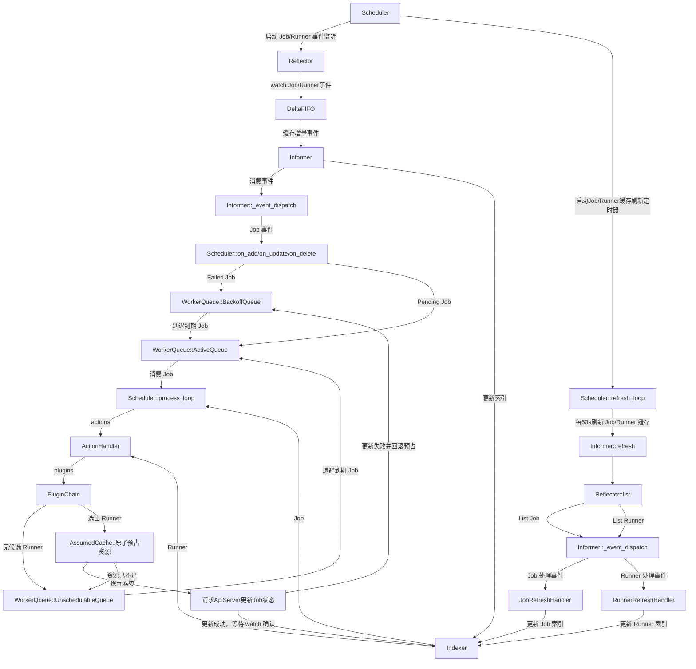

# Scheduler 设计

## 一、定位

Scheduler 负责监听 `ebs/v1` Job 和 Runner，把 `status.phase == "Pending"` 状态的 Job 绑定到合适的 Runner 上执行。

Scheduler 是系统组件，直接访问 `ebs-apiserver` 的全局系统 API：

```text
scheduler -> ebs-apiserver -> etcd / Elasticsearch
```

Scheduler 不直接访问 etcd 或 Elasticsearch，不直接执行 Job，也不负责维护 Runner 本地执行状态。Runner 是否忙、当前可用资源和心跳信息由 runner 进程通过 `Runner.status` 上报；具体 Job 与 Runner 的绑定关系以 Job 自身的 `status.runner` 为准。

## 二、设计目标

首版 Scheduler 目标是实现一个简单、可运行、可扩展的调度闭环：

| 目标 | 说明 |
|------|------|
| watch 驱动 | 监听全局 Job 和 Runner 变化，及时触发调度 |
| Project 无关 | 通过全局 Job API 跨 Project 调度，不逐个 Project 建立 watch |
| 轻量过滤 | 基于 Runner 类型、架构、状态、污点、标签和可调度资源过滤 |
| 简单打分 | 基于空闲优先、可调度资源和标签匹配进行排序 |
| 状态绑定 | 只更新 Job status，写入实际 Runner `status.runner` 名称并将 Job 置为 Running `status.phase="Running"` |
| 可扩展 | 后续可逐步引入更多 Filter/Score 插件 |

## 三、API 交互

### 3.1 监听 Job

Scheduler 使用全局 Job API 监听所有 Project 下的 Job：

```text
GET /apis/ebs/v1/jobs?watch=true
```

首版不依赖自定义 field selector。Scheduler 收到 Job 事件后，在本地判断：

```text
job.status.phase == "Pending"
```

只有 Pending Job 进入调度队列。

### 3.2 读取 Runner

Scheduler 使用 Runner API 获取候选执行机：

```text
GET /apis/ebs/v1/runners
GET /apis/ebs/v1/runners?watch=true
```

Runner 是集群级资源，候选信息来自：

- `metadata.name`
- `metadata.labels`
- `spec.type`
- `spec.arch`
- `spec.unschedulable`
- `spec.taints`
- `status.phase`
- `status.allocatable`
- `status.heartbeat`

### 3.3 绑定 Job

Job 是 Project 级资源。Scheduler 从 Job 对象的 `metadata.namespace` 获取所属 Project，然后通过 Project API 更新 Job status：

```text
PUT /apis/ebs/v1/projects/{project}/jobs/{name}/status
```

绑定时更新：

```yaml
status:
  phase: Running
  stage: Pending
  runner: runner-ct-aarch64-01
  startTime: "2026-06-09T10:00:00Z"
```

Scheduler 不更新 Runner status。绑定关系只写入 Job status；如后续需要统计每个 Runner 的运行负载，Scheduler 应基于 watch 到的 Job 按 `status.runner` 聚合。

## 四、调度输入

Job、Runner 及其公共子结构的完整字段、类型、默认值和枚举统一由 [data-models.md](./data-models.md) 定义。本节只说明 Scheduler 实际读取的字段及其调度语义，不重复定义对象结构。

### 4.1 Job 字段

| 字段 | 调度用途 |
|------|----------|
| `metadata.namespace` | 获取所属 Project，并组成 Job Key |
| `metadata.name` | 与 Project 共同组成 Job Key |
| `metadata.uid` | 区分同名 Job 删除后重建的不同实例 |
| `metadata.resourceVersion` | Bind 时执行乐观并发控制 |
| `spec.priority` | ActiveQueue 排序；值越大越优先，默认 0 |
| `spec.runtime` | 执行运行时类型，默认 `ct`；首版暂不参与资源计算 |
| `spec.resources.requests` | 判断 Runner 剩余资源是否满足请求 |
| `spec.nodeSelector` | 精确匹配 Runner `metadata.labels` |
| `spec.tolerations` | 判断 Job 是否容忍 Runner `spec.taints` |
| `status.phase` | 判断 Job 是否需要调度以及是否正在占用资源 |
| `status.runner` | 判断 Job 是否已经绑定，并聚合 Runner 已绑定资源 |

`spec.runtimeSpec`、`spec.timeoutSeconds`、`spec.resources.limits` 和 `spec.payload` 首版不参与调度，由 Runner 执行侧解释或使用。

首版资源匹配支持 `cpu`、`memory` 和 `ephemeral-storage`。资源数量使用数据模型定义的字符串形式，例如 `"8"`、`"16Gi"` 和 `"100Gi"`。

### 4.2 Runner 字段

| 字段 | 调度用途 |
|------|----------|
| `metadata.name` | Runner 唯一标识及 Job 绑定目标 |
| `metadata.labels` | 匹配 Job `spec.nodeSelector` |
| `spec.type` | 表示 Runner 执行类型 |
| `spec.arch` | 表示 Runner CPU 架构；调度约束通过标准标签表达 |
| `spec.unschedulable` | 为 true 时禁止调度新 Job |
| `spec.taints` | 与 Job `spec.tolerations` 执行匹配 |
| `status.phase` | 只有 `Idle` 或 `Running` Runner 能进入候选集 |
| `status.allocatable` | 计算 Runner 可用于 Job 的资源基数 |
| `status.heartbeat` | 判断 Runner 信息是否仍然有效 |

调度标签统一使用 `Runner.metadata.labels`，不使用 `spec.labels`。

### 4.3 Job 唯一键

Job 名称只在所属 Project 内唯一。Scheduler 的 Indexer、调度队列、去重集合和退避记录统一使用以下格式作为 Job 唯一键：

```text
{project}/{jobName}
```

其中 `project` 取自 `job.metadata.namespace`，`jobName` 取自 `job.metadata.name`。例如：

```text
openeuler-24-03/build-kernel
```

从队列取出 Job Key 后，Indexer 必须按完整 Job Key 查询对象。Runner 是集群级资源，其缓存键仍使用 `metadata.name`。

## 五、调度流程

流程图



核心逻辑

```text
Informer (ListWatch / Reflector)
  -> watch Job / Runner 事件
  -> DeltaFIFO 缓存增量事件
  -> SharedInformer 消费事件 -> Indexer 更新索引 -> 事件分发

Scheduler 事件处理:
  -> on_add / on_update: Pending Job -> WorkerQueue.add_to_active()
  -> on_add / on_update: Failed Job  -> WorkerQueue.add_to_backoff()
  -> on_delete: 删除 Job -> WorkerQueue.remove()

Scheduler process_loop 调度主循环:
  -> WorkerQueue.pop() 从 ActiveQueue 取出 {project}/{jobName}, 从 Indexer 根据完整 Job Key 查询 Job 对象
  -> 创建 SchedulingContext (job, runner indexer, client)
  -> pre_schedule:
       INITIAL: 读取 Runner 快照 -> 提取 Job 资源需求 -> 生成候选列表
       CALC_CAPACITY: 调用 ResourceCalcPlugin 计算 Runner 容量
  -> schedule:
       FILTER: 调用 FilterPlugin 过滤 Runner
       SCORE:  调用 ScorePlugin 对 Runner 打分
       BIND:   调用 BindPlugin 选择最优 Runner
  -> post_schedule 调度后处理:
       ASSUME: 在本地 assumed cache 中原子预占 Runner 资源
       BROADCAST: Job 绑定 Runner   -> 更新 status.phase="Running", status.stage="Pending" 同步到 apiserver;
                  watch 确认绑定     -> 从 assumed cache 删除对应预占；
                  API 更新失败       -> 回滚预占并将 Job 加入 WorkerQueue.add_to_backoff()；
                  Job 未绑定 Runner -> WorkerQueue.add_to_unschedulable()；

定时器线程 (WorkerQueue.run_with_interval):
  -> 每 10s 将 UnschedulableQueue 头部 Job 移回 ActiveQueue
  -> 每 10s 将 BackoffQueue 中到期 Job 移回 ActiveQueue

定时器线程 (Scheduler._run_refresh):
  -> 每 60s 执行 list 操作，将 Job 和 Runner 的缓存刷新

```

### 5.1 入队


Job 进入调度队列：

- `status.phase == "Pending"`
- `status.runner` 为空

如果 watch 中断，Scheduler 重新 list 全局 Job，并重新筛选 Pending Job。

### 5.2 缓存与索引管理

调度器使用 Indexer 缓存 Job 和 Runner 数据，同时提供索引快速检索数据的能力。

#### 5.2.1 初始化

- List Job
  
  使用 `{project}/{jobName}` 作为键，将 Job 添加到 Indexer 创建缓存和索引。

- List Runner

  添加 Runner 到 Indexer 创建缓存和索引。

#### 5.2.2 Watch

- Job 事件
  
  - ADDED: 添加新 Job 到 Indexer 创建缓存和索引
  - MODIFIED: 更新 Indexer 中 Job 的缓存和索引
  - DELETED: 删除 Indexer 中的 Job 缓存和索引

- Runner 事件
  
  - ADDED: 添加新 Runner 到 Indexer 创建缓存和索引
  - MODIFIED: 更新 Indexer 中 Runner 的缓存和索引
  - DELETED: 删除 Indexer 中的 Runner 缓存和索引

#### 5.2.3 定时器更新

调度器定时（默认：60秒）刷新 Job 和 Runner 缓存和索引。

- List Job: 

  - 获取最新 Job 列表，逐个检索 Job 在 Indexer 中是否存在，不存在则添加；存在则更新缓存和索引
  - 获取最新 Job 列表，按 `{project}/{jobName}` 计算最新和缓存 Job 各自的唯一标识列表，删除缓存中存在而最新列表不存在的 Job 缓存和索引

- List Runner:

  - 获取最新 Runner 列表，逐个检索 Runner 在 Indexer 中是否存在，不存在则添加；存在则更新缓存和索引
  - 获取最新 Runner 列表，计算出最新和缓存 Runner 各自的唯一标识列表，删除缓存中存在而最新列表不存在的 Runner 缓存和索引

#### 5.2.4 Runner 可分配

检索 Indexer 中绑定了 Runner 且 Job `status.phase == "Running"` 的 Job 列表，并结合本地 assumed cache 中尚未被 watch 确认的预占，计算 Runner 当前可用于调度的资源：

```text
available = runner.status.allocatable
          - sum(running Job requests)
          - sum(unconfirmed assumed Job requests)
```

当 Job 的绑定已经通过 watch 进入 Indexer 时，必须先删除其 assumed 记录，再按 Running Job 计算，避免同一 Job 被重复扣减。

#### 5.2.5 Assumed Cache

apiserver 更新成功到 Job watch 事件进入本地 Indexer 之间存在时间窗口。如果 Scheduler 在这个窗口内继续调度，后续 Job 会读取到旧的 Runner 可用资源，可能造成资源超卖。Scheduler 使用进程内 assumed cache 记录已经选定 Runner、但尚未被 watch 确认的 Job 绑定。

每条记录至少包含：

```text
AssumedJob
├── jobKey           # {project}/{jobName}
├── jobUID           # 防止同名 Job 删除重建后误匹配
├── runnerName       # 预选 Runner
├── requests         # 调度时使用的资源请求快照
├── resourceVersion  # 发起 Bind 前观察到的 Job 版本
└── assumedAt        # 预占时间
```

assumed cache 同时维护按 Job Key 和 Runner 名称查询的索引。对同一个 Runner 执行“读取可用资源、判断是否满足、写入预占”必须处于同一临界区，保证多个调度 worker 不能同时消费同一份资源。

生命周期：

1. Scheduler 选出 Runner 后，在发送 Bind 请求前调用 `assume(job, runner)` 原子预占资源。
2. 如果预占时发现 Runner 的最新可用资源不足，则放弃该候选并重新选择，不发送 Bind 请求。
3. Bind API 返回失败或 resourceVersion 冲突时，立即调用 `forget(jobKey)` 回滚预占，然后按失败类型重新入队。
4. Job watch 观察到同一 UID 的 Job 已处于 `Running` 且 `status.runner` 与预占 Runner 相同时，视为绑定已确认，调用 `forget(jobKey)`；资源随后由 Indexer 中的 Running Job 继续扣减。
5. Job 被删除，或其状态、UID、Runner 与预占不一致时，删除预占并重新评估是否需要入队。
6. Scheduler 关闭时直接丢弃 assumed cache；重启后通过全量 List 中的 Running Job 重建实际资源占用，不恢复旧的临时预占。

为防止 Bind 请求结果未知或 watch 长时间中断导致预占永久泄漏，记录设置可配置的确认超时，例如 30 秒。记录超时后不能直接释放：Scheduler 必须先从 apiserver GET 最新 Job，确认绑定未生效后才能删除；如果 GET 失败，保留预占并延后重试。

assumed cache 只存在于 Scheduler 内存中，不修改 Runner 对象，也不是最终绑定事实来源。Job `status.runner` 仍是唯一持久化绑定关系。首版单调度进程可以使用本地 cache；多副本部署必须配合 leader election，否则不同副本之间无法共享预占信息。

### 5.3 Filter

首版过滤规则：

| 插件 | 说明 |
|------|------|
| PhaseFilter | Runner `status.phase` 必须是 `Idle` 或 `Running` |
| UnschedulableFilter | Runner `spec.unschedulable` 不能为 true |
| NodeSelectorFilter | Job `spec.nodeSelector` 中的每个键值都必须匹配 Runner `metadata.labels` |
| CapacityFilter | Runner `status.allocatable` 必须满足 Job `spec.resources.requests`；未声明 requests 时不限制资源 |
| TaintFilter | Runner `spec.taints` 中 `NoSchedule` taint 必须被 Job `spec.tolerations` 容忍 |

`status.phase == "Booting"` 的 Runner 可以被 watch 缓存，但不进入候选集，等 Runner 上报 `Idle` 或 `Running` 后再参与调度。

`NodeSelectorFilter` 采用精确匹配：`spec.nodeSelector` 为空时不限制 Runner；非空时，其中每个键值都必须存在于 Runner `metadata.labels` 且值相等。Runner agent 注册时会上报常用调度标签，例如：

```yaml
metadata:
  labels:
    ebs.io/runner-type: ct
    ebs.io/runner-arch: aarch64
```

Job 可以通过相同标签约束目标 Runner：

```yaml
spec:
  nodeSelector:
    ebs.io/runner-type: ct
    ebs.io/runner-arch: aarch64
```

### 5.4 Score

首版使用 `UtilizationScorer` 和 `SpreadingScorer` 两个固定打分函数。每项分数统一归一化到 `[0, 100]`，分数越高越优先。资源计算包含已绑定的 Running Job 和尚未被 watch 确认的 assumed Job。

#### UtilizationScorer

根据当前 Job 假定调度到 Runner 后的 CPU、内存剩余比例打分：

```text
cpuRemainingRatio = (availableCPU - requestedCPU) / allocatableCPU
memoryRemainingRatio = (availableMemory - requestedMemory) / allocatableMemory

metrics = 可参与计算的 CPU、Memory 指标集合
utilizationScore = sum(remainingRatio(metric) for metric in metrics) / len(metrics) * 100
```

规则：

- `available` 使用 5.2.4 定义的 Runner 当前可用资源。
- 只计算 Runner 声明了 `allocatable` 且值大于 0 的指标，`metricCount` 是实际参与计算的指标数量。
- Job 未声明某项 request 时，该项 request 按 0 计算。
- Job 请求大于 available 的 Runner 已由 `CapacityFilter` 淘汰，不进入打分。
- 如果 CPU 和内存都无法参与计算，`utilizationScore` 取 0。
- 最终结果限制在 `[0, 100]`，避免解析和舍入误差产生越界值。

该算法优先选择调度后资源余量更高的 Runner，使负载在 Runner 间分散。

#### SpreadingScorer

根据 Runner 当前承担的 Job 数量打分：

```text
jobCount = runningJobCount + assumedJobCount
spreadingScore = 100 / (1 + jobCount)
```

Running Job 和 assumed Job 均计入 `jobCount`，避免连续调度期间所有新 Job 都选择同一个 Runner。

#### 总分

```text
finalScore = utilizationScore * 0.6 + spreadingScore * 0.4
```

`finalScore` 统一限制在 `[0, 100]`。

首版直接实现上述固定函数，不引入插件注册框架；后续插件化时保持相同的分值范围和加权接口。

### 5.5 Pick

选择总分最高的 Runner。若分数相同，按 Runner `metadata.name` 升序选择，保证结果稳定。

### 5.6 Bind

绑定时只更新 Job status：

```yaml
status:
  phase: Running
  stage: Pending
  runner: runner-ct-aarch64-01
  startTime: "2026-06-09T10:00:00Z"
```

绑定更新必须处理资源版本冲突：

- 发送更新前必须已经在 assumed cache 中完成资源预占。
- 如果 Job 已经不是 Pending，放弃本次绑定。
- 如果 Job 已经有 `status.runner`，放弃本次绑定。
- 如果更新时出现 resourceVersion 冲突，先回滚 assumed 记录，再读取 Job 判断是否需要重试。
- API 返回成功后不立即释放预占，等待 Job watch 事件确认绑定。

### 5.7 Job 饥饿问题

默认的调度策略是：

1. 先绑定 Priority 高的 Job。
2. Job 均匀分配到所有 Runner。

- 优势：
1. 避免 Runner 负载不均衡。
2. 确保高 Priority Job 能及时得到执行。

- 缺点：
1. 如果高 Priority Job 持续运行，低 Priority Job 可能会被饿死。
2. 请求资源大的高 Priority Job 可能会被饿死。

`缺点1`尚可接受，因为高 Priority Job 优先执行，符合预期。

`缺点2`高优 Priority Job 被饿死，这是不可接受的。导致该问题的原因是：Job 均匀分布在 Runner 上执行，则 Job 执行时间长或数量过多都会导致 Runner 没有足够的资源执行较大请求资源的高 Priority Job。针对这个问题有如下几种方案：

- 方案1: 资源锁定
  - 描述：当请求资源大的高 Priority Job 绑定 Runner 失败后，可以将当前最有可能执行 Job 的 Runner 锁定， 除锁定 Runner 的 Job 外，其他 Job 无法绑定该 Runner。
  - 实现：
  
    - 在缓存 Runner `metadata.labels` 中添加一个 `ebs.io/runner-locked-by` 标签，当 Job 绑定 Runner 失败后，会尝试向 Runner 添加该标签。由于 Kubernetes label value 不能包含 `/`，标签值使用 Job UID；Scheduler 内部仍以 `{project}/{jobName}` 标识 Job。
    - 锁定 Runner 后，其他 Job 无法绑定该 Runner，直到高 Priority Job 完成绑定或取消。
    - 实现一个 Runner 锁定过滤插件，在 Filter 阶段，若 Runner 已被锁定，且 Job 不是锁定 Runner 的 Job，则过滤该 Runner。

- 方案2: 资源预定
  - 描述：当请求资源大的高 Priority Job 绑定 Runner 失败后，可以向当前最有可能执行 Job 的 Runner 预定资源，当其他 Job 向 Runner 请求资源时，会根据当前的负载策略决定是否接受。
  - 实现：
  
    - 在缓存 Runner `metadata.labels` 中添加一个 `ebs.io/runner-reserved-by` 标签，当高 Priority Job 被绑定 Runner 失败后，会尝试向 Runner 添加该标签。标签值使用 Job UID；Scheduler 内部仍以 `{project}/{jobName}` 标识 Job。
    - 预定 Runner 后，其他 Job 可以根据当前的负载策略尝试绑定 Runner，预定 Runner 直到高 Priority Job 完成绑定或取消后释放预定资源。
    - 实现一个 Runner 预定过滤插件，在 Filter 阶段，若 Runner 已被预定，且 Job 不是预定 Runner 的 Job，则尝试保留该 Runner。

- 方案3: 动态唤醒
  - 描述：当请求资源大的高 Priority Job 绑定 Runner 失败后进入延迟队列，每当有 Runner 释放资源的事件发生时，都将优先唤醒高优先级 Job 进行调度。
  - 实现： 实现 Job 事件处理器，每当有 Job `status.phase == "Running"` 状态变更为: `Completed`、`Aborted` 或 `Failed` 的事件发生时，将该 Job 从延迟队列中唤醒。

注意：若设置了本地自定义标签，则需要实现一个 Job 事件处理器，用于处理 Job 事件发生时自定义标签的合并，并及时更新缓存。

## 六、调度队列

### 6.1 队列架构

调度队列由 `WorkerQueue` 统一管理，内部包含三个子队列：

```text
WorkerQueue
├── ActiveQueue (PriorityQueue)        # 待调度 Pending Job，按 spec.priority 排序
├── BackoffQueue (PriorityQueue)       # 运行失败退避 Job，按退避到期时间排序
└── UnschedulableQueue (PriorityQueue) # Runner 的可用资源不满足 Job 资源需求，按入队顺序排序
```
数据流转
```mermaid
graph TD
    J[Job] --> |status.phase == "Pending"| A[ActiveQueue]
    J --> |status.phase == "Failed"| B[BackoffQueue]
    J --> |status.runner Bound Failed| U[UnschedulableQueue]
    B[BackoffQueue] --> |到期 Job| A[ActiveQueue]
    U[UnschedulableQueue] --> |到期 Job| A
```

### 6.2 PriorityQueue（优先级队列）

继承 `GenericHeapQueue`，基于 `HeapQueue`（大顶堆）实现，Job 按 `spec.priority` 排序，优先级高的先出队。Job 的 `obj_key` 固定为 `{project}/{jobName}`。内部维护 `_obj_keys` 和 `_delete_keys` 列表，重复对象自动忽略，删除采用懒删除策略。

| 方法 | 说明 |
|------|------|
| `push(obj)` | 入队，重复对象忽略，返回 `bool` |
| `pop(block, timeout)` | 出队，返回 `(priority, obj_key, obj_value)` 元组，其中 `obj_key` 为 `{project}/{jobName}`；队列为空返回 `None` |
| `peek()` | 查看队首元素但不移除，返回 `(priority, obj_key, obj_value)` 元组，其中 `obj_key` 为 `{project}/{jobName}` |
| `delete(obj)` | 懒删除，`pop()`/`peek()` 时跳过已删除项 |
| `exists(obj)` | 判断对象是否在队列中 |
| `is_empty()` | 判断队列是否为空 |
| `close()` | 关闭队列，关闭后 `push()` 返回 `False` |

### 6.3 BackoffQueue（退避队列）

继承 `GenericHeapQueue`，使用小顶堆（`big_top_heap=False`），用于调度失败后的指数退避重试。入队时自动计算退避到期时间作为排序依据：

```text
order_no = time.time() + backoff_time
backoff_time = min(backoff_factor * 2^(restartCount - 1), max_backoff)
```

| 参数 | 默认值 | 说明 |
|------|--------|------|
| `backoff_factor` | 10 | 退避基础因子（秒） |
| `max_backoff` | 3600 | 最大退避时间上限（秒） |

退避时间计算示例（`backoff_factor=10`）：

| restartCount | 退避时间 | 公式 |
|-------------|---------|------|
| 1 | 10s | 10 * 2^0 |
| 2 | 20s | 10 * 2^1 |
| 3 | 40s | 10 * 2^2 |
| 4 | 80s | 10 * 2^3 |

| 方法 | 说明 |
|------|------|
| `push(obj)` | 入队前自动计算退避时间（`time.time() + backoff_time`）作为排序依据 |
| `all_backoff_matured(timeout_limit)` | 弹出入队时间小于给定值的所有对象，用于定时器检查到期 Job |

### 6.4 WorkerQueue（工作队列）

顶层队列管理器，组合三个子队列并通过定时器线程实现队列间自动流转。

| 方法 | 说明 |
|------|------|
| `add_to_active(job)` | 将 Pending Job 加入 ActiveQueue，若 Job 已经在 BackoffQueue 或 UnschedulableQueue 则不加入 ActiveQueue|
| `add_to_backoff(job)` | 将失败 Job 加入 BackoffQueue（自动计算退避时间），从其他队列中移除 |
| `add_to_unschedulable(job)` | 将无可用 Runner 的 Job 加入 UnschedulableQueue，从其他队列中移除 |
| `remove(obj)` | 从所有子队列中懒删除 Job |
| `pop()` | 阻塞从 ActiveQueue 中取出优先级最高的 Job，返回 `(priority, obj_key, obj_value)`，其中 `obj_key` 为 `{project}/{jobName}` |
| `peek()` | 查看 ActiveQueue 队首 Job |
| `close()` | 关闭所有队列并停止定时器线程 |

### 6.5 定时器线程

`WorkerQueue` 内部维护一个定时器线程 `run_with_interval`，按 `interval`（默认 10s）间隔周期性执行：

1. 检查 `UnschedulableQueue`：每次弹出一个头部 Job，`re_push` 回 `ActiveQueue`
2. 检查 `BackoffQueue`：调用 `all_backoff_matured(timeout_limit)` 获取所有退避到期的 Job，逐一 `re_push` 回 `ActiveQueue`

### 6.6 队列规则

- 新增或更新为 Pending 的 Job 进入 `ActiveQueue`（`on_add` / `on_update`）。
- 调度失败的重试 Job 进入 `BackoffQueue`（退避到期后自动移回 `ActiveQueue`）。
- 当前 Runner 可分配资源不满足 Job 请求资源的 Job 进入 `UnschedulableQueue`，定时重试。
- Job 被删除后，通过 `on_delete` 从所有队列 `remove()`。
- 调度成功绑定后，Job 状态变为 `status.phase="Running"`, `status.stage="Pending"`，不再进入队列。
- Runner 资源总容量无法满足 Job 请求资源的 Job 直接标记为 Aborted，不入队。

失败类型：

| 类型 | 处理 |
|------|------|
| Job 请求资源超过 Runner 可分配资源 | 进入 UnschedulableQueue，定时重试 |
| Job 请求资源超过 Runner 总容量资源 | 更新 Job `status.phase="Aborted"` |
| API 更新失败 | 进入 BackoffQueue，退避后重试 |

## 七、并发与幂等

首版可以单副本部署，简化锁和 leader election。

如果未来多副本部署，需要引入 leader election 或基于 Job status 的乐观并发控制。无论单副本还是多副本，Bind 必须幂等：

- 只绑定 `status.phase == "Pending"` 且 `status.runner` 为空的 Job。
- 绑定成功后，重复处理同一 watch 事件不会再次修改已 Running 的 Job。
- 绑定失败不修改 Runner `status.phase` 和  `status.runner`。
- 同一 Runner 的可用资源计算与 assumed 预占必须原子执行，防止不同 Job 并发绑定导致资源超卖。
- assumed cache 是单进程状态；启用多个调度进程前必须先实现 leader election 或等价的分布式协调机制。

## 八、故障处理

| 场景 | 处理 |
|------|------|
| Job watch 中断 | 使用 `metadata.resourceVersion` 恢复 watch；失败时重新 list |
| Runner watch 中断 | 重新 list Runner，刷新本地缓存 |
| Runner 心跳超时 | 本地过滤该 Runner；`status.phase == "Offline"` 标记由外部控制器处理 |
| Bind 冲突 | 重新读取 Job，若仍 `status.phase == "Pending"` 则重试 |
| Bind 失败 | 立即回滚对应 assumed 记录，Job 进入退避队列 |
| Bind 成功但 watch 未确认 | assumed 记录到期后 GET 最新 Job，确认绑定未生效才释放预占 |
| 无候选 Runner | Job 进入 unschedulable，等待 Runner 或资源状态变化 |
| apiserver 不可达 | 指数退避重连 |

## 九、首版实现结构

目录结构：

```text
components/scheduler/
├── requirements.txt               # 项目依赖声明
├── build/                         # 构建相关
│   ├── Dockerfile                 # 容器构建文件
│   └── build_docker.sh            # Docker 构建脚本
├── docs/                          # 文档
│   └── README.md                  # 项目说明文档
└── src/                           # 源代码
    ├── app.py                     # 应用入口（FastAPI + Gunicorn 多进程启动）
    ├── gunicorn_conf.py           # Gunicorn 配置（worker 数、端口、日志等）
    ├── scheduler/                 # 调度核心
    ├── cache/                     # 缓存层 DeltaFIFO、Indexer、Work Queue 等实现
    ├── common/                    # 公共模块 数据模型定义、工具实现
    ├── informer/                  # Informer 层 ListWatch、Reflector 实现
    ├── client/                    # API 客户端 EBSClient、Decoder 实现
    ├── plugin/                    # 插件系统，插件基类、注册中心、所有插件实现
    ├── log/                       # 日志模块
    └── server/                    # API服务，健康检查 API 实现
```

## 十、后续扩展

后续可以在不改变首版主流程的前提下扩展：

- 更完整的资源数量解析和 GPU 等扩展资源。
- 镜像缓存、ccache 缓存亲和。
- VM / HW 类型专用 PreBind 检查。
- 多副本 scheduler leader election。
- 插件化 Filter / Score 框架。
