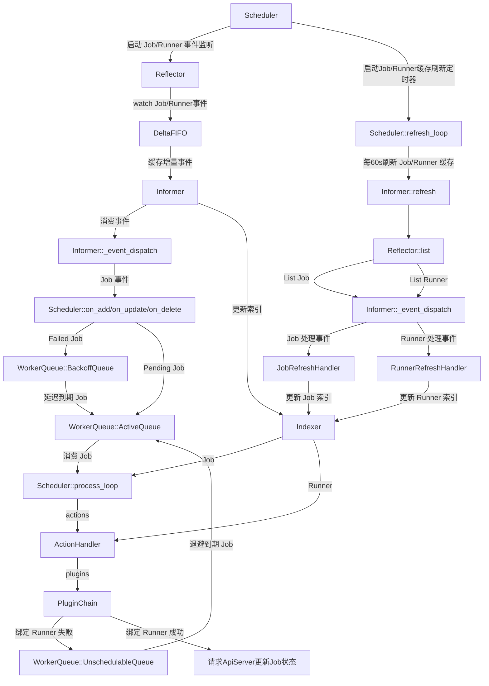

# Scheduler 设计

## 一、定位

Scheduler 负责监听 `ebs/v1` Job 和 Runner，把 `status.phase == "Pending"` 状态的 Job 绑定到合适的 Runner 上执行。

Scheduler 是系统组件，直接访问 `ebs-apiserver` 的全局系统 API：

```text
scheduler -> ebs-apiserver -> etcd / Elasticsearch
```

Scheduler 不直接访问 etcd 或 Elasticsearch，不直接执行 Job，也不负责维护 Runner 本地执行状态。Runner 是否忙、当前可用资源和心跳信息由 runner 进程通过 `Runner.status` 上报；具体 Job 与 Runner 的绑定关系以 Job 自身的 `status.runner` 为准。

## 二、设计目标

首版 Scheduler 目标是实现一个简单、可运行、可扩展的调度闭环：

| 目标 | 说明 |
|------|------|
| watch 驱动 | 监听全局 Job 和 Runner 变化，及时触发调度 |
| Project 无关 | 通过全局 Job API 跨 Project 调度，不逐个 Project 建立 watch |
| 轻量过滤 | 基于 Runner 类型、架构、状态、污点、标签和可调度资源过滤 |
| 简单打分 | 基于空闲优先、可调度资源和标签匹配进行排序 |
| 状态绑定 | 只更新 Job status，写入实际 Runner `status.runner` 名称并将 Job 置为 Running `status.phase="Running"` |
| 可扩展 | 后续可逐步引入更多 Filter/Score 插件 |

## 三、API 交互

### 3.1 监听 Job

Scheduler 使用全局 Job API 监听所有 Project 下的 Job：

```text
GET /apis/ebs/v1/jobs?watch=true
```

首版不依赖自定义 field selector。Scheduler 收到 Job 事件后，在本地判断：

```text
job.status.phase == "Pending"
```

只有 Pending Job 进入调度队列。

### 3.2 读取 Runner

Scheduler 使用 Runner API 获取候选执行机：

```text
GET /apis/ebs/v1/runners
GET /apis/ebs/v1/runners?watch=true
```

Runner 是集群级资源，候选信息来自：

- `metadata.name`
- `metadata.labels`
- `spec.type`
- `spec.arch`
- `spec.unschedulable`
- `spec.taints`
- `status.phase`
- `status.allocatable`
- `status.heartbeat`

### 3.3 绑定 Job

Job 是 Project 级资源。Scheduler 从 Job 对象的 `metadata.namespace` 获取所属 Project，然后通过 Project API 更新 Job status：

```text
PUT /apis/ebs/v1/projects/{project}/jobs/{name}/status
```

绑定时更新：

```yaml
status:
  phase: Running
  stage: Pending
  runner: runner-ct-aarch64-01
  startTime: "2026-06-09T10:00:00Z"
```

Scheduler 不更新 Runner status。绑定关系只写入 Job status；如后续需要统计每个 Runner 的运行负载，Scheduler 应基于 watch 到的 Job 按 `status.runner` 聚合。

## 四、输入数据模型

### 4.1 JobSpec

首版调度只使用当前 `JobSpec` 已定义字段：

```go
type JobSpec struct {
    Priority     int64                `json:"priority,omitempty"`
    Runtime      string               `json:"runtime,omitempty"`
    RuntimeSpec  runtime.RawExtension `json:"runtimeSpec,omitempty"`
    TimeoutSeconds int64              `json:"timeoutSeconds,omitempty"`
    Resources    ResourceRequirements `json:"resources,omitempty"`
    NodeSelector map[string]string    `json:"nodeSelector,omitempty"`
    Tolerations  []Toleration         `json:"tolerations,omitempty"`
    Payload      string               `json:"payload,omitempty"`
}
```

调度含义：

| 字段 | 调度用途 |
|------|----------|
| `priority` | Job 调度优先级，值越大越优先，默认：0 |
| `runtime` | 执行运行时类型，默认 `ct`；首版暂不参与资源计算，可用于后续运行时亲和或隔离策略 |
| `runtimeSpec` | 运行时专属配置，首版暂不参与调度 |
| `timeoutSeconds` | 最大运行秒数，首版暂不参与调度，可由 runner 执行侧用于超时控制 |
| `resources.requests` | 判断 Runner `status.allocatable` 是否满足资源请求 |
| `resources.limits` | 执行时资源上限，首版暂不参与调度 |
| `nodeSelector` | 精确匹配 Runner `metadata.labels`，架构约束通过 `ebs.io/runner-arch` 表达 |
| `tolerations` | 容忍 Runner `spec.taints` |
| `payload` | YAML 格式的 Job 参数内容，首版暂不参与调度 |

首版可以先支持 `nodeSelector`、`tolerations` 和常见资源名 `cpu`、`memory`、`ephemeral-storage`。资源数量沿用字符串表达，如 `"8"`、`"16Gi"`、`"100Gi"`。

#### ResourceRequirements

```go
type ResourceRequirements struct {
    Requests map[string]string `json:"requests,omitempty"`
    Limits   map[string]string `json:"limits,omitempty"`
}
```

| 字段 | Go 类型 | 说明 |
|------|---------|------|
| `requests` | map[string]string | 资源需求，如 `{"cpu": "4", "memory": "8Gi"}`。调度器用于匹配 Runner 的可分配容量 |
| `limits` | map[string]string | 资源上限，如 `{"cpu": "8", "memory": "16Gi"}`。用于限制 Job 最大资源使用量 |

#### Toleration

```go
type Toleration struct {
    Key      string `json:"key,omitempty"`
    Operator string `json:"operator,omitempty"`
    Value    string `json:"value,omitempty"`
    Effect   string `json:"effect,omitempty"`
}
```

| 字段 | Go 类型 | 说明 |
|------|---------|------|
| `key` | string | 匹配 Runner taint 的键 |
| `operator` | string | 匹配操作符：`Equal`（相等）、`Exists`（存在）、`Gt`（大于）、`Lt`（小于） |
| `value` | string | 匹配值，与 `key` 配合使用 |
| `effect` | string | 容忍效果：`NoSchedule`（不调度）、`PreferNoSchedule`（尽量不调度）、`NoExecute`（不执行并驱逐） |

### 4.2 RunnerSpec

```go
type RunnerSpec struct {
    Type          string        `json:"type,omitempty"`
    Arch          string        `json:"arch,omitempty"`
    Hostname      string        `json:"hostname,omitempty"`
    Unschedulable bool          `json:"unschedulable,omitempty"`
    Taints        []RunnerTaint `json:"taints,omitempty"`
}
```

#### RunnerTaint

```go
type RunnerTaint struct {
    Key    string `json:"key"`
    Value  string `json:"value,omitempty"`
    Effect string `json:"effect"`
}
```

| 字段 | Go 类型 | 说明 |
|------|---------|------|
| `key` | string | 污点键 |
| `value` | string | 污点值 |
| `effect` | string | 效果：`NoSchedule`/`PreferNoSchedule`/`NoExecute` |

调度标签统一使用 `Runner.metadata.labels`，不使用 `spec.labels`。

### 4.3 RunnerStatus

```go
type RunnerStatus struct {
    Phase       string             `json:"phase,omitempty"`
    Conditions  []metav1.Condition `json:"conditions,omitempty"`
    Capacity    map[string]string  `json:"capacity,omitempty"`
    Allocatable map[string]string  `json:"allocatable,omitempty"`
    Addresses   []RunnerAddress    `json:"addresses,omitempty"`
    Info        RunnerInfo         `json:"info,omitempty"`
    Heartbeat   metav1.Time        `json:"heartbeat,omitempty"`
}
```

首版调度使用：

| 字段 | 用途 |
|------|------|
| `phase` | 过滤掉 `status.phase == "Offline"`、`status.phase == "Booting"` 等不可执行状态 |
| `allocatable` | 判断是否仍有可调度容量 |
| `unschedulable` | 过滤标记为不可调度 `spec.unschedulable == true`的 Runner |
| `taints` | 过滤 Runner 污点 |

## 五、调度流程

流程图



核心逻辑

```text
Informer (ListWatch / Reflector)
  -> watch Job / Runner 事件
  -> DeltaFIFO 缓存增量事件
  -> SharedInformer 消费事件 -> Indexer 更新索引 -> 事件分发

Scheduler 事件处理:
  -> on_add / on_update: Pending Job -> WorkerQueue.add_to_active()
  -> on_add / on_update: Failed Job  -> WorkerQueue.add_to_backoff()
  -> on_delete: 删除 Job -> WorkerQueue.remove()

Scheduler process_loop 调度主循环:
  -> WorkerQueue.pop() 从 ActiveQueue 取出 job_name, 从 Indexer 根据 job_name 查询 Job 对象
  -> 创建 SchedulingContext (job, runner indexer, client)
  -> pre_schedule:
       INITIAL: 读取 Runner 快照 -> 提取 Job 资源需求 -> 生成候选列表
       CALC_CAPACITY: 调用 ResourceCalcPlugin 计算 Runner 容量
  -> schedule:
       FILTER: 调用 FilterPlugin 过滤 Runner
       SCORE:  调用 ScorePlugin 对 Runner 打分
       BIND:   调用 BindPlugin 选择最优 Runner
  -> post_schedule 调度后处理:
       BROADCAST: Job 绑定 Runner   -> 更新 status.phase="Running", status.stage="Pending" 同步到 apiserver; 
                  Job 未绑定 Runner -> WorkerQueue.add_to_unschedulable()；
                  API 更新失败       -> WorkerQueue.add_to_backoff()

定时器线程 (WorkerQueue.run_with_interval):
  -> 每 10s 将 UnschedulableQueue 头部 Job 移回 ActiveQueue
  -> 每 10s 将 BackoffQueue 中到期 Job 移回 ActiveQueue

定时器线程 (Scheduler._run_refresh):
  -> 每 60s 执行 list 操作，将 Job 和 Runner 的缓存刷新

```

### 5.1 入队


Job 进入调度队列：

- `status.phase == "Pending"`
- `status.runner` 为空

如果 watch 中断，Scheduler 重新 list 全局 Job，并重新筛选 Pending Job。

### 5.2 缓存与索引管理

调度器使用 Indexer 缓存 Job 和 Runner 数据，同时提供索引快速检索数据的能力。

#### 5.2.1 初始化

- List Job
  
  添加 Job 到 Indexer 创建缓存和索引。

- List Runner

  添加 Runner 到 Indexer 创建缓存和索引。

#### 5.2.2 Watch

- Job 事件
  
  - ADDED: 添加新 Job 到 Indexer 创建缓存和索引
  - MODIFIED: 更新 Indexer 中 Job 的缓存和索引
  - DELETED: 删除 Indexer 中的 Job 缓存和索引

- Runner 事件
  
  - ADDED: 添加新 Runner 到 Indexer 创建缓存和索引
  - MODIFIED: 更新 Indexer 中 Runner 的缓存和索引
  - DELETED: 删除 Indexer 中的 Runner 缓存和索引

#### 5.2.3 定时器更新

调度器定时（默认：60秒）刷新 Job 和 Runner 缓存和索引。

- List Job: 

  - 获取最新 Job 列表，逐个检索 Job 在 Indexer 中是否存在，不存在则添加；存在则更新缓存和索引
  - 获取最新 Job 列表，计算出最新和缓存 Job 各自的唯一标识列表，删除缓存中存在而最新列表不存在的 Job 缓存和索引

- List Runner:

  - 获取最新 Runner 列表，逐个检索 Runner 在 Indexer 中是否存在，不存在则添加；存在则更新缓存和索引
  - 获取最新 Runner 列表，计算出最新和缓存 Runner 各自的唯一标识列表，删除缓存中存在而最新列表不存在的 Runner 缓存和索引

#### 5.2.4 Runner 可分配

检索 Indexer 中绑定了 Runner 且 Job `status.phase == "Running"` 的 Job 列表，然后将当前 Runner `status.allocatable` 减掉所有绑定了该 Runner 的 Job 的请求资源，剩下的即是当前 Runner 的可分配资源。

### 5.3 Filter

首版过滤规则：

| 插件 | 说明 |
|------|------|
| PhaseFilter | Runner `status.phase` 必须是 `Idle` 或 `Running` |
| UnschedulableFilter | Runner `spec.unschedulable` 不能为 true |
| NodeSelectorFilter | Job `spec.nodeSelector` 中的每个键值都必须匹配 Runner `metadata.labels` |
| CapacityFilter | Runner `status.allocatable` 必须满足 Job `spec.resources.requests`；未声明 requests 时不限制资源 |
| TaintFilter | Runner `spec.taints` 中 `NoSchedule` taint 必须被 Job `spec.tolerations` 容忍 |

`status.phase == "Booting"` 的 Runner 可以被 watch 缓存，但不进入候选集，等 Runner 上报 `Idle` 或 `Running` 后再参与调度。

### 5.4 Score

首版打分保持简单：

| 打分项 | 说明 |
|--------|------|
| Idle 优先 | 绑定 Job 越少的 Runner 优先 |
| CPU 余量 | Runner `status.allocatable["cpu"]` 越大越优先 |
| 内存余量 | Runner `status.allocatable["memory"]` 越大越优先 |


示例权重：

```text
score = idleScore * 40 + CPU * 30 + Memory * 30
```

首版打分规则：

| 插件 | 说明 |
|--------|------|
| UtilizationScorer | 计算指标：CPU 和 Memory。计算公式: score = (cpu(allocatable * max_score * cpu_weight/capacity) + memory(allocatable * max_score * memory_weight/capacity)) / weight_sum | 
| SpreadingScorer | 计算指标：Runner 已绑定的 Job 数量。计算公式: score = (runner_job_capacity - bound_runner_count) / runner_job_capacity * weight_sum | 

首版不引入复杂插件系统。实现上可以先用固定 Filter/Score 函数，后续再拆成插件。

### 5.5 Pick

选择总分最高的 Runner。若分数相同，按 Runner 名称排序，保证结果稳定。

### 5.6 Bind

绑定时只更新 Job status：

```yaml
status:
  phase: Running
  stage: Pending
  runner: runner-ct-aarch64-01
  startTime: "2026-06-09T10:00:00Z"
```

绑定更新必须处理资源版本冲突：

- 如果 Job 已经不是 Pending，放弃本次绑定。
- 如果 Job 已经有 `status.runner`，放弃本次绑定。
- 如果更新时出现 resourceVersion 冲突，重新读取 Job 后再判断是否需要重试。

### 5.7 Job 饥饿问题

默认的调度策略是：

1. 先绑定 Priority 高的 Job。
2. Job 均匀分配到所有 Runner。

- 优势：
1. 避免 Runner 负载不均衡。
2. 确保高 Priority Job 能及时得到执行。

- 缺点：
1. 如果高 Priority Job 持续运行，低 Priority Job 可能会被饿死。
2. 请求资源大的高 Priority Job 可能会被饿死。

`缺点1`尚可接受，因为高 Priority Job 优先执行，符合预期。

`缺点2`高优 Priority Job 被饿死，这是不可接受的。导致该问题的原因是：Job 均匀分布在 Runner 上执行，则 Job 执行时间长或数量过多都会导致 Runner 没有足够的资源执行较大请求资源的高 Priority Job。针对这个问题有如下几种方案：

- 方案1: 资源锁定
  - 描述：当请求资源大的高 Priority Job 绑定 Runner 失败后，可以将当前最有可能执行 Job 的 Runner 锁定， 除锁定 Runner 的 Job 外，其他 Job 无法绑定该 Runner。
  - 实现：
  
    - 在缓存 Runner `metadata.labels` 中添加一个 `ebs.io/runner-locked-by` 标签，当 Job 绑定 Runner 失败后，会尝试向 Runner 添加该标签，值为 Job 名称。
    - 锁定 Runner 后，其他 Job 无法绑定该 Runner，直到高 Priority Job 完成绑定或取消。
    - 实现一个 Runner 锁定过滤插件，在 Filter 阶段，若 Runner 已被锁定，且 Job 不是锁定 Runner 的 Job，则过滤该 Runner。

- 方案2: 资源预定
  - 描述：当请求资源大的高 Priority Job 绑定 Runner 失败后，可以向当前最有可能执行 Job 的 Runner 预定资源，当其他 Job 向 Runner 请求资源时，会根据当前的负载策略决定是否接受。
  - 实现：
  
    - 在缓存 Runner `metadata.labels` 中添加一个 `ebs.io/runner-reserved-by` 标签，当高 Priority Job 被绑定 Runner 失败后，会尝试向 Runner 添加该标签，值为 Job 名称。
    - 预定 Runner 后，其他 Job 可以根据当前的负载策略尝试绑定 Runner，预定 Runner 直到高 Priority Job 完成绑定或取消后释放预定资源。
    - 实现一个 Runner 预定过滤插件，在 Filter 阶段，若 Runner 已被预定，且 Job 不是预定 Runner 的 Job，则尝试保留该 Runner。

- 方案3: 动态唤醒
  - 描述：当请求资源大的高 Priority Job 绑定 Runner 失败后进入延迟队列，每当有 Runner 释放资源的事件发生时，都将优先唤醒高优先级 Job 进行调度。
  - 实现： 实现 Job 事件处理器，每当有 Job `status.phase == "Running"` 状态变更为: `Completed`、`Aborted` 或 `Failed` 的事件发生时，将该 Job 从延迟队列中唤醒。

注意：若设置了本地自定义标签，则需要实现一个 Job 事件处理器，用于处理 Job 事件发生时自定义标签的合并，并及时更新缓存。

## 六、Runner 匹配规则

Job 使用 `spec.nodeSelector` 表达对 Runner 标签的硬约束。首版采用精确匹配规则：

1. 如果 `spec.nodeSelector` 为空，不限制 Runner 标签。
2. 如果设置了 `spec.nodeSelector`，其中每个键值都必须存在于 Runner `metadata.labels` 且值相等。
3. Runner agent 注册时会上报常用标签，例如：

```yaml
metadata:
  labels:
    ebs.io/runner-type: ct
    ebs.io/runner-arch: aarch64
```

例如指定只调度到 ct 类型 aarch64 Runner：

```yaml
spec:
  nodeSelector:
    ebs.io/runner-type: ct
    ebs.io/runner-arch: aarch64
```

## 七、调度队列

### 7.1 队列架构

调度队列由 `WorkerQueue` 统一管理，内部包含三个子队列：

```text
WorkerQueue
├── ActiveQueue (PriorityQueue)        # 待调度 Pending Job，按 spec.priority 排序
├── BackoffQueue (PriorityQueue)       # 运行失败退避 Job，按退避到期时间排序
└── UnschedulableQueue (PriorityQueue) # Runner 的可用资源不满足 Job 资源需求，按入队顺序排序
```
数据流转
```mermaid
graph TD
    J[Job] --> |status.phase == "Pending"| A[ActiveQueue]
    J --> |status.phase == "Failed"| B[BackoffQueue]
    J --> |status.runner Bound Failed| U[UnschedulableQueue]
    B[BackoffQueue] --> |到期 Job| A[ActiveQueue]
    U[UnschedulableQueue] --> |到期 Job| A
```

### 7.2 PriorityQueue（优先级队列）

继承 `GenericHeapQueue`，基于 `HeapQueue`（大顶堆）实现，Job 按 `spec.priority` 排序，优先级高的先出队。内部维护 `_obj_keys` 和 `_delete_keys` 列表，重复对象自动忽略，删除采用懒删除策略。

| 方法 | 说明 |
|------|------|
| `push(obj)` | 入队，重复对象忽略，返回 `bool` |
| `pop(block, timeout)` | 出队，返回 `(priority, obj_key, obj_value)` 元组，队列为空返回 `None` |
| `peek()` | 查看队首元素但不移除，返回 `(priority, obj_key, obj_value)` 元组 |
| `delete(obj)` | 懒删除，`pop()`/`peek()` 时跳过已删除项 |
| `exists(obj)` | 判断对象是否在队列中 |
| `is_empty()` | 判断队列是否为空 |
| `close()` | 关闭队列，关闭后 `push()` 返回 `False` |

### 7.3 BackoffQueue（退避队列）

继承 `GenericHeapQueue`，使用小顶堆（`big_top_heap=False`），用于调度失败后的指数退避重试。入队时自动计算退避到期时间作为排序依据：

```text
order_no = time.time() + backoff_time
backoff_time = min(backoff_factor * 2^(restartCount - 1), max_backoff)
```

| 参数 | 默认值 | 说明 |
|------|--------|------|
| `backoff_factor` | 10 | 退避基础因子（秒） |
| `max_backoff` | 3600 | 最大退避时间上限（秒） |

退避时间计算示例（`backoff_factor=10`）：

| restartCount | 退避时间 | 公式 |
|-------------|---------|------|
| 1 | 10s | 10 * 2^0 |
| 2 | 20s | 10 * 2^1 |
| 3 | 40s | 10 * 2^2 |
| 4 | 80s | 10 * 2^3 |

| 方法 | 说明 |
|------|------|
| `push(obj)` | 入队前自动计算退避时间（`time.time() + backoff_time`）作为排序依据 |
| `all_backoff_matured(timeout_limit)` | 弹出入队时间小于给定值的所有对象，用于定时器检查到期 Job |

### 7.4 WorkerQueue（工作队列）

顶层队列管理器，组合三个子队列并通过定时器线程实现队列间自动流转。

| 方法 | 说明 |
|------|------|
| `add_to_active(job)` | 将 Pending Job 加入 ActiveQueue，若 Job 已经在 BackoffQueue 或 UnschedulableQueue 则不加入 ActiveQueue|
| `add_to_backoff(job)` | 将失败 Job 加入 BackoffQueue（自动计算退避时间），从其他队列中移除 |
| `add_to_unschedulable(job)` | 将无可用 Runner 的 Job 加入 UnschedulableQueue，从其他队列中移除 |
| `remove(obj)` | 从所有子队列中懒删除 Job |
| `pop()` | 阻塞从 ActiveQueue 中取出优先级最高的 Job，返回 `(priority, obj_key, obj_value)` |
| `peek()` | 查看 ActiveQueue 队首 Job |
| `close()` | 关闭所有队列并停止定时器线程 |

### 7.5 定时器线程

`WorkerQueue` 内部维护一个定时器线程 `run_with_interval`，按 `interval`（默认 10s）间隔周期性执行：

1. 检查 `UnschedulableQueue`：每次弹出一个头部 Job，`re_push` 回 `ActiveQueue`
2. 检查 `BackoffQueue`：调用 `all_backoff_matured(timeout_limit)` 获取所有退避到期的 Job，逐一 `re_push` 回 `ActiveQueue`

### 7.6 队列规则

- 新增或更新为 Pending 的 Job 进入 `ActiveQueue`（`on_add` / `on_update`）。
- 调度失败的重试 Job 进入 `BackoffQueue`（退避到期后自动移回 `ActiveQueue`）。
- 当前 Runner 可分配资源不满足 Job 请求资源的 Job 进入 `UnschedulableQueue`，定时重试。
- Job 被删除后，通过 `on_delete` 从所有队列 `remove()`。
- 调度成功绑定后，Job 状态变为 `status.phase="Running"`, `status.stage="Pending"`，不再进入队列。
- Runner 资源总容量无法满足 Job 请求资源的 Job 直接标记为 Aborted，不入队。

失败类型：

| 类型 | 处理 |
|------|------|
| Job 请求资源超过 Runner 可分配资源 | 进入 UnschedulableQueue，定时重试 |
| Job 请求资源超过 Runner 总容量资源 | 更新 Job `status.phase="Aborted"` |
| API 更新失败 | 进入 BackoffQueue，退避后重试 |

## 八、并发与幂等

首版可以单副本部署，简化锁和 leader election。

如果未来多副本部署，需要引入 leader election 或基于 Job status 的乐观并发控制。无论单副本还是多副本，Bind 必须幂等：

- 只绑定 `status.phase == "Pending"` 且 `status.runner` 为空的 Job。
- 绑定成功后，重复处理同一 watch 事件不会再次修改已 Running 的 Job。
- 绑定失败不修改 Runner `status.phase` 和  `status.runner`。

## 九、故障处理

| 场景 | 处理 |
|------|------|
| Job watch 中断 | 使用 `metadata.resourceVersion` 恢复 watch；失败时重新 list |
| Runner watch 中断 | 重新 list Runner，刷新本地缓存 |
| Runner 心跳超时 | 本地过滤该 Runner；`status.phase == "Offline"` 标记由外部控制器处理 |
| Bind 冲突 | 重新读取 Job，若仍 `status.phase == "Pending"` 则重试 |
| 无候选 Runner | Job 进入 unschedulable，等待 Runner 或资源状态变化 |
| apiserver 不可达 | 指数退避重连 |

## 十、首版实现结构

目录结构：

```text
components/scheduler/
├── requirements.txt               # 项目依赖声明
├── build/                         # 构建相关
│   ├── Dockerfile                 # 容器构建文件
│   └── build_docker.sh            # Docker 构建脚本
├── docs/                          # 文档
│   └── README.md                  # 项目说明文档
└── src/                           # 源代码
    ├── app.py                     # 应用入口（FastAPI + Gunicorn 多进程启动）
    ├── gunicorn_conf.py           # Gunicorn 配置（worker 数、端口、日志等）
    ├── scheduler/                 # 调度核心
    ├── cache/                     # 缓存层 DeltaFIFO、Indexer、Work Queue 等实现
    ├── common/                    # 公共模块 数据模型定义、工具实现
    ├── informer/                  # Informer 层 ListWatch、Reflector 实现
    ├── client/                    # API 客户端 EBSClient、Decoder 实现
    ├── plugin/                    # 插件系统，插件基类、注册中心、所有插件实现
    ├── log/                       # 日志模块
    └── server/                    # API服务，健康检查 API 实现
```

## 十一、后续扩展

后续可以在不改变首版主流程的前提下扩展：

- 更完整的资源数量解析和 GPU 等扩展资源。
- 镜像缓存、ccache 缓存亲和。
- VM / HW 类型专用 PreBind 检查。
- 多副本 scheduler leader election。
- 插件化 Filter / Score 框架。
