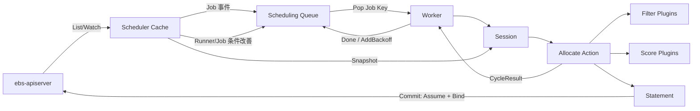

# Scheduler 设计

## 一、定位与范围

Scheduler 负责监听 `ebs/v1` Job 和 Runner，将尚未绑定的 Pending Job 分配到合适的 Runner：

```text
scheduler -> ebs-apiserver -> etcd
```

Scheduler 只通过 ebs-apiserver 读写资源，不直接访问 etcd，不执行 Job，也不维护 Runner 的本地执行状态。持久化绑定关系以 `Job.status.runner` 为准。

首版范围：

- 单个 Job 独立调度，不实现 PodGroup、Gang Scheduling 或 Project Queue。
- 不实现抢占、资源回收和资源预定。
- 单副本部署，不启用 leader election。
- 使用事件驱动队列；每次从队列取出一个 Job，创建一次独立调度周期。
- 使用固定的 Allocate Action 和静态 Plugin 列表，不支持运行时热加载。

设计借鉴 Volcano Scheduler 的 Cache、Session、Action、Plugin 和 Statement 分层。Volcano 面向 Kubernetes 批量任务的 Queue、PodGroup、Gang、Preempt、Reclaim 和 Backfill 不属于首版范围。

## 二、设计目标

| 目标 | 说明 |
|------|------|
| watch 驱动 | 监听全局 Job 和 Runner 变化，及时触发调度 |
| 缓存快照 | 每个调度周期基于一致的只读快照执行 Filter 和 Score |
| 策略分层 | Action 编排流程，Plugin 提供过滤和打分算法 |
| 原子预占 | Bind 前在本地预占资源，避免正常并发调度超卖；BindUnknown 恢复窗口属于首版已接受限制 |
| 幂等绑定 | 只绑定 Pending 且未设置 Runner 的 Job，使用 resourceVersion 处理冲突 |
| 可恢复 | watch 重连、全量 relist 和指数退避形成完整恢复闭环 |
| 可观测 | 暴露队列、调度周期、插件结果、Bind 和预占相关指标 |

## 三、API 交互

### 3.1 List/Watch Job

Scheduler 使用全局 Job API：

```text
GET /apis/ebs/v1/jobs
GET /apis/ebs/v1/jobs?watch=true&resourceVersion={resourceVersion}
```

首版不依赖 field selector，在本地筛选：

```text
job.status.phase == "Pending" && job.status.runner == ""
```

Job Key 固定为：

```text
{metadata.namespace}/{metadata.name}
```

缓存、队列、退避记录和 assumed cache 都必须使用完整 Job Key，并同时保存 `metadata.uid`，防止同名 Job 删除重建后误匹配。

### 3.2 List/Watch Runner

```text
GET /apis/ebs/v1/runners
GET /apis/ebs/v1/runners?watch=true&resourceVersion={resourceVersion}
```

Scheduler 使用以下字段：

- `metadata.name`
- `metadata.labels`
- `spec.type`
- `spec.arch`
- `spec.unschedulable`
- `spec.taints`
- `status.phase`
- `status.allocatable`

Runner 使用 `metadata.name` 作为缓存键。

### 3.3 Bind Job

Job 是 Project 级资源。Scheduler 从 `metadata.namespace` 获取 Project，通过 status 子资源完成绑定：

```text
PUT /apis/ebs/v1/projects/{project}/jobs/{name}/status
```

Scheduler 对 Job status 的字段所有权按操作划分：

- 绑定 Job 时拥有 `status.phase` 和 `status.runner`。

```yaml
status:
  phase: Running
  runner: runner-ct-aarch64-01
```

Scheduler 不拥有也不修改 `status.message`，也不负责把非法或不可调度 Job 写为 Aborted；非法输入的防御性处理见 5.2 节。

`startTime` 由 Runner 在真正开始执行时填写。Scheduler 构造任何 status 更新对象时必须 DeepCopy 最新 Job，只修改当前操作拥有的字段，保留其他 status 字段并携带当前 `metadata.resourceVersion`，不能用部分 status 对象覆盖整个 status。

Bind 成功必须同时满足：

- Job UID 与调度周期开始时一致。
- Job 仍为 Pending。
- `status.runner` 仍为空。
- resourceVersion 未发生冲突。

首版接受 Runner 在本地 Assume 成功后、Job status 更新前被删除或变为不可调度的短暂竞态。Scheduler 不在 Bind 前额外 GET Runner，ebs-apiserver 也不为本次 status 更新提供 Runner 存在性事务校验；因此 UpdateStatus 成功即视为 Bind 成功，不因随后观察到 Runner 变化而回滚 Job。Runner 离线以及已经绑定 Job 的恢复由 Job 执行状态管理流程处理，不属于 Scheduler 首版职责。除 8 节明确接受的 BindUnknown 恢复窗口外，该取舍不会破坏本地并发容量控制，但不保证 Bind 时 Runner 仍然存在。

### 3.4 客户端接口契约

Scheduler 在 `pkg/client` 中封装 ebs-apiserver REST 调用，对 Cache 和 Statement 暴露以下最小接口：

```go
type JobInterface interface {
    List(ctx context.Context, opts metav1.ListOptions) (*ebsv1.JobList, error)
    Watch(ctx context.Context, opts metav1.ListOptions) (watch.Interface, error)
    Get(ctx context.Context, project, name string, opts metav1.GetOptions) (*ebsv1.Job, error)
    UpdateStatus(
        ctx context.Context,
        project, name string,
        job *ebsv1.Job,
        opts metav1.UpdateOptions,
    ) (*ebsv1.Job, error)
}

type RunnerInterface interface {
    List(ctx context.Context, opts metav1.ListOptions) (*ebsv1.RunnerList, error)
    Watch(ctx context.Context, opts metav1.ListOptions) (watch.Interface, error)
}

type Interface interface {
    Jobs() JobInterface
    Runners() RunnerInterface
}

type WriteOutcome string

const (
    WriteNotSent  WriteOutcome = "NotSent"
    WriteRejected WriteOutcome = "Rejected"
    WriteUnknown  WriteOutcome = "Unknown"
)

type WriteError struct {
    Outcome WriteOutcome
    Err     error
}

func (e *WriteError) Error() string
func (e *WriteError) Unwrap() error
```

`WriteError` 只用于写请求失败，`Outcome` 是客户端与 Statement 之间的稳定契约：

- `WriteNotSent`：输入校验、序列化、DNS、TLS 握手或建立连接失败，能够确认请求未发送。
- `WriteRejected`：收到完整 HTTP/Kubernetes Status 响应，能够确认本次请求未被接受；底层 `Err` 必须保留 `APIStatus`，供 `apierrors.IsConflict` 等方法判断。
- `WriteUnknown`：请求可能已经发送，但未取得能够确认结果的完整响应。

`UpdateStatus` 成功时直接返回对象和 nil；失败时必须返回 nil 和 `*WriteError`。调用方使用 `errors.As` 读取 `Outcome`，不得根据错误字符串或单独的 EOF、timeout 类型推断请求是否已发送。无法可靠证明 `NotSent` 或 `Rejected` 的错误一律归为 `WriteUnknown`。

方法与 REST 路径固定映射为：

| 方法 | HTTP 请求 |
|------|-----------|
| `Jobs().List` | `GET /apis/ebs/v1/jobs` |
| `Jobs().Watch` | `GET /apis/ebs/v1/jobs?watch=true` |
| `Jobs().Get(project, name)` | `GET /apis/ebs/v1/projects/{project}/jobs/{name}` |
| `Jobs().UpdateStatus(project, name, job)` | `PUT /apis/ebs/v1/projects/{project}/jobs/{name}/status` |
| `Runners().List` | `GET /apis/ebs/v1/runners` |
| `Runners().Watch` | `GET /apis/ebs/v1/runners?watch=true` |

`project` 和 `name` 必须分别来自缓存 Job 的 `metadata.namespace` 和 `metadata.name`，不能为空，也不能从 Job payload、label 或命令行参数推导。路径段必须使用 URL path escaping。客户端拒绝调用方在 `ListOptions` 中设置 `Watch=true` 后调用 `List`，`Watch` 方法则统一覆盖为 `Watch=true`。

客户端使用 `k8s.io/client-go/rest.RESTClient` 和 `ebs-api/ebs/v1` Scheme 完成参数编码、JSON 序列化和 watch event 解码，不在首版生成 ClientSet、Informer 或 Lister。必须注册 `ebsv1.AddToScheme` 和 Kubernetes metav1 类型，并设置稳定的 User-Agent，例如 `eulermaker-scheduler/{version}`。

#### Informer 适配

Cache 为两个类型分别提供 `cache.ListerWatcher` 适配器：

```go
type jobListerWatcher struct {
    client JobInterface
    ctx    context.Context
}

func (l *jobListerWatcher) List(opts metav1.ListOptions) (runtime.Object, error)
func (l *jobListerWatcher) Watch(opts metav1.ListOptions) (watch.Interface, error)

type runnerListerWatcher struct {
    client RunnerInterface
    ctx    context.Context
}

func (l *runnerListerWatcher) List(opts metav1.ListOptions) (runtime.Object, error)
func (l *runnerListerWatcher) Watch(opts metav1.ListOptions) (watch.Interface, error)
```

适配器从 Scheduler 生命周期 context 派生请求 context；Scheduler 关闭时必须取消正在进行的 list/watch。Informer 负责 list/watch 重连和 resourceVersion 过期后的 relist，REST 客户端不得在内部再启动独立重连循环。

#### 请求与返回语义

- `List` 和 `Watch` 必须原样传递 `resourceVersion`、`timeoutSeconds`、`allowWatchBookmarks` 和 selector 等标准 `ListOptions`；首版 Scheduler 本身不设置 Job field selector。
- 普通 `List`、`Get` 和 `UpdateStatus` 使用 `--request-timeout`；watch 不使用该短超时，由 `ListOptions.TimeoutSeconds` 和生命周期 context 控制。
- `UpdateStatus` 必须发送完整 Job 对象。对象的 namespace/name 必须与方法参数一致，并携带非空 `metadata.uid` 和 `metadata.resourceVersion`，否则客户端在发出请求前返回输入错误。
- `UpdateStatus` 返回 apiserver 持久化后的最新 Job。Statement 以返回对象的 UID、runner、phase 和 resourceVersion 作为 Bind 成功结果，不使用请求对象猜测服务端状态。
- 客户端将 Kubernetes `Status` 错误保留为 `apierrors.APIStatus`，使上层能够使用 `IsConflict`、`IsNotFound`、`IsUnauthorized`、`IsForbidden`、`IsTooManyRequests` 和 `SuggestsClientDelay` 分类处理；不得只返回格式化字符串。
- 响应对象归调用方所有，但写入 informer cache 的对象仍视为只读。客户端不得缓存或复用可变的请求、响应对象。

#### 重试责任

REST 客户端只负责传输，不自动重放写请求：

- list/watch 重连由 Informer 负责。
- Bind 冲突、429、5xx 和网络错误由 Statement 分类并返回结果，由 worker 按第九节策略终结本次队列条目。
- `UpdateStatus` 不得在客户端内部自动重试，避免使用过期 resourceVersion 重放写入。
- 只允许 client-go transport 执行不会产生第二次应用层写入的底层连接处理。

REST client 必须在 transport 的请求生命周期中记录是否已经开始发送请求，并将写失败归类为“明确未写入”和“写入结果未知”：

- apiserver 明确返回 Conflict、429、其他 4xx 或 5xx 状态时，按明确失败处理。
- 参数校验、序列化、TLS 握手、DNS 或建立连接阶段失败时，请求尚未发送，按明确失败处理。
- 请求发送后发生 context deadline exceeded、响应读取超时、EOF、unexpected EOF、connection reset 或其他无法确认响应的传输错误时，按写入结果未知处理。客户端不得把这类错误转换成普通可重试错误并立即重放。

测试使用同一组接口注入线程安全 fake client。fake 必须支持 resourceVersion 冲突、NotFound、延迟 watch、watch 关闭和 context 取消，不能通过直接访问具体 RESTClient 模拟这些场景。

## 四、总体架构



### 4.1 Cache

Cache 是 apiserver 对象的本地镜像，基于 `client-go/tools/cache` 实现：

- 为 Job 和 Runner 分别创建 `ListWatch`、`SharedIndexInformer` 和 Indexer。
- Job Indexer 的 key function 返回 `{namespace}/{name}`。
- Job 增加 `status.runner`、`status.phase` 索引，用于统计 Runner 上 Running Job 的资源占用。
- Runner 使用默认名称索引。
- informer 对象只读；所有需要修改的对象必须先 DeepCopy。

不自行实现 Reflector、DeltaFIFO 或通用 Indexer。

启动顺序：

1. 创建空的 SchedulerCache 和 SchedulingQueue。
2. 创建 Job、Runner informer，在 informer 启动前注册 event handler，并保存两个 `ResourceEventHandlerRegistration`。
3. 启动 Job 和 Runner informer；初始 List 中的对象全部通过 event handler 增量写入 SchedulerCache，Pending 且未绑定的 Job 同时进入 Queue。
4. 同时等待两个 informer 的 `HasSynced()` 和两个 handler registration 的 `HasSynced()`。registration 的同步表示初始 List 中的事件已经实际交付给该 handler，而不只是进入 Indexer。
5. 同步完成后校验 SchedulerCache 内部索引和资源占用不变量，启动 assumed confirmer 和调度 worker。
6. readiness 变为成功。

任一 informer 或 handler registration 尚未同步时不得启动 worker，也不得报告 ready。等待过程必须接受 Scheduler 生命周期 context；context 取消或同步失败时直接退出，不使用未完整初始化的 Cache。

首版不在启动阶段从 Indexer 再构造并整体替换 SchedulerCache，也不执行独立 Reconcile。event handler 是 SchedulerCache 中 Job、Runner 和 Running 占用的唯一输入路径；初始 List、后续 Watch、relist 和 resync 均基于 SchedulerCache 中的已存状态使用相同的幂等 old/new 差量逻辑，不得重复累加回调对象，因此不存在锁外旧快照覆盖较新事件的问题。启动时 assumed 为空。

#### Cache 数据模型

首版不直接在调度周期中读取 Informer Indexer。Informer event handler 将对象同步到 Scheduler 自己维护的状态表，所有调度快照和资源预占均从该状态表读取。

纯调度模型位于 `pkg/framework`，完整包边界见第十三节。`pkg/cache` 只定义缓存内部状态、assumed 状态和操作参数，并负责生成 `framework.Snapshot`。后续代码片段为简洁省略部分 `framework.` 前缀。

```go
type SchedulerCache struct {
    mu sync.RWMutex

    jobs            map[string]*JobState
    runners         map[string]*RunnerState
    runningUsage    map[string]framework.Resource
    runningJobCount map[string]int64
    assumedByJob    map[string]*AssumedJob
    assumedByRunner map[string]map[string]*AssumedJob
    nextAssumeGeneration uint64
}

type JobState struct {
    Job      *ebsv1.Job
    Requests framework.Resource
    Invalid  error
}

type RunnerState struct {
    Runner      *ebsv1.Runner
    Allocatable framework.Resource
    Invalid     error
    Revision    uint64
}

```

`RunnerSnapshot` 和 `Snapshot` 的结构见 4.2 节，`Resource` 见 5.2 节。

`JobState` 和 `RunnerState` 在写入 Cache 时完成资源解析，避免每个调度周期重复解析字符串。缓存中的 Kubernetes 对象仍视为只读；写入时保存 DeepCopy，返回 Snapshot 时再次 DeepCopy，任何调用方都不能持有 Cache 内部对象的可变指针。

`RunnerState.Revision` 是 Scheduler 进程内的调度版本，不写入 API。Runner 的 phase、spec、labels、allocatable 或该 Runner 上 Running Job 的集合发生调度相关变化时递增；只更新 heartbeat、addresses 等无关字段时不递增。assumed 变化不递增 Revision，由原子容量检查直接处理。

#### Cache 接口

Cache 对其他包只暴露以下同步接口：

```go
type Cache interface {
    Snapshot(jobKey string, uid types.UID) (*framework.Snapshot, error)
    Assume(request AssumeRequest) (generation uint64, err error)
    Forget(jobKey string, uid types.UID, generation uint64) bool
    GetAssumed(jobKey string, uid types.UID) (*AssumedJob, bool)
    ClaimExpiredAssumed(
        now time.Time,
        retryAfter time.Duration,
        limit int,
    ) []*AssumedJob
}

type AssumeRequest struct {
    JobKey                string
    JobUID                types.UID
    RunnerName            string
    RunnerUID             types.UID
    RunnerRevision        uint64
    Requests              framework.Resource
    JobResourceVersion    string
}
```

`Snapshot` 在 `RLock` 内检查 Job Key 和 UID，复制目标 Job、全部 Runner、Running 占用和 assumed 占用，然后释放锁。返回结果是该调用瞬间的一致只读视图；不同 Informer 的 apiserver resourceVersion 不要求相同，但所有已经进入 SchedulerCache 的事件必须以同一个锁边界被观察。

`Assume` 在一次 `Lock` 临界区内完成：

1. 校验缓存 Job 的 Key、UID、resourceVersion、phase 和 runner；resourceVersion 必须等于 `JobResourceVersion`，Job 必须仍为 Pending 且未绑定。
2. 校验 Runner 存在，且 UID、`Revision` 分别等于 `RunnerUID`、`RunnerRevision`；任一不相等都返回 `ErrStaleSnapshot`，由新周期重新执行全部 Filter 和 Score。
3. 基于当前 allocatable、Running 占用和全部 assumed 记录重新计算 available。
4. 容量满足时分配新的 Generation，同时写入 `assumedByJob` 和 `assumedByRunner` 并返回 Generation；否则返回 `ErrStaleSnapshot`。

同一 Job UID 已存在 assumed 记录时，完全相同的 Runner UID、Runner Revision、requests 和 Job resourceVersion 视为幂等重试，返回已有 Generation；任一字段不同都返回 `ErrStaleSnapshot`。`Forget` 只有在 Job Key、UID 和 Generation 全部匹配时才删除记录并返回 true，旧周期不能删除新周期的预占。Informer handler 在持有写锁时使用内部清理函数，可根据已经观察到的对象状态清理对应记录，不经过对外 `Forget` 接口。

因此 Commit 阶段不需要在旧 Session 上重新运行插件：任何影响 Filter 或 Score 的 Runner/占用变化都会使 Revision 失效；其他 worker 新增的 assumed 记录则通过步骤 3 的容量复算防止超卖。

#### Informer 事件更新

Job event handler 在一次 `Lock` 中原子完成以下操作：

- 按 `{namespace}/{name}` 和 UID 更新或删除 `jobs`。
- 从旧 Job 的 Runner 占用中扣除旧 requests，再把新 Job 的 requests 加入新 Runner；只有 `phase=Running` 且 runner 非空的 Job计入 Running 占用。
- 同一 UID 的 Job 被观察为已经绑定到 assumed Runner 时，在增加 Running 占用的同一临界区内删除 assumed，避免出现重复扣减或短暂未扣减。
- Job 删除、UID 改变或绑定到其他 Runner 时清理旧 assumed。
- Running Job 集合变化时递增受影响 Runner 的 Revision。

Runner event handler 在一次 `Lock` 中更新或删除 `runners`。只有调度相关字段变化才递增 Revision；Runner 删除时保留已经存在的 assumed 记录，等待进行中的 Bind 或后续确认流程处理。assumed 记录同时保存 Runner UID，不能把预占容量转移到同名重建的新 Runner。

如果 Runner 在 `Assume` 返回后才被删除，已经进入 REST Bind 阶段的 Statement 可以继续提交；此时 Runner handler 不主动 Forget 该 Statement 的 assumed 记录。Bind 明确失败时由 Statement Forget，写入结果未知或 Bind 成功时按正常 watch/超时确认流程清理。新调度周期不会再选择已经从 Cache 删除的 Runner。

#### 锁和调用顺序

首版只使用 `SchedulerCache.mu` 保护上述所有状态，不再增加 per-Runner 锁或独立 assumed cache 锁。临界区只允许内存复制、比较、资源加减和 map 更新：

- 不得在持有 Cache 锁时执行 REST 请求、插件、日志格式化或指标上报。
- 不得在持有 Cache 锁时调用 SchedulingQueue；handler 先在锁内更新状态并记录所需的 Add/Delete/Activate 动作，释放锁后再操作队列。
- worker 从 Queue Pop/Done 后才能调用 Cache，但不得同时持有 Queue 内部锁和 Cache 锁。
- Statement 先调用 `Assume` 并保存返回的 Generation，释放 Cache 锁后再执行 Job GET 和 UpdateStatus；明确未写入时携带该 Generation 调用 `Forget`，写入结果未知时保留 assumed。
- assumed 超时确认先在锁内复制记录，释放锁后 GET Job，再次加锁时必须重新比较 Job Key、UID 和 Generation，只有记录仍是同一代时才能确认或删除。

所有 Cache 写操作必须具有幂等的 old/new 差量语义，不能以“在现有 usage 上重复累加当前对象”的方式处理 resync。以上规则使锁顺序固定为“Queue 操作结束 → Cache 操作 → 释放 Cache → 外部调用”，不存在反向持锁调用。

| 操作 | 锁模式 | 锁内行为 |
|------|--------|----------|
| `Snapshot`、`GetAssumed` | `RLock` | 查找并复制，不返回内部指针 |
| Job/Runner handler | `Lock` | 应用 old/new 差量，更新状态、占用、Revision 和 assumed 索引 |
| `Assume` | `Lock` | 校验快照版本、复算容量、分配 Generation、写入双索引 |
| `Forget` | `Lock` | 匹配 UID 和 Generation 后删除双索引 |
| `ClaimExpiredAssumed` | `Lock` | 领取到期记录、推迟 NextCheckAt 并返回副本 |
| Filter、Score、REST、Queue、指标 | 不持有 Cache 锁 | 只操作快照或外部组件 |

### 4.2 Session

framework 中的快照与 Session 定义如下。Session 表示一次 Job 调度周期的只读视图，作用类似 Volcano 的 scheduling session，但首版只处理一个 Job：

```go
type RunnerSnapshot struct {
    Runner          *ebsv1.Runner
    Allocatable     Resource
    Available       Resource
    RunningJobCount int64
    AssumedJobCount int64
    Revision        uint64
    Invalid         error
}

type Snapshot struct {
    Job       *ebsv1.Job
    Requests  Resource
    Runners   map[string]*RunnerSnapshot
    CreatedAt time.Time
}

type Session struct {
    CycleID       string
    Job           *ebsv1.Job
    Runners       map[string]*RunnerSnapshot
    OpenedAt      time.Time
    FilterPlugins []FilterPlugin
    ScorePlugins  []ScorePlugin
}
```

Session 创建时从 Cache 复制当前 Job、Runner 和资源占用。Filter、Score 在同一 Session 内必须读取相同快照，不能在插件执行过程中重新读取 informer 对象。

Session 关闭后不得继续使用其中的对象。Bind 前必须重新读取最新 Job 验证 UID、phase、runner 和 resourceVersion；Runner 身份、版本和可用资源由 Statement Commit 调用 `SchedulerCache.Assume` 原子确认。

### 4.3 Action

Action 负责调度流程编排，Plugin 只负责算法判断。首版只有固定的 `Allocate` Action：

```go
type Action interface {
    Name() string
    Execute(context.Context, *Session) *CycleResult
}

type QueueAction string

const (
    QueueDone       QueueAction = "Done"
    QueueAddBackoff QueueAction = "AddBackoff"
)

type CycleResult struct {
    Code              ResultCode
    JobKey            string
    JobUID            types.UID
    RunnerName        string
    Reason            string
    Err               error
    QueueAction       QueueAction
}
```

`JobUID` 和 `QueueAction` 是必填字段，`QueueAction` 只能是 `QueueDone` 或 `QueueAddBackoff`。完整结果映射与 worker 终结规则见第九节。

Allocate 顺序：

1. 按 5.2 节校验 Job 调度输入；非法输入返回 `UnschedulableError/QueueDone`。
2. 按 Runner 名称升序构造候选列表。
3. 依次运行 Filter Plugin。
4. 对通过过滤的 Runner 运行 Score Plugin。
5. 选择总分最高的 Runner；同分时名称升序。
6. 创建 Statement 并尝试 Commit。
7. 将调度结果归一为 `CycleResult` 并返回。

### 4.4 Plugin

首版使用静态注册的接口，不实现配置化 tier 或动态插件加载：

```go
type StatusCode string

const (
    Success       StatusCode = "Success"
    Unschedulable StatusCode = "Unschedulable"
    Error         StatusCode = "Error"
)

type Status struct {
    Code    StatusCode
    Plugin  string
    Reason  string
    Err     error
}

type FilterPlugin interface {
    Name() string
    Filter(context.Context, *Session, *RunnerSnapshot) *Status
}

type ScorePlugin interface {
    Name() string
    Score(context.Context, *Session, *RunnerSnapshot) (int64, *Status)
    Weight() int64
}
```

`Unschedulable` 表示当前快照下不满足条件，可以因 Runner 变化而恢复；`Error` 表示插件或输入处理异常。Plugin 不得修改 Cache、Session、Job 或 Runner。

### 4.5 Statement

Statement 管理本次周期的本地预占和 Job status 提交，借鉴 Volcano Statement 的 Commit/Discard 语义。实现放在独立的 `pkg/statement`，职责仅限于调用 Cache 的 `Assume`/`Forget` 以及执行 Job GET/UpdateStatus，不持有也不调用 SchedulingQueue。它通过构造函数注入 `cache.Cache` 和 `client.JobInterface`，不得依赖 Scheduler、Action、Plugin 或 Queue：

```go
type Request struct {
    JobKey             string
    JobUID             types.UID
    RunnerName         string
    RunnerUID          types.UID
    RunnerRevision     uint64
    Requests           framework.Resource
    JobResourceVersion string
}

type State string

const (
    StateNew       State = "New"
    StateAssumed   State = "Assumed"
    StateCommitted State = "Committed"
    StateUnknown   State = "Unknown"
    StateDiscarded State = "Discarded"
)

type Statement struct {
    cache            cache.Cache
    jobs             client.JobInterface
    request          Request
    assumeGeneration uint64
    state            State
    commitErr        error
}

func (s *Statement) Commit(ctx context.Context) error
func (s *Statement) Discard()

func New(
    schedulerCache cache.Cache,
    jobs client.JobInterface,
    request Request,
) (*Statement, error)
```

`New` 校验依赖和 Request 的必填字段；失败时返回 `nil, error`，成功时创建 `StateNew` 的 Statement。Statement 只允许由创建它的调度周期 goroutine 串行使用，因此内部不增加 mutex。状态、assumed 所有权和允许操作固定如下：

| 状态 | assumed 所有权 | 再次 `Commit` | `Discard` |
|------|----------------|---------------|-----------|
| New | 尚未创建 | 执行首次 Commit | 转为 Discarded，不调用 Forget |
| Assumed | Statement | 不允许重入；首次 Commit 正在串行推进 | 调用至多一次 Forget 后转为 Discarded |
| Committed | Job watch/assumed confirmer | 返回已保存的 nil | 幂等空操作，不得 Forget |
| Unknown | Job watch/assumed confirmer | 返回已保存的 `ErrBindOutcomeUnknown` | 幂等空操作，不得 Forget |
| Discarded | 无 | 返回已保存错误 | 幂等空操作 |

状态只能从 New 进入 Assumed 或 Discarded，再从 Assumed 进入 Committed、Unknown 或 Discarded；后三者均为终态。`commitErr` 保存 Commit 或提前 Discard 产生的终结结果。

`Commit` 用于绑定 Job，必须按以下顺序执行：

1. 只有 `StateNew` 可以开始首次 Commit。调用 `SchedulerCache.Assume`，在同一锁内校验 Job、Runner UID、Runner Revision 和当前容量，并写入双索引 assumed 记录；成功时保存 Generation 并进入 `StateAssumed`；失败时进入 `StateDiscarded`，保存并返回 `ErrStaleSnapshot`。
2. Cache 解锁后 GET 最新 Job，验证 UID、phase、runner 和用于本次决策的 resourceVersion。
3. 使用 GET 返回的最新 resourceVersion 更新 Job status。
4. GET、校验失败，或 UpdateStatus 明确返回未写入错误时，立即携带 Generation 调用 `Forget`，进入 `StateDiscarded` 并保存对应错误。`Forget` 返回 false 表示记录已由 handler 清理或替换，不改变本次错误分类，也不得再次清理。
5. UpdateStatus 返回写入结果未知的错误时，不调用 `Forget`，进入 `StateUnknown`，保存并返回 `ErrBindOutcomeUnknown`；assumed 的所有权转交给 Job watch 和超时确认流程。
6. UpdateStatus 返回成功后校验响应对象：对象必须非 nil，UID 必须与 Request 一致，phase 必须为 Running，runner 必须为目标 Runner，resourceVersion 必须非空。全部满足时进入 `StateCommitted`，保存 nil 并保留 assumed，等待 Job watch 确认；任一条件不满足都说明客户端取得了成功响应但无法证明预期绑定结果，必须进入 `StateUnknown`，保存并返回包装了 `ErrBindOutcomeUnknown` 的错误，reason 固定为 `unexpected-success-response`。

成功响应异常后不得调用 Forget、不得把响应对象写入 SchedulerCache、不得重放 UpdateStatus，也不得根据请求对象自行构造 Running Job。Action 必须返回 `BindUnknown/QueueDone`；后续只允许 Job watch 或 assumed confirmer GET 的权威对象确认和清理该预占。

UpdateStatus 明确返回 Conflict 时，`Commit` 必须先 `Forget`，再 GET 一次最新 Job：若仍为同一 UID、Pending 且未绑定，返回 `ErrConflictRetryable`；若 Job 已删除、UID 改变、非 Pending 或已经绑定，返回 `ErrJobNoLongerSchedulable`。二次 GET 临时失败返回对应的明确 client 错误，由 Action 归为 `InternalError/QueueAddBackoff`；401/403 按第九节停止新调度。Action 不直接调用 Job client 补充判断。

首次 Commit 前调用 Discard 时保存 `ErrStatementDiscarded`；Assumed 状态下调用 Discard 时携带 UID 和 Generation 调用至多一次 Forget。Action 可以使用 `defer statement.Discard()` 兜底，因为 Committed 和 Unknown 状态下该调用不会释放 assumed。Action、Plugin 和 Statement 不调用 Queue，终结职责统一见第九节。

## 五、资源模型

### 5.1 首版资源范围

Go 首版只使用 `cpu` 和 `memory` 进行容量过滤与打分。`ephemeral-storage` 当前由 Runner 上报实时可用空间，其语义不同于 CPU、Memory 的容量基数；在统一上报和占用模型前不参与调度。

所有数量使用 `k8s.io/apimachinery/pkg/api/resource.Quantity` 解析和比较，不转换为浮点数。

### 5.2 Resource

`Resource` 定义在 `pkg/framework`，Cache、Statement 和 Plugin 共同使用该值类型，不在各包定义别名或转换结构：

```go
type Resource struct {
    CPU    resource.Quantity
    Memory resource.Quantity
}
```

解析规则：

| 场景 | 处理 |
|------|------|
| Job 未请求某项资源 | request 按 0 计算 |
| Job request 非法、为负数 | 记录非法对象日志和指标，本周期以 `UnschedulableError/QueueDone` 结束，不写 Job status |
| Runner 未声明 Job 请求的资源 | 该 Runner 容量不足 |
| Runner allocatable 非法或为负数 | 过滤该 Runner，并记录错误指标 |
| Running Job 存在非法 request | 该 Runner 的资源视图无效，本周期过滤该 Runner |
| available 计算结果小于 0 | 按 0 使用并记录资源超配指标 |

零 request 合法；零 allocatable 只能承载没有请求该资源的 Job。

CPU、Memory request 以及 toleration 的格式和取值应由 ebs-apiserver 校验，非法对象原则上不能写入存储。Scheduler 仍执行防御性校验，以兼容历史数据或服务端校验缺陷；发现非法 Job 时不写 status、不退避重试，使用 `QueueDone` 结束本周期并增加 `scheduler_invalid_jobs_total{reason}`。同一 UID 的 spec 等调度相关字段更新会由 watch 再次 `Add`，从而允许用户修正后恢复调度。Runner 自身字段非法只淘汰该 Runner；当所有 Runner 都因此被淘汰时按 `Unschedulable` 退避，等待 Runner 更新。

### 5.3 可用资源

```text
available(runner) = runner.status.allocatable
                  - sum(requests of Running Jobs bound to runner)
                  - sum(requests of unconfirmed assumed Jobs on runner)
```

assumed 向 Running 占用的转移按 4.1 节 Job event handler 的原子更新规则执行。

## 六、调度插件

### 6.1 Filter Plugin

按以下顺序执行；任一插件返回非 Success 即停止该 Runner 的后续过滤：

| 顺序 | 插件 | 规则 |
|------|------|------|
| 1 | PhaseFilter | Runner phase 必须为 `Idle` 或 `Running` |
| 2 | UnschedulableFilter | `spec.unschedulable` 必须为 false |
| 3 | RuntimeFilter | Job `spec.runtime` 必须等于 Runner `spec.type` |
| 4 | NodeSelectorFilter | Job selector 的每个键值必须精确匹配 Runner labels |
| 5 | TaintFilter | Runner 的硬性 taint 必须被 Job tolerations 容忍 |
| 6 | CapacityFilter | CPU、Memory available 必须满足 requests |

`spec.runtime` 使用 apiserver 默认值，未填写时为 `ct`。RuntimeFilter 匹配结构化字段，不依赖 `ebs.io/runner-type` 标签。

TaintFilter 规则：

- `NoSchedule` 和 `NoExecute` 作为硬性过滤条件。
- `PreferNoSchedule` 不在 Filter 阶段淘汰，在 Score 阶段降低分数。
- Toleration 首版支持 Kubernetes 语义的 `Equal` 和 `Exists`；空 operator 按 `Equal`。
- Job toleration 的非法 operator 或 effect 按 5.2 节终止整个周期并记录非法对象，不写 Job status，也不能只淘汰当前 Runner后继续选择其他 Runner。
- toleration effect 为空时匹配该 key 对应的全部 effect；`Exists` 忽略 value，`Equal` 要求 key 和 value 都相等。

### 6.2 Score Plugin

单项分数范围为 `[0, 100]`，分数越高越优先。

#### LeastAllocated

```text
cpuScore = floor((availableCPU - requestedCPU) * 100 / allocatableCPU)
memoryScore = floor((availableMemory - requestedMemory) * 100 / allocatableMemory)
score = floor(sum(可计算资源的 resourceScore) / 可计算资源数量)
```

每项 `resourceScore` 以及最终 score 都截断到 `[0, 100]`。只计算 Runner 声明且 allocatable 大于零的资源；没有可计算资源时得 0 分。权重为 60。

计算必须保持 `resource.Quantity` 的十进制精度：将 remaining 和 allocatable 规范化到相同十进制 scale 后，使用 `math/big.Int` 执行非负整数的乘法、除法和向下取整。不得使用 `float64`、`AsApproximateFloat64`、`Value()` 或 `MilliValue()` 计算比例，避免精度损失和 `remaining * 100` 溢出。CapacityFilter 已保证 remaining 非负且不小于本次 request；如果防御性计算仍得到负数，则按 0 分并记录内部错误指标。

#### BalancedJobs

```text
jobCount = runningJobCount + assumedJobCount
score = 100 / (1 + jobCount)
```

权重为 40。

#### TaintPreference

Runner 每存在一个未被容忍的 `PreferNoSchedule` taint 扣 20 分，最低为 0。该插件权重为 10。

#### 汇总与选择

```text
finalScore = sum(pluginScore * pluginWeight) / sum(pluginWeight)
```

使用整数计算并截断到 `[0, 100]`。选择最高分 Runner；同分时按 `metadata.name` 升序，保证结果稳定。

## 七、Scheduling Queue

### 7.1 数据结构

```go
type QueuedJob struct {
    Key         string
    UID         types.UID
    Priority    int64
    Sequence    uint64
    Retries     int
    ReadyAt     time.Time
    Schedulable bool
}

type SchedulingQueue interface {
    Add(*ebsv1.Job)
    AddBackoff(*QueuedJob, error)
    ActivateAll()
    Delete(key string, uid types.UID)
    Pop() (*QueuedJob, bool)
    Done(*QueuedJob)
    ShutDown()
}
```

`AddBackoff` 是一次 `Pop` 的终结操作：它必须在 Queue 的同一个锁临界区内移除匹配 Key 和 UID 的 `inFlight` 条目，并根据 dirty 和 activated 状态决定进入 `activeQ`、`backoffQ` 或结束。调用后不得再对同一调度周期调用 `Done`。`Done` 与 `AddBackoff` 是互斥的终结路径，每次成功 `Pop` 得到的条目最终必须且只能选择其中一个；二者对已经终结或 UID 不匹配的旧条目执行时均为幂等空操作。

内部包含：

- `activeQ`：大顶堆，Priority 高者优先，同优先级按 Sequence FIFO。
- `backoffQ`：小顶堆，ReadyAt 早者优先。
- `inFlight`：已经被 worker 取出但尚未通过 Done 或 AddBackoff 终结的条目。
- `dirty`：`map[string]*QueuedJob`，保存 Job 在处理期间收到的最新队列快照，而不是仅保存布尔标记。
- `activated`：`map[string]types.UID`，记录 `ActivateAll` 期间仍处于 inFlight 的条目；UID 用于防止激活标记作用于同名重建的新对象。
- `notifyCh`：容量为 1 的非阻塞唤醒通道，用于通知正在等待的 `Pop` 重新检查 Queue 状态。
- `shutdownCh`：只在 `ShutDown` 中关闭一次的广播通道，用于同时唤醒全部等待中的 `Pop`。

event handler 根据最新 Job 计算 `QueuedJob.Schedulable`：仅当 Job 仍为 Pending 且 `status.runner` 为空时为 true。Job Key 已存在于 `inFlight` 时，`Add` 不修改正在执行的条目，而是按 Key 覆盖 `dirty` 中的旧值，使其始终保存最新 UID、priority 和可调度状态。

`QueuedJob.Priority` 固定取自 `Job.spec.priority`，未填写时 Go 零值为 0，直接使用 `int64` 比较，不做偏移或转换。priority 更新属于调度相关更新；同一 UID 的 active 条目原位修复堆，backoff 或 inFlight 条目按下述事件优先规则处理。

`Add` 必须在 Queue 的一个锁临界区内按以下规则处理，同一 Key 在 `activeQ`、`backoffQ` 和 `inFlight` 中至多存在一个主条目：

| 当前状态 | 最新 Job | `Add` 行为 |
|----------|----------|-------------|
| Queue 已关闭 | 任意 | 幂等空操作，不再接收新条目 |
| 不存在 | `Schedulable=true` | 创建 `Retries=0`、`ReadyAt` 为零值的新条目，分配新 Sequence 并加入 `activeQ` |
| 不存在 | `Schedulable=false` | 不创建条目 |
| `activeQ`，UID 相同 | `Schedulable=true` | 原位更新 priority 和其他最新字段，修复堆顺序；保留原 Sequence 和 Retries，不重复插入 |
| `activeQ`，UID 相同 | `Schedulable=false` | 从 `activeQ` 删除 |
| `backoffQ`，UID 相同 | `Schedulable=true` | 最新事件优先于旧退避；从 `backoffQ` 删除，设置 `Retries=0`、清空 `ReadyAt`、分配新 Sequence 并加入 `activeQ` |
| `backoffQ`，UID 相同 | `Schedulable=false` | 从 `backoffQ` 删除 |
| `inFlight`，UID 相同 | 任意 | 不修改 inFlight，使用最新 `QueuedJob` 覆盖 dirty；由 `Done` 或 `AddBackoff` 消费 |
| 任一状态，UID 不同 | `Schedulable=true` | 清理旧 UID 的 active/backoff/dirty/activated 状态；若旧 UID 仍在 inFlight，则把新对象写入 dirty，等待旧周期终结，否则作为 `Retries=0` 的全新对象加入 `activeQ` |
| 任一状态，UID 不同 | `Schedulable=false` | 清理旧 UID 的 active/backoff/dirty/activated 状态；若旧 UID 仍在 inFlight，则写入新 UID、`Schedulable=false` 的 dirty 记录，使旧周期终结时不再加入任何队列 |

只有新增 Job 或调度相关内容发生变化时才调用 `Add`。Informer resync 或仅有无关字段、resourceVersion 变化的更新不得取消 backoff；可通过比较 UID、priority、spec 以及 phase/runner 判断是否为有效更新。`Add` 将条目加入或移入 `activeQ` 后必须唤醒等待中的 worker。

`Delete(key, uid)` 不强制中断正在执行的 worker，也不取消其 context。它必须在 Queue 的一个锁临界区内按 UID 执行：

- 删除 `activeQ`、`backoffQ` 中 Key 和 UID 都匹配的条目，并清理对应 dirty 和 activated 状态。
- Key 位于 `inFlight` 且 UID 匹配时保留 inFlight，清理 activated，并写入同 Key、同 UID、`Schedulable=false` 的 dirty 墓碑；随后 `Done` 或 `AddBackoff` 只终结旧周期，不会重新入队。
- UID 不匹配时为幂等空操作，迟到的旧对象删除事件不得移除同名新对象。

调度流程不依赖 Queue Delete 中断正在执行的周期。Action/Statement 在 `Snapshot`、`Assume` 以及 Bind 前 GET 阶段依次校验 Job Key、UID、phase、runner 和 resourceVersion；Job 已删除、UID 改变或不再可调度时停止 Bind，必要时先携带 Generation 调用 `Forget`，并返回 `QueueDone`。worker 只根据结果调用 `Done` 或 `AddBackoff`；即使 Queue 状态已被 Delete 处理，终结操作也必须是安全的幂等操作。

`Done` 在 Queue 的同一个锁临界区内删除对应 `inFlight` 条目并读取、删除 dirty 和 activated 记录。`Done` 表示本周期不需要因调度结果重试，因此单独存在的 activated 标记不会使条目重新入队；是否重新入队仍由 dirty 中的最新 Job 状态决定：

- dirty 不存在时，本次处理结束，不重新入队。
- dirty 的 `Schedulable=false` 时不重新入队。
- dirty 的 `Schedulable=true` 时，使用 dirty 中的最新 UID 和 priority 创建新的 Sequence，并加入 `activeQ`；UID 相同表示原对象在处理期间发生更新，UID 不同表示同名对象已删除重建，此时必须丢弃旧周期的 retries 等状态并作为全新对象入队。

因此，worker Bind 成功后即使处理期间收到 Job 更新，`Done` 也不会将已经 Running 或已经绑定的 Job 再次加入 `activeQ`。

`AddBackoff` 同样必须在该锁临界区内读取并删除 dirty 和 activated 记录，且最新事件或激活事件优先于旧调度结果：

- dirty 和匹配 UID 的 activated 标记都不存在时，对 inFlight 条目的 `Retries` 加一，计算 `ReadyAt` 并加入 `backoffQ`。
- dirty 与 inFlight UID 相同且 `Schedulable=true` 时，不应用本次失败产生的退避；使用 dirty 中的最新 priority，设置 `Retries=0`、`ReadyAt` 为零值、分配新的 Sequence，并直接加入 `activeQ`。
- dirty 的 `Schedulable=false` 时结束处理，不加入任何队列。
- dirty 与 inFlight UID 不同且 `Schedulable=true` 时，旧调度结果不得影响新对象；使用 dirty 的 UID 和 priority，以 `Retries=0` 和新的 Sequence 作为全新对象加入 `activeQ`。
- dirty 不存在，但存在与 inFlight UID 匹配的 activated 标记时，保留当前 `Retries`，不应用本次失败产生的新退避，清空 `ReadyAt`、分配新的 Sequence，并直接加入 `activeQ`。

上述所有分支都已经终结本次 `Pop`，调用方不得随后调用 `Done`。

每个 Job Key 在四种状态间只能有一个逻辑条目。UID 变化视为新对象，必须清理旧 UID 的排队、退避和 assumed 状态。

### 7.2 退避

```text
duration = min(initial * 2^(retries-1), max)
```

`initial` 和 `max` 取第十一节配置值，并加入 `[0.8, 1.2]` 随机抖动。

无候选 Runner、快照过期、Bind 冲突和临时 API 错误进入 backoffQ。上下文取消或 Scheduler 关闭不增加 retries。

#### backoffQ 到期推进

`Pop` 是 backoffQ 到期条目进入 activeQ 的唯一时间驱动者，不再启动独立的 backoff goroutine。`Pop` 使用以下循环：

1. 获取 Queue 锁，若已关闭则返回 `nil, false`。
2. 将 backoffQ 中所有 `ReadyAt <= now` 的条目移入 activeQ，清空 `ReadyAt`，保留 `Retries` 和进入 backoffQ 时已分配的 `Sequence`。
3. activeQ 非空时，弹出最高优先级条目，写入 inFlight，解锁并返回。
4. activeQ 和 backoffQ 都为空时，解锁后同时等待 `notifyCh` 和 `shutdownCh`。
5. activeQ 为空但 backoffQ 非空时，记录堆顶 `ReadyAt`，解锁后同时等待该时刻的 timer、`notifyCh` 和 `shutdownCh`。任意一个触发后停止并排空 timer，然后回到第 1 步重新读取堆顶，不使用锁外保存的旧截止时间直接移动条目。

`AddBackoff` 将条目放入 backoffQ 时必须分配新的 `Sequence`。所有可能改变 `Pop` 决策的操作都在完成锁内状态变更后，对 `notifyCh` 执行一次非阻塞发送：

- `Add` 向 activeQ 插入条目。
- `AddBackoff` 插入第一个 backoff 条目，或新的 `ReadyAt` 早于原堆顶。
- `ActivateAll` 将条目移入 activeQ。
- `Delete` 删除当前 backoffQ 堆顶。
- `ShutDown` 在锁内将 Queue 标记为关闭，并通过 `sync.Once` 关闭 `shutdownCh`；关闭通道会广播唤醒全部 `Pop`，不依赖容量为 1 的 `notifyCh`。

`notifyCh` 已有未消费通知时允许丢弃重复通知，因为 `Pop` 被唤醒后会在锁内重新计算全部条件。不得在持有 Queue 锁时阻塞发送或等待 timer。多个 `Pop` 并发等待时，单次唤醒只需唤醒一个 worker；被唤醒的 worker 移入多个到期条目后，如 activeQ 仍非空，必须再发送一次通知唤醒其他 worker。

### 7.3 事件与激活

| 事件 | 队列操作 |
|------|----------|
| 新增 Pending Job | Add |
| Pending Job spec/priority 更新 | Add，更新条目并立即激活 |
| Job 进入非 Pending 状态 | Delete |
| Job 删除 | Delete，并清理 assumed 记录 |
| 新增可调度 Runner | ActivateAll |
| Runner 从不可调度变为可调度 | ActivateAll |
| Runner type、labels、taints、allocatable 改善 | ActivateAll |
| Running Job 进入终态并释放资源 | ActivateAll |

首版使用 `ActivateAll` 保证正确性，后续可按 Filter 失败原因建立精准激活索引。

`ActivateAll` 的语义固定为：

1. 在 Queue 的一个锁临界区内，将 `backoffQ` 的全部条目立即移入 `activeQ`。
2. 条目保留已有 `Retries`，清空 `ReadyAt`，避免条件反复变化时丢失历史失败信息。
3. 每个被移动的条目分配新的 Sequence，作为一次新的入队，并在完成后唤醒等待中的 worker。
4. `inFlight` 条目不移动，也不重复加入 `activeQ`；为其 Key 和 UID 写入 activated 标记。周期通过 `Done` 终结时消费并忽略该标记，周期通过 `AddBackoff` 终结时根据上述规则直接重新进入 `activeQ`。

重复调用 `ActivateAll` 必须幂等：已经位于 `activeQ` 的条目不重复插入，同一 Key 和 UID 的 inFlight 激活标记只保留一份。

## 八、Assumed Cache 与并发

```go
type AssumedJob struct {
    JobKey             string
    JobUID             types.UID
    RunnerName         string
    RunnerUID          types.UID
    RunnerRevision     uint64
    Requests           framework.Resource
    JobResourceVersion string
    Generation         uint64
    AssumedAt          time.Time
    NextCheckAt        time.Time
}
```

assumed 不是独立 Cache，而是 `SchedulerCache` 的组成部分，由同一个 `SchedulerCache.mu` 保护。它同时按 Job Key 和 Runner 名称建立索引；“读取 available、检查容量、分配 Generation、写入两个索引”必须在一次写锁临界区内完成。`Generation` 由 `nextAssumeGeneration` 单调递增，用于防止旧的超时确认协程删除 Job 后来创建的新预占。

首次 Assume 时设置：

```text
AssumedAt   = now
NextCheckAt = now + assumeTimeout
```

生命周期：

1. Statement Commit 在 Bind 前原子 assume。
2. Bind 明确失败或冲突时携带本周期的 Generation 立即 forget；Bind 写入结果未知时保留 assumed。
3. Job watch 确认相同 UID、Runner 和 Running 状态后 forget。
4. Job 删除、UID 改变或绑定结果不一致时 forget。
5. Scheduler 退出时直接丢弃；重启后由 Running Job 重建占用。

#### 到期领取

assumed 记录超时由 `assumeTimeout` 配置。确认协程不能直接访问 `assumedByJob`，必须调用：

```go
ClaimExpiredAssumed(now, retryAfter, limit)
```

该方法在一个 `SchedulerCache.mu` 写锁临界区内：

1. 从 `assumedByJob` 中选择 `NextCheckAt <= now` 的记录。
2. 最多领取 `limit` 条；`limit <= 0` 时返回空集合。配置校验必须在启动时保证 `assumeBatchSize > 0` 和 `assumeRetryInterval > 0`。
3. 将被领取记录的 `NextCheckAt` 更新为 `now + retryAfter`。
4. 返回记录的 DeepCopy，禁止返回 Cache 内部指针。

提前更新 `NextCheckAt` 作为领取标记，防止后续扫描重复处理正在确认的记录。记录不需要单独的 checking 标志；确认失败时不回滚 `NextCheckAt`，到达新的检查时间后自然重试。

#### 确认协程

在 informer 和 handler registration 全部同步后、worker 启动前，Scheduler 启动一个 assumed confirmer。主扫描 goroutine 按 `assumeScanInterval` 调用 `ClaimExpiredAssumed`，将返回记录提交给固定大小的确认 worker pool。每轮扫描必须等待本批记录全部处理完成后，才能开始下一轮领取；单进程内始终只有一个主扫描 goroutine。因此，即使某批 GET 的执行时间超过 `assumeRetryInterval`，也不会并发确认同一条 assumed 记录。关闭时停止领取新记录并等待正在执行的 GET 响应或其 context 取消。

确认周期、重试间隔、批量和 worker 数由第十一节的 assumed 相关参数统一配置。

确认 worker 不持有 Cache 锁或 Queue 锁执行 GET。每条记录 GET 最新 Job 后按以下规则处理：

- Job 已正确绑定到目标 Runner 且为 Running：保留 assumed，等待 Job handler 按 4.1 节的原子接管规则处理。
- 仍为 Pending 且未绑定：携带 Job Key、UID 和 Generation 调用 `Forget`；只有返回 true 时才调用 `Queue.Add(job)` 重新入队。
- Job NotFound 或返回 UID 不同：携带 Generation 调用 `Forget`，不重新入队。
- Job 已绑定到其他 Runner、进入其他非 Pending 状态：携带 Generation 调用 `Forget`，不重新入队。
- GET 返回 401/403：保留 assumed，readiness 失败并停止领取新的确认任务。
- GET 返回 429、5xx、网络错误或 context deadline exceeded：保留 assumed，由更新后的 `NextCheckAt` 延迟确认。
- Scheduler context 取消：保留进程内 assumed 并退出；进程退出后该状态自然丢弃，重启时由 Running Job重建占用。

GET 返回目标 Runner 上的 Running Job 时，确认协程不能立即 Forget，以免在 informer 更新前释放资源。

确认协程完成 GET 后执行的每个修改都必须携带原记录的 Generation。如果 GET 期间记录已被 handler 删除或被新一代 assumed 替换，`Forget` 返回 false，确认协程不得修改 Queue。

`ErrBindOutcomeUnknown` 产生的 assumed 使用上述同一确认机制。在其被确认或清理前，不得为同一 Job 启动新 Bind 或重放原 UpdateStatus。

首版明确接受 BindUnknown 恢复窗口内可能短暂低估 Runner 占用：确认 GET 观察到 Job 仍为 Pending 并成功 Forget 后，原 UpdateStatus 仍可能在 apiserver 晚到成功；在对应 Running watch 事件进入 Cache 前，该 Job 暂时既不计入 assumed，也不计入 Running。该窗口可能造成短暂资源超卖，不属于首版的一致性保证。实现必须记录 `scheduler_bind_unknown_release_total`，并在日志中携带 Job Key、UID、Runner、Generation 和原 resourceVersion，便于评估该窗口；不得以此为由立即重放 UpdateStatus。后续可通过带调度周期幂等键的 Bind API 消除此限制。

## 九、调度结果与错误处理

`ResultCode` 及其常量定义在 `pkg/framework`，与 4.3 节的 `CycleResult`、`QueueAction` 放在同一包：

```go
type ResultCode string

const (
    Scheduled          ResultCode = "Scheduled"
    BindUnknown        ResultCode = "BindUnknown"
    Unschedulable      ResultCode = "Unschedulable"
    UnschedulableError ResultCode = "UnschedulableError"
    Conflict           ResultCode = "Conflict"
    InternalError      ResultCode = "InternalError"
)
```

`ErrStaleSnapshot`、`ErrBindOutcomeUnknown`、`ErrConflictRetryable`、`ErrJobNoLongerSchedulable` 和 `ErrStatementDiscarded` 必须定义为可通过 `errors.Is` 判断的稳定错误。HTTP 状态码、请求是否已经发送以及响应是否完整读取由 REST client 统一归类，Action 和 worker 不得通过错误字符串推断结果是否未知。

Action 对 Statement 错误的映射固定如下：`ErrConflictRetryable` 生成 `Conflict/QueueAddBackoff`；`ErrJobNoLongerSchedulable` 生成 `Conflict/QueueDone`；`ErrBindOutcomeUnknown` 生成 `BindUnknown/QueueDone`；其他明确的临时错误生成 `InternalError/QueueAddBackoff`，401/403 和 Scheduler 关闭生成 `InternalError/QueueDone`。因此 worker 无需了解错误类型。

具体场景到 `CycleResult.Code` 及 `QueueAction` 的映射如下。表中的终结方法就是 Action 必须写入结果的 `QueueAction`，同一个 `ResultCode` 可以表达同类观测结果，但不能覆盖或改变该字段：

| 具体场景 | ResultCode | assumed 处理 | status/API 处理 | Queue 终结方法 | Retries |
|----------|------------|----------------|-----------------|----------------|---------|
| Bind 成功 | Scheduled | 保留，等待 watch 或超时确认 | 无 | `Done` | 不增加 |
| Bind 请求发送后结果未知 | BindUnknown | 按第八节保留并确认 | 不重放 UpdateStatus | `Done` | 不增加 |
| 当前没有满足条件的 Runner | Unschedulable | 无 | 保持 Job Pending | `AddBackoff` | 加一；ActivateAll 可提前激活但保留历史值 |
| 所有 Runner 数据非法 | Unschedulable | 无 | 保持 Job Pending 并记录指标 | `AddBackoff` | 加一 |
| 防御性发现非法 Job 输入 | UnschedulableError | 无 | 不写 status；记录日志和非法对象指标 | `Done` | 不增加；等待同一 UID 的调度相关更新 |
| `ErrStaleSnapshot` | Conflict | 若已产生 Generation 则 `Forget` | 不执行 Bind | `AddBackoff` | 加一，不提供独立的立即重试终结路径 |
| Bind resourceVersion 冲突 | Conflict | `Forget` | GET 最新 Job 并重新判断 | 仍为 Pending 且未绑定时 `AddBackoff`，否则 `Done` | AddBackoff 时加一 |
| Bind 明确返回 429、5xx 或请求发送前发生网络错误 | InternalError | `Forget` | 不在客户端内部重放请求 | `AddBackoff` | 加一 |
| Plugin 返回 Error 或 Scheduler 内部临时错误 | InternalError | 已 Assume 时 `Forget` | 记录错误 | `AddBackoff` | 加一 |
| API 401/403 | InternalError | 已 Assume 时 `Forget` | readiness 失败并停止获取新的 Queue 条目 | 当前 inFlight 调用 `Done` | 不增加；恢复依赖进程重启 |
| Job NotFound、UID 改变、非 Pending 或已经绑定 | Conflict | 已 Assume 时 `Forget` | 不覆盖最新 Job | `Done` | 不增加 |
| Scheduler context 取消或 Queue 关闭 | InternalError | 已 Assume 时 `Forget` | 不再发起新请求 | `Done` | 不增加 |

每次 `Pop` 成功后，worker 必须保证最终恰好调用一次 `CycleResult.QueueAction` 指定的终结方法。Action 返回前必须已由 Statement 完成本周期需要的 `Forget` 和 status/API 操作，worker 随后才终结 Queue 条目。对于需要“GET 最新 Job 并重新判断”的分支，该 GET 和判断由 Action/Statement 在返回前完成：仍为同一 UID、Pending 且未绑定时填写 `QueueAddBackoff`，否则填写 `QueueDone`；worker 不执行这次 GET。

worker 在终结前统一调用结果校验函数。未知 `QueueAction` 或空 Job UID属于内部契约错误：记录错误和指标、将 readiness 置为失败，并以 `Done` 安全释放当前 inFlight；不得猜测为 `AddBackoff`。结果校验通过后，`QueueDone` 只调用 `Done`，`QueueAddBackoff` 只调用 `AddBackoff`。

## 十、Watch、重同步与关闭

- watch 从 List 返回的 resourceVersion 开始。
- resourceVersion 过期时重新 List，并以 Replace 语义刷新 informer cache。
- informer resync 默认 60 秒，用于重新触发事件处理，不自行实现额外全量缓存刷新器。
- DELETED 事件必须支持 `DeletedFinalStateUnknown` tombstone。
- API 暂时不可达时由 client-go watch/retry 机制恢复。

优雅关闭顺序：

1. readiness 置为失败。
2. 停止接受新的调度周期。
3. 关闭 SchedulingQueue，唤醒 Pop。
4. 取消正在执行但尚未 Bind 的周期并 Discard。
5. 停止 assumed confirmer，取消正在执行的 GET。
6. 等待 worker 和 confirmer 退出。
7. 停止 informer。

已经成功提交到 apiserver 的 Bind 不回滚。

## 十一、配置

| 参数 | 默认值 | 说明 |
|------|--------|------|
| `--apiserver` | 必填 | ebs-apiserver 地址 |
| `--apiserver-ca` | 条件必填 | 用于验证 ebs-apiserver 服务端证书的 CA 文件；启用 `--insecure-skip-verify` 时可省略 |
| `--insecure-skip-verify` | `false` | 跳过 ebs-apiserver 服务端证书校验，仅允许在开发环境显式启用 |
| `--workers` | `4` | 调度 worker 数量 |
| `--resync-period` | `60s` | informer resync 周期 |
| `--backoff-initial` | `1s` | 初始退避 |
| `--backoff-max` | `300s` | 最大退避 |
| `--assume-timeout` | `30s` | 首次 Bind watch 确认超时 |
| `--assume-scan-interval` | `5s` | assumed 到期扫描周期；不得大于 assume-timeout |
| `--assume-retry-interval` | `5s` | 领取或确认失败后的再次检查间隔 |
| `--assume-batch-size` | `100` | 每次扫描最多领取的 assumed 记录数，必须大于 0 |
| `--assume-workers` | `4` | 并发执行确认 GET 的 worker 数，必须大于 0 |
| `--client-qps` | `20` | API client QPS |
| `--client-burst` | `40` | API client Burst |
| `--request-timeout` | `30s` | 非 watch 请求超时 |
| `--health-address` | `:8080` | 健康检查和指标监听地址 |

Scheduler 当前通过 HTTPS 直连 ebs-apiserver，不使用客户端证书。客户端身份认证与对应的最小权限控制，待 ebs-apiserver 提供客户端证书校验能力后再实现。

默认必须通过 `--apiserver-ca` 验证 ebs-apiserver 的服务端证书；未提供 CA 且未显式启用 `--insecure-skip-verify` 时启动失败。

启用 `--insecure-skip-verify` 时必须输出醒目的安全警告；生产部署必须保持为 `false`。

首版不监听 CA 文件变化。CA 轮换通过更新挂载文件并滚动重启 Scheduler 完成；证书内容及 TLS 握手中的敏感信息不得写入日志。

## 十二、可观测性

健康检查：

- `/healthz`：进程和 worker 主循环存活。
- `/readyz`：认证有效，Job/Runner informer 已同步，队列已启动。
- `/metrics`：Prometheus 指标。

至少提供：

- `scheduler_queue_depth{queue="active|backoff|inflight"}`
- `scheduler_scheduling_attempts_total{result}`
- `scheduler_scheduling_duration_seconds`
- `scheduler_plugin_duration_seconds{plugin,extension_point}`
- `scheduler_filter_rejections_total{plugin,reason}`
- `scheduler_bind_total{result}`
- `scheduler_bind_unknown_release_total`
- `scheduler_assumed_jobs`
- `scheduler_assume_confirmation_total{result}`
- `scheduler_invalid_jobs_total{reason}`
- `scheduler_resource_overcommit_total{resource}`

每次调度日志至少包含 `jobKey`、`jobUID`、`cycleUID`、`runner`、`result` 和 `reason`。

## 十三、Go 实现结构

```text
components/scheduler/
├── cmd/scheduler/
│   └── main.go
├── pkg/
│   ├── action/allocate/           # Allocate Action
│   ├── cache/                     # informer、Indexer、内部状态和 assumed
│   ├── client/                    # ebs-apiserver REST client
│   ├── framework/                 # 纯模型、快照、Session、Plugin 接口和结果类型
│   │   ├── resource.go
│   │   ├── snapshot.go
│   │   ├── session.go
│   │   ├── plugin.go
│   │   └── result.go
│   ├── statement/                 # Assume/Forget 与 Job status 事务编排
│   ├── plugin/
│   │   ├── phase/
│   │   ├── unschedulable/
│   │   ├── runtime/
│   │   ├── nodeselector/
│   │   ├── taint/
│   │   ├── capacity/
│   │   └── score/
│   ├── queue/                     # activeQ、backoffQ、inFlight
│   ├── scheduler/                 # 生命周期和 worker
│   └── options/                   # 参数与配置校验
├── Dockerfile
├── go.mod
├── go.sum
└── README.md
```

包之间的依赖方向为：

```text
cmd -> scheduler -> action/framework
                -> cache/client
                -> queue
                -> statement
action -> framework/statement
statement -> cache/client/framework
plugin -> framework
cache -> client/framework/API types
framework -> API types
```

framework 不得导入 scheduler 内的任何其他包。plugin 和 queue 不得依赖具体 HTTP client。只有 client 包构造 `RESTClient`；statement 依赖 `client.JobInterface` 抽象而不依赖其具体实现，cache 依赖 `client.Interface` 创建 informer并依赖 framework 构造快照。上述依赖必须保持单向，不允许 framework 反向依赖 cache，也不允许 cache 或 client 反向依赖 statement。

## 十四、测试与验收

### 14.1 单元测试

- `go list ./...` 能完成所有包加载，framework 的直接 import 集合只包含标准库、公共 API module 和 Kubernetes 基础类型，不包含 scheduler 内的 cache/client/statement/plugin/scheduler 包。
- 每个 Filter 的成功、拒绝和非法输入。
- 每个 Score 的边界值、权重和同分排序。
- `resource.Quantity` 的 CPU、Memory 解析与减法。
- LeastAllocated 使用相同十进制 scale 和 `math/big.Int` 计算逐资源向下取整分数及最终平均分，不发生浮点精度损失或整数溢出。
- activeQ 优先级、FIFO、去重、dirty 和 shutdown。
- backoff 递增、上限、抖动和 ActivateAll。
- `Pop` 在 activeQ 为空时等待最早 `ReadyAt`，到期批量推进，新的更早条目会重置等待，`ShutDown` 会立即唤醒全部 `Pop`。
- 多个 `Pop` 并发等待时，到期条目不丢失、不重复，activeQ 仍有条目时能继续唤醒其他 worker。
- assumed cache 原子预占、确认、超时和 UID 变化。
- ClaimExpiredAssumed 的批量上限、`limit <= 0` 返回空集合、NextCheckAt 推迟和 DeepCopy。
- 一批 assumed 确认未全部结束时不启动下一轮领取，同一记录不会被两个确认 worker 并发处理。
- 确认 GET 期间 assumed 被 handler 删除或替换时，旧 Generation 不会清理 Queue 或新记录。
- GET 到目标 Running Job时不会在 informer 更新 Running 占用前释放 assumed。
- 两个 worker 基于同一快照并发 Assume 时容量不会超卖。
- Runner Revision 或 UID 变化后，旧快照 Assume 返回 `ErrStaleSnapshot`。
- 旧周期延迟执行 Forget 时，不能删除同一 Job 新 Generation 的 assumed 记录。
- 初始 handler 交付和 informer resync 不会重复累计 Running 占用。
- informer 已 HasSynced 但 handler registration 尚未 HasSynced 时不会启动 worker 或报告 ready。
- handler 更新 Cache 与激活 Queue 之间不存在交叉持锁。
- Statement 的 New、Assumed、Committed、Unknown、Discarded 全部合法状态迁移，以及非法反向迁移不会发生。
- Statement Commit/Discard 的幂等性；重复 Commit 不重复 Assume、GET 或 UpdateStatus，重复 Discard 不重复 Forget。
- `defer Discard` 在 Commit 成功或 Bind 结果未知后不释放 assumed；明确失败和主动 Discard 最多调用一次 Forget。
- 每个状态的 assumed 所有权符合状态表；进入 Committed 或 Unknown 后任何 Statement 方法都不会调用 Forget。
- UpdateStatus 成功返回 nil 对象，或响应的 UID、phase、runner、resourceVersion 任一不符合预期时进入 Unknown，返回可由 `errors.Is` 识别的 `ErrBindOutcomeUnknown` 并保留 assumed。
- 成功响应异常后不更新 Cache、不重放 UpdateStatus，Action 固定返回 `BindUnknown/QueueDone`，由 watch 或 assumed confirmer 完成后续处理。
- Bind 明确冲突后由 Statement 二次 GET；仍为同一 UID、Pending 且未绑定时返回 `ErrConflictRetryable`，其他状态返回 `ErrJobNoLongerSchedulable`，Action 分别生成 `QueueAddBackoff` 和 `QueueDone`。
- REST client 将写失败稳定分类为 `WriteNotSent`、`WriteRejected` 和 `WriteUnknown`，保留底层 APIStatus，并将无法证明明确失败的情况归入 `WriteUnknown`。
- Action 只返回 `CycleResult`，Action、Plugin 和 Statement 不会调用 Queue，每次成功 `Pop` 仅由 worker 调用一次 `Done` 或 `AddBackoff`。
- 所有 `CycleResult` 都携带 Job UID。
- 每个合法 `CycleResult` 都携带唯一有效的 `QueueAction`；worker 不重新 GET Job，并严格执行一次对应终结方法。非法 QueueAction 以 `Done` 释放 inFlight 并使 readiness 失败。
- Job priority 固定映射自 `spec.priority`，priority 更新在 active、backoff 和 inFlight 状态下符合队列事件优先规则。
- 非法 Job request、toleration operator 和 effect 不触发 status 写入，以 `QueueDone` 结束；同一 UID 的调度相关更新可以重新激活。
- tombstone 删除事件。

所有并发相关测试必须通过：

```bash
go test -race ./...
```

### 14.2 集成测试

- informer 首次同步前不会调度。
- 多 Project 的同名 Job 不冲突。
- 多 worker 并发调度不会超卖同一 Runner。
- Bind 冲突后不会覆盖其他 status 字段。
- Bind 成功但 watch 延迟时 assumed 资源仍被扣减。
- Bind 响应超时但服务端实际写入成功时保留 assumed，且不会重复 UpdateStatus；若确认释放后发生晚到成功，能够记录 BindUnknown 低估窗口指标并最终由 Running watch 修正占用。
- Bind 响应超时且服务端未写入时，由超时确认清理 assumed 并将 Job 重新入队。
- Runner 在 Assume 后、Bind 前删除时允许 Bind 成功，后续周期不再选择该 Runner，且 assumed 能正常清理。
- Job 删除并以同名新 UID 重建后不会继承旧预占。
- 新增 Runner、容量增加或 Running Job 完成会激活退避 Job。
- watch resourceVersion 过期后重新 List 并继续调度。
- Scheduler 重启后根据 Running Job 重建资源占用。

### 14.3 首版完成标准

- 只将 Job 调度到 runtime、selector、taint 和容量均匹配的 Runner。
- 正常并发调度和单纯 watch 延迟下不发生资源超卖；允许 8 节定义的 BindUnknown 晚到成功窗口内短暂低估占用。
- 不覆盖非 Scheduler 拥有的 Job status 字段。
- 临时无候选 Job 保持 Pending，并在条件改善后自动恢复。
- API 故障和进程重启后无需人工清理 assumed 状态。
- 单元测试、集成测试和 race test 全部通过。

## 十五、后续扩展

- `ephemeral-storage` 和扩展资源的统一容量模型。
- 精准的 unschedulable Job 激活索引。
- Project Queue、配额和公平调度。
- 资源预定、抢占和回收。
- 多副本 leader election。
- 配置化 Action、Plugin 和 tier。
- 缓存亲和、镜像亲和和 ccache 亲和。
